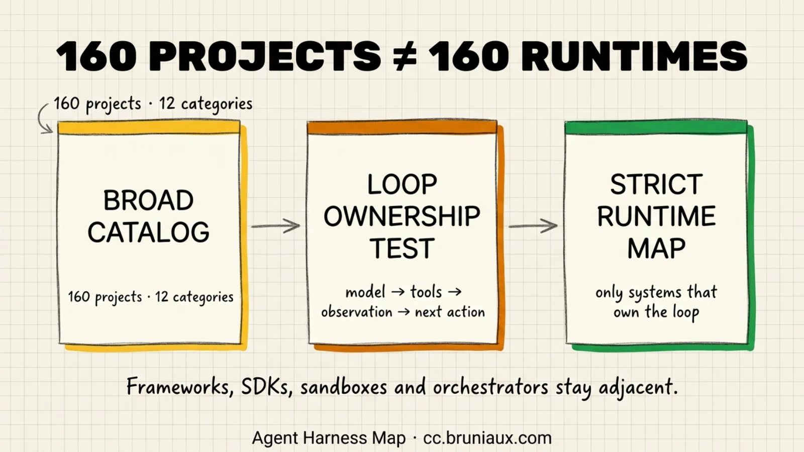
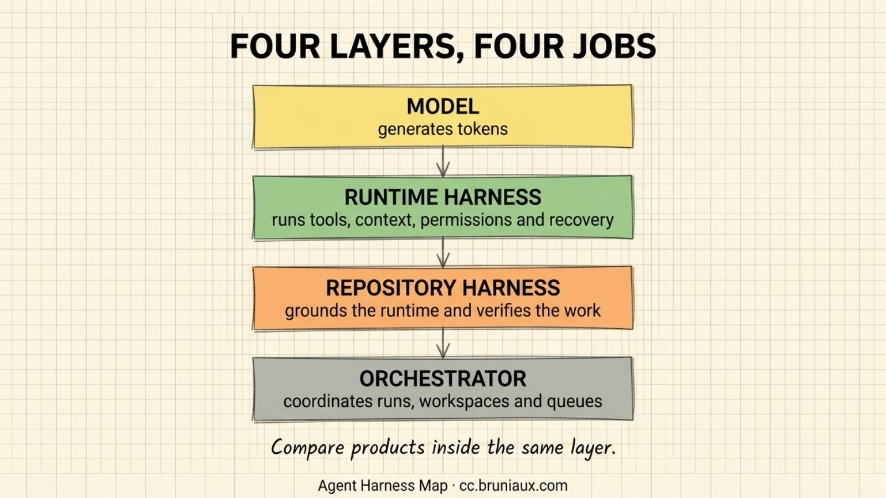
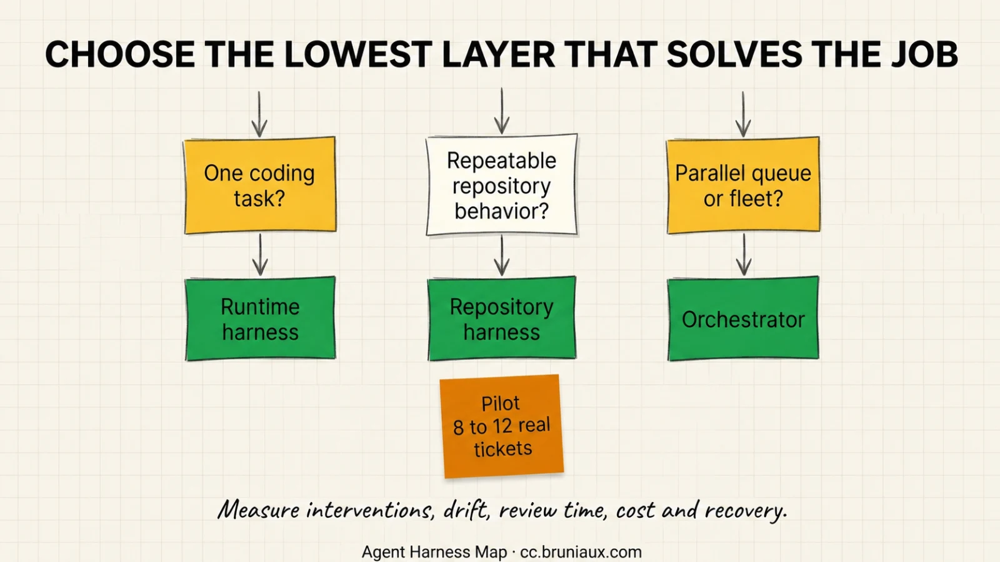

# Agent Harness Landscape

Use this map to separate four questions that product lists often merge: which model generates, which runtime owns the tool loop, which repository configuration controls local behavior, and which orchestrator coordinates multiple runs. A project can be valuable without being a runtime harness.

The broad directory below normalizes the 160 projects and 12 categories in [Best of Agent Harnesses](https://ryanalberts.github.io/best-of-Agent-Harnesses/), then adds 32 guide supplements discovered through direct project research. It uses the upstream snapshot at commit [`ece3146`](https://github.com/RyanAlberts/best-of-Agent-Harnesses/tree/ece314654d2c23fe7bd69fc6ef7088f093207e49), dated 2026-08-23. The strict map applies an additional test: does the product own the cycle that plans, acts through tools, observes results, and decides what happens next?

An **agent harness** is the runtime around a model that assembles context, exposes tools, applies permissions, executes the action loop, records state, and handles failure. Simon Willison's concise definition, ["models using tools in a loop"](https://simonwillison.net/2025/May/22/tools-in-a-loop/), identifies the behavioral boundary. The 2026 [Agent System and Harness Design survey](https://arxiv.org/abs/2606.20683) expands that runtime into six responsibilities: observation, context, control, action, state, and verification. The [SWE-agent paper](https://papers.neurips.cc/paper_files/paper/2024/file/5a7c947568c1b1328ccc5230172e1e7c-Paper-Conference.pdf) names the coding-specific interface between the model and computer the **agent-computer interface**.

Comparison requires a second boundary: every outcome belongs to a **model-harness pair** under a disclosed task set and budget. In a controlled 300-run study across two models and three harnesses, [The Scaffold Effect](https://arxiv.org/abs/2607.22585) found up to a 40-times difference in tokens per solved task, while pass-rate differences stayed within 0 to 8 percentage points and were mostly not statistically significant. A harness can strongly affect cost and failure behavior without being the main accuracy bottleneck.

This page answers *which layer and which project*. [Agent Harness Engineering](../core/agent-harness.md) documents the components inside a runtime harness. [Loop & Graph Engineering](../core/loop-graph-engineering.md) covers feedback, topology, state transitions, stopping rules, and judgment boundaries. [Agent Tools: Beyond Claude Code](./agentic-tools.md) provides deeper product profiles. The [glossary](../core/glossary.md) separates runtime harnesses from repository harnesses and evaluation harnesses.

### Choose the right entry point

| Question | Canonical page |
|---|---|
| How does the loop, context, tool, hook, permission, and recovery machinery work? | [Agent Harness Engineering](../core/agent-harness.md) |
| How should a loop or executable workflow graph be designed and bounded? | [Loop & Graph Engineering](../core/loop-graph-engineering.md) |
| Which runtime or adjacent project fits a particular job? | This [Agent Harness Landscape](./agent-harness-landscape.md) page |
| What does a named coding-agent product support in practice? | [Agent Tools: Beyond Claude Code](./agentic-tools.md) |
| How should a repository prepare instructions, setup, state, and verification for any runtime? | [Repository Harness Engineering](../ultimate-guide.md#925-harness-engineering) |
| How should a shortlist be evaluated and instrumented? | [Agent Evaluation](../roles/agent-evaluation.md) and [Observability](../ops/observability.md) |
| Which systems optimize a harness rather than run tasks directly? | [Harness Optimizers and Meta-Harnesses](#harness-optimizers-and-meta-harnesses) |

These pages are linked but deliberately not merged. The engineering reference explains stable mechanisms. This map is a dated evidence snapshot whose projects, licences, features, and GitHub signals need a separate refresh cycle.

## 160 Projects Does Not Mean 160 Runtime Harnesses

The upstream catalog mixes ready-to-run coding agents with SDKs, frameworks, memory systems, sandboxes, evaluation tools, observability products, prompt libraries, and multi-agent control planes. Treating all 160 as interchangeable runtimes produces invalid comparisons. The strict map retains projects with evidence that they own an agent loop; adjacent products remain in the directory under their actual job.

*The 160-project and 12-category figures come from Best of Agent Harnesses, snapshot 2026-08-23. Catalog size is not runtime count.*

## The Twelve-Category Map

The category names come from the pinned upstream snapshot. `Usually`, `Sometimes`, and `No` describe the category's typical relation to a loop. They do not assign one answer to every project inside it.

<!-- BEGIN GENERATED: category-summary -->
| Category | Projects | What it contributes | Owns an agent loop? | Guide layer |
|---|---:|---|---|---|
| [Coding agent products (IDEs, CLIs, full suites)](#coding-agent-products) | 22 | Turnkey coding agents | Usually | Runtime |
| [Coding harness configs and SDKs](#coding-harness-configs) | 17 | Configuration packs and agent SDKs | Sometimes | Repository / construction |
| [Evaluation and benchmarking harnesses](#evaluation) | 18 | Benchmarks and evaluation harnesses | No | Evaluation |
| [Frameworks](#frameworks) | 25 | Libraries for building an agent loop | Sometimes | Construction |
| [Libraries and SDKs](#libraries-sdks) | 15 | Reusable agent building blocks | No | Construction |
| [Memory and state](#memory) | 5 | Persistent state and retrieval | No | Memory |
| [Multi-agent and orchestration](#multi-agent) | 12 | Coordination across agents or runtimes | Sometimes | Orchestrator |
| [Observability and eval-ops](#observability) | 4 | Tracing, quality, and operations | No | Observability |
| [Personal agent runtimes](#personal-agent-runtimes) | 10 | Ready-to-run personal agents | Usually | Runtime |
| [Plugins, MCPs, CLI tools](#plugins-mcp-cli) | 19 | Tools connected to an existing runtime | No | Extension |
| [Progressive disclosure harnesses](#progressive-disclosure) | 8 | Context and prompt-loading strategies | Sometimes | Repository / context |
| [Research and task-specific harnesses](#research-task) | 5 | Domain-specific agents and research systems | Sometimes | Runtime / task-specific |
<!-- END GENERATED: category-summary -->

## Core Coding Harnesses

The strict map contains 42 runtimes. Every name links to its official product page or canonical repository. Open-source rows include GitHub stars when a canonical repository was available. Stars are a dated popularity signal, not a quality score. Entries with detailed coverage in this guide keep that internal profile in the role cell.

<!-- BEGIN GENERATED: strict-runtime-map -->
**Snapshot:** 2026-08-28. GitHub stars are captured on the date shown in each project cell.

**Legend:** <abbr title="Not established from the pinned sources">?</abbr> = not established from the pinned sources; N/A = does not apply.

| Harness | Interface | Provider strategy | Loop evidence | Licence | Role |
|---|---|---|---|---|---|
| [AgentForge](https://github.com/MohitGoyal09/AgentForge) <small>★ 60 · 2026-08-28</small> | <abbr title="Not established from the pinned sources">?</abbr> | <abbr title="Not established from the pinned sources">?</abbr> | Confirmed | <abbr title="Not established from the pinned sources">?</abbr> | The README documents a ReAct-style loop that repeats model requests, typed tool calls, and observations until completion. |
| [agentic-harness](https://github.com/codejunkie99/agentic-harness) <small>★ 84 · 2026-08-28</small> | <abbr title="Not established from the pinned sources">?</abbr> | <abbr title="Not established from the pinned sources">?</abbr> | Confirmed | <abbr title="Not established from the pinned sources">?</abbr> | The README documents a coding-agent loop that iterates through model tool calls against a workspace. |
| [aider](https://github.com/Aider-AI/aider) <small>★ 48,420 · 2026-08-23</small> | <abbr title="Not established from the pinned sources">?</abbr> | <abbr title="Not established from the pinned sources">?</abbr> | Claimed | Open source | Git-aware CLI pair programmer; edits in-repo, supports multiple models and MCP so agents see version control and tools. [Guide profile](./agentic-tools.md#13-aider) |
| [Amp](https://ampcode.com/) | <abbr title="Not established from the pinned sources">?</abbr> | <abbr title="Not established from the pinned sources">?</abbr> | Claimed | Proprietary | Amp presents its product as an agentic coding tool. |
| [Augment Code](https://www.augmentcode.com/) | <abbr title="Not established from the pinned sources">?</abbr> | <abbr title="Not established from the pinned sources">?</abbr> | Claimed | Proprietary | Augment presents its product as an AI coding platform with agent capabilities. |
| [Autonomous Coding Harness](https://github.com/GantisStorm/autonomous-coding-harness) <small>★ 7 · 2026-08-28</small> | <abbr title="Not established from the pinned sources">?</abbr> | <abbr title="Not established from the pinned sources">?</abbr> | Claimed | <abbr title="Not established from the pinned sources">?</abbr> | The README claims a milestone-based autonomous coding loop with implementation, verification, and human checkpoints. |
| [Claude Code](https://code.claude.com/docs/en/overview) | <abbr title="Not established from the pinned sources">?</abbr> | <abbr title="Not established from the pinned sources">?</abbr> | Claimed | Proprietary | Anthropic documents Claude Code as an agentic coding tool that reads codebases, edits files, and runs commands. |
| [claw-code-agent](https://github.com/HarnessLab/claw-code-agent) <small>★ 543 · 2026-08-23</small> | <abbr title="Not established from the pinned sources">?</abbr> | <abbr title="Not established from the pinned sources">?</abbr> | Claimed | <abbr title="Not established from the pinned sources">?</abbr> | Python reimplementation of the Claude Code agent architecture with zero external dependencies; interactive chat, streaming, plugin runtime, nested agent delegation, cost... |
| [Cline](https://github.com/cline/cline) <small>★ 66,707 · 2026-08-23</small> | <abbr title="Not established from the pinned sources">?</abbr> | <abbr title="Not established from the pinned sources">?</abbr> | Claimed | Open source | VS Code extension whose harness is a plan-then-act loop with per-step human approval and cost transparency; the VS Code integration is the UI shell. |
| [Codex](https://github.com/openai/codex) <small>★ 114,837 · 2026-08-23</small> | <abbr title="Not established from the pinned sources">?</abbr> | <abbr title="Not established from the pinned sources">?</abbr> | Claimed | Open source | OpenAI's terminal coding agent. [Guide profile](./agentic-tools.md#11-codex-cli-openai) |
| [crush](https://github.com/charmbracelet/crush) <small>★ 27,601 · 2026-08-23</small> | <abbr title="Not established from the pinned sources">?</abbr> | <abbr title="Not established from the pinned sources">?</abbr> | Claimed | Restricted (fsl-1.1-mit) | Charm's terminal coding agent (Charm's fork of the original OpenCode). [Guide profile](./agentic-tools.md#17-crush-charm) |
| [Cursor Agent](https://cursor.com/agents) | <abbr title="Not established from the pinned sources">?</abbr> | <abbr title="Not established from the pinned sources">?</abbr> | Claimed | Proprietary | Cursor presents Agent as its coding-agent product across editor and remote surfaces. |
| [DeepSeek Harness](https://github.com/deepseek-ai/deepseek-harness) <small>★ 201,064 · 2026-08-28</small> | <abbr title="Not established from the pinned sources">?</abbr> | <abbr title="Not established from the pinned sources">?</abbr> | Claimed | Mit | The official repository describes a developer-preview agent harness built on the Cordis plugin framework. [Guide profile](./agentic-tools.md#18-deepseek-harness-dsh) |
| [DeepSeek-Reasonix](https://github.com/esengine/DeepSeek-Reasonix) <small>★ 35,065 · 2026-08-23</small> | <abbr title="Not established from the pinned sources">?</abbr> | <abbr title="Not established from the pinned sources">?</abbr> | Claimed | <abbr title="Not established from the pinned sources">?</abbr> | DeepSeek-native terminal coding agent. |
| [Devin](https://devin.ai/) | <abbr title="Not established from the pinned sources">?</abbr> | <abbr title="Not established from the pinned sources">?</abbr> | Claimed | Proprietary | Cognition presents Devin as an AI software engineer. |
| [Factory Droid](https://www.factory.ai/) | <abbr title="Not established from the pinned sources">?</abbr> | <abbr title="Not established from the pinned sources">?</abbr> | Claimed | Proprietary | Factory presents Droids as software-development agents. |
| [Gemini CLI](https://github.com/google-gemini/gemini-cli) <small>★ 106,626 · 2026-08-23</small> | <abbr title="Not established from the pinned sources">?</abbr> | <abbr title="Not established from the pinned sources">?</abbr> | Claimed | Open source | Google's first-party terminal agent for Gemini. [Guide profile](./agentic-tools.md#16-gemini-cli-google) |
| [GitHub Copilot CLI](https://github.com/features/copilot/cli) | <abbr title="Not established from the pinned sources">?</abbr> | <abbr title="Not established from the pinned sources">?</abbr> | Claimed | Proprietary | GitHub presents Copilot CLI as a coding agent for the terminal. |
| [goose](https://github.com/aaif-goose/goose) <small>★ 53,295 · 2026-08-23</small> | <abbr title="Not established from the pinned sources">?</abbr> | <abbr title="Not established from the pinned sources">?</abbr> | Claimed | Open source | Block-originated Rust agent, now stewarded by the Linux Foundation's Agentic AI Foundation (aaif-goose/goose). [Guide profile](./agentic-tools.md#14-goose-aaifblock) |
| [Hermes](https://github.com/NousResearch/hermes-agent) <small>★ 234,688 · 2026-08-23</small> | <abbr title="Not established from the pinned sources">?</abbr> | <abbr title="Not established from the pinned sources">?</abbr> | Confirmed | Open source | Nous Research's self-improving agent: a learning loop turns experience into reusable skills, builds a persistent user model across sessions, and checkpoints state to disk with... |
| [jcode](https://github.com/1jehuang/jcode) <small>★ 18,308 · 2026-08-23</small> | <abbr title="Not established from the pinned sources">?</abbr> | <abbr title="Not established from the pinned sources">?</abbr> | Confirmed | <abbr title="Not established from the pinned sources">?</abbr> | Rust terminal coding agent pitched as the most RAM-efficient harness in its class; MCP support, multi-provider (Claude/OpenAI). |
| [Jules](https://jules.google/) | <abbr title="Not established from the pinned sources">?</abbr> | <abbr title="Not established from the pinned sources">?</abbr> | Claimed | Proprietary | Google presents Jules as an asynchronous coding agent. |
| [Junie](https://www.jetbrains.com/junie/) | <abbr title="Not established from the pinned sources">?</abbr> | <abbr title="Not established from the pinned sources">?</abbr> | Claimed | Proprietary | JetBrains presents Junie as its coding agent. |
| [Kilo Code](https://github.com/Kilo-Org/kilocode) <small>★ 26,978 · 2026-08-23</small> | <abbr title="Not established from the pinned sources">?</abbr> | <abbr title="Not established from the pinned sources">?</abbr> | Claimed | <abbr title="Not established from the pinned sources">?</abbr> | VS Code extension and CLI in the Cline/Roo-Code lineage : a natural pick now that Roo-Code is archived upstream. |
| [Kimi Code CLI](https://github.com/MoonshotAI/kimi-code) <small>★ 7,126 · 2026-08-28</small> | <abbr title="Not established from the pinned sources">?</abbr> | <abbr title="Not established from the pinned sources">?</abbr> | Claimed | Mit | The official repository describes Kimi Code CLI as an agentic coding tool for terminals and IDEs. |
| [Kiro](https://kiro.dev/) | <abbr title="Not established from the pinned sources">?</abbr> | <abbr title="Not established from the pinned sources">?</abbr> | Claimed | Proprietary | Kiro presents its product as an agentic development environment. |
| [oh-my-pi](https://github.com/can1357/oh-my-pi) <small>★ 26,658 · 2026-08-23</small> | <abbr title="Not established from the pinned sources">?</abbr> | <abbr title="Not established from the pinned sources">?</abbr> | Claimed | Open source | Terminal coding agent (fork of Pi) that wires the IDE into the harness: hash-anchored edits, a 32-tool loop tuned per-model, LSP rename/references/diagnostics on every write, a... |
| [OpenHarness (HKUDS)](https://github.com/HKUDS/OpenHarness) <small>★ 15,492 · 2026-08-23</small> | <abbr title="Not established from the pinned sources">?</abbr> | <abbr title="Not established from the pinned sources">?</abbr> | Confirmed | Open source | Open agent harness with a built-in personal agent ("Ohmo") that runs across Feishu, Slack, Telegram, and Discord; core tool-use, skills, memory, multi-agent coordination with... |
| [Open Interpreter](https://github.com/openinterpreter/openinterpreter) <small>★ 68,121 · 2026-08-23</small> | <abbr title="Not established from the pinned sources">?</abbr> | <abbr title="Not established from the pinned sources">?</abbr> | Claimed | Open source | Lightweight terminal coding agent oriented to open models (DeepSeek, Kimi, Qwen). |
| [Open SWE](https://github.com/langchain-ai/open-swe) <small>★ 10,624 · 2026-08-28</small> | <abbr title="Not established from the pinned sources">?</abbr> | <abbr title="Not established from the pinned sources">?</abbr> | Claimed | Mit | The official repository describes Open SWE as an asynchronous coding agent for repository tasks. |
| [opencode](https://github.com/anomalyco/opencode) <small>★ 200,557 · 2026-08-23</small> | <abbr title="Not established from the pinned sources">?</abbr> | <abbr title="Not established from the pinned sources">?</abbr> | Claimed | Open source | Open-source terminal coding agent (formerly sst/opencode; transferred to anomalyco). [Guide profile](./agentic-tools.md#15-opencode-anomaly-formerly-sst) |
| [OpenCode Harness](https://github.com/samarailly51-pixel/opencode-harness) <small>★ 148 · 2026-08-28</small> | <abbr title="Not established from the pinned sources">?</abbr> | <abbr title="Not established from the pinned sources">?</abbr> | Confirmed | <abbr title="Not established from the pinned sources">?</abbr> | The README documents a coding-agent loop with tools, permissions, traces, evaluation, and repair feedback. |
| [OpenHands](https://github.com/OpenHands/OpenHands) <small>★ 84,844 · 2026-08-23</small> | <abbr title="Not established from the pinned sources">?</abbr> | <abbr title="Not established from the pinned sources">?</abbr> | Claimed | Restricted ((multi-license)) | Dockerized software-engineering agent. [Guide profile](./agentic-tools.md#24-openhands-all-hands-ai) |
| [OpenHarness](https://github.com/AgentBoardTT/openharness) <small>★ 12 · 2026-08-28</small> | <abbr title="Not established from the pinned sources">?</abbr> | <abbr title="Not established from the pinned sources">?</abbr> | Confirmed | <abbr title="Not established from the pinned sources">?</abbr> | The README documents a provider-to-tools agent loop and runtime injection points. |
| [pi](https://github.com/earendil-works/pi) <small>★ 95,747 · 2026-08-23</small> | <abbr title="Not established from the pinned sources">?</abbr> | <abbr title="Not established from the pinned sources">?</abbr> | Claimed | <abbr title="Not established from the pinned sources">?</abbr> | The upstream AI agent toolkit behind this list's oh-my-pi fork: a unified multi-provider LLM API, agent loop, and TUI shell providing the harness that oh-my-pi's Rust rewrite... |
| [qwen-code](https://github.com/QwenLM/qwen-code) <small>★ 27,310 · 2026-08-23</small> | <abbr title="Not established from the pinned sources">?</abbr> | <abbr title="Not established from the pinned sources">?</abbr> | Claimed | <abbr title="Not established from the pinned sources">?</abbr> | Alibaba's official terminal coding agent, forked from Gemini CLI's agent loop and retuned for Qwen models. |
| [Replit Agent](https://replit.com/ai) | <abbr title="Not established from the pinned sources">?</abbr> | <abbr title="Not established from the pinned sources">?</abbr> | Claimed | Proprietary | Replit presents Agent as a product that builds applications from user goals. |
| [Roo Code](https://github.com/RooCodeInc/Roo-Code) <small>★ 24,326 · 2026-08-23</small> | <abbr title="Not established from the pinned sources">?</abbr> | <abbr title="Not established from the pinned sources">?</abbr> | Claimed | Open source | VS Code/Cursor extension in the Cline lineage. |
| [Spettro](https://github.com/Aploide/spettro) <small>★ 33 · 2026-08-28</small> | <abbr title="Not established from the pinned sources">?</abbr> | <abbr title="Not established from the pinned sources">?</abbr> | Confirmed | <abbr title="Not established from the pinned sources">?</abbr> | The README documents autonomous goal runs, native tool calls, subagent workflows, and verification loops. |
| [SWE-agent](https://github.com/SWE-agent/SWE-agent) <small>★ 20,112 · 2026-08-23</small> | <abbr title="Not established from the pinned sources">?</abbr> | <abbr title="Not established from the pinned sources">?</abbr> | Claimed | Open source | LM-driven harness built for SWE-bench: edit state, command execution, and issue-focused loop: the reference agent stack next to the benchmark itself. [Guide profile](./agentic-tools.md#22-swe-agent-princeton) |
| [Warp Agent Mode](https://www.warp.dev/warp-ai) | <abbr title="Not established from the pinned sources">?</abbr> | <abbr title="Not established from the pinned sources">?</abbr> | Claimed | Proprietary | Warp presents its AI surface as an agentic development environment in the terminal. |
| [Windsurf Cascade](https://windsurf.com/cascade) | <abbr title="Not established from the pinned sources">?</abbr> | <abbr title="Not established from the pinned sources">?</abbr> | Claimed | Proprietary | Windsurf presents Cascade as its agentic coding assistant. |
<!-- END GENERATED: strict-runtime-map -->

DeepSeek Harness needs a maturity caveat. The official repository describes `dsh` as a developer preview and warns that compatibility may change. Its plugin architecture, permissions, sandbox choices, and local-first processing do not make untrusted repositories safe by default. See the [DeepSeek Harness profile](./agentic-tools.md#18-deepseek-harness-dsh) for setup, architecture, and security boundaries.

### Creator interviews as supplementary evidence

Official documentation and canonical repositories remain the source of truth for current product behavior. Creator interviews add dated design rationale that a feature table cannot capture:

- Boris Cherny's [Building Claude Code interview](https://www.youtube.com/watch?v=julbw1JuAz0&t=1520s) traces the product's move from a chatbot to a tool-using agent, while the [permission discussion](https://www.youtube.com/watch?v=julbw1JuAz0&t=3176s) explains the layered controls behind command execution.
- Dax Raad's [Building OpenCode interview](https://www.youtube.com/watch?v=1VqKUrxR2C8&t=1104s) documents the open-source, provider-neutral runtime positioning. The later [control-plane discussion](https://www.youtube.com/watch?v=1VqKUrxR2C8&t=2045s) separates organization-wide provider, permission, budget, and rate-limit controls from the runtime itself.

These interviews do not upgrade a generated evidence state on their own. They are dated testimony, so current availability, licence, and feature behavior still require a direct official source. The [practitioner video evidence ledger](../core/agent-harness.md#10-practitioner-video-evidence) records the short verbatim, timestamp, and boundary for each source.

## Orchestrators: Products Above the Runtime

The adjacent map contains 15 control planes. An orchestrator coordinates queues, isolated workspaces, or multiple agent sessions. Use one after a single runtime is no longer the bottleneck. Parallel runs multiply throughput, context drift, and review load at the same time.

The runtime/control-plane distinction also appears in Dax Raad's [May 2026 OpenCode interview](https://www.youtube.com/watch?v=1VqKUrxR2C8&t=2045s). He describes organization-wide provider setup, permissions, budgets, and rate limits as a separate control plane. That supports the architectural boundary used here, but it is not evidence that the enterprise product described in the interview is publicly available today.

<!-- BEGIN GENERATED: adjacent-control-planes -->
| Control plane | Role | Loop ownership | Licence |
|---|---|---|---|
| [AgentBox](https://github.com/madarco/agentbox) <small>★ 374 · 2026-08-23</small> | Runs multiple coding agents in parallel, each in its own sandboxed VM, locally or in the cloud, from one command. | No; evidence claimed | Open source |
| [AgentsMesh](https://github.com/AgentsMesh/AgentsMesh) <small>★ 2,330 · 2026-08-28</small> | The README documents a control-plane and data-plane system for operating external coding agents. | No; evidence confirmed | <abbr title="Not established from the pinned sources">?</abbr> |
| [Autonomous Workstream](https://github.com/AmoghReddy45/autonomous-workstream) <small>★ 32 · 2026-08-28</small> | The README documents a plugin and CLI that sequences bounded tasks through an external coding-agent backend. | No; evidence confirmed | <abbr title="Not established from the pinned sources">?</abbr> |
| [Harness](https://github.com/boldblackai/harness) <small>★ 10 · 2026-08-28</small> | The README documents hardened container environments for agents rather than an agent decision loop. | No; evidence confirmed | <abbr title="Not established from the pinned sources">?</abbr> |
| [cc-haha](https://github.com/NanmiCoder/cc-haha) <small>★ 14,189 · 2026-08-23</small> | Local-first desktop workspace harness for Claude Code and other agents: multi-agent sessions, Git worktrees, code diffs, a skill marketplace, and chat-app access (WeChat... | No; evidence claimed | <abbr title="Not established from the pinned sources">?</abbr> |
| [eigent](https://github.com/eigent-ai/eigent) <small>★ 15,083 · 2026-08-23</small> | Open-source desktop harness positioned as a local, free alternative to Claude Cowork and Codex: multi-agent workspace orchestration in a self-hosted app rather than a hosted... | No; evidence claimed | <abbr title="Not established from the pinned sources">?</abbr> |
| [Agent Harness](https://github.com/0xenzyme/agent-harness) <small>★ 7 · 2026-08-28</small> | The README explicitly describes an adapter-driven control plane that delegates scheduling to the Codex runtime. | No; evidence confirmed | <abbr title="Not established from the pinned sources">?</abbr> |
| [Harness CLI](https://github.com/hyspacex/harness-cli) <small>★ 15 · 2026-08-28</small> | The README describes an orchestration and repair layer over Claude Agent SDK or Codex App Server runtimes. | No; evidence confirmed | <abbr title="Not established from the pinned sources">?</abbr> |
| [Liza](https://github.com/liza-mas/liza) <small>★ 363 · 2026-08-28</small> | The source implements a control plane over external coding-agent CLIs, with a persistent YAML blackboard, isolated git worktrees, doer/reviewer roles, leases, recovery... | No; evidence confirmed | Apache-2.0 |
| [OpenAgents](https://github.com/openagents-org/openagents) <small>★ 4,005 · 2026-08-28</small> | The official repository describes OpenAgents as a network for persistent agents and shared workspaces. | No; evidence claimed | Apache-2.0 |
| [Proliferate](https://github.com/proliferate-ai/proliferate) <small>★ 310 · 2026-08-23</small> | Open-source AI IDE for Claude Code, Codex, OpenCode, and more. | No; evidence claimed | Open source |
| [Symphony](https://github.com/openai/symphony) <small>★ 26,812 · 2026-08-23</small> | OpenAI's harness for fanning a task out into many isolated, autonomous coding-agent implementation runs and surfacing the ones that pass, so a team manages outcomes instead of... | No; evidence claimed | <abbr title="Not established from the pinned sources">?</abbr> |
| [harness](https://github.com/twaldin/harness) <small>★ 20 · 2026-08-28</small> | The README explicitly describes a unified subprocess wrapper for existing coding-agent CLIs. | No; evidence confirmed | <abbr title="Not established from the pinned sources">?</abbr> |
| [vibe-kanban](https://github.com/BloopAI/vibe-kanban) <small>★ 27,893 · 2026-08-23</small> | Kanban-style fleet manager for running Claude Code, Codex, or any coding agent across many tasks at once. | No; evidence claimed | <abbr title="Not established from the pinned sources">?</abbr> |
| [Vigilante](https://github.com/aliengiraffe/vigilante) <small>★ 37 · 2026-08-28</small> | The README explicitly calls Vigilante a control plane over supported headless coding-agent CLIs. | No; evidence confirmed | <abbr title="Not established from the pinned sources">?</abbr> |
<!-- END GENERATED: adjacent-control-planes -->

### Liza: a repository harness and control plane combined

[Liza](https://github.com/liza-mas/liza) coordinates external coding-agent CLIs rather than replacing their inner model-and-tool loop. Its pinned [provider catalog](https://github.com/liza-mas/liza/blob/a22c12381c5d884d2586a48aaaa517bca184f9cf/provider-catalog.yaml) defines subprocess adapters for Claude Code, Codex, OpenCode, Kimi, Gemini, Qwen, Mistral, and Devin; some are disabled by default. This is why Liza appears in the adjacent map and does not increase the 42-runtime count.

The repository contains more than a prompt-level role description. The [supervision model at commit `a22c123`](https://github.com/liza-mas/liza/blob/a22c12381c5d884d2586a48aaaa517bca184f9cf/specs/architecture/supervision-model.md) defines a persistent YAML blackboard, file-locked state changes, isolated git worktrees, lease and generation fencing, doer/reviewer task transitions, recovery operations, and supervised merge authority. The cloned snapshot contained 296 Go test files. Its exact commit passed the upstream [Ubuntu](https://github.com/liza-mas/liza/actions/runs/33061917377/job/98482510741) and [macOS](https://github.com/liza-mas/liza/actions/runs/33061917377/job/98482510513) jobs on 2026-08-27. Local tests were not executed for this review because the review host did not have Go installed.

That evidence confirms code-enforced orchestration, not production safety. A git worktree prevents concurrent agents from editing the same checkout; it does not isolate processes, credentials, or network access. The provider catalog also includes broad non-interactive modes such as `--approve-all`, `--dangerously-skip-permissions`, and `--permission-mode dangerous`. Review those defaults, run Liza inside an OS-level sandbox with scoped credentials, and pilot recovery plus merge gates on real repository tickets. Liza's own [architectural issues ledger](https://github.com/liza-mas/liza/blob/a22c12381c5d884d2586a48aaaa517bca184f9cf/specs/architecture/architectural-issues.md) records remaining single-gate, cross-pair review, specification-quality, and context-pressure risks.

**Loop and graph lens.** Liza combines a frozen organization graph with a runtime work graph. The pinned [`pipeline.yaml`](https://github.com/liza-mas/liza/blob/a22c12381c5d884d2586a48aaaa517bca184f9cf/internal/embedded/pipeline.yaml) declares roles, doer/reviewer pairs, state vocabularies, quorums, and cross-pair transitions. The supervisor creates and advances task dependencies at runtime. This is a domain-specific executable graph, not a general graph framework: the pinned [`TransitionDef`](https://github.com/liza-mas/liza/blob/a22c12381c5d884d2586a48aaaa517bca184f9cf/internal/pipeline/config.go) exposes source, destination, trigger, and cardinality, but not a general edge schema, join policy, or arbitrary node program.

**Judgment boundary.** Mechanical checks can reject illegal state transitions, stale leases, missing dependencies, or an unmet review quorum. They cannot establish that the decomposition, implementation, or reviewer verdict is semantically correct. The same issue ledger says cross-pair decomposition judgment is a consequential single gate, provider diversity is preferred rather than guaranteed at verdict time, reviewer accuracy is unmeasured, and manual checkpoints make human availability load-bearing. Compare Liza on two axes: workflow correctness and task correctness. Passing the first does not imply the second.

The evidence is no longer limited to the maintainer. An [Ippon practitioner report](https://blog.ippon.fr/2026/04/29/premier-rex-multi-agent-liza/) describes a deliberately small catalog project with roughly 30 tasks, 5 automated sprints, 35 review verdicts, 3 corrected rejections, and 3 to 4 hours of human time. It also reports massive token consumption and required human planning checkpoints. This is a useful bounded REX, not a production or comparative benchmark.

This responsibility-boundary reading was prompted by private comparison notes shared by Liza maintainer [Tangi Vass](https://github.com/liza-mas). The published claims above are independently tied to the pinned repository rather than to those notes.

## Harness Optimizers and Meta-Harnesses

Harness optimizers are adjacent to the strict runtime map. They do not primarily execute user tasks or coordinate a fleet. They change a target harness, evaluate candidates, and decide which version should govern later runs. Most entries below are research systems, not production products.

| System | Optimizes | Evidence | Maturity and main limit |
|---|---|---|---|
| [ADAS](https://proceedings.iclr.cc/paper_files/paper/2025/hash/36b7acf6f6010652b3f2a433774a66fe-Abstract-Conference.html) | Code-defined prompts, tools, and workflows | ICLR 2025 experiments across coding, science, and math | Peer-reviewed, but headline comparisons are system-level rather than pure fixed-model ablations |
| [AFlow](https://arxiv.org/abs/2410.10762) | Workflow topology represented as code | 5.7% average improvement across six benchmarks | ICLR 2025; heterogeneous baselines |
| [ACE](https://arxiv.org/abs/2510.04618) | Context and memory playbooks | +10.6% on agents and +8.6% on finance tasks | ICLR 2026; narrower than whole-harness optimization |
| [GEPA](https://arxiv.org/abs/2507.19457) | Prompts using reflected trajectories | 6% average gain over GRPO across six tasks; up to 35 times fewer rollouts | ICLR 2026 Oral; prompt-level optimizer |
| [Meta-Harness](https://arxiv.org/abs/2603.28052) | End-to-end harness code | Classification, math, and TerminalBench-2 improvements | 2026 preprint; coding search and final evaluation reuse the same 89 tasks |
| [Agentic Harness Engineering](https://arxiv.org/abs/2604.25850) | Prompt, tools, middleware, skills, subagents, and memory | Terminal-Bench 2 pass@1 from 69.7% to 77.0% over ten iterations | 2026 preprint focused on coding benchmarks |
| [HarnessOpt-Bench](https://arxiv.org/abs/2608.06301) | Evaluates the optimizer, not one target harness | Five optimizer models, four downstream tasks, 111 scored runs | 2026 benchmark preprint; early protocol awaiting broader reproduction |

Do not fold these systems into the 42-runtime count. A runtime owns the task loop. An optimizer owns a search loop over candidate harnesses. [Agent Harness Engineering §11](../core/agent-harness.md#11-harness-optimizers-and-meta-harnesses) documents the evidence and the minimum evaluation protocol.

## Four Layers, Four Responsibilities

| Layer | Owns | Typical artifacts | Selection question |
|---|---|---|---|
| Model | Generation and reasoning | Weights, API, context window | Which model meets the task, latency, privacy, and cost constraints? |
| Repository harness | Project-specific instructions and controls | `AGENTS.md`, `CLAUDE.md`, skills, hooks, policies | What behavior must remain portable with the repository? |
| Runtime harness | Tool loop, permissions, state, recovery | CLI, IDE agent, desktop or cloud runtime | Who owns plan, act, observe, repeat? |
| Orchestrator | Queues, workspaces, budgets, multiple runs | Scheduler, fleet manager, task board | What must coordinate more than one runtime or agent? |

Frameworks, SDKs, sandboxes, memory systems, evaluation tools, observability platforms, and protocols sit beside or below these layers. LangGraph can help build a runtime; E2B can isolate its execution; Mem0 can persist memory; Langfuse can observe it; MCP can connect tools. None of those roles alone proves ownership of the coding loop.

The term *meta-harness* has two incompatible uses. Optimizer research uses it for a system that changes one or more harness layers under evaluation. Products such as Omnigent use it for a common interface that dispatches tasks to existing harnesses. Keep the roles separate: this guide classifies a dispatcher as an orchestrator or control plane, while a harness optimizer changes the system that will perform future runs. The generated directory below preserves each pinned source's wording, so Omnigent's row retains its upstream *meta-harness* label even though the guide layer is orchestration. See the [Databricks cost-management resource evaluation](../../docs/resource-evaluations/databricks-managing-ai-coding-costs-scale.md) for the terminology boundary.

## Complete Project Directory

The directory preserves every upstream project and lists the 32 guide supplements separately. <abbr title="Not established from the pinned sources">?</abbr> means the pinned source did not support a conclusion. `N/A` means the field does not apply to that category. Archived projects remain visible and marked, because removal would hide the history behind current comparisons.

<!-- BEGIN GENERATED: project-catalog -->
<!-- BEGIN UPSTREAM PROJECT DIRECTORY -->

<strong>Coding agent products (IDEs, CLIs, full suites) (22)</strong>

| Project | Role | Main capabilities | Adoption | Autonomy / Recovery | Licence |
|---|---|---|---|---|---|
| [AgentBox](https://github.com/madarco/agentbox) <small>★ 374 · 2026-08-23</small> | Runs multiple coding agents in parallel, each in its own sandboxed VM, locally or in the cloud, from one command. | Build vs buy, Lifecycle hooks, Memory, Prompt optimization | Slightly complex | N/A / N/A | Open source |
| [cc-haha](https://github.com/NanmiCoder/cc-haha) <small>★ 14,189 · 2026-08-23</small> | Local-first desktop workspace harness for Claude Code and other agents: multi-agent sessions, Git worktrees, code diffs, a skill marketplace, and chat-app access (WeChat... | Memory, Multi-agent, Typescript | Complex | N/A / N/A | <abbr title="Not established from the pinned sources">?</abbr> |
| [claw-code-agent](https://github.com/HarnessLab/claw-code-agent) <small>★ 543 · 2026-08-23</small> | Python reimplementation of the Claude Code agent architecture with zero external dependencies; interactive chat, streaming, plugin runtime, nested agent delegation, cost... | Build vs buy, Lifecycle hooks, Memory, Prompt optimization | Slightly complex | Checkpoint gated / None | <abbr title="Not established from the pinned sources">?</abbr> |
| [Cline](https://github.com/cline/cline) <small>★ 66,707 · 2026-08-23</small> | VS Code extension whose harness is a plan-then-act loop with per-step human approval and cost transparency; the VS Code integration is the UI shell. | Build vs buy, Lifecycle hooks, Memory, Prompt optimization | Slightly complex | Step gated / Resumable | Open source |
| [Codex](https://github.com/openai/codex) <small>★ 114,837 · 2026-08-23</small> | OpenAI's terminal coding agent. | Build vs buy, Lifecycle hooks, Memory, Prompt optimization | Slightly complex | Bounded / Resumable | Open source |
| [crush](https://github.com/charmbracelet/crush) <small>★ 27,601 · 2026-08-23</small> | Charm's terminal coding agent (Charm's fork of the original OpenCode). | Build vs buy, Lifecycle hooks, Memory, Prompt optimization | Slightly complex | Bounded / Resumable | Restricted (fsl-1.1-mit) |
| [DeepSeek-Reasonix](https://github.com/esengine/DeepSeek-Reasonix) <small>★ 35,065 · 2026-08-23</small> | DeepSeek-native terminal coding agent. | Cli, Memory, Tui, Typescript | Slightly complex | N/A / N/A | <abbr title="Not established from the pinned sources">?</abbr> |
| [eigent](https://github.com/eigent-ai/eigent) <small>★ 15,083 · 2026-08-23</small> | Open-source desktop harness positioned as a local, free alternative to Claude Cowork and Codex: multi-agent workspace orchestration in a self-hosted app rather than a hosted... | Local, Multi-agent | Complex | N/A / N/A | <abbr title="Not established from the pinned sources">?</abbr> |
| [Gemini CLI](https://github.com/google-gemini/gemini-cli) <small>★ 106,626 · 2026-08-23</small> | Google's first-party terminal agent for Gemini. | Build vs buy, Lifecycle hooks, Memory, Prompt optimization | Slightly complex | Bounded / Resumable | Open source |
| [goose](https://github.com/aaif-goose/goose) <small>★ 53,295 · 2026-08-23</small> | Block-originated Rust agent, now stewarded by the Linux Foundation's Agentic AI Foundation (aaif-goose/goose). | Build vs buy, Lifecycle hooks, Memory, Prompt optimization | Slightly complex | Headless / Resumable | Open source |
| [jcode](https://github.com/1jehuang/jcode) <small>★ 18,308 · 2026-08-23</small> | Rust terminal coding agent pitched as the most RAM-efficient harness in its class; MCP support, multi-provider (Claude/OpenAI). | Cli, Mcp, Memory, Provider-agnostic | Slightly complex | N/A / N/A | <abbr title="Not established from the pinned sources">?</abbr> |
| [Kilo Code](https://github.com/Kilo-Org/kilocode) <small>★ 26,978 · 2026-08-23</small> | VS Code extension and CLI in the Cline/Roo-Code lineage : a natural pick now that Roo-Code is archived upstream. | Build vs buy, Lifecycle hooks, Memory, Prompt optimization | Slightly complex | Step gated / Resumable | <abbr title="Not established from the pinned sources">?</abbr> |
| [oh-my-pi](https://github.com/can1357/oh-my-pi) <small>★ 26,658 · 2026-08-23</small> | Terminal coding agent (fork of Pi) that wires the IDE into the harness: hash-anchored edits, a 32-tool loop tuned per-model, LSP rename/references/diagnostics on every write, a... | Build vs buy, Lifecycle hooks, Memory, Prompt optimization | Slightly complex | Bounded / Resumable | Open source |
| [Open Interpreter](https://github.com/openinterpreter/openinterpreter) <small>★ 68,121 · 2026-08-23</small> | Lightweight terminal coding agent oriented to open models (DeepSeek, Kimi, Qwen). | Build vs buy, Lifecycle hooks, Memory, Prompt optimization | Mostly simple | Bounded / Resumable | Open source |
| [opencode](https://github.com/anomalyco/opencode) <small>★ 200,557 · 2026-08-23</small> | Open-source terminal coding agent (formerly sst/opencode; transferred to anomalyco). | Build vs buy, Lifecycle hooks, Memory, Prompt optimization | Slightly complex | Headless / Resumable | Open source |
| [OpenHands](https://github.com/OpenHands/OpenHands) <small>★ 84,844 · 2026-08-23</small> | Dockerized software-engineering agent. | Build vs buy, Lifecycle hooks, Memory, Prompt optimization | Complex | Headless / Resumable | Restricted ((multi-license)) |
| [pi](https://github.com/earendil-works/pi) <small>★ 95,747 · 2026-08-23</small> | The upstream AI agent toolkit behind this list's oh-my-pi fork: a unified multi-provider LLM API, agent loop, and TUI shell providing the harness that oh-my-pi's Rust rewrite... | Build vs buy, Lifecycle hooks, Memory, Prompt optimization | Slightly complex | Bounded / Resumable | <abbr title="Not established from the pinned sources">?</abbr> |
| [Proliferate](https://github.com/proliferate-ai/proliferate) <small>★ 310 · 2026-08-23</small> | Open-source AI IDE for Claude Code, Codex, OpenCode, and more. | Build vs buy, Lifecycle hooks, Memory, Prompt optimization | Complex | Bounded / Resumable | Open source |
| [qwen-code](https://github.com/QwenLM/qwen-code) <small>★ 27,310 · 2026-08-23</small> | Alibaba's official terminal coding agent, forked from Gemini CLI's agent loop and retuned for Qwen models. | Build vs buy, Lifecycle hooks, Memory, Prompt optimization | Slightly complex | Bounded / Resumable | <abbr title="Not established from the pinned sources">?</abbr> |
| [Roo Code](https://github.com/RooCodeInc/Roo-Code) <small>★ 24,326 · 2026-08-23</small> | VS Code/Cursor extension in the Cline lineage. | Build vs buy, Lifecycle hooks, Memory, Prompt optimization | Slightly complex | Step gated / Resumable | Open source |
| [Symphony](https://github.com/openai/symphony) <small>★ 26,812 · 2026-08-23</small> | OpenAI's harness for fanning a task out into many isolated, autonomous coding-agent implementation runs and surfacing the ones that pass, so a team manages outcomes instead of... | Build vs buy, Lifecycle hooks, Memory, Prompt optimization | Complex | Headless / Resumable | <abbr title="Not established from the pinned sources">?</abbr> |
| [vibe-kanban](https://github.com/BloopAI/vibe-kanban) <small>★ 27,893 · 2026-08-23</small> | Kanban-style fleet manager for running Claude Code, Codex, or any coding agent across many tasks at once. | Build vs buy, Lifecycle hooks, Memory, Prompt optimization | Slightly complex | N/A / N/A | <abbr title="Not established from the pinned sources">?</abbr> |

<strong>Coding harness configs and SDKs (17)</strong>

| Project | Role | Main capabilities | Adoption | Autonomy / Recovery | Licence |
|---|---|---|---|---|---|
| [addyosmani/agent-skills](https://github.com/addyosmani/agent-skills) <small>★ 89,221 · 2026-08-23</small> | Addy Osmani's production-grade skill pack: 24 engineering skills and 4 specialist agent personas that encode senior-dev workflows (spec through deploy) across 70+ coding agents... | Ide, Workflow | Mostly simple | N/A / N/A | Open source |
| [agents-cli](https://github.com/google/agents-cli) <small>★ 5,708 · 2026-08-23</small> | Google's official CLI and skill pack that layers agent-creation, evaluation, and deployment skills on top of whatever coding assistant you already run, rather than shipping its... | Build vs buy, Lifecycle hooks, Memory, Prompt optimization | Mostly simple | N/A / N/A | <abbr title="Not established from the pinned sources">?</abbr> |
| [Anthropic Skills](https://github.com/anthropics/skills) <small>★ 171,127 · 2026-08-23</small> | Anthropic's official Agent Skills repository: SKILL.md-based folders (instructions, scripts, resources) Claude dynamically loads on Claude Code, Claude.ai, and the API. | Build vs buy, Lifecycle hooks, Memory, Prompt optimization | Mostly simple | N/A / N/A | Restricted (anthropic terms) |
| [AutoHarness](https://github.com/aiming-lab/AutoHarness) <small>★ 368 · 2026-08-23</small> | Lightweight governance harness: wraps any LLM client in ~2 lines for automated harness engineering: 6-14 step pipeline, YAML constitution, risk-pattern matching, session... | Build vs buy, Lifecycle hooks, Memory, Prompt optimization | Super simple | Bounded / None | Open source |
| [awesome-claude-code](https://github.com/hesreallyhim/awesome-claude-code) <small>★ 52,857 · 2026-08-23</small> | Large community-curated index of Claude Code skills, slash commands, status lines, and plugins: resources for extending the harness, not a harness itself, but the most-followed... | Build vs buy, Lifecycle hooks, Memory, Prompt optimization | Super simple | N/A / N/A | <abbr title="Not established from the pinned sources">?</abbr> |
| [Claude Agent SDK](https://github.com/anthropics/claude-agent-sdk-python) <small>★ 7,957 · 2026-08-23</small> | Official Anthropic SDK (Python + TypeScript, demos, quickstarts): built-in tools, MCP, long-running coding agents with session bridging. | Build vs buy, Lifecycle hooks, Memory, Prompt optimization | Complex | Headless / Resumable | Open source |
| [get-shit-done](https://github.com/open-gsd/gsd-core) <small>★ 8,617 · 2026-08-23</small> | Goal-backward planning and wave-based execution over fresh context windows; avoids context rot by design. | Build vs buy, Lifecycle hooks, Memory, Prompt optimization | Mostly simple | Bounded / Resumable | Open source |
| [GStack](https://github.com/garrytan/gstack) <small>★ 129,281 · 2026-08-23</small> | Garry Tan's Claude Code skill stack: 23 slash-command modes (CEO/eng/design review, QA, ship, browse, retro, …) that structure one assistant as a virtual engineering team. | Build vs buy, Lifecycle hooks, Memory, Prompt optimization | Slightly complex | N/A / N/A | Open source |
| [LoopTroop](https://github.com/looptroop-ai/LoopTroop) <small>★ 123 · 2026-08-23</small> | Config layer that chains LLM councils for planning, Ralph loops for iterative refinement, and OpenCode worktrees for shipping. | Build vs buy, Lifecycle hooks, Memory, Prompt optimization | Mostly simple | Bounded / Retry | Open source |
| [Meta-Harness](https://github.com/stanford-iris-lab/meta-harness) <small>★ 1,448 · 2026-08-23</small> | Reference implementation from the Meta-Harness paper: an academic testbed for harness-engineering research, not a product: useful as a citation-grade baseline rather than... | <abbr title="Not established from the pinned sources">?</abbr> | Slightly complex | N/A / N/A | <abbr title="Not established from the pinned sources">?</abbr> |
| [planning-with-files](https://github.com/OthmanAdi/planning-with-files) <small>★ 26,305 · 2026-08-23</small> | Skill for persistent, file-based planning across long-running coding-agent sessions: crash-proof markdown plans, session recovery after /clear/compaction, and a deterministic... | Memory | Mostly simple | N/A / N/A | <abbr title="Not established from the pinned sources">?</abbr> |
| [pmstack](https://github.com/RyanAlberts/pmstack) <small>★ 8 · 2026-08-23</small> | Claude Code config for AI product managers: CLAUDE.md plus skills for competitive analysis, PRD-from-signal, metric frameworks, stakeholder briefs, and agent eval design. | Build vs buy, Lifecycle hooks, Memory, Prompt optimization | Super simple | N/A / N/A | Open source |
| [RepoMaster](https://github.com/QuantaAlpha/RepoMaster) <small>★ 543 · 2026-08-23</small> | Repo-scoped research harness: builds function-call and module-dependency graphs to explore only what's needed; large relative gains on MLE-bench and GitTaskBench with lower... | Build vs buy, Lifecycle hooks, Memory, Prompt optimization | Slightly complex | Headless / None | <abbr title="Not established from the pinned sources">?</abbr> |
| [skillhub](https://github.com/iflytek/skillhub) <small>★ 4,891 · 2026-08-23</small> | iFlytek's self-hosted registry for publishing, versioning, and governing agent skill packages: the harness config layer treated as an enterprise artifact store rather than a... | Build vs buy, Lifecycle hooks, Memory, Prompt optimization | Mostly simple | N/A / N/A | <abbr title="Not established from the pinned sources">?</abbr> |
| [superpowers](https://github.com/obra/superpowers) <small>★ 276,518 · 2026-08-23</small> | Performance-oriented harness pack for Claude Code and 13 other harnesses (Codex, Cursor, OpenCode, Gemini CLI, more): skills, instincts, memory, security, research-first workflows. | Build vs buy, Lifecycle hooks, Memory, Prompt optimization | Complex | N/A / N/A | Open source |
| [SWE-agent](https://github.com/SWE-agent/SWE-agent) <small>★ 20,112 · 2026-08-23</small> | LM-driven harness built for SWE-bench: edit state, command execution, and issue-focused loop: the reference agent stack next to the benchmark itself. | Build vs buy, Lifecycle hooks, Memory, Prompt optimization | Slightly complex | Headless / Resumable | Open source |
| [wshobson/agents](https://github.com/wshobson/agents) <small>★ 39,042 · 2026-08-23</small> | Cross-harness marketplace of drop-in subagents and skills for Claude Code, Codex CLI, Cursor, OpenCode, and Copilot; specialized, production-ready agent definitions you install... | Build vs buy, Lifecycle hooks, Memory, Prompt optimization | Super simple | N/A / N/A | Open source |

<strong>Evaluation and benchmarking harnesses (18)</strong>

| Project | Role | Main capabilities | Adoption | Autonomy / Recovery | Licence |
|---|---|---|---|---|---|
| [AgencyBench](https://github.com/GAIR-NLP/AgencyBench) <small>★ 94 · 2026-08-23</small> | Long-horizon agent benchmark: 32 scenarios, 138 tasks, ~1M tokens and ~90 tool calls; Docker sandbox and rubric-based + LLM judges. | Evals, Python, Sandbox | Complex | Headless / None | Open source |
| [Agent Lightning](https://github.com/microsoft/agent-lightning) <small>★ 17,609 · 2026-08-23</small> | Microsoft's training-oriented harness: optimization loops for agent behavior: when you need to improve policies over rollouts, not only score a fixed prompt. | Evals, Python, Training | Complex | Headless / Resumable | Open source |
| [agent-qa](https://github.com/vostride/agent-qa) <small>★ 936 · 2026-08-23</small> | Self-improving QA harness for web and mobile apps: natural-language tests, memory-backed self-healing, dashboard/CLI, MCP and skills support, plus sandboxed hooks for... | Cli, Mcp, Memory, Sandbox | Slightly complex | Headless / Retry | Restricted (fsl-1.1-alv2) |
| [AgentBench](https://github.com/THUDM/AgentBench) <small>★ 3,682 · 2026-08-23</small> | ICLR'24 benchmark: agents across AlfWorld, DB, knowledge graphs, OS, webshop; Docker Compose, function-calling interface. | Evals, Python, Rag, Sandbox | Complex | Headless / None | Open source |
| [ARC-AGI-2](https://github.com/arcprize/ARC-AGI-2) <small>★ 734 · 2026-08-23</small> | ARC Prize task set: grid-based abstraction/reasoning; public and private splits for generalization. | <abbr title="Not established from the pinned sources">?</abbr> | Super simple | N/A / N/A | Open source |
| [arc-agi-benchmarking](https://github.com/arcprize/arc-agi-benchmarking) <small>★ 363 · 2026-08-23</small> | Runner for ARC-AGI: multi-provider (OpenAI, Anthropic, Gemini, etc.), rate limits, retries, and scoring. | Evals, Provider-agnostic, Python | Mostly simple | Headless / Retry | Open source |
| [inspect_ai](https://github.com/UKGovernmentBEIS/inspect_ai) <small>★ 2,606 · 2026-08-23</small> | Inspect AI core: composable eval tasks, sandboxes, scorers, and multi-model runs; the framework behind inspect_evals, not just the task bundle. | Evals, Python, Sandbox | Complex | Headless / Resumable | Open source |
| [inspect_evals](https://github.com/UKGovernmentBEIS/inspect_evals) <small>★ 639 · 2026-08-23</small> | UK AISI/Arcadia/Vector: GAIA and other evals in Inspect AI; level 1-3, sandboxed, tool-calling solvers. | Evals, Sandbox | Slightly complex | Headless / Resumable | Open source |
| [letta-evals](https://github.com/letta-ai/letta-evals) <small>★ 83 · 2026-08-23</small> | Eval harness for stateful Letta agents; configurable suites and grading (LLM or rule-based) so you can measure what you ship. | Memory, Python | Mostly simple | Headless / None | Open source |
| [SUPER](https://github.com/allenai/super-benchmark) <small>★ 58 · 2026-08-23</small> | Agents that set up and run ML/NLP from GitHub repos; 45 expert problems, 152 masked tasks, 602 AutoGen tasks; Docker-based. | Python, Sandbox | Slightly complex | Headless / None | Open source |
| [SWE-bench](https://github.com/SWE-bench/SWE-bench) <small>★ 5,691 · 2026-08-23</small> | LMs resolve real GitHub issues; Docker harness, instance IDs; standard for code-agent evals. | Evals, Python, Sandbox | Slightly complex | Headless / Resumable | Open source |
| [SWE-Gym](https://github.com/SWE-Gym/SWE-Gym) <small>★ 723 · 2026-08-23</small> | Training and evaluation for SWE agents and verifiers (ICML 2025). | Evals, Python, Training | Slightly complex | Headless / None | Open source |
| [swe-smith](https://github.com/SWE-bench/SWE-smith) <small>★ 748 · 2026-08-23</small> | Data generation for SWE agents; 50k+ instances across 128 repos; used for SWE-agent-LM training. | Python, Training | Slightly complex | Headless / None | Open source |
| [Terminal-Bench](https://github.com/harbor-framework/terminal-bench) <small>★ 533 · 2026-08-23</small> | The terminal-task benchmark coding agents now cite next to SWE-bench: hard, containerized terminal tasks scored end to end. | Cli, Evals, Python | Slightly complex | Headless / None | Open source |
| [TRAIL](https://github.com/patronus-ai/trail-benchmark) <small>★ 22 · 2026-08-23</small> | Trace reasoning and agentic issue localization; 148 long-context traces, 841 errors, 20+ error types; Hugging Face dataset. | <abbr title="Not established from the pinned sources">?</abbr> | Mostly simple | N/A / N/A | Open source |
| [VitaBench](https://github.com/meituan-longcat/vitabench) <small>★ 164 · 2026-08-23</small> | ICLR'26: 66 tools, real-world apps (delivery, travel, retail); 100 cross-scenario + 300 single-scenario tasks; adopted by Qwen/Seed. | <abbr title="Not established from the pinned sources">?</abbr> | Complex | Headless / None | Open source |
| [WebArena](https://github.com/web-arena-x/webarena) <small>★ 1,584 · 2026-08-23</small> | Realistic web env (e.g. | Python | Complex | Headless / None | Open source |
| [WebVoyager](https://github.com/MinorJerry/WebVoyager) <small>★ 1,122 · 2026-08-23</small> | End-to-end web agent with LMMs: screenshots + actions on real sites; benchmark on 15 sites, GPT-4V for automatic eval. | Evals, Vision | Slightly complex | Headless / None | Open source |

<strong>Frameworks (25)</strong>

| Project | Role | Main capabilities | Adoption | Autonomy / Recovery | Licence |
|---|---|---|---|---|---|
| [agent-squad](https://github.com/2FastLabs/agent-squad) <small>★ 7,742 · 2026-08-23</small> | AWS-originated orchestrator (now under 2FastLabs): intent classification, streaming, SupervisorAgent; "agent-as-tools" so one agent delegates to a squad. | Build vs buy, Lifecycle hooks, Memory, Prompt optimization | Slightly complex | Bounded / Resumable | Open source |
| [AgentSilex](https://github.com/howl-anderson/agentsilex) <small>★ 454 · 2026-08-23</small> | ~300 lines of readable agent code on top of LiteLLM; the "I want to see the whole loop" option for learning or minimal production. | Build vs buy, Lifecycle hooks, Memory, Prompt optimization | Super simple | Bounded / None | Open source |
| [AgentStack](https://github.com/agentstack-ai/AgentStack) <small>★ 2,185 · 2026-08-23</small> | Scaffolds full agent projects; plugs in CrewAI, LangGraph, OpenAI Swarm, LlamaStack and wires AgentOps observability from day one. | Build vs buy, Lifecycle hooks, Memory, Prompt optimization | Slightly complex | N/A / N/A | Open source |
| [AgentVerse](https://github.com/OpenBMB/AgentVerse) <small>★ 5,113 · 2026-08-23</small> | Task-solving and simulation envs for multi-LLM agents; deploy many agents in custom environments without building infra from scratch. | Build vs buy, Lifecycle hooks, Memory, Prompt optimization | Complex | Headless / None | Open source |
| [agno](https://github.com/agno-agi/agno) <small>★ 41,848 · 2026-08-23</small> | Python agents with memory, knowledge bases, tools, and structured outputs; continues the PhiData-era product line under the Agno name: production apps, evals, and pipelines. | Build vs buy, Lifecycle hooks, Memory, Prompt optimization | Complex | Bounded / Resumable | Open source |
| [AutoGPT](https://github.com/Significant-Gravitas/AutoGPT) <small>★ 186,806 · 2026-08-23</small> | The original autonomous loop: goal in, agent iterates with tools and memory; Forge is the dev framework, Benchmark the eval harness. | Build vs buy, Lifecycle hooks, Memory, Prompt optimization | Complex | Headless / Resumable | Restricted (polyform-su) |
| [Bee Agent Framework](https://github.com/i-am-bee/beeai-framework) <small>★ 3,383 · 2026-08-23</small> | Python + TypeScript, LF AI-backed; MCP/ACP, workflows, Requirement Agent; the one that pushes "production multi-agent" without LangChain. | Build vs buy, Lifecycle hooks, Memory, Prompt optimization | Complex | Bounded / Resumable | Open source |
| [botpress](https://github.com/botpress/botpress) <small>★ 14,876 · 2026-08-23</small> | Visual bot builder and runtime; multi-channel, open-source alternative to commercial bot platforms. | Build vs buy, Lifecycle hooks, Memory, Prompt optimization | Complex | Headless / Resumable | Open source |
| [browser-use](https://github.com/browser-use/browser-use) <small>★ 110,219 · 2026-08-23</small> | Python web-agent harness: natural-language goals become browser actions, driven directly over the Chrome DevTools Protocol (it dropped Playwright in August 2025). | Build vs buy, Lifecycle hooks, Memory, Prompt optimization | Slightly complex | Bounded / Retry | Open source |
| [Dify](https://github.com/langgenius/dify) <small>★ 153,269 · 2026-08-23</small> | One-stop LLM app platform: visual workflows, RAG pipeline, 50+ tools, model management; "ship from prototype to prod" in a single UI. | Build vs buy, Lifecycle hooks, Memory, Prompt optimization | Complex | Headless / Retry | Restricted (fair-code) |
| [Google ADK](https://github.com/google/adk-python) <small>★ 21,234 · 2026-08-23</small> | Google's official Agent Development Kit: code-first Python toolkit for building, evaluating, and deploying agents. | Build vs buy, Lifecycle hooks, Memory, Prompt optimization | Complex | Headless / Resumable | Open source |
| [Haystack](https://github.com/deepset-ai/haystack) <small>★ 26,293 · 2026-08-23</small> | Open-source orchestration framework for context-engineered LLM apps: modular pipelines and agent workflows with explicit control over retrieval, routing, memory, and... | Memory, Python, Rag | Complex | N/A / N/A | Open source |
| [langchain](https://github.com/langchain-ai/langchain) <small>★ 144,822 · 2026-08-23</small> | Chains, tools, retrievers, and agents; the usual entry point for "add tools to an LLM" in Python/JS. | Build vs buy, Lifecycle hooks, Memory, Prompt optimization | Complex | Bounded / Retry | Open source |
| [langflow](https://github.com/langflow-ai/langflow) <small>★ 153,582 · 2026-08-23</small> | Low-code UI to build and deploy LangChain/LangGraph flows; visual DAG editor and one-click run. | Build vs buy, Lifecycle hooks, Memory, Prompt optimization | Complex | Headless / Retry | Open source |
| [langgraph](https://github.com/langchain-ai/langgraph) <small>★ 40,276 · 2026-08-23</small> | State-machine graphs over LLM steps; checkpointing, human-in-the-loop, and durable execution so workflows survive restarts. | Build vs buy, Lifecycle hooks, Memory, Prompt optimization | Slightly complex | Headless / Durable | Open source |
| [letta](https://github.com/letta-ai/letta) <small>★ 24,360 · 2026-08-23</small> | Python agent runtime with tool use and control flow; lean API; stateful agents with long-horizon memory. | Build vs buy, Lifecycle hooks, Memory, Prompt optimization | Mostly simple | Headless / Durable | Open source |
| [llama-index](https://github.com/run-llama/llama_index) <small>★ 51,815 · 2026-08-23</small> | Data-centric: indexing, RAG, and query engines; agent abstractions sit on top of your data pipelines. | Build vs buy, Lifecycle hooks, Memory, Prompt optimization | Complex | Bounded / Retry | Open source |
| [mastra](https://github.com/mastra-ai/mastra) <small>★ 27,375 · 2026-08-23</small> | TypeScript-first; agents, tools, and workflows with a single runtime and minimal boilerplate. | Build vs buy, Lifecycle hooks, Memory, Prompt optimization | Slightly complex | Bounded / Durable | Restricted (elastic-2.0) |
| [n8n](https://github.com/n8n-io/n8n) <small>★ 202,069 · 2026-08-23</small> | Fair-code workflow engine with 400+ nodes and native AI nodes; the self-hosted Zapier that actually does agents and LangChain. | Build vs buy, Lifecycle hooks, Memory, Prompt optimization | Complex | Headless / Durable | Restricted (fair-code) |
| [R2R](https://github.com/SciPhi-AI/R2R) <small>★ 7,973 · 2026-08-23</small> | RAG-first: hybrid search, knowledge graphs, multimodal; the framework for "production RAG" when you care more about retrieval than chat UI. | Build vs buy, Lifecycle hooks, Memory, Prompt optimization | Complex | Headless / Retry | Open source |
| [rasa](https://github.com/RasaHQ/rasa) <small>★ 21,302 · 2026-08-23</small> | Conversational AI stack (NLU, dialogue, actions); long-standing OSS choice for chat and voice bots. | Build vs buy, Lifecycle hooks, Memory, Prompt optimization | Complex | Headless / Resumable | Open source |
| [semantic-kernel](https://github.com/microsoft/semantic-kernel) <small>★ 28,481 · 2026-08-23</small> | Microsoft's plugin and planner layer for LLMs; C#, Python, Java; strong on enterprise auth and orchestration. | Build vs buy, Lifecycle hooks, Memory, Prompt optimization | Complex | Bounded / Retry | Open source |
| [Stagehand](https://github.com/browserbase/stagehand) <small>★ 24,023 · 2026-08-23</small> | Browserbase's SDK for browser agents: natural-language actions (act, extract, observe) and deterministic Playwright code mix in one script, so agent flexibility and repeatable... | Browser, Typescript | Slightly complex | Bounded / None | Open source |
| [SuperAgentX](https://github.com/superagentxai/superagentx) <small>★ 203 · 2026-08-23</small> | Lightweight multi-agent orchestrator with an AGI-angle; minimal surface, docs-first, for teams that want orchestration without the kitchen sink. | Build vs buy, Lifecycle hooks, Memory, Prompt optimization | Mostly simple | Bounded / None | Open source |
| [youtu-agent](https://github.com/TencentCloudADP/youtu-agent) <small>★ 4,601 · 2026-08-23</small> | Tencent Cloud's agent framework: a minimal tool-calling harness designed to perform well with open-source models, positioned as a lighter alternative to heavier orchestration... | Build vs buy, Lifecycle hooks, Memory, Prompt optimization | Mostly simple | Bounded / Retry | <abbr title="Not established from the pinned sources">?</abbr> |

<strong>Libraries and SDKs (15)</strong>

| Project | Role | Main capabilities | Adoption | Autonomy / Recovery | Licence |
|---|---|---|---|---|---|
| [Agent Sandbox](https://github.com/kubernetes-sigs/agent-sandbox) <small>★ 3,591 · 2026-08-23</small> | Kubernetes-native sandbox primitive for agent runtimes: a Sandbox resource plus warm pools and claims for fast-start, isolated, stateful workloads. | Local, Memory, Sandbox | Slightly complex | N/A / N/A | Open source |
| [Cloudflare Agents](https://github.com/cloudflare/agents) <small>★ 5,478 · 2026-08-23</small> | Persistent, stateful agents on Durable Objects: state, websockets, scheduling, and AI chat baked in. | Memory, Typescript | Slightly complex | Headless / Durable | Open source |
| [Community-curated agent lists](https://github.com/brandonhimpfen/awesome-ai-agents) <small>★ 15 · 2026-08-23</small> | Broader directories: e.g. | <abbr title="Not established from the pinned sources">?</abbr> | Super simple | N/A / N/A | <abbr title="Not established from the pinned sources">?</abbr> |
| [Composio](https://github.com/ComposioHQ/composio) <small>★ 29,840 · 2026-08-23</small> | 1,000+ toolkits with auth, tool search, and a sandboxed workbench: drop-in tool layer so agents stop reinventing OAuth + integrations. | Python, Sandbox, Tool-discovery, Typescript | Complex | N/A / N/A | Open source |
| [Daytona](https://github.com/daytonaio/daytona) <small>★ 71,914 · 2026-08-23</small> | Elastic dev environments for AI-generated code: workspaces, Git, previews: infra harness between "the model wrote a patch" and "it ran in a real machine." ⚠️ Public repo... | Sandbox | Slightly complex | N/A / N/A | Open source |
| [deepagents](https://github.com/langchain-ai/deepagents) <small>★ 28,172 · 2026-08-23</small> | LangChain's Python+TypeScript agent harness on top of LangGraph: planning tool, virtual filesystem, shell sandbox, sub-agent spawning: the "Claude Code-style" harness as a... | Multi-agent, Python, Sandbox, Typescript | Slightly complex | Bounded / Durable | Open source |
| [E2B](https://github.com/e2b-dev/E2B) <small>★ 13,523 · 2026-08-23</small> | Firecracker sandboxes for executing agent-generated code; the hosted isolation layer many tool-calling demos use instead of running arbitrary LLM output on your laptop. | Python, Sandbox | Slightly complex | N/A / N/A | Open source |
| [LiteLLM](https://github.com/BerriAI/litellm) <small>★ 57,066 · 2026-08-23</small> | One interface to 100+ LLMs; routing, caching, budgets. | Provider-agnostic, Python | Mostly simple | N/A / Retry | Open source |
| [open-harness](https://github.com/MaxGfeller/open-harness) <small>★ 599 · 2026-08-23</small> | TypeScript Agent class on Vercel AI SDK; streaming events, filesystem/bash tools, MCP, and subagent delegation. | Mcp, Multi-agent, Typescript | Slightly complex | Bounded / None | Open source |
| [openai-agents-js](https://github.com/openai/openai-agents-js) <small>★ 3,685 · 2026-08-23</small> | Official OpenAI Agents SDK for Node/TS: handoffs, guardrails, voice; the JS counterpart to openai-agents-python. | Multi-agent, Typescript, Voice | Slightly complex | Bounded / Resumable | Open source |
| [pydantic-ai](https://github.com/pydantic/pydantic-ai) <small>★ 19,453 · 2026-08-23</small> | Type-safe Python agents with Pydantic I/O; multi-provider, MCP, Logfire observability, and human-in-the-loop. | Mcp, Provider-agnostic, Python, Typed | Slightly complex | Bounded / Durable | Open source |
| [smolagents](https://github.com/huggingface/smolagents) <small>★ 28,938 · 2026-08-23</small> | Code-as-action agents: model outputs Python executed in sandbox (E2B, Modal, etc.); ~1k LOC core. | Python, Sandbox | Mostly simple | Bounded / None | Open source |
| [Steel](https://github.com/steel-dev/steel-browser) <small>★ 7,529 · 2026-08-23</small> | Open-source browser API for agents: cloud or self-hosted Chrome sessions with stealth, residential proxies, CAPTCHA solving, and persistent profiles. | Browser, Local, Memory | Slightly complex | N/A / N/A | Open source |
| [strands-agents](https://github.com/strands-agents/harness-sdk) <small>★ 6,984 · 2026-08-23</small> | Model-driven Python SDK; decorators for tools, native MCP, multi-agent; "minimal code" without sacrificing provider choice. | Mcp, Multi-agent, Python, Typed | Mostly simple | Bounded / Resumable | Open source |
| [vercel/ai](https://github.com/vercel/ai) <small>★ 26,368 · 2026-08-23</small> | React and Node SDK for streaming, tool calls, and agent-style UIs; provider-agnostic. | Provider-agnostic, Typescript | Slightly complex | Bounded / Retry | Open source |

<strong>Memory and state (5)</strong>

| Project | Role | Main capabilities | Adoption | Autonomy / Recovery | Licence |
|---|---|---|---|---|---|
| [beads](https://github.com/gastownhall/beads) <small>★ 26,534 · 2026-08-23</small> | Portable persistent-memory layer for coding agents: tracks decisions and task state outside the harness's own context window so it survives session resets and model swaps. | Build vs buy, Lifecycle hooks, Memory, Prompt optimization | Mostly simple | N/A / N/A | <abbr title="Not established from the pinned sources">?</abbr> |
| [claude-mem](https://github.com/thedotmack/claude-mem) <small>★ 91,578 · 2026-08-23</small> | Session-memory plugin for Claude Code, Codex, OpenClaw, Gemini, Copilot, and more: captures everything an agent does during a session, AI-compresses it, and injects the... | Build vs buy, Lifecycle hooks, Memory, Prompt optimization | Slightly complex | N/A / N/A | Open source |
| [cognee](https://github.com/topoteretes/cognee) <small>★ 30,194 · 2026-08-23</small> | Open-source memory layer for agents: an extract-cognify-load pipeline that turns your data into a queryable knowledge graph plus vector store, so agents recall facts and... | Build vs buy, Lifecycle hooks, Memory, Prompt optimization | Slightly complex | N/A / N/A | Open source |
| [Graphiti (Zep)](https://github.com/getzep/graphiti) <small>★ 30,212 · 2026-08-23</small> | Zep's open-source memory engine: real-time temporal knowledge graphs that track how facts about users and entities change over time, so agents can answer "what was true when."... | Memory, Python, Rag, Workflow | Slightly complex | N/A / N/A | Open source |
| [Mem0](https://github.com/mem0ai/mem0) <small>★ 63,868 · 2026-08-23</small> | Universal memory layer for AI agents: stores user/org/session memory, retrieves on demand. | Build vs buy, Lifecycle hooks, Memory, Prompt optimization | Slightly complex | N/A / N/A | Open source |

<strong>Multi-agent and orchestration (12)</strong>

| Project | Role | Main capabilities | Adoption | Autonomy / Recovery | Licence |
|---|---|---|---|---|---|
| [AG2](https://github.com/ag2ai/ag2) <small>★ 4,883 · 2026-08-23</small> | AG2 (formerly AutoGen): the community-governed continuation of the original AutoGen project after Microsoft's fork diverged: conversable multi-agent groups, code execution, and... | Multi-agent, Python | Complex | N/A / N/A | <abbr title="Not established from the pinned sources">?</abbr> |
| [AgentRL](https://github.com/THUDM/AgentRL) <small>★ 347 · 2026-08-23</small> | Multitask, multiturn RL for LLM agents; Ray-based scaling, rollout/actor workers: for teams that want to train agents, not just run them. | Build vs buy, Lifecycle hooks, Memory, Prompt optimization | Complex | Headless / Resumable | Open source |
| [autogen](https://github.com/microsoft/autogen) <small>★ 60,585 · 2026-08-23</small> | Conversable agents and group chats; code execution and human-in-the-loop; Microsoft origin, AG2 ecosystem. | Build vs buy, Lifecycle hooks, Memory, Prompt optimization | Complex | Bounded / Resumable | Open source |
| [ChatDev](https://github.com/OpenBMB/ChatDev) <small>★ 34,103 · 2026-08-23</small> | Multi-agent software-company simulation (CEO, CTO, programmer, tester) built on chat chains with communicative dehallucination; ChatDev 2.0 continues the line. | Build vs buy, Lifecycle hooks, Memory, Prompt optimization | Slightly complex | Headless / None | Open source |
| [crewAI](https://github.com/crewAIInc/crewAI) <small>★ 57,501 · 2026-08-23</small> | Role-based agents (roles, goals, backstories) in Crews; Flows add event-driven and hierarchical control for production. | Build vs buy, Lifecycle hooks, Memory, Prompt optimization | Complex | Bounded / Resumable | Open source |
| [hive](https://github.com/aden-hive/hive) <small>★ 10,949 · 2026-08-23</small> | Self-hosted multi-agent harness aimed at production workloads: human-in-the-loop checkpoints and a self-improving agent loop, distinct from single-session coding-agent shells. | Build vs buy, Lifecycle hooks, Memory, Prompt optimization | Complex | Bounded / Resumable | <abbr title="Not established from the pinned sources">?</abbr> |
| [MetaGPT](https://github.com/FoundationAgents/MetaGPT) <small>★ 69,962 · 2026-08-23</small> | The "AI software company" multi-agent framework: role-played PM, architect, and engineer agents turn a one-line requirement into specs, designs, and code along an SOP assembly... | Build vs buy, Lifecycle hooks, Memory, Prompt optimization | Complex | Headless / Resumable | Open source |
| [Microsoft Agent Framework](https://github.com/microsoft/agent-framework) <small>★ 13,060 · 2026-08-23</small> | Microsoft's convergence of AutoGen and Semantic Kernel: build, orchestrate, and deploy agents and multi-agent workflows in Python and .NET, with graph-based workflows and... | Build vs buy, Lifecycle hooks, Memory, Prompt optimization | Slightly complex | Bounded / Resumable | Open source |
| [omnigent](https://github.com/omnigent-ai/omnigent) <small>★ 9,189 · 2026-08-23</small> | Open-source meta-harness: orchestrates Claude Code, Codex, Cursor, Pi, and custom agents behind one policy/sandboxing layer so teams swap harnesses without rewriting workflows. | Ide, Python, Sandbox | Complex | N/A / N/A | <abbr title="Not established from the pinned sources">?</abbr> |
| [openai-agents-python](https://github.com/openai/openai-agents-python) <small>★ 28,887 · 2026-08-23</small> | Handoffs, guardrails, and multi-LLM routing; minimal surface so you own the loop. | Build vs buy, Lifecycle hooks, Memory, Prompt optimization | Mostly simple | Bounded / Resumable | Open source |
| [OpenManus](https://github.com/FoundationAgents/OpenManus) <small>★ 58,048 · 2026-08-23</small> | Open, invite-free general agent from the MetaGPT team: planning plus tool use over a multi-agent loop, aimed at reproducing Manus-style autonomous task completion on your own keys. | Build vs buy, Lifecycle hooks, Memory, Prompt optimization | Complex | Bounded / None | Open source |
| [PraisonAI](https://github.com/MervinPraison/PraisonAI) <small>★ 8,947 · 2026-08-23</small> | Autonomous multi-agent teams with a single entry point; emphasis on minimal config. | Build vs buy, Lifecycle hooks, Memory, Prompt optimization | Mostly simple | Bounded / None | Open source |

<strong>Observability and eval-ops (4)</strong>

| Project | Role | Main capabilities | Adoption | Autonomy / Recovery | Licence |
|---|---|---|---|---|---|
| [Arize Phoenix](https://github.com/Arize-ai/phoenix) <small>★ 11,148 · 2026-08-23</small> | Arize's source-available, local-first tracing and eval layer: run it on your laptop or your own infra, and graduate to the managed Arize AX platform only when you need it. | Evals, Python | Slightly complex | N/A / N/A | Restricted (elastic-2.0) |
| [Langfuse](https://github.com/langfuse/langfuse) <small>★ 33,575 · 2026-08-23</small> | Open-source LLM engineering platform: full-trace observability, online and offline evals, prompt management, and cost metrics for agent runs in production: the monitoring layer... | Evals, Typescript | Slightly complex | N/A / N/A | Open source |
| [MLflow](https://github.com/mlflow/mlflow) <small>★ 27,630 · 2026-08-23</small> | Mature ML platform now covering GenAI: MLflow Tracing captures every agent step, tool call, and token, with built-in LLM evals and prompt versioning: observability for teams... | Evals, Python | Complex | N/A / N/A | Open source |
| [Opik](https://github.com/comet-ml/opik) <small>★ 21,549 · 2026-08-23</small> | Comet's open-source agent observability and evaluation platform: tracing, scoring, and experiment comparison with the whole core feature set free to self-host under Apache-2.0. | Evals, Python | Slightly complex | N/A / N/A | Open source |

<strong>Personal agent runtimes (10)</strong>

| Project | Role | Main capabilities | Adoption | Autonomy / Recovery | Licence |
|---|---|---|---|---|---|
| [Agent Zero](https://github.com/agent0ai/agent-zero) <small>★ 18,943 · 2026-08-23</small> | Organic, prompt-defined personal agent framework: hierarchical sub-agents, persistent memory, browser and code tools, and self-modifying behavior; runs in Docker with a web UI. | Build vs buy, Lifecycle hooks, Memory, Prompt optimization | Slightly complex | Bounded / Resumable | <abbr title="Not established from the pinned sources">?</abbr> |
| [AIlice](https://github.com/myshell-ai/AIlice) <small>★ 1,411 · 2026-08-23</small> | Fully autonomous general-purpose agent; one binary, Docker-ready, for when you want "set goal and walk away" without a framework. | Build vs buy, Lifecycle hooks, Memory, Prompt optimization | Slightly complex | Bounded / None | Open source |
| [CowAgent](https://github.com/zhayujie/CowAgent) <small>★ 46,642 · 2026-08-23</small> | Self-hosted harness (formerly chatgpt-on-wechat) that plans tasks, runs tools/skills, and self-evolves via memory; multi-model, multi-channel (WeChat, Telegram, etc.), one-line... | Memory, Python | Slightly complex | N/A / N/A | <abbr title="Not established from the pinned sources">?</abbr> |
| [Eliza](https://github.com/elizaOS/eliza) <small>★ 19,137 · 2026-08-23</small> | Open "agentic operating system" (elizaOS): persistent multi-agent runtime with character files, a plugin ecosystem, and social/platform integrations : the harness behind a... | Build vs buy, Lifecycle hooks, Memory, Prompt optimization | Complex | Headless / Resumable | Open source |
| [Hermes](https://github.com/NousResearch/hermes-agent) <small>★ 234,688 · 2026-08-23</small> | Nous Research's self-improving agent: a learning loop turns experience into reusable skills, builds a persistent user model across sessions, and checkpoints state to disk with... | Build vs buy, Lifecycle hooks, Memory, Prompt optimization | Slightly complex | Headless / Resumable | Open source |
| [Khoj](https://github.com/khoj-ai/khoj) <small>★ 36,674 · 2026-08-23</small> | Self-hostable "AI second brain": answers over your docs and the web, custom agents, scheduled automations, and multi-client reach (web, Obsidian, Emacs, WhatsApp). | Build vs buy, Lifecycle hooks, Memory, Prompt optimization | Complex | Headless / Resumable | Open source |
| [nanobot](https://github.com/HKUDS/nanobot) <small>★ 47,301 · 2026-08-23</small> | Ultra-lightweight, self-hosted personal agent framework: the harness is a Python daemon wiring tools, memory, and MCP into chat/webhook front ends (Telegram, Discord, web)... | Local, Mcp, Memory, Python | Mostly simple | N/A / N/A | <abbr title="Not established from the pinned sources">?</abbr> |
| [OpenClaw](https://github.com/openclaw/openclaw) <small>★ 387,220 · 2026-08-23</small> | Self-hosted, always-on personal agent (formerly Clawdbot/Moltbot): a gateway + event-loop runtime that treats messages, heartbeats, crons, and webhooks as one input queue... | Build vs buy, Lifecycle hooks, Memory, Prompt optimization | Complex | Headless / Resumable | Open source |
| [OpenHarness (HKUDS)](https://github.com/HKUDS/OpenHarness) <small>★ 15,492 · 2026-08-23</small> | Open agent harness with a built-in personal agent ("Ohmo") that runs across Feishu, Slack, Telegram, and Discord; core tool-use, skills, memory, multi-agent coordination with... | Build vs buy, Lifecycle hooks, Memory, Prompt optimization | Complex | Bounded / Resumable | Open source |
| [Talon](https://github.com/dylanneve1/talon) <small>★ 71 · 2026-08-23</small> | Multi-platform personal agent living in Telegram, Discord, Teams, and the terminal. | Build vs buy, Lifecycle hooks, Memory, Prompt optimization | Slightly complex | Headless / Resumable | Open source |

<strong>Plugins, MCPs, CLI tools (19)</strong>

| Project | Role | Main capabilities | Adoption | Autonomy / Recovery | Licence |
|---|---|---|---|---|---|
| [Agent Governance Toolkit](https://github.com/microsoft/agent-governance-toolkit) <small>★ 6,091 · 2026-08-23</small> | Microsoft's policy-enforcement layer for autonomous agents: zero-trust identity, execution sandboxing, and OWASP Agentic Top-10 coverage sit in front of the agent loop as a... | Python, Sandbox | Slightly complex | N/A / N/A | Open source |
| [agent-vault](https://github.com/Infisical/agent-vault) <small>★ 2,124 · 2026-08-23</small> | Infisical's HTTP credential proxy that fronts secrets for Claude Code, OpenClaw, and other agent harnesses so the agent's tool calls never see raw credentials: a harness... | <abbr title="Not established from the pinned sources">?</abbr> | Mostly simple | N/A / N/A | <abbr title="Not established from the pinned sources">?</abbr> |
| [agentlog](https://github.com/RyanAlberts/agentlog) <small>★ 1 · 2026-08-23</small> | Persistent decision memory for any project: remember, recall, reflect. | Cli, Memory, Python | Super simple | N/A / N/A | Open source |
| [aider](https://github.com/Aider-AI/aider) <small>★ 48,420 · 2026-08-23</small> | Git-aware CLI pair programmer; edits in-repo, supports multiple models and MCP so agents see version control and tools. | Cli, Mcp, Python | Slightly complex | Checkpoint gated / Resumable | Open source |
| [Better-OpenCodeMCP](https://github.com/ajhcs/Better-OpenCodeMCP) <small>★ 9 · 2026-08-23</small> | MCP server for OpenCode/Crush: async task execution, model bridging (e.g. | Mcp, Typescript | Mostly simple | N/A / N/A | Open source |
| [chrome-devtools-mcp](https://github.com/ChromeDevTools/chrome-devtools-mcp) <small>★ 49,601 · 2026-08-23</small> | Google's official Chrome DevTools MCP server: exposes console, network, and performance-trace inspection as tool calls agents can drive directly, instead of a human clicking... | Browser, Mcp, Typescript | Mostly simple | N/A / N/A | Open source |
| [cocoindex-code](https://github.com/cocoindex-io/cocoindex-code) <small>★ 2,670 · 2026-08-23</small> | Embedded, tree-sitter/AST-based code-search CLI and MCP server that gives coding agents fast semantic lookups over a repo instead of grepping or re-reading whole files into... | Cli, Mcp | Mostly simple | N/A / N/A | <abbr title="Not established from the pinned sources">?</abbr> |
| [Context7](https://github.com/upstash/context7) <small>★ 61,104 · 2026-08-23</small> | MCP server that injects up-to-date, version-specific library docs into an agent's context on demand; kills the stale-training-data hallucinations that plague codegen. | Mcp, Training, Typescript | Super simple | N/A / N/A | Open source |
| [continue](https://github.com/continuedev/continue) <small>★ 35,601 · 2026-08-23</small> | Open-source IDE extension (VS Code, JetBrains); in-editor completion and chat with local or API models. | Ide, Typescript | Complex | Checkpoint gated / Resumable | Open source |
| [Docker MCP Gateway](https://github.com/docker/mcp-gateway) <small>★ 1,537 · 2026-08-23</small> | Docker's official MCP CLI plugin / gateway; container-aware MCP tooling from Docker (replaces deprecated docker/mcp-servers path). | Cli, Mcp, Sandbox | Slightly complex | N/A / N/A | Open source |
| [github-mcp-server](https://github.com/github/github-mcp-server) <small>★ 32,440 · 2026-08-23</small> | GitHub's official MCP server (Go): repos, issues, PRs, code search, Actions. | Mcp | Slightly complex | N/A / N/A | Open source |
| [MCP Inspector](https://github.com/modelcontextprotocol/inspector) <small>★ 10,730 · 2026-08-23</small> | GUI to test and debug MCP servers; inspect tools, resources, and prompts. | Mcp, Typescript | Super simple | N/A / N/A | Open source |
| [MCP Python SDK](https://github.com/modelcontextprotocol/python-sdk) <small>★ 24,090 · 2026-08-23</small> | Official SDK to build and consume MCP servers/clients in Python; stdio and SSE transports. | Mcp, Python | Mostly simple | N/A / N/A | Open source |
| [MCP Registry](https://github.com/modelcontextprotocol/registry) <small>★ 7,185 · 2026-08-23</small> | Official, community-driven registry for MCP servers: the "app store" MCP clients use to discover servers. | Mcp | Slightly complex | N/A / N/A | Open source |
| [MCP Servers](https://github.com/modelcontextprotocol/servers) <small>★ 89,798 · 2026-08-23</small> | The official reference collection of Model Context Protocol servers (filesystem, git, fetch, memory, time, and more): the canonical, vetted toolset agents connect to, and the... | Mcp, Memory, Typescript | Mostly simple | N/A / N/A | Open source |
| [MCP TypeScript SDK](https://github.com/modelcontextprotocol/typescript-sdk) <small>★ 13,230 · 2026-08-23</small> | Official MCP implementation for Node/TS; reference for the protocol. | Mcp, Typescript | Mostly simple | N/A / N/A | Open source |
| [mcp-context-forge](https://github.com/IBM/mcp-context-forge) <small>★ 4,350 · 2026-08-23</small> | IBM's official AI gateway/registry/proxy that sits in front of any MCP, A2A, or REST/gRPC API: unified endpoint, centralized discovery, guardrails, and plugin support: the... | Mcp, Python | Complex | N/A / N/A | <abbr title="Not established from the pinned sources">?</abbr> |
| [Playwright MCP](https://github.com/microsoft/playwright-mcp) <small>★ 36,382 · 2026-08-23</small> | Playwright's official MCP server: structured browser control (navigate, click, fill, extract) via the accessibility tree rather than screenshots, so web tasks stay fast and... | Browser, Mcp, Typescript, Vision | Mostly simple | N/A / N/A | Open source |
| [puppeteer-real-browser-mcp](https://github.com/withLinda/puppeteer-real-browser-mcp-server) <small>★ 26 · 2026-08-23</small> | Puppeteer MCP with real-browser and anti-detection; for agents that need to drive sites that block headless. | Browser, Mcp, Typescript | Mostly simple | N/A / N/A | <abbr title="Not established from the pinned sources">?</abbr> |

<strong>Progressive disclosure harnesses (8)</strong>

| Project | Role | Main capabilities | Adoption | Autonomy / Recovery | Licence |
|---|---|---|---|---|---|
| [agents.md](https://github.com/agentsmd/agents.md) <small>★ 23,804 · 2026-08-23</small> | Open format for repo-scoped agent briefings; nested AGENTS.md files scope instructions per directory, so agents get a map of what exists and load only what's relevant. | Build vs buy, Lifecycle hooks, Memory, Prompt optimization | Super simple | N/A / N/A | Open source |
| [awesome-cursorrules](https://github.com/PatrickJS/awesome-cursorrules) <small>★ 40,646 · 2026-08-23</small> | Curated .cursorrules and skills that leverage Cursor's index-then-load model; the canonical collection for rules-as-progressive-disclosure in the IDE. | Build vs buy, Lifecycle hooks, Memory, Prompt optimization | Super simple | N/A / N/A | Open source |
| [context-mode](https://github.com/mksglu/context-mode) <small>★ 20,102 · 2026-08-23</small> | Context-window optimization layer that sandboxes tool output before it reaches the model (claimed 98% reduction) and persists session memory across 17 agent platforms via MCP... | Build vs buy, Lifecycle hooks, Memory, Prompt optimization | Mostly simple | N/A / N/A | Restricted (elastic-2.0) |
| [Headroom](https://github.com/headroomlabs-ai/headroom) <small>★ 67,250 · 2026-08-23</small> | Compresses tool outputs, logs, files, and RAG chunks with content-aware compressors before they reach the model: claimed 20% fewer tokens for coding agents and 60-95% fewer for... | Mcp, Rag | Mostly simple | N/A / N/A | Open source |
| [langgraph-bigtool](https://github.com/langchain-ai/langgraph-bigtool) <small>★ 556 · 2026-08-23</small> | Build LangGraph agents with large tool sets; retrieval and on-demand tool loading so agents scale beyond context without stuffing every schema upfront. | Build vs buy, Lifecycle hooks, Memory, Prompt optimization | Slightly complex | Bounded / Durable | Open source |
| [MCP-Zero](https://github.com/xfey/MCP-Zero) <small>★ 511 · 2026-08-23</small> | Active tool discovery for autonomous agents: model requests tools by requirement; hierarchical semantic routing over 308 servers / 2,797 tools with ~98% token reduction (APIBank). | Build vs buy, Lifecycle hooks, Memory, Prompt optimization | Complex | Bounded / None | Open source |
| [ToolGen](https://github.com/Reason-Wang/ToolGen) <small>★ 184 · 2026-08-23</small> | ICLR 2025: unified tool retrieval and calling via generation; 47k+ tools without context stuffing: retrieval and invocation in one generative step. | Build vs buy, Lifecycle hooks, Memory, Prompt optimization | Complex | N/A / N/A | <abbr title="Not established from the pinned sources">?</abbr> |
| [ToolRAG](https://github.com/antl3x/ToolRAG) <small>★ 33 · 2026-08-23</small> | Semantic tool retrieval for LLMs; serves only the tools the user query demands (MCP-compatible), unlimited tool sets with zero context penalty. | Build vs buy, Lifecycle hooks, Memory, Prompt optimization | Mostly simple | N/A / N/A | Open source |

<strong>Research and task-specific harnesses (5)</strong>

| Project | Role | Main capabilities | Adoption | Autonomy / Recovery | Licence |
|---|---|---|---|---|---|
| [AutoResearchClaw](https://github.com/aiming-lab/AutoResearchClaw) <small>★ 14,071 · 2026-08-23</small> | Fully autonomous, self-evolving research harness: multi-agent debate and citation verification carry a project from idea to a written paper without a human in the loop. | Multi-agent | Complex | N/A / N/A | <abbr title="Not established from the pinned sources">?</abbr> |
| [DeerFlow](https://github.com/bytedance/deer-flow) <small>★ 80,648 · 2026-08-23</small> | ByteDance's long-horizon research harness: a LangGraph-based agent loop that researches, codes, and creates using sandboxes, memory, tools, and subagents behind a message... | Memory, Multi-agent, Python, Sandbox | Complex | Headless / Resumable | Open source |
| [gpt-researcher](https://github.com/assafelovic/gpt-researcher) <small>★ 29,099 · 2026-08-23</small> | Autonomous deep-research agent: web + local sources, citation-grounded reports, multi-agent and deep-research modes. | Build vs buy, Lifecycle hooks, Memory, Prompt optimization | Complex | Bounded / Retry | Open source |
| [MiroThinker](https://github.com/MiroMindAI/MiroThinker) <small>★ 8,359 · 2026-08-23</small> | Deep-research harness tuned for long browsing-and-reasoning chains; benchmarked on BrowseComp, GAIA, and HLE by pairing a dedicated agent loop with its own MiroThinker models... | Evals | Slightly complex | Headless / Retry | <abbr title="Not established from the pinned sources">?</abbr> |
| [openagents](https://github.com/OpenAgentsInc/openagents) <small>★ 447 · 2026-08-23</small> | Platform for autonomous agents and autopilot-style workflows; decentralized/Nostr-oriented (Pylon runtime, actively shipped in 2026). | Build vs buy, Lifecycle hooks, Memory, Prompt optimization | Complex | Headless / Resumable | Open source |

<!-- END UPSTREAM PROJECT DIRECTORY -->

### Guide supplements (32)

These official products and researched candidates are absent from the pinned upstream snapshot. Their inclusion does not change the upstream 160-project count.

| Project | Role | Main capabilities | Adoption | Autonomy / Recovery | Licence |
|---|---|---|---|---|---|
| [Agent Harness](https://github.com/0xenzyme/agent-harness) <small>★ 7 · 2026-08-28</small> | The README explicitly describes an adapter-driven control plane that delegates scheduling to the Codex runtime. | <abbr title="Not established from the pinned sources">?</abbr> | <abbr title="Not established from the pinned sources">?</abbr> | <abbr title="Not established from the pinned sources">?</abbr> / <abbr title="Not established from the pinned sources">?</abbr> | <abbr title="Not established from the pinned sources">?</abbr> |
| [AgentForge](https://github.com/MohitGoyal09/AgentForge) <small>★ 60 · 2026-08-28</small> | The README documents a ReAct-style loop that repeats model requests, typed tool calls, and observations until completion. | <abbr title="Not established from the pinned sources">?</abbr> | <abbr title="Not established from the pinned sources">?</abbr> | <abbr title="Not established from the pinned sources">?</abbr> / <abbr title="Not established from the pinned sources">?</abbr> | <abbr title="Not established from the pinned sources">?</abbr> |
| [agentic-harness](https://github.com/codejunkie99/agentic-harness) <small>★ 84 · 2026-08-28</small> | The README documents a coding-agent loop that iterates through model tool calls against a workspace. | <abbr title="Not established from the pinned sources">?</abbr> | <abbr title="Not established from the pinned sources">?</abbr> | <abbr title="Not established from the pinned sources">?</abbr> / <abbr title="Not established from the pinned sources">?</abbr> | <abbr title="Not established from the pinned sources">?</abbr> |
| [AgentsMesh](https://github.com/AgentsMesh/AgentsMesh) <small>★ 2,330 · 2026-08-28</small> | The README documents a control-plane and data-plane system for operating external coding agents. | <abbr title="Not established from the pinned sources">?</abbr> | <abbr title="Not established from the pinned sources">?</abbr> | <abbr title="Not established from the pinned sources">?</abbr> / <abbr title="Not established from the pinned sources">?</abbr> | <abbr title="Not established from the pinned sources">?</abbr> |
| [Amp](https://ampcode.com/) | Amp presents its product as an agentic coding tool. | <abbr title="Not established from the pinned sources">?</abbr> | <abbr title="Not established from the pinned sources">?</abbr> | <abbr title="Not established from the pinned sources">?</abbr> / <abbr title="Not established from the pinned sources">?</abbr> | Proprietary |
| [Augment Code](https://www.augmentcode.com/) | Augment presents its product as an AI coding platform with agent capabilities. | <abbr title="Not established from the pinned sources">?</abbr> | <abbr title="Not established from the pinned sources">?</abbr> | <abbr title="Not established from the pinned sources">?</abbr> / <abbr title="Not established from the pinned sources">?</abbr> | Proprietary |
| [Autonomous Coding Harness](https://github.com/GantisStorm/autonomous-coding-harness) <small>★ 7 · 2026-08-28</small> | The README claims a milestone-based autonomous coding loop with implementation, verification, and human checkpoints. | <abbr title="Not established from the pinned sources">?</abbr> | <abbr title="Not established from the pinned sources">?</abbr> | <abbr title="Not established from the pinned sources">?</abbr> / <abbr title="Not established from the pinned sources">?</abbr> | <abbr title="Not established from the pinned sources">?</abbr> |
| [Autonomous Workstream](https://github.com/AmoghReddy45/autonomous-workstream) <small>★ 32 · 2026-08-28</small> | The README documents a plugin and CLI that sequences bounded tasks through an external coding-agent backend. | <abbr title="Not established from the pinned sources">?</abbr> | <abbr title="Not established from the pinned sources">?</abbr> | <abbr title="Not established from the pinned sources">?</abbr> / <abbr title="Not established from the pinned sources">?</abbr> | <abbr title="Not established from the pinned sources">?</abbr> |
| [Claude Code](https://code.claude.com/docs/en/overview) | Anthropic documents Claude Code as an agentic coding tool that reads codebases, edits files, and runs commands. | <abbr title="Not established from the pinned sources">?</abbr> | <abbr title="Not established from the pinned sources">?</abbr> | <abbr title="Not established from the pinned sources">?</abbr> / <abbr title="Not established from the pinned sources">?</abbr> | Proprietary |
| [Cursor Agent](https://cursor.com/agents) | Cursor presents Agent as its coding-agent product across editor and remote surfaces. | <abbr title="Not established from the pinned sources">?</abbr> | <abbr title="Not established from the pinned sources">?</abbr> | <abbr title="Not established from the pinned sources">?</abbr> / <abbr title="Not established from the pinned sources">?</abbr> | Proprietary |
| [DeepSeek Harness](https://github.com/deepseek-ai/deepseek-harness) <small>★ 201,064 · 2026-08-28</small> | The official repository describes a developer-preview agent harness built on the Cordis plugin framework. | <abbr title="Not established from the pinned sources">?</abbr> | <abbr title="Not established from the pinned sources">?</abbr> | <abbr title="Not established from the pinned sources">?</abbr> / <abbr title="Not established from the pinned sources">?</abbr> | Mit |
| [Devin](https://devin.ai/) | Cognition presents Devin as an AI software engineer. | <abbr title="Not established from the pinned sources">?</abbr> | <abbr title="Not established from the pinned sources">?</abbr> | <abbr title="Not established from the pinned sources">?</abbr> / <abbr title="Not established from the pinned sources">?</abbr> | Proprietary |
| [Factory Droid](https://www.factory.ai/) | Factory presents Droids as software-development agents. | <abbr title="Not established from the pinned sources">?</abbr> | <abbr title="Not established from the pinned sources">?</abbr> | <abbr title="Not established from the pinned sources">?</abbr> / <abbr title="Not established from the pinned sources">?</abbr> | Proprietary |
| [GitHub Copilot CLI](https://github.com/features/copilot/cli) | GitHub presents Copilot CLI as a coding agent for the terminal. | <abbr title="Not established from the pinned sources">?</abbr> | <abbr title="Not established from the pinned sources">?</abbr> | <abbr title="Not established from the pinned sources">?</abbr> / <abbr title="Not established from the pinned sources">?</abbr> | Proprietary |
| [Harness](https://github.com/boldblackai/harness) <small>★ 10 · 2026-08-28</small> | The README documents hardened container environments for agents rather than an agent decision loop. | <abbr title="Not established from the pinned sources">?</abbr> | <abbr title="Not established from the pinned sources">?</abbr> | <abbr title="Not established from the pinned sources">?</abbr> / <abbr title="Not established from the pinned sources">?</abbr> | <abbr title="Not established from the pinned sources">?</abbr> |
| [harness](https://github.com/twaldin/harness) <small>★ 20 · 2026-08-28</small> | The README explicitly describes a unified subprocess wrapper for existing coding-agent CLIs. | <abbr title="Not established from the pinned sources">?</abbr> | <abbr title="Not established from the pinned sources">?</abbr> | <abbr title="Not established from the pinned sources">?</abbr> / <abbr title="Not established from the pinned sources">?</abbr> | <abbr title="Not established from the pinned sources">?</abbr> |
| [Harness CLI](https://github.com/hyspacex/harness-cli) <small>★ 15 · 2026-08-28</small> | The README describes an orchestration and repair layer over Claude Agent SDK or Codex App Server runtimes. | <abbr title="Not established from the pinned sources">?</abbr> | <abbr title="Not established from the pinned sources">?</abbr> | <abbr title="Not established from the pinned sources">?</abbr> / <abbr title="Not established from the pinned sources">?</abbr> | <abbr title="Not established from the pinned sources">?</abbr> |
| [Hermes Autoresearch](https://github.com/AtlasOmnia/hermes-autoresearch) (Archived) <small>★ 8 · 2026-08-28</small> | The archived README says the experiment control loop moved into the hermes-loops monorepo. | Historical | <abbr title="Not established from the pinned sources">?</abbr> | <abbr title="Not established from the pinned sources">?</abbr> / <abbr title="Not established from the pinned sources">?</abbr> | <abbr title="Not established from the pinned sources">?</abbr> |
| [Jules](https://jules.google/) | Google presents Jules as an asynchronous coding agent. | <abbr title="Not established from the pinned sources">?</abbr> | <abbr title="Not established from the pinned sources">?</abbr> | <abbr title="Not established from the pinned sources">?</abbr> / <abbr title="Not established from the pinned sources">?</abbr> | Proprietary |
| [Junie](https://www.jetbrains.com/junie/) | JetBrains presents Junie as its coding agent. | <abbr title="Not established from the pinned sources">?</abbr> | <abbr title="Not established from the pinned sources">?</abbr> | <abbr title="Not established from the pinned sources">?</abbr> / <abbr title="Not established from the pinned sources">?</abbr> | Proprietary |
| [Kimi Code CLI](https://github.com/MoonshotAI/kimi-code) <small>★ 7,126 · 2026-08-28</small> | The official repository describes Kimi Code CLI as an agentic coding tool for terminals and IDEs. | <abbr title="Not established from the pinned sources">?</abbr> | <abbr title="Not established from the pinned sources">?</abbr> | <abbr title="Not established from the pinned sources">?</abbr> / <abbr title="Not established from the pinned sources">?</abbr> | Mit |
| [Kiro](https://kiro.dev/) | Kiro presents its product as an agentic development environment. | <abbr title="Not established from the pinned sources">?</abbr> | <abbr title="Not established from the pinned sources">?</abbr> | <abbr title="Not established from the pinned sources">?</abbr> / <abbr title="Not established from the pinned sources">?</abbr> | Proprietary |
| [Liza](https://github.com/liza-mas/liza) <small>★ 363 · 2026-08-28</small> | The source implements a control plane over external coding-agent CLIs, with a persistent YAML blackboard, isolated git worktrees, doer/reviewer roles, leases, recovery... | Adversarial-review, Crash-recovery, Multi-agent, Worktrees | Complex | Checkpoint gated / Durable | Apache-2.0 |
| [Open SWE](https://github.com/langchain-ai/open-swe) <small>★ 10,624 · 2026-08-28</small> | The official repository describes Open SWE as an asynchronous coding agent for repository tasks. | <abbr title="Not established from the pinned sources">?</abbr> | <abbr title="Not established from the pinned sources">?</abbr> | <abbr title="Not established from the pinned sources">?</abbr> / <abbr title="Not established from the pinned sources">?</abbr> | Mit |
| [OpenAgents](https://github.com/openagents-org/openagents) <small>★ 4,005 · 2026-08-28</small> | The official repository describes OpenAgents as a network for persistent agents and shared workspaces. | <abbr title="Not established from the pinned sources">?</abbr> | <abbr title="Not established from the pinned sources">?</abbr> | <abbr title="Not established from the pinned sources">?</abbr> / <abbr title="Not established from the pinned sources">?</abbr> | Apache-2.0 |
| [OpenCode Harness](https://github.com/samarailly51-pixel/opencode-harness) <small>★ 148 · 2026-08-28</small> | The README documents a coding-agent loop with tools, permissions, traces, evaluation, and repair feedback. | <abbr title="Not established from the pinned sources">?</abbr> | <abbr title="Not established from the pinned sources">?</abbr> | <abbr title="Not established from the pinned sources">?</abbr> / <abbr title="Not established from the pinned sources">?</abbr> | <abbr title="Not established from the pinned sources">?</abbr> |
| [OpenHarness](https://github.com/AgentBoardTT/openharness) <small>★ 12 · 2026-08-28</small> | The README documents a provider-to-tools agent loop and runtime injection points. | <abbr title="Not established from the pinned sources">?</abbr> | <abbr title="Not established from the pinned sources">?</abbr> | <abbr title="Not established from the pinned sources">?</abbr> / <abbr title="Not established from the pinned sources">?</abbr> | <abbr title="Not established from the pinned sources">?</abbr> |
| [Replit Agent](https://replit.com/ai) | Replit presents Agent as a product that builds applications from user goals. | <abbr title="Not established from the pinned sources">?</abbr> | <abbr title="Not established from the pinned sources">?</abbr> | <abbr title="Not established from the pinned sources">?</abbr> / <abbr title="Not established from the pinned sources">?</abbr> | Proprietary |
| [Spettro](https://github.com/Aploide/spettro) <small>★ 33 · 2026-08-28</small> | The README documents autonomous goal runs, native tool calls, subagent workflows, and verification loops. | <abbr title="Not established from the pinned sources">?</abbr> | <abbr title="Not established from the pinned sources">?</abbr> | <abbr title="Not established from the pinned sources">?</abbr> / <abbr title="Not established from the pinned sources">?</abbr> | <abbr title="Not established from the pinned sources">?</abbr> |
| [Vigilante](https://github.com/aliengiraffe/vigilante) <small>★ 37 · 2026-08-28</small> | The README explicitly calls Vigilante a control plane over supported headless coding-agent CLIs. | <abbr title="Not established from the pinned sources">?</abbr> | <abbr title="Not established from the pinned sources">?</abbr> | <abbr title="Not established from the pinned sources">?</abbr> / <abbr title="Not established from the pinned sources">?</abbr> | <abbr title="Not established from the pinned sources">?</abbr> |
| [Warp Agent Mode](https://www.warp.dev/warp-ai) | Warp presents its AI surface as an agentic development environment in the terminal. | <abbr title="Not established from the pinned sources">?</abbr> | <abbr title="Not established from the pinned sources">?</abbr> | <abbr title="Not established from the pinned sources">?</abbr> / <abbr title="Not established from the pinned sources">?</abbr> | Proprietary |
| [Windsurf Cascade](https://windsurf.com/cascade) | Windsurf presents Cascade as its agentic coding assistant. | <abbr title="Not established from the pinned sources">?</abbr> | <abbr title="Not established from the pinned sources">?</abbr> | <abbr title="Not established from the pinned sources">?</abbr> / <abbr title="Not established from the pinned sources">?</abbr> | Proprietary |
<!-- END GENERATED: project-catalog -->

## How to Pick a Harness

Start at the lowest layer that solves the problem. A new framework, runtime, and orchestrator introduced together create three independent failure surfaces before the team has measured one.

1. **Job:** What must the agent do: generate an answer, edit a repository, run commands, or coordinate several workers?
2. **Adoption surface:** Can the team support a CLI, IDE extension, local service, container, or managed cloud environment?
3. **Autonomy:** Which actions need approval, and what can run without a person present?
4. **Recovery:** What must survive a failed command, process restart, exhausted context window, or interrupted network call?
5. **Usage and cost:** Is the workload interactive, bursty, continuous, or parallel? Compare accepted-task cost, not token price alone.
6. **Exit:** Can prompts, repository instructions, state, tools, and audit data move to another runtime?

Feature count and GitHub popularity cannot answer those questions for a specific codebase.

## How to Test-Drive the Shortlist

Test two or three candidates on 8 to 12 representative tasks from the same repositories. Use the same model, repository instructions, tool permissions, and resource budget where the products allow it. Repeat critical tasks because one successful run does not establish reliability. Give each run an isolated worktree and write pass criteria before execution.

Record the following measurements for every task:

| Measurement | What to record |
|---|---|
| Human verdict | Accepted, accepted after correction, or rejected |
| Interventions | Approval prompts, redirects, manual edits, and restarts |
| Plan drift | Work outside the requested files, contract, or acceptance criteria |
| Wall time | Time from task start to reviewed result |
| Accepted-task cost | Total model and platform cost divided by accepted tasks |
| Recovery | Whether the run resumes after a controlled interruption without repeating or losing work |
| Setup friction | Time and specialist work needed to reproduce the environment |
| Turns to accepted completion | Model or agent turns required before the reviewed result passes; Patrick Debois proposes [turn count as an enablement signal](https://www.youtube.com/watch?v=I9RWrW32QEw&t=700s) |
| Requirement coverage | Passed, failed, and unresolved acceptance criteria, each linked to its evidence |
| Proof artifacts | Commands, outputs, tests, screenshots, traces, or runtime captures needed to reproduce acceptance |
| Tail latency | Per-run distribution and slow cases, not only the mean; see Amit Kushwaha's [distribution-aware benchmark argument](https://www.youtube.com/watch?v=guhTp2Q8VX0&t=810s) |
| Model-harness pair | Exact model, version, reasoning mode, harness version, and configuration used for the result |
| Repeated-run reliability | Success consistency, perturbation tolerance, predictable resource use, and bounded failure severity; see [Towards a Science of AI Agent Reliability](https://arxiv.org/abs/2602.16666) |

Review the produced diff and tests, not the agent's self-report. A green test suite is necessary but may not cover every requirement. Simon Willison's [captured command-and-output workflow](https://www.youtube.com/watch?v=owmJyKVu5f8&t=461s) is one way to preserve a human-reviewable proof artifact, while Shachar Azriel's [executable-spec pattern](https://www.youtube.com/watch?v=aWrGSM5vVyc&t=861s) maps verification to individual requirements. Keep consequential actions behind a human or policy gate during the trial. Use the [Agent Evaluation](../roles/agent-evaluation.md) framework to define acceptance evidence, [Observability](../ops/observability.md) to capture traces and interventions, and [Security Hardening](../security/security-hardening.md) to test the execution boundary rather than trusting a product label. Apply the [Agentic Benchmark Checklist](https://arxiv.org/abs/2507.02825) before treating a score change as a product result: task setup and grader defects can exceed the claimed improvement.

## Machine-Readable Access

- [Normalized dataset on GitHub](https://github.com/FlorianBruniaux/claude-code-ultimate-guide/blob/main/machine-readable/agent-harnesses.json): four explicit sets, provenance, loop ownership, feature evidence, official URLs, and dated GitHub metadata.
- [Machine-readable reference guide](../../machine-readable/README.md): dataset contract, evidence states, rebuild commands, and maintenance rules.
- [`reference.yaml`](../../machine-readable/reference.yaml): stable routes to the engineering page, this landscape, product profiles, evaluation, observability, security, and release evidence.
- [`claude-code-releases.yaml`](../../machine-readable/claude-code-releases.yaml): version-level evidence for Claude Code runtime behavior. It is release history, not a cross-product feature table.
- [Best of Agent Harnesses site](https://ryanalberts.github.io/best-of-Agent-Harnesses/): upstream catalog and comparison guides.
- [Pinned upstream JSON](https://raw.githubusercontent.com/RyanAlberts/best-of-Agent-Harnesses/ece314654d2c23fe7bd69fc6ef7088f093207e49/harnesses.json): the immutable source used for this snapshot.
- [Upstream live JSON](https://ryanalberts.github.io/best-of-Agent-Harnesses/harnesses.json): useful for discovering changes after the pinned snapshot.
- MCP resource: `claude-code-guide://agent-harnesses` from this guide's MCP server.
- Upstream MCP package: `agent-harnesses-mcp`.

The refresh pipeline validates counts, URLs, evidence states, repository metadata, and deterministic output before it replaces the committed dataset. README extraction treats repository content as untrusted data and never publishes model output automatically.

## Related Reading

- [Agent Harness Engineering](../core/agent-harness.md): stable architecture, Claude Code implementation checkpoint, [meta-harness evidence](../core/agent-harness.md#11-harness-optimizers-and-meta-harnesses), and [timestamped practitioner video evidence](../core/agent-harness.md#10-practitioner-video-evidence)
- [Architecture](../core/architecture.md): the master loop, tool arsenal, context, subagents, permissions, and MCP
- [Tools Reference](../core/tools-reference.md) and [Hooks Events Reference](../core/hooks-events-reference.md): exact Claude Code interfaces behind several comparison criteria
- [Agent Tools: Beyond Claude Code](./agentic-tools.md): deeper profiles for selected coding agents
- [Agent Evaluation](../roles/agent-evaluation.md): task sets, graders, human verdicts, and acceptance criteria
- [Observability](../ops/observability.md): traces, metrics, errors, costs, and intervention signals
- [Security Hardening](../security/security-hardening.md) and [Native Sandbox](../security/sandbox-native.md): permissions, prompt injection, filesystem, process, and network controls
- [Agent Teams](../workflows/agent-teams.md) and [Agentic Software Factories](../workflows/agentic-software-factories.md): coordination above a single runtime loop
- [Glossary](../core/glossary.md): runtime, repository, evaluation harness, and orchestrator terminology

## Limits of This Map

- The pinned source contains 160 projects and 86 deep-dive profiles. A light record does not support the same feature claims as a deep profile.
- In the upstream snapshot, autonomy is not applicable for 65 entries and recovery for 64. Missing values must not be rewritten as absent features.
- The official [DeepSeek Harness repository](https://github.com/deepseek-ai/deepseek-harness) is a guide supplement because it is absent from the pinned upstream snapshot. DeepSeek-Reasonix is a different community project present upstream.
- Commercial products require direct vendor verification. Pricing, supported models, limits, and product surfaces can change without a repository commit.
- GitHub stars and licence metadata are snapshots captured on the date shown. A star count measures attention, not task success, security, recovery, or maintenance quality.
- `owns_loop: claimed` records what an official source says. `confirmed` requires a concrete mechanism or executable evidence. `unknown` remains unresolved.
- A benchmark score is not a property of a model name. Record the model-harness pair, task version, budget, and run count.
- Meta-harness results remain early. ADAS and AFlow are peer-reviewed; several dedicated 2026 harness-optimization results are preprints and need independent replication.

The upstream data is licensed under [CC BY-SA 4.0](https://creativecommons.org/licenses/by-sa/4.0/). This guide records the source commit, preserves attribution, and adds its own classification and verification layer.
