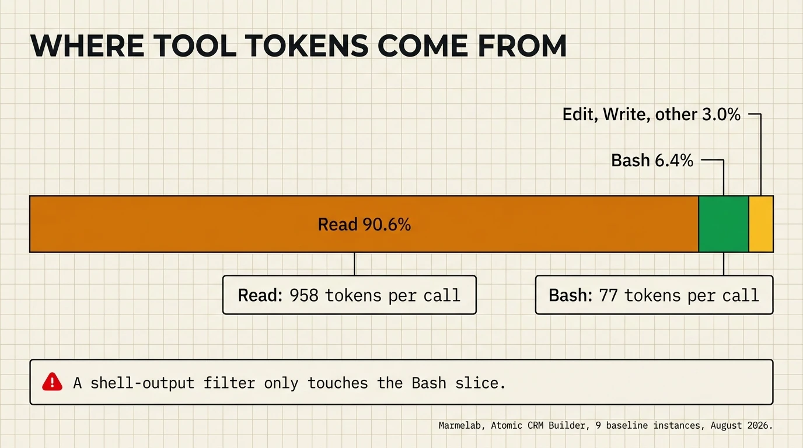
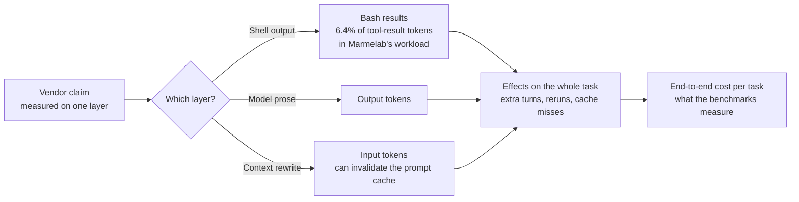

# Context engineering: Tools & ecosystem

> **Confidence**: Tier 1/2. Core concepts based on published research and production data. Third-party tool details based on public documentation, GitHub API star counts verified 2026-07-07.
>
> **Related**: [Context Engineering (configuration guide)](../core/context-engineering.md) | [Third-Party Tools](./third-party-tools.md) | [MCP Servers Ecosystem](./mcp-servers-ecosystem.md) | [a map of the context-engineering tool landscape](https://www.florian.bruniaux.com/blog/articles/context-engineering-tools-map/) (four layers, not a ranking)

This page maps the ecosystem of tools that help you manage what enters the context window and what doesn't. It complements the [configuration-focused context engineering guide](../core/context-engineering.md), which covers CLAUDE.md structure and path-scoping. Here the focus is on the broader tooling landscape: output compression, prompt compression, AI gateways, RAG optimization, observability, and inference infrastructure.

---

## Table of contents

1. [The Mental Model](#1-the-mental-model)
2. [Core Concepts](#2-core-concepts) (MVC, context rot, semantic priming, ghost tokens)
3. [Output Compression: CLI & Tool Output](#3-output-compression-cli--tool-output) ([independent benchmarks](#independent-benchmarks), RTK, Headroom, pxpipe, tilth, shunt, Token Savior, context-mode, stacklit, Cloudflare Code Mode MCP)
4. [Prompt Compression](#4-prompt-compression) (LLMLingua, Selective Context, AutoCompressors/Gisting, RECOMP, AttnComp, TOON)
5. [AI Gateways](#5-ai-gateways)
6. [RAG Optimization](#6-rag-optimization)
7. [Memory Systems](#7-memory-systems)
8. [KV Cache Infrastructure](#8-kv-cache-infrastructure)
9. [LLMOps & Observability](#9-llmops--observability)
10. [Tool Selection by Use Case](#10-tool-selection-by-use-case)
11. [Research Landscape](#11-research-landscape)

---

## 1. The mental model

The framing that makes everything else click: **the context window is RAM, not disk**.

RAM is fast, expensive, and finite. You don't load everything you own into RAM before running a program. You load exactly what the program needs, right when it needs it. The same applies to LLM context: every token you put there displaces something else, costs money, and competes for the model's attention.

This reframes the engineering challenge. It's not "how do I give the model more information?" but "what is the minimum viable set of information the model needs to succeed?" Every technique in this page is an answer to that second question.

The parallel with system architecture holds further. A CPU without good memory management stalls. An LLM without good context management hallucinates, loses coherence, and drifts toward generic outputs. Optimizing context is a reliability investment, not merely a cost-cutting exercise.

---

## 2. Core concepts

### Minimum viable context (MVC)

MVC is the principle of providing exactly the information needed for the task, nothing more. It has two failure modes that look opposite but stem from the same cause:

- **Under-context**: the model lacks necessary information, hallucinates or produces generic output
- **Over-context**: the model is overwhelmed with irrelevant information, attention diffuses, adherence degrades

The research on adherence degradation (see [context engineering guide, section 2](../core/context-engineering.md#2-the-context-budget)) quantifies the over-context failure: a CLAUDE.md over 400 lines typically drops adherence to ~60%. The cause is attention diffusion: too many potentially relevant signals compete for the model's limited attention budget.

MVC is not about minimalism for its own sake. It's about precision. A 300-token system prompt that covers exactly what the model needs beats a 3,000-token prompt that buries the critical instruction on page five.

### Context rot

Context rot describes the degradation in model behavior as context length grows during a session. The most studied form is the "lost-in-the-middle" phenomenon: models consistently underweight information placed in the middle of a long context, attending primarily to the beginning and end.

Empirical consequences in practice:

- Instructions near the top of a CLAUDE.md file are followed more consistently than instructions at the bottom
- In long agentic sessions, earlier constraints lose salience as new content pushes them toward the middle
- Tool outputs from the start of a session are often effectively "forgotten" after several rounds of interaction

Mitigation: `/compact` at 70% context usage (not 90%), structured note-taking hooks, and session restarts for fundamentally new task contexts. The `/compact` command summarizes conversation history, moving stale content out of the active attention window while preserving continuity.

### Semantic priming hypothesis

An observation from compression research with practical implications: when you ultra-compress a context (removing most tokens), the model does not recall the removed information verbatim. Instead, the compressed context acts as a *semantic prime*: it activates relevant latent knowledge that was already present in the model's weights from training.

This matters because it means heavily compressed context can perform better than its information density suggests. The model is not reconstructing facts from the context; it's being pointed toward relevant knowledge it already has. For well-trained domains, a 10-token hint may activate more relevant knowledge than a 100-token verbatim extract.

The practical implication: prefer keywords and structural cues over prose when context is tight. "Use OpenAPI 3.1, strict mode, no nullable" retrieves more precise behavior than two paragraphs explaining the same thing.

### Context rot vs. token cost: The two pressures

Context management operates under two simultaneous pressures that pull in opposite directions:

| Pressure | Cause | Effect | Mitigation |
|----------|-------|--------|------------|
| **Context Rot** | Too much content | Attention diffusion, lost-in-middle | Prune, compact, scope |
| **Token Cost** | Every token billed | Budget overrun, latency increase | Compress, filter, cache |

Compression addresses cost. Pruning addresses rot. Good context engineering does both.

### Context quality after compaction ("Ghost Tokens")

Most of the tooling in this page answers "how many tokens did we save?" A newer, narrower angle asks a different question: after `/compact` or any lossy summarization pass, how much of what remains is still load-bearing, versus dead weight that survived compaction by accident? The term circulating for the latter is "ghost tokens": content that costs budget but no longer does useful work, distinct from the noise MVC targets before compaction ever runs.

`alexgreensh/token-optimizer` is the tool most associated with this framing (1,748 stars as of 2026-07-27, up from 1,565 in June and 947 in May 2026, the fastest-growing entry in this category by percentage). Rather than reporting a single reduction percentage, it targets what survives a compaction pass and whether that surviving content is still relevant to the task at hand.

This is a genuinely distinct question from the raw-reduction metrics reported elsewhere on this page (Headroom's per-scenario token cuts, RTK's up to 90% on shell output). Raw reduction measures how much was cut. Post-compaction quality measures whether what was kept is still correct and relevant. A tool could score well on the first metric and poorly on the second, if it happens to prune the wrong content. Treat this as an emerging measurement dimension, not yet a mature tooling category. Watch this angle rather than adopt it as a solved problem.

---

## 3. Output compression: CLI & tool output

Tool outputs, shell command results, test logs, and database query responses share a structural problem: they contain 70–95% boilerplate. A passing test suite logs hundreds of success lines for the one failure you care about. A `git log` dumps metadata for every commit when you need three fields. This noise enters the context window verbatim unless intercepted.

### Independent benchmarks

Eight public benchmarks measured token-saving tools on whole agent tasks, or replayed real sessions, rather than on one layer. Read on 2026-09-30, they agree on one point: a tool that shrinks shell output, model prose, or one content type rarely shrinks the bill by the same amount, and several tools made tasks more expensive. No tool wins in every benchmark, and each result belongs to one harness, one model, and one effort setting. The models tested were `claude-sonnet-4-6`, `claude-sonnet-5`, GPT-5.6 Sol, and an unnamed Claude Sonnet version, and the Codepointer replay applied Opus 4.8 prices; none of the eight tested Claude Sonnet 5.5, Claude Opus 5.5, or the GPT-6 models listed in the [LLM market snapshot](../ops/llm-market-snapshot.md), so treat the results as dated evidence about the mechanism, not as current rankings.

Two of the eight are not independent of every tool they measure: Dasein Labs runs its bench and makes Parsec, and the THOL maintainer is Tokenade's author. Their Parsec and Tokenade rows are each maker's own benchmark, not a third-party measurement; the other rows in those two benchmarks measure tools their publisher does not make.

> **Disclosure**: the author of this guide is a core contributor to RTK. This section does not recommend a tool: it reports what each project claims and what third parties measured, with sources, and gives RTK's results as measured, including the unfavourable ones. The [token-savings page](https://cc.bruniaux.com/token-savings/) extends it with a catalogue of 45 projects selected by a fixed rule (public, not archived, aimed at coding agents, and at least 100 GitHub stars, or measured by one of these benchmarks, or already covered by the guide), each with its claim, the unit the claim uses, and any third-party measurement.

| Benchmark | Method | Publisher's interest |
|---|---|---|
| [Dasein Code-Compression Bench](https://github.com/daseinlabs/code-compression-bench), 2026-07-04 | 100 SWE-bench Verified tasks, headless Claude Code, `claude-sonnet-4-6`, official Docker grader, one run per arm, cache-aware cost | Sponsored and operated by Dasein Labs, which makes Parsec, one of the arms. The Parsec arm also injects a turn-0 brief and a stop decision, beyond compression |
| [Stet, "Six Ways to Save"](https://www.stet.sh/blog/gpt-56-token-saving-modes), 2026-07-20 | 10 merged changes from one production repo, Codex CLI with GPT-5.6 Sol, 7 arms, 2 repetitions, 140 runs | The unnamed author builds Stet.sh, the evaluation tool used; no compared tool is theirs |
| [Marmelab, "Cutting the Coding Agent Bill"](https://marmelab.com/blog/2026/08/27/which-agent-based-plugin-should-you-use-in-2026.html), 2026-08-27 | Atomic CRM Builder tasks, 1 to 4 tasks per tool, 3 to 4 runs per configuration; harness, model, and tool versions not stated | Marmelab builds the workload; no compared tool is theirs |
| [JetBrains, RTK](https://blog.jetbrains.com/ai/2026/07/rtk-claude-code-token-savings/), July 2026 | 86 SkillsBench tasks, 425 billed trials, Claude Code 2.1.201, rtk 0.43.0, `claude-sonnet-5`, low and high effort, Wilcoxon test on per-task medians | None stated |
| [JetBrains, Caveman](https://blog.jetbrains.com/ai/2026/07/speak-to-ai-agents-like-cavemen-tosave-tokens/), July 2026 | 86 SkillsBench tasks, 82 clean pairs, `claude-sonnet-5` at low effort, Caveman forcibly activated | None stated |
| [Token-Harness Optimizer Leaderboard](https://pi-infected.github.io/token-harness-optimizer-leaderboard/) (THOL), Claude Code 2.1.206 campaign, results committed 2026-07-18 | Headless Claude Code with `claude-sonnet-4-6`, 17 tasks, 10 runs per task and tool; the headline keeps the 7 tasks where the tool-free control used at least 200,000 tokens (70 runs per tool), end-to-end USD with bootstrap 95% intervals. The page uses the opposite sign convention; figures are converted here | Maintained by the author of Tokenade, which tops the table; the page says so |
| [Tura, token-saving plugins](https://github.com/Tura-AI/benchmark/tree/main/blog_data/token-saving-plugin-eza), 2026-07-19 | One task (rewrite the Rust `eza` tool in Python, 52 assertions), Codex CLI 0.144.1 with GPT-5.6 Sol at high reasoning, 2 runs per arm, cost modeled from token counts at list prices | Published by the maintainer of Tura, a competing coding agent; the author says it is not an independent review |
| [Codepointer, "Cutting LLM token costs"](https://codepointer.dev/p/cutting-llm-token-costs-with-rtk), 2026-06-18 | Counterfactual replay of 500 sessions from the author's own Claude Code history (614M tokens, $926.31 at list prices); no live runs, task success not measured | No relationship with the compared projects stated |

**Results.** Negative means cheaper than the same agent without the tool.

| Tool | Benchmark | What was measured | Result |
|---|---|---|---|
| RTK | Dasein | Total cost | +13%, 54 tasks resolved vs 57 without it |
| RTK | JetBrains | Median cost per task, low then high effort | +7.6% (p=0.004), then +0.1% (p=0.99); quality unchanged. RTK's maintainers dispute the one-run-per-task design (see the RTK section) |
| RTK | Stet | Workload cost, run 1 then run 2 | +13%, then -9% |
| RTK | THOL | End-to-end cost, 7 long tasks | +7.1% (95% interval -7.2% to +26.0%) |
| RTK | Tura | Modeled cost, one task, 2 runs | +7.2%, 44% more agent rounds; the author says the data do not identify a plugin effect |
| RTK | Codepointer | Share of replayed spend | -0.5%, while cutting 33% to 99% of the shell output it recognizes |
| Caveman | JetBrains | Output tokens, forced activation | -8.5%. The README now reports a 50% median output-token cut against an "Answer concisely." control (skill only); the GitHub description still says "cuts 65% of tokens" |
| Caveman | Dasein | Total cost | -19% |
| Caveman | Stet | Workload cost, run 1 then run 2 | +9%, then -12% |
| Caveman | THOL | End-to-end cost, 7 long tasks | -13.6% (interval -30.2% to +3.6%) |
| Caveman | Tura | Modeled cost, one task, 2 runs | -3.9% |
| Caveman | Codepointer | Share of replayed spend | -0.4% |
| Headroom | Dasein | Total cost | +44% |
| Headroom | Marmelab | Cost per operation, cache mode then token mode | -4% (called noise by the authors), then +32% |
| Headroom | THOL | End-to-end cost, 7 long tasks | +52.8% (interval +10.2% to +120.2%) |
| Headroom | Codepointer | Share of replayed spend | -2.8%, with a median 54% cut on the grep and diff output it touches |
| Ponytail | Stet | Workload cost, run 1 then run 2 | +20%, then -2%; tests 1 win, 4 losses, 15 ties |
| Ponytail | THOL | End-to-end cost, 7 long tasks | -3.5% (interval -18.1% to +12.4%) |
| Ponytail | Tura | Modeled cost, one task, 2 runs | -8.9%; the two runs spread by 51.7% of their mean |
| Context Mode | Stet | Workload cost, run 1 then run 2 | +72%, then +33% |
| Graphify | Marmelab | Cost on a large transformation | +1% |
| Graphify, code-review-graph | THOL | End-to-end cost, 7 long tasks | -3.3% and -8.5%, but THOL reports that the agent never called either tool, so the gap is not a tool effect |
| CodeGraph | THOL | End-to-end cost, 7 long tasks | -7.6% (interval -21.6% to +8.7%) |
| lean-ctx | THOL | End-to-end cost, 7 long tasks | +10.3% (interval -12.6% to +46.4%) |
| Edgee | THOL | End-to-end cost, 7 long tasks | -14.7% (interval -37.1% to +11.1%); THOL flags no token accounting for this tool |
| claude-token-efficient | THOL | End-to-end cost, 7 long tasks | -11.6% (interval -24.2% to +1.4%) |
| LSP code navigation | Marmelab | Cost on a large transformation | -13% |
| Parsec | Dasein (sponsor's arm) | Total cost | -39%, 62 tasks resolved |
| Fermat | Dasein | Total cost | -22%, 55 tasks resolved; run 2026-09-21 on a later harness, not paired with the other arms |
| Woz | Dasein | Total cost | -13%, 55 tasks resolved, wall clock +23% |
| Tokenade | THOL (author's tool) | End-to-end cost, 7 long tasks | -38.9% (interval -53.2% to -22.3%); the agent called the tool in 5 of 70 runs |
| Switching to GPT-5.6 Terra xhigh | Stet | Workload cost, run 1 then run 2 | -49%, then -49%: a model change, the only repeated drop in that study |

**Research preprints (2025 to September 2026).** These arXiv preprints, not yet peer reviewed, test token reduction against billed or estimated cost, success, or time. Their abstracts were read on 2026-09-30; the [token-savings page](https://cc.bruniaux.com/token-savings/#research) lists 15, separating studies from papers whose authors measure their own method.

| Preprint | Setup | Finding |
|---|---|---|
| [Token Reduction Is Not Cost Reduction](https://arxiv.org/abs/2607.12161) (Weinberger, Hozez; v1 2026-07-13, v5 2026-08-12) | Three token-reduction approaches against unmodified Claude Code, provider-billed cost, SWE-bench Go subset | The largest compression setup cut delivered tool-output tokens by 38.4% and raised billed cost by 6.8%; across tasks, token reduction and cost reduction correlated weakly (Pearson r = 0.15) |
| [An Empirical Cost Attribution of Context-Compression Gateways in Multi-Turn Coding Agents](https://arxiv.org/abs/2609.22114) (Chen, Shi; v1 2026-08-19) | Paritok, a production gateway between Claude Code or Codex and Claude Sonnet or GPT-5 | Tool-schema filtering removes about 21K to 57K tokens per turn; content compression saves about 2% per turn; the authors warn that single-shot compression benchmarks must not be cited as a multi-turn cost argument. The paper instruments the authors' own gateway |
| [What Does Context Compression Cost an Agent?](https://arxiv.org/abs/2608.16370) (Liu; v1 2026-08-17) | Three models, two task environments, 24-turn horizon | With GPT-5.5, completion moved from 80% to 85% (p = 1.0) while retrieval calls rose from 21.0 to 63.9 (p = .002): the agent reacquires the state that compression dropped |
| [CAVEWOMAN](https://arxiv.org/abs/2606.24083) (Adeyemi, Rossi, Dernoncourt; v1 2026-06-23) | Eight models, five datasets, single generations rather than an agent loop | Output compression cut realized cost 1.4x to 2.4x per model on most API models; input compression raised net cost, about 1.15x on the five-benchmark mean |
| [Don't Break the Cache](https://arxiv.org/abs/2601.06007) (Lumer, Nizar, Jangiti et al.; v2 2026-01-31) | Three caching strategies, three providers, over 500 agent sessions | Prompt caching reduced API cost by 41% to 80%: keeping the cache intact matters more than shrinking what goes into it |
| [Agentic Coding in the Wild](https://arxiv.org/abs/2608.00101) (Liu, Qiu, Goiri et al.; v1 2026-07-30) | June 2026 GitHub Copilot traces: 3.2M users, 13M sessions, 761M calls | Cache hit rates average 90% within a turn and fall to 55% across turn boundaries |
| [Can your AI agent be cheaper?](https://arxiv.org/abs/2608.25399) (Smekal; v1 2026-08-26) | 2,700 runs with Kimi K3 at three effort levels | Replacing a full task specification with a bare user story raised token spend by 29.7% |
| [Beyond Token Savings: A Systematic Study of Context Compression in LLM Agents](https://arxiv.org/abs/2609.32961) (Satish, Sinha, Kawada, Yadwadkar; v1 2026-09-26) | Nearly 35,000 runs, three open-weight models, SWE-bench Verified and Terminal-Bench 1.0 | On Terminal-Bench with Qwen, policies using roughly one third as many tokens can take 20% to 80% longer, and the same policy behaves differently across models |

**Why a layer saving does not become a bill saving.** In Marmelab's baseline runs, `Read` results made up 90.6% of tool-result tokens and `Bash` 6.4%. JetBrains found that the Bash calls RTK can rewrite carry just under 20% of tool-result characters, and that tool results are only part of what a session bills, because the same context is re-read on every turn. Over its low-effort run, `rtk gain` reported 96.2 million tokens saved while the measured bill went up.





**How to use these results.**

- **Compare denominators before numbers.** "Up to 90% fewer tokens in shell output" and "+7.6% cost per task" describe different quantities; both can be true.
- **Discount single runs.** Dasein runs each arm once on 100 tasks, and Stet's signs flip between its two repetitions for Caveman, Ponytail, and RTK.
- **Weigh the publisher's interest.** The two benchmarks that rank a tool first are run by that tool's maker (Dasein for Parsec, the THOL maintainer for Tokenade), and the Tura benchmark comes from a competing agent's maintainer.
- **Measure on your own tasks.** Run your workload with and without the tool, paired, and compare cost per accepted task, as described in [AI unit economics](../ops/ai-unit-economics.md#2-building-a-cost-per-accepted-task). The [AI FinOps lever map](../ops/ai-finops.md#3-lever-map) places compression among the other cost levers.

### RTK (Rust Token Killer)

RTK is a CLI proxy that intercepts command output before it reaches Claude's context, applying purpose-built filters that surface signal and discard noise. It integrates via a Claude Code hook, so standard commands are transparently rewritten.

| Attribute | Details |
|-----------|---------|
| **Source** | [github.com/rtk-ai/rtk](https://github.com/rtk-ai/rtk) |
| **Install** | `brew install rtk`, the install script from the README, or `cargo install --git https://github.com/rtk-ai/rtk` (a different "rtk" crate exists on crates.io) |
| **Stars** | 82,094 (GitHub API, 2026-09-30), up from 69,042 on 2026-07-07, 24,397 in April 2026 and 446 in February 2026 |
| **Integration** | Claude Code hook via `rtk init --global` |

The jump from April to July, roughly 2.8x, is a steep curve for a CLI proxy. It is plausible given the tool's growing bundling into other agents' default setups (see below), but treat the figure as unverified against the full star-history graph rather than confirmed growth, and re-check before quoting it in a high-stakes context.

RTK's own per-command figures, which count shell output only:

| Command | Reduction |
|---------|-----------|
| `rtk git log` | 92% |
| `rtk git status` | 76% |
| `rtk vitest run` | 99%+ |
| `rtk cargo test` | 89% avg |
| `rtk pnpm outdated` | 70–85% |

The design philosophy: suppress successful output, surface failures. A test suite that passes 300 tests and fails 2 should show 2 lines, not 302. This matches how a developer reads output. Context should match that cognitive model.

RTK supports custom filters via TOML DSL (`.rtk/filters.toml`) for project-specific output patterns without writing Rust. See [Third-Party Tools: RTK](./third-party-tools.md#rtk-rust-token-killer) for the complete feature reference.

**Real-world cost impact**: RTK's README states the limit itself: it cuts up to 90% of the bash output the agent reads, which "is not the same as cutting your bill by 90%", and Claude Code's built-in Read, Grep and Glob tools bypass its hook. A counterfactual replay of 500 of Codepointer's own Claude Code sessions ($926.31 at list prices) found RTK saving 0.5% of spend while cutting 33% to 99% of the shell output it recognized. The author of the maki agent reports that bash is about 12% of his total token usage and file reads about 65%. The per-command savings are real; they apply to one slice of the context.

**Response from RTK's maintainers**: in ["RTK on SkillsBench: What the Benchmark Measures"](https://www.rtk-ai.app/blog/rtk-on-skillsbench/) (RTK AI Labs, 2026-08-07), the maintainers argue that the JetBrains headline rests on one run per task, and that the extra turns (+13.8%) come from agent behavior rather than compression. Re-running with RTK v0.45.0, they report -4.8% cost on 13 dev tasks (permutation p = 0.305), task-level results from -32% to +14%, run-to-run variation of about 22% on the same task, and a compression ceiling of about 3% to 4% of the bill, because RTK rewrote about one third of Bash calls covering about 20% of tool-output characters. This is the vendor's own analysis. See also [issue #3157](https://github.com/rtk-ai/rtk/issues/3157). The repository description on GitHub says "60-90% on common dev commands", while the README headline says "up to 90% of the bash output your agent reads".

**Third-party measurements**: on whole tasks, JetBrains measured a median cost per task of +7.6% with RTK at low effort (p=0.004) and +0.1% at high effort, with quality unchanged; Dasein measured +13% total cost; Stet measured +13% then -9% over two runs; THOL measured +7.1% on long sessions, with an interval that crosses zero. See [independent benchmarks](#independent-benchmarks) for methods and caveats. The author of this guide is a core contributor to RTK.

### Headroom

Headroom compresses what enters the context from tool outputs, structured data, and conversation history. Its output shaper also reduces what comes back from the model, making it one of the few tools that operates on both sides of the LLM call.

| Attribute | Details |
|-----------|---------|
| **Source** | [GitHub: headroomlabs-ai/headroom](https://github.com/headroomlabs-ai/headroom) |
| **Docs** | [headroom-docs.vercel.app](https://headroom-docs.vercel.app/docs) |
| **Stars** | 74,156 (GitHub API, 2026-09-30), up from 62,778 on 2026-07-27 and 57,223 on 2026-07-07 |
| **Author** | Tejas Chopra (Senior Engineer, Netflix) |
| **License** | Apache 2.0 |
| **Install** | `pip install "headroom-ai[all]"` or `npm install headroom-ai` |
| **Version** | v0.39.1 (latest release, 2026-09-26) |

> **URL correction**: Earlier versions of this guide linked `headroom.ai` (unrelated domain) and later `github.com/chopratejas/headroom` (the author's personal fork). The project has since moved to the `headroomlabs-ai` org; the old personal slug now redirects, a standard GitHub org transfer.

**Reported cost impact**: the maintainer cites aggregate savings of "~$700K across 200B tokens processed." This is self-reported with no third-party audit found. Treat it as a marketing signal, not a verified figure, distinct from the per-workload benchmark numbers below, which do publish methodology.

**Five deployment modes**:

1. Python library: `compress(messages)` directly in application code
2. TypeScript/npm: `withHeadroom()` / `compress()`
3. HTTP proxy: `headroom proxy --port 8787`, then set `ANTHROPIC_BASE_URL=http://localhost:8787`
4. MCP server: `headroom mcp install` (exposes `headroom_compress`, `headroom_retrieve`, `headroom_stats`)
5. Agent wrap: `headroom wrap claude|codex|cursor|aider|copilot`

**Compress-Cache-Retrieve (CCR)**: Instead of sending verbose tool output to the model, Headroom replaces it with a `{{HEADROOM_TAG_N}}` placeholder, stores the original in a local SQLite store (HNSW vector index + FTS5 full-text index), and registers a retrieval handle. The model calls `headroom_retrieve(tag)` when it needs the original data. Multiple agents (Claude + Codex) can share the same SQLite store for cross-agent context handoff.

**Output shaper** (`HEADROOM_OUTPUT_SHAPER=1`): appends a brevity instruction at the end of the system prompt (cache prefix is preserved) and reduces model effort on turns that follow successful tool results. Savings are reported as "estimated" using a 10% holdout control group with 95% confidence intervals.

**Benchmark scope**: The repository description, read 2026-09-30, says "20% fewer tokens for coding agents, 60-95% fewer tokens for JSON, same answers". The README's current token reductions (SRE incident debugging 57%, codebase exploration 42%, GitHub issue triage 30%, code search 21%, read 2026-09-30) are measured on four seeded offline scenarios built from MCP-server output formats, not on full-session spend; earlier versions quoted 73% to 92% on the same kinds of content. Whole-task third-party results: Dasein measured +44% total cost, THOL +52.8% on long sessions, Marmelab -4% then +32%, and Codepointer's replay -2.8% of spend (see [independent benchmarks](#independent-benchmarks)). Accuracy benchmarks (GSM8K 0.870 to 0.870, TruthfulQA 0.530 vs 0.560) are N=100 samples, not independently reproduced. Reproduction command: `python -m headroom.evals suite --tier 1`.

**Known issues (June 2026, check the issue tracker for current resolution status)**:

- **Issue #714**: CCR originals expire after 5 minutes (LRU TTL). Long-running agent jobs that pause between steps will hit retrieval failures when the cache expires. No persistent fallback is documented for this case.
- **Issue #1158**: `headroom wrap claude` silently caps context at 200K for Claude Max subscribers (the `context-1m-2025-08-07` beta header is dropped). Claude Max users should use `headroom mcp install` instead of `wrap`.
- **Issue #1227** (security, unresolved as of June 2026): CCR endpoints lack loopback protection and use permissive CORS. A local web page can read cached tool outputs without authentication. Avoid CCR if the host runs alongside untrusted local web content.
- **Issue #1209**: In some configurations, CCR stores the `{{HEADROOM_TAG_N}}` placeholder as the original, so `headroom_retrieve` returns the placeholder rather than the actual data. PR #1208 filed.
- **Issue #1233**: `CodeAwareCompressor` generates invalid Python syntax on roughly 28% of real files containing modern syntax (match/case, walrus operator, nested async). Silent fallback to uncompressed output in those cases.

**When to choose Headroom over RTK**: RTK handles unstructured CLI text and drops content you definitively do not need. Headroom is the right choice for structured data (JSON payloads, database results, API responses) where you cannot predict upfront which parts the model will need, and where lossless retrieval is a requirement. The two tools complement each other; RTK operates at the shell output layer, Headroom at the structured data layer.

**Production note**: Core compression is functional. CCR has reliability issues under bugs #714 and #1209 above. For Claude Max users, prefer MCP mode over `headroom wrap`.

### pxpipe

pxpipe is the first production tool built on optical/visual context compression specifically for Claude Code and the Anthropic API: instead of shrinking text, it rewrites large context blocks as images before the request leaves the machine. See [Context Engineering: Optical and Visual Context Compression](../core/context-engineering.md#optical-and-visual-context-compression) for the research lineage (DeepSeek-OCR, AgentOCR, Glyph, VIST).

| Attribute | Details |
|-----------|---------|
| **Source** | [github.com/teamchong/pxpipe](https://github.com/teamchong/pxpipe) |
| **License** | MIT, TypeScript |
| **Stars** | 4,277 (GitHub API, 2026-07-07), up from 586 at launch in May 2026, roughly 7x in under two months |
| **Install** | `npx pxpipe-proxy` |

**Mechanism**: a local proxy intercepts `/v1/messages` calls and, above a computed cost-effectiveness threshold, rewrites large `tool_result` blocks, already-collapsed older turns, and the static system-prompt/tool-doc block into PNG images (1928px-wide columns, roughly 92,000 characters per page, roughly 4,761 vision tokens per page). It never touches model output, recent turns, or sparse prose, where text stays cheaper per character. The text-vs-image break-even is around 19 characters per token; the maintainer's observed Claude Code traffic averages 1.91 characters per token, so most large content is worth imaging. Exact-byte content (passwords, hashes, IDs) is explicitly excluded from rendering and flagged in the README as a documented lossy-recall risk, not a solved problem.

```bash
npx pxpipe-proxy
ANTHROPIC_BASE_URL=http://127.0.0.1:47821 claude
```

**Benchmarks**: 59 to 70% end-to-end bill reduction, measured per-request via a parallel counterfactual `count_tokens` call logged to `~/.pxpipe/events.jsonl` and cross-checked against actual billed usage, a reproducible methodology rather than a marketing estimate. SWE-bench Lite pilot: 10/10 passing in both arms at -65% request size (small n, disclosed as such in the README). Verbatim recall of 12-character hex strings: 13/15 correct on Fable 5, 0/15 on Sol, numbers the README states plainly rather than hides.

**Model allowlist**: defaults to `claude-fable-5` and `gpt-5.6`. Opus 4.7/4.8 and GPT-5.5 are opt-in because of measured higher misread rates on rendered images.

**When to choose pxpipe over Headroom**: same API-gateway layer, different modality. Headroom compresses text to text (reversible, retrieval-based); pxpipe rasterizes text to images (lossy on exact strings, not retrieval-based). They complement rather than compete: pxpipe is Claude Code/Anthropic-API-specific with limited GPT support, not a multi-agent generalist tool like Headroom.

### tilth

tilth is an MCP server for code navigation that targets the largest single source of token usage in Claude Code sessions: file reads. Rather than returning full file contents, it provides structural navigation via tree-sitter, so the model reads shapes and relationships instead of raw text.

| Attribute | Details |
|-----------|---------|
| **Source** | [github.com/jahala/tilth](https://github.com/jahala/tilth) |
| **Install** | `cargo install tilth` then `tilth install claude-code` |
| **Architecture** | MCP server, installs into Claude Code |
| **Parser** | tree-sitter (multi-language) |

The core tools it exposes:

- **File read with auto-outline**: for large files, instead of the full text, returns a structural skeleton with section names and line ranges. The model requests specific ranges on demand.
- **Symbol search**: definitions, usages, and resolved callees in a single call, replacing the grep-then-read loop.
- **`--callers`**: all call sites of a symbol, structurally, not via text search.
- **`--deps`**: imports and dependents of a file, useful before a refactor to understand blast radius.
- **`grok <symbol>`**: everything about one symbol in one call: signature, callers, callees, sibling functions, associated tests.
- **Structural diff**: change summary at the function level, not the line level.
- **Session dedup**: symbols already shown in the session are marked `[shown earlier]` rather than re-expanded.

**Benchmarks**: tilth has retired its earlier cost benchmark (v0.5.0, early-2026 models). Its README, read 2026-09-30, says that benchmark "no longer describes the tool" and that "tilth makes no cost claim"; the harness is kept under a `benchmark-archive` tag. Earlier versions of this guide quoted that benchmark's -40% cost per correct answer; do not reuse it. No third-party measurement was found.

Why file reads are a large target: in Marmelab's measured workload, `Read` results were 90.6% of tool-result tokens and `Bash` 6.4%, and the author of the maki agent reports reads at about 65% of his total token usage versus about 12% for bash. A smaller read does not guarantee a smaller bill, for the reasons given in [independent benchmarks](#independent-benchmarks).

**Install:**

```bash
cargo install tilth
tilth install claude-code   # registers the MCP server in Claude Code
```

No per-project configuration is needed after global install.

**Comparison with lean-ctx**: Both tilth and lean-ctx use tree-sitter to compress file reads. lean-ctx operates as a hook-level redirect (intercepts native Read calls at the MCP layer), while tilth exposes explicit navigation tools the model calls directly. lean-ctx is more transparent and requires no change to how the model requests files. tilth gives the model more control over what it fetches but requires it to use the tilth tools rather than standard read operations. On teams that want the model to actively navigate code structure rather than have reads compressed passively, tilth's explicit tools fit better.

### shunt (delegation, not compression)

shunt targets the same pool as tilth and lean-ctx, file reads, with a different mechanism. It does not compress what Claude reads. It keeps the file away from Claude entirely: a hook blocks the read, and a script sends the files and the question to a cheaper model, which answers with a summary. Claude only sees that summary.

| Attribute | Details |
|-----------|---------|
| **Source** | [github.com/spotify/portal-ai-plugins](https://github.com/spotify/portal-ai-plugins) (`plugins/shunt`, Apache-2.0) |
| **Article** | [Portal by Spotify cut my Claude Code token usage by 90%](https://engineering.atspotify.com/2026/9/portal-by-spotify-cut-my-claude-code-token-usage-by-90) |
| **Requires** | A Spotify Portal instance (commercial managed Backstage, free trial then sales pricing) with the AiKA assistant |
| **Worker model** | Gemini 2.5 Flash by default, configurable per Portal "mode" |
| **Evaluation** | [spotify-portal-shunt.md](../../docs/resource-evaluations/spotify-portal-shunt.md) (3/5) |

**How it works**: a `PreToolUse` hook on `Read` blocks full reads of files above 350 lines and names the `/bulk-reader` skill in its refusal. A second hook does the same for `cat`, `head`, `tail`, `less` and `more` in Bash. The `bulk-read` script sends the files to the worker model through the Portal CLI. A `code-write` script generates boilerplate from a spec and one reference file and writes it straight to disk, so Claude never reads the generated code.

**Reading the 90%**: it is the mean of three read scenarios (82%, 94%, 94%) on a private monorepo, counted as tokens entering Claude's context only. The worker model's tokens, the extra turn caused by each block and answer accuracy are not measured. The cost moves to another bill rather than disappearing. The author also reports the limits: the worker's summaries carry unreliable line numbers, so edits still need a targeted read, and Gemini Flash missed a thread-safety bug that Claude found once given the section. Apply the checklist in [How to read a vendor's cost-reduction claim](../ops/ai-unit-economics.md#6-how-to-read-a-vendors-cost-reduction-claim) before quoting the number.

**Measured defects** (live test, Claude Code 2.1.284, no Portal instance):

- The Read block works on text files, but a PDF is blocked too: the line count is taken on the binary, so a PDF with 4,471 newline bytes is sent down the delegation path.
- The Bash hook ignores paths that start with `~`: `head -100 ~/project/file.ts` passes while the same command with an absolute path is blocked. The hook tests the literal string, and a quoted `~` is not expanded.
- Ranged reads always pass, including `offset: 0`, and the refusal message itself suggests re-reading with `offset` and `limit`. The hook steers Claude; it does not enforce a budget.
- `code-write --target` writes through Bash, outside any hook or permission rule scoped to `Edit` and `Write`.

**What to take from it**: the pattern, not the product. The author's first version was a block of routing rules in `CLAUDE.md`, which Claude could ignore. The hook makes the routing apply on every call. You can reproduce the same enforcement without Portal and without sending code to a second vendor, by redirecting to a subagent that runs on Haiku:

```markdown
<!-- .claude/agents/bulk-reader.md -->
---
name: bulk-reader
description: Answers a precise question about large files. Use when a full read was refused for size.
tools: Read, Grep, Glob
model: haiku
---
Read the files named in the task and answer only the question asked, in short bullets.
Lead each bullet with the exact symbol name and line number. Do not propose edits.
```

```bash
#!/usr/bin/env bash
# PreToolUse hook (matcher: Read): send full reads of large text files to a Haiku subagent
MIN_LINES="${BULK_READ_MIN_LINES:-350}"
input=$(cat)
# The subagent itself must be able to read the files it was sent
[ "$(jq -r '.agent_type // empty' <<<"$input")" = "bulk-reader" ] && exit 0
# Ranged reads (offset or limit set, including 0) are targeted: let them through
[ "$(jq -r '.tool_input | has("offset") or has("limit")' <<<"$input")" = "true" ] && exit 0
path=$(jq -r '.tool_input.file_path // empty' <<<"$input")
[ -f "$path" ] || exit 0
# Text files only: PDFs, images and notebooks go to Read as usual
case "$(file -b --mime-type "$path")" in
  text/*|application/json|application/xml|application/javascript) ;;
  *) exit 0 ;;
esac
lines=$(wc -l < "$path" | tr -d ' ')
[ "$lines" -le "$MIN_LINES" ] && exit 0
jq -n --arg r "File is $lines lines (threshold: $MIN_LINES). Ask the bulk-reader subagent a precise question about it, or re-read only the section you need with offset and limit." \
  '{hookSpecificOutput: {hookEventName: "PreToolUse", permissionDecision: "deny", permissionDecisionReason: $r}}'
```

Register it under `hooks.PreToolUse` with `"matcher": "Read"` in `.claude/settings.json`. The hook uses the current `hookSpecificOutput` format, exits silently when it has nothing to decide, and reads `agent_type` so the subagent is not blocked by the rule it serves. File reads are already resolved to absolute paths by Claude Code, so the `~` problem above does not apply to a Read hook. The trade-off stays the same as shunt's: a summary replaces the file, which is fine for "what does this module do" and wrong for "fix line 212". Measure before and after with `/cost` on the same questions, and check the answers, not only the token count.

**Comparison with tilth and lean-ctx**: they cut the tokens of a read locally, without adding a model, and keep exact content available. shunt and the subagent variant replace the read with an answer from another model: larger savings on exploratory questions, lossy by construction, and useless for edits.

### Token Savior

Token Savior is a three-in-one MCP server: structural code navigation by symbol (replacing full-file reads), Bash output compaction for 34 common CLI tools, and persistent cross-session memory via SQLite with FTS5.

| Attribute | Details |
|-----------|---------|
| **Source** | [GitHub: Mibayy/token-savior](https://github.com/Mibayy/token-savior) |
| **Install** | `pip install "token-savior-recall[mcp]"` then `ts init --agent claude --yes` |
| **Stars** | ~1,000 (June 2026) |
| **Language** | Python 3.11+ |
| **Last commit** | April 2026 (C99/C11 and GLSL support added) |

**Core navigation tools** (via the `optimized` profile, 15+ tools):

- `find_symbol(name)` - locate functions and classes across the indexed codebase
- `get_function_source(name)` - retrieve implementation without loading the full file
- `get_full_context(identifier)` - extended context around a symbol
- `get_change_impact(identifier)` - dependency chain for blast-radius analysis before refactoring
- `build_commit_summary` - recent git changes without reading every file
- `memory_index` / `memory_search` - store and retrieve session learnings across runs
- `ts_discover()` - scan past transcripts for missed optimization opportunities

**Bash compaction**: 34 output compactors for git, pytest, jest, kubectl, and similar tools, activated via `TS_BASH_COMPACT=1` and PostToolUse hooks. Outputs above 4KB fall back to full capture. This feature is opt-in and accounts for a significant share of the reported gains; skipping it reduces the savings substantially.

**6 tool profiles** (controls how many tools the model sees, useful when manifest budget is constrained): `full`, `core`, `nav`, `lean`, `ultra`, `tiny`. The `tiny` profile exposes 6 tools; roughly 60 others are reachable via `ts_search` on demand.

**Language support**: Python, TypeScript/JavaScript, Go, Rust, C#, C/C99/C11, GLSL, plus config formats (JSON, YAML, TOML, INI, ENV, HCL/Terraform, Dockerfile, Markdown).

**tsbench results** (Claude Opus 4.7, 96 tasks, synthetic 2,000-line codebase, `--seed 42`, author-created benchmark):

| Metric | Without Token Savior | With Token Savior |
|--------|---------------------|-------------------|
| Task completion | 78.3% | 97.9% |
| Active tokens/task | ~16,800 | ~3,929 (-77%) |
| Wall time/task | ~111s | ~26.6s (-76%) |

The README, read 2026-09-30, now says these figures stand only "as reported and unverified": the tsbench repository is not public, and a re-measurement published on 2026-08-09 was withdrawn the next day because only 1 of 143 sessions called a Token Savior tool (deferred MCP tool loading hid them). Re-measurement is listed as open work. No independent third-party reproduction has been published. Behavior on large codebases (100K+ lines) has not been benchmarked under controlled conditions.

```bash
# Recommended install
pip install "token-savior-recall[mcp]"
ts init --agent claude --yes   # merges hooks into ~/.claude/settings.json

# Or without global install
WORKSPACE_ROOTS=/your/project uvx token-savior
```

**Comparison with tilth**: tilth (Rust, 14 languages; its cost benchmark is retired) focuses on structural code navigation and file outlines. Token Savior adds Bash output compaction and persistent cross-session memory, features tilth does not have. Choose tilth for a Rust code navigation layer with no index to maintain. Choose Token Savior if you also need Bash compaction and memory persistence across sessions.

### context-mode

context-mode is an MCP server that operates at the boundary between tools and context, intercepting tool call outputs before they reach the conversation window and applying compression or selective retrieval. It also implements a session tracking layer using SQLite with FTS5 full-text search, enabling semantic retrieval of earlier session content after `/compact` discards raw history.

| Attribute | Details |
|-----------|---------|
| **Source** | [GitHub: mksglu/context-mode](https://github.com/mksglu/context-mode) |
| **Stars** | 18,654 (GitHub API, 2026-07-07), up from 14,149 in May 2026 (+32% in about 2 months) |
| **License** | ELv2 (commercial SaaS planned) |
| **Platforms** | Claude Code plugin, Gemini CLI, Copilot, Cursor, Kiro, Zed, and 11 others (17 total, up from 12 in May 2026) |
| **Claims** | "315 KB becomes 5.4 KB. 98% reduction": bytes of raw tool output kept out of the context window on the vendor's scenarios (about 60% without hooks, per its own platform table). Not tokens and not the bill |
| **License** | Elastic License 2.0 (source-available) |
| **Third-party measurement** | Stet: workload cost +72%, then +33% over two runs (see [independent benchmarks](#independent-benchmarks)) |

The growth rate reads as consolidation of an already-mature tool rather than a new-entrant spike: other projects now cite context-mode as a dependency or reference, a sign of an ecosystem forming around it rather than just end users adopting it.

**How the MCP output sandbox works**: Instead of routing raw tool call output directly into the conversation, context-mode intercepts the result, applies compression, and injects a summary with a retrieval handle. The full output is accessible on demand if the model requests it, similar in spirit to Headroom's lossless architecture but operating specifically on MCP tool boundaries.

**Session memory after `/compact`**: context-mode uses SQLite + FTS5 to index session history. When `/compact` runs and discards raw conversation history, the SQLite index persists. Subsequent retrieval queries use BM25 ranking to surface relevant earlier context without reloading the full transcript.

**"Think in Code" pattern**: context-mode v1.0.64 documented a pattern where, instead of reading files to answer an exploratory question, the model writes and executes a script that queries or counts, then reads only the result. This is covered in depth as a named technique in the [context engineering guide](../core/context-engineering.md).

**When to choose context-mode**: If you run Claude Code alongside other platforms (Cursor, Gemini CLI) and want a single context management layer that works across all of them. Also useful when MCP tool outputs are large and structured, and you need post-compact session retrieval beyond what `/compact` alone provides.

**Comparison with RTK and Headroom**: RTK operates at the shell command level (CLI output), Headroom at the structured data/API response level. context-mode operates specifically at the MCP tool boundary and adds session persistence. These tools are complementary.

### stacklit

stacklit generates a machine-readable index of a repository's package structure, exported symbols, and dependencies. An agent reads this index in a single call (~250 tokens) instead of spending 50,000+ tokens exploring files to understand the codebase structure.

| Attribute | Details |
|-----------|---------|
| **Source** | [GitHub: glincker/stacklit](https://github.com/glincker/stacklit) |
| **Install** | `npm install -g stacklit` |
| **Integration** | Auto-configures Claude Code, Cursor, and Aider via `stacklit setup` |
| **Claimed reduction** | 50,000+ tokens of exploration compressed to ~250 tokens |

**How it works**: `stacklit generate-json` scans the repository and writes `stacklit.json`, a structured map of packages, exports with type signatures, dependency graph, git activity heatmap, and framework hints. `stacklit setup` injects a compact codebase map into agent configuration files automatically. `stacklit diff` detects when the index is stale after file additions or deletions.

```bash
# One-time setup per repository
stacklit generate-json    # create the index
stacklit setup            # inject into Claude Code / Cursor / Aider config

# Maintenance
stacklit diff             # check if index is stale
stacklit generate-json    # re-index after structure changes
```

**Worktree compatibility**: generates per-repository indexes with no centralized state. Unlike grepai (which requires a local embedding index) or Serena (which connects to a language server), stacklit produces a static JSON file that works in git worktrees and ephemeral CI environments without additional setup.

**Comparison with RTK and context-mode**: RTK intercepts CLI output during a session. context-mode intercepts MCP tool output in real time. stacklit eliminates exploration-phase token spend before the session starts, by making the repo structure known from the first message. The three tools target different moments in a session's lifecycle and are complementary.

### Cloudflare code mode MCP

A different category of tool-schema cost: an MCP server with hundreds or thousands of endpoints loads a schema per tool, and that schema overhead can dwarf the actual task. Cloudflare's Code Mode MCP (`cloudflare/mcp`) addresses this at the API-surface level rather than the output level.

Instead of exposing one MCP tool per endpoint, it exposes exactly two meta-tools, `search()` and `execute()`, backed by a typed SDK. The model writes and runs JavaScript in a sandboxed V8 instance (Dynamic Worker Loader) that calls the typed SDK, rather than receiving a schema definition for every possible endpoint upfront. For Cloudflare's full API surface (2,500+ endpoints), this drops the schema-loading cost from roughly 1.17M tokens to about 1,000, a 99.9% reduction on that specific dimension.

This is a shipped production feature at a major infrastructure vendor, not a side project or a research prototype. It generalizes a pattern worth naming: when a tool surface is large and mostly unused per session, exposing a code-execution interface over the API instead of one MCP tool per endpoint moves the token cost from "loaded upfront for every session" to "paid only for the endpoints actually called." See [MCP Servers Ecosystem](./mcp-servers-ecosystem.md) for how this interacts with Claude Code's MCP tool-count guidance ([Progressive Disclosure](../core/context-engineering.md#progressive-disclosure) in the core context engineering guide recommends fewer than 80 total tools across active servers; a code-execution MCP server sidesteps that ceiling entirely by exposing 2 tools regardless of API surface size).

### Zero-install approach: claude-token-efficient

[claude-token-efficient](https://github.com/drona23/claude-token-efficient) (6,072 stars, GitHub API, 2026-09-30) is a single `CLAUDE.md` file that instructs Claude to generate concise responses. No binary, no MCP server, no hooks.

The README's 63% figure is a word count over four prompts, single run each, which the README itself calls "a directional indicator"; its newer benchmark with the current file gives about 4%, 12% and 7% fewer output tokens on Haiku, Sonnet and Opus. THOL measured -11.6% end-to-end cost on long sessions, with an interval that crosses zero. The approach works within a real but narrow scope: if verbose model output is your primary cost driver, a style instruction in `CLAUDE.md` costs nothing to try. It cannot compress shell output, file reads, or tool responses. Those require tools like RTK, lean-ctx, Headroom, or tilth. The near-6K star count reflects genuine demand for zero-config options, not validated performance across diverse workloads.

Use it as a starting point. When you hit the ceiling, the tools above address what a `CLAUDE.md` file cannot.

---

## 4. Prompt compression

Prompt compression operates at the model-input level: reducing the token count of the prompt itself before it is sent to the LLM. This differs from output compression (which intercepts tool responses) and context pruning (which manages session history).

### LLMLingua / LLMLingua-2

LLMLingua (Microsoft Research) is the most studied prompt compression framework. It uses a small language model to evaluate the "importance" of each token in a prompt, then removes the least important tokens up to a target compression ratio.

| Attribute | Details |
|-----------|---------|
| **Source** | [github.com/microsoft/LLMLingua](https://github.com/microsoft/LLMLingua) |
| **Max compression** | 20x |
| **Performance loss** | ~1.5% on GSM8K and BBH benchmarks |
| **Approach (v1)** | Perplexity-based token scoring via small LM |
| **Approach (v2)** | Data distillation from GPT-4, token classification |

LLMLingua-2 improves on the original by treating compression as a classification problem (keep vs. drop) rather than a ranking problem. The classifier is trained via distillation from GPT-4 annotations, making it faster and more generalizable across domains.

The Semantic Priming Hypothesis (see section 2) explains why 20x compression can retain 98.5% of task performance: the model is not recalling compressed text literally. It's using the compressed tokens as semantic anchors into its own pre-trained knowledge. High-frequency tokens (function words, connectives) are often dropped; domain keywords and structural markers are preserved.

**When to use**: Long system prompts, repetitive RAG contexts, few-shot examples where the examples are verbose. Not suitable for code (syntax is load-bearing) or numerical data (every digit matters).

### Selective context

Selective Context (Li et al., 2023) predates LLMLingua and scores lexical units (tokens, phrases, or sentences) by Shannon self-information rather than raw perplexity. It is generally cited as LLMLingua's direct predecessor, and LLMLingua has since superseded it in practice. Reported compression/quality figures for it vary by source; treat any specific ratio you find as a secondary-source citation, not a confirmed benchmark result.

### AutoCompressors and gist tokens (soft-prompt compression)

A distinct family that compresses context into learned vectors instead of shorter text. **AutoCompressors** (Chevalier et al., EMNLP 2023) fine-tune a base model to summarize long segments into reusable "summary vectors." **Gisting** (Mu, Li & Goodman, Stanford, NeurIPS 2023) trains a model to compress a prompt into a handful of cacheable "gist tokens" by modifying attention masks during standard fine-tuning, reporting up to 26x compression with minimal quality loss on the Alpaca+ dataset.

Neither technique is deployed in production tooling as of mid-2026: both require fine-tuning the target model itself, which breaks the "works on any LLM" portability that made LLMLingua adoptable. They exist as a category to track, not yet something to install.

### RECOMP (RAG-specific compression)

RECOMP (Xu et al., arXiv 2310.04408) compresses retrieved documents before they enter the prompt, rather than compressing the assembled prompt as a whole (complementary to the Anthropic Contextual Retrieval approach described in §6 below). Two trainable compressors: an extractive one that selects useful sentences, an abstractive one that generates a distilled multi-document summary. Reported gains on Natural Questions, TriviaQA, and HotpotQA for frozen LMs. Still a research technique, not an industry-standard tool, but the underlying principle (compress at retrieval time, not prompt-assembly time) has informed later RAG-compression work.

### AttnComp (research direction)

AttnComp (not yet a shipping product as of March 2026) proposes replacing perplexity scoring with cross-attention patterns as the compression metric. The argument: perplexity measures how "surprising" a token is given its predecessors. That's useful for language modeling, but only loosely correlated with task relevance. Cross-attention patterns directly show which tokens the model attends to for a given output, making it a more principled importance metric.

Published results show AttnComp outperforms LLMLingua at equivalent compression ratios. Monitor for OSS release.

### TOON (token-oriented object notation)

TOON operates at a different level than LLMLingua or AttnComp: it is a data serialization format, not a compression algorithm applied after the fact. Instead of scoring and dropping tokens from an existing prompt, it re-encodes structured data (arrays of objects, tabular records) into a denser textual notation before that data ever reaches the model, keyed columns declared once instead of repeated per row, the way CSV avoids repeating field names.

`xaviviro/python-toon` provides a Python encoder/decoder, and production case studies (Scalevise, among others cited in the press) report 50%+ token reduction plus a 15% latency improvement on structured, tabular payloads.

The gains are entirely format-dependent: near zero on deeply nested, non-uniform JSON (there is no repeated flat structure to exploit), maximal on flat tabular arrays (API list responses, database query results, CSV-shaped data). Before adopting TOON, check whether your actual payloads are tabular; if they are deeply nested objects, LLMLingua's semantic scoring is the better fit.

---

## 5. AI gateways

AI gateways sit between configured applications and their LLM providers. They can handle routing, rate limiting, cost management, and active context transformation for requests sent through them. Traffic that bypasses the configured endpoint remains outside their telemetry and policy controls.

### Edgee

Edgee is a Rust-based AI gateway for coding agents (Claude Code, Codex and others). It sells two cost levers: token compression, shipped as **Compressor V2** (announced July 2, 2026), and model routing. Compression is the lever Edgee has published measurements for; routing has no published benchmark yet (see [Routing](#routing) below). Section reviewed against Edgee's public pages on September 30, 2026.

#### Compressor V2: three layers, measured separately

| Layer | What it compresses | Measured effect (Edgee's own benchmark) |
|-------|--------------------|-------------------------------------------|
| **Brevity** | Model output (strips narrated planning, "I'll first read the file, then...") | 27.5% median per-task cost reduction, 6 SWE-bench Lite tasks, 6/6 favor Edgee (p = 0.031) |
| **Tool Surface Reduction (TSR)** | MCP `tools[]` catalog, collapsed to one virtual `search` tool | 33.0% fewer tokens, 8 tool-heavy MCP tasks, 8/8 (p = 0.008); cost ~10%, 5/8, not significant |
| **Tool result trimming** | Conversation history / tool outputs | 10.4% median cost reduction, 6 SWE-bench Lite tasks, 4/6, not significant |

**Sources**: [Edgee Blog, Compressor V2 methodology](https://www.edgee.ai/blog/posts/introducing-compressor-v2-three-compression-layers-measured-end-to-end-for-a-50-cost-reduction) (Khaled Maâmra, July 2, 2026) | [Edgee docs, Token Compression](https://www.edgee.ai/docs/features/token-compression) | [github.com/edgee-ai/edgee](https://github.com/edgee-ai/edgee)

Since September 16, 2026, TSR is on by default for new Claude Code and Codex keys ([edgee#244](https://github.com/edgee-ai/edgee/pull/244)). Each layer can still be toggled per API key.

**Production vs. benchmark: Edgee now separates the two.** The current docs give two figures and warn against mixing them: **15-20%** token-bill reduction "across active Edgee customers, rolling 30 days, from compression alone, no routing" ("Plan on this one"), and **50%** on SWE-bench Lite with all three layers on, described as "a ceiling under controlled conditions." The docs add: "never quote the 50% without naming SWE-bench Lite." Earlier versions of Edgee's docs gave per-layer production averages (brevity ~6.5%, trimming ~19%, TSR ~25% "in development"); those figures no longer appear, and the current pages publish only the aggregate range.

**Reading the 50% figure critically**: the methodology post states that "V2's three strategies were evaluated independently against workloads matched to their design target," so its tables contain no run with all three layers on. The docs and [product page](https://www.edgee.ai/token-compression) now back the 50% with a single SWE-bench Lite session, "18,420 → 9,210 tokens with all three on," split into per-layer shares of 10%, 10% and 30%. Two limits apply. That session is n=1 and does not appear in the methodology post. And the three shares come out at exactly 10.0%, 10.0% and 30.0% of the baseline (1,842 + 1,842 + 5,526 tokens), which reads more like an illustration than a measured decomposition. Summing the separately measured per-layer effects would not give the combined gain either: less narration leaves less history to trim.

The statistical design of the per-layer experiments is careful: paired per-task comparison, a sign test chosen over a paired t-test because cost differences are heavy-tailed, a 10,000-resample bootstrap, and a nonce injected into each replicate to defeat prompt-cache contamination between runs. The sample sizes still matter: at n=6, the best achievable two-sided sign-test p-value is 0.031, so a perfect 6-of-6 result was the *only* outcome that could clear the conventional 0.05 threshold; one task flipping drops it to 5/6, p=0.22, not significant. TSR's cost effect (5/8) and trimming (4/6) did not reach significance.

**Task resolution is still unmeasured.** None of Edgee's published material reports SWE-bench's actual metric, resolution rate (the share of issues whose patch still passes the tests), with compression on vs. off. The docs answer with one line, "zero measurable drift on SWE-Bench Verified samples," with no sample size, instance list, baseline rate or confidence interval. The [`compression-lab`](https://github.com/edgee-ai/compression-lab) repository measures token consumption and cost, not resolution. A cheaper agent that solves fewer tickets is not a net win, so treat "semantically lossless on code tasks" as a claim to test on your own workload.

**Relationship to RTK**: Edgee's methodology post names RTK as the direct inspiration for the tool-result-trimming layer. Structurally, RTK can only ever cover that one layer: it runs as a local shell hook and has no access to the MCP tool catalog or the model's own output. For a Claude Code user already running RTK, Edgee's brevity layer is the genuinely new capability, and trimming overlaps with what RTK already does locally. TSR overlaps with Claude Code's native MCP Tool Search (§ [MCP Tool Search](../core/architecture.md#mcp-tool-search-lazy-loading)); Edgee's launcher force-enables Claude's Tool Search when TSR is on ([edgee#150](https://github.com/edgee-ai/edgee/pull/150)), and no published experiment isolates TSR's gain over native Tool Search alone. The only direct comparison is a pre-V2 Edgee report from March 2026 ([battle report](https://github.com/edgee-ai/compression-lab/blob/main/reports/battle-report-2026-03-12T07-09-26-635Z.md)): 19.5% cost reduction for Edgee vs. 19.0% for RTK on the same instruction set, with RTK's API duration lower (676 s vs. 712 s). It publishes no replicate count or significance test, so it shows the two tools in the same range, not a winner.

#### compression-lab results (published September 30, 2026)

Edgee's [`compression-lab`](https://github.com/edgee-ai/compression-lab) README now publishes the per-layer Compressor V2 results on SWE-bench Lite, as reductions against vanilla Claude Code (aggregate / mean / median per task), with a paired sign test on cost over 300 comparisons per layer:

| Layer | Cost | Tokens | Output tokens | Sign test (cost) |
|-------|------|--------|---------------|------------------|
| Brevity | 30.6% / 30.0% / 33.3% | 23.9% / 23.4% / 25.4% | 61.3% / 63.4% / 77.2% | 277/300, p ≈ 1.6×10⁻⁵⁶ |
| Tool result trimming | 6.3% / 5.6% / 6.0% | 6.9% / 6.0% / 6.0% | 2.0% / 2.5% / 4.3% | 202/300, p ≈ 1.9×10⁻⁹ |
| TSR | 16.7% / 14.4% / 14.0% | 18.8% / 15.9% / 15.8% | 17.2% / 16.0% / 17.0% | 260/300, p ≈ 1.1×10⁻⁴⁰ |

The same README reports an endurance run on a subscription plan: 26.5 instructions completed instead of 21, a total session cost of $12.26 against $10.25 (+19.6%), and a cost per instruction 5.1% lower ($0.463 against $0.488).

What the README states about its own choices: SWE-bench is not designed for MCP, so it was "artificially augment[ed]" with MCP requests to have something to measure; runs use a randomly selected subset because full SWE-bench runs are costly; and the three layers were measured one at a time, not combined, on the argument that they target different parts of the prompt. Token usage comes from Claude Code's session logs and cost is computed locally from Anthropic's price table, not from invoices; the gateway contributes no numbers. The README table reports cost and tokens, not SWE-bench resolution rates.

#### Routing

Edgee's [routing strategies](https://www.edgee.ai/docs/features/routing-strategies) come in two forms: manual rules (map a requested model to a serving model, with optional per-model budgets or budget stages) and **smart routing, in beta**, which classifies each task as low, medium, high or max complexity and sends it to the model chosen for that level. Edgee's docs publish no savings figure for routing. Its product page mentions "up to 70% combined reduction" for compression plus budget-driven strategies, without a methodology.

The only routing number found is a customer interview hosted on Edgee's blog ([Qonto, September 22, 2026](https://www.edgee.ai/blog/posts/edgee-has-become-our-governance-layer-for-ai-usage-an-interview-with-qontos-kevin-prettre)): compression alone at a "17% median" cost reduction, and compression plus rerouting at "37.7%" in Qonto's latest measurement, after a September 1 policy that moved task-execution traffic to "a cheaper frontier model of the same class." The routing share is not isolated. Qonto states it does "not yet run a formal evaluation platform"; its quality evidence is team feedback, delivery velocity, and a two-week blind trial in which ten engineers were silently rerouted to an open-weight model and "none of them could tell the difference."

#### Deployment notes

- **Latency**: the "<12ms P50 gateway overhead" on the product page is compression time at the edge. Edgee's own [gateway benchmark](https://www.edgee.ai/blog/posts/i-benchmarked-six-ai-gateways-including-ours) (August 10, 2026) measured time-to-first-token overhead of +24 ms on `gpt-5.4` and +101 ms on `claude-sonnet-4-6`, on short prompts over two days; its own scope note excludes long contexts and tool calls.
- **Data path**: the hosted gateway processes prompts, code context and tool results in transit. An [on-premise option](https://www.edgee.ai/blog/posts/edgee-on-premise-gateway) (July 16, 2026) keeps "prompts and provider keys" inside your infrastructure, with a headless mode for air-gapped networks.
- **Independent evidence**: as of September 30, 2026, we found no independent reproduction of Edgee's benchmarks. The one third-party measurement is THOL, which reports Edgee 14.7% cheaper on long sessions with an interval that crosses zero, and flags that Edgee's traffic is not visible to its token accounting. Third-party write-ups, such as [SFEIR's analysis](https://www.sfeir.com/articles/edgee-compression-contexte-agents-codage/) (in French), re-read Edgee's published data rather than re-running it.

### Portkey

Portkey is a managed AI gateway centered on unified routing across multiple LLM providers.

| Attribute | Details |
|-----------|---------|
| **Source** | [portkey.ai](https://portkey.ai) |
| **Model support** | 250+ LLMs via unified API |
| **Features** | Routing, fallbacks, load balancing, caching, guardrails |
| **Observability** | Built-in tracing and cost tracking |

Portkey's semantic caching layer is particularly relevant for context optimization: identical or near-identical requests are cached and returned without an LLM call. In applications with repetitive query patterns (helpdesks, code review bots, internal search), cache hit rates can reduce total LLM calls by 30–60%.

**Gateway vs. Output Compression**: these categories complement each other. RTK/Headroom compress what goes into the context from tool outputs. Gateways compress or route the assembled prompt before it hits the model. Both reduce total token spend, but they intercept at different points in the pipeline.

### LiteLLM

[LiteLLM](https://github.com/BerriAI/litellm) is an MIT-licensed Python proxy with Redis-backed caching, virtual keys, and configurable per-team or per-user budget caps. Unlike Edgee or Portkey, it ships no active compression layer of its own: its cost levers are caching and routing, not token-level compression of what gets sent. It can be paired with RTK or lean-ctx, which handle compression, when the goal also includes centralized budget enforcement for routed team traffic. See [api-gateway.md](../ops/api-gateway.md) for the budget-enforcement boundary.

### Semantic caching as a library: GPTCache

Portkey's semantic caching (above) and Anthropic's prompt caching (§8) both require an exact or near-exact prefix match. [GPTCache](https://github.com/zilliztech/GPTCache) (Zilliz, Apache 2.0) targets a different case: it caches the full *response*, keyed by the embedding of the query, and serves it for any new query above a cosine-similarity threshold, skipping the LLM call entirely rather than reducing what gets sent to it. It's a library to integrate into your own code (not a drop-in gateway), with pluggable vector backends (Milvus, FAISS) and storage backends (Redis, MongoDB); embedding lookup adds roughly 3–8ms. Hit-rate figures of 30 to 70% circulate in vendor and blog material but are not independently verified. Treat them as an order of magnitude, not a measured number, until you benchmark your own traffic.

---

## 6. RAG optimization

Retrieval-Augmented Generation has a well-documented failure mode: the retrieval step returns chunks that are semantically relevant in isolation but lack the context to be useful. A fragment mentioning "Q3 revenue grew 3%" is meaningless without the company name and year, both of which may have been in the same document but in a different chunk.

### Anthropic contextual retrieval

Anthropic's contextual retrieval method addresses chunk isolation by pre-contextualizing each fragment before indexing. A short LLM-generated preamble is prepended to each chunk, situating it within the document it came from.

```
Before: "Revenue grew 3% in Q3."

After: "From Acme Corp Q3 2024 earnings report: Revenue grew 3% in Q3."
```

The preamble is generated once per chunk at indexing time, not at retrieval time. With prompt caching, the cost of generating preambles for a large document corpus is reduced by ~90% (the document is cached; only the per-chunk instruction varies).

Published results from Anthropic's evaluation:

| Method | Failure Rate Reduction |
|--------|----------------------|
| Contextual embeddings only | 35% |
| Contextual BM25 (keyword + semantic) | 49% |
| Contextual embeddings + BM25 + reranking | 67% |

The combination of semantic search (embeddings), keyword search (BM25), and a reranking step that re-orders results by relevance to the actual query produces the best outcomes. Reranking providers include Cohere and Voyage AI.

Cost at scale: generating contextual preambles for 1M document tokens costs approximately $1.02 after prompt caching. For most production corpora, this is a one-time indexing cost.

### JIT / agentic search

Traditional RAG loads the retrieval results at the start of the request. JIT (Just-in-Time) retrieval defers this: the agent starts with minimal context and retrieves information on-demand as the task reveals what it actually needs.

This matters for agent workflows with unpredictable information requirements. A code debugging agent may need one set of docs for a Python error and a completely different set for the database error encountered two steps later. Loading both upfront wastes context; loading neither forces hallucination. JIT retrieval threads the needle.

In Claude Code terms: this is what the agent does naturally when it uses tools (`list_directory`, `read_file`, `grep`) rather than receiving a pre-assembled context. The "search when needed" pattern is a design principle, not just a Claude capability.

### Query-Side indexing: Semantic chunking and synthetic questions

Two indexing-time techniques consistently improve retrieval quality beyond what better embeddings alone achieve.

**Semantic chunking** splits documents by logical unit (paragraph, section, argument block) rather than by a fixed token count. A 500-token boundary drawn mid-sentence produces two fragments that are individually ambiguous and poorly retrieve against any query. Splitting at paragraph or section boundaries preserves the unit of meaning, even when chunk sizes become irregular.

**Synthetic question generation** takes each chunk and asks an LLM: what questions would this chunk answer? Those generated questions are indexed alongside (or instead of) the raw chunk text. At query time, user questions match indexed questions far more reliably than they match prose, because the vocabulary and phrasing align better. The technique is formalized in the doc2query line of work (Nogueira & Lin, 2019) and in HyDE (Hypothetical Document Embeddings, Gao et al., 2022). In production systems, practitioners have observed retrieval improvements in the 10% range on their evaluation sets, though gains vary significantly with dataset and embedding model.

The two techniques compose well with Anthropic's contextual retrieval approach described above: contextualize each chunk first, then generate synthetic questions from the contextualized version. The questions inherit the surrounding document context and produce richer index entries.

*Source: Guillaume Laforge (Developer Advocate, Google Cloud), [IFTTD ep 361 "Pourquoi le RAG n'est pas mort"](https://www.ifttd.io/episodes/rag); doc2query: Nogueira & Lin (2019); HyDE: Gao et al. (2022).*

### RAG triad evaluation

The RAG Triad is a framework for evaluating RAG output quality across three dimensions:

| Dimension | Question | What it catches |
|-----------|----------|----------------|
| **Context Relevance** | Is the retrieved context relevant to the question? | Retrieval failures |
| **Answer Relevance** | Is the answer relevant to the question? | Generation drift |
| **Groundedness** | Is the answer supported by the retrieved context? | Hallucination |

All three can fail independently. A system can retrieve perfectly relevant context and still hallucinate (groundedness failure). It can generate a relevant answer not supported by what was retrieved. Evaluating all three simultaneously identifies which part of the RAG pipeline is the weak link.

Arize Phoenix implements the RAG Triad as a production evaluation framework (see section 9).

---

## 7. Memory systems

Long-running agents face a variant of the context rot problem: session history grows until it exceeds the context window, or until early context is effectively ignored. Memory systems solve this by moving information out of the context window and into persistent storage, retrieving it on demand.

### Short-Term: Compaction and structured note-taking

For Claude Code specifically, two mechanisms handle session-level memory:

**`/compact`** summarizes the conversation history, replacing the raw exchange with a dense summary. The model retains continuity but the token count resets substantially. Use at 70% context usage, not 90%.

**Structured note-taking via hooks** is the agentic version: a PostToolUse hook writes key decisions, discovered facts, and task state to a notes file. The agent loads this file at the start of the next session. This sidesteps context rot entirely for multi-session work: the notes file sits at the start of the context (maximum attention) and contains only curated information.

**Auto Memory (v2.1.59+)** and **Auto Dream** provide native CC alternatives: Claude writes its own `MEMORY.md` between sessions, and a background sub-agent consolidates it after ≥5 sessions and ≥24 hours. See [Memory Systems: Auto Memory](../core/memory-systems.md#22-auto-memory-v21594).

### Long-Term: External memory systems

For multi-session and multi-agent workflows, persistent memory systems store information outside the context window and retrieve it selectively. The CC ecosystem has a three-tier model:

**Individual (no team)**: claude-mem (89K stars, hooks-based auto-capture), agentmemory (26K stars, BM25+vector+graph fusion, 95.2% R@5), ICM (Rust binary, dual decay+graph architecture, `brew install icm`). Stars verified 2026-07-27.

**Team sharing**: CLAUDE.md + `.mcp.json` + skills committed to the repo (the Trinity, zero infra). Mem0 Cloud MCP for pooled team memory. Zep/Graphiti for temporal knowledge graphs. On making this shared context hold up across a whole team rather than a single session, see [context engineering for the team, not just the session](https://www.florian.bruniaux.com/blog/articles/context-engineering-team-system/).

**The RAG-vs-Memory distinction**: RAG is the model's access to external world knowledge (docs, codebase, web). Memory is its access to user-specific and session-specific knowledge (preferences, past decisions, continuity). Both are retrieval systems serving different parts of the information architecture. A well-designed agent uses both.

> **Canonical reference**: [Memory Systems guide](../core/memory-systems.md): 20-tool comparison table, architecture patterns, risk matrix, decision flowchart, and benchmarks.

---

## 8. KV cache infrastructure

This section has two parts. The first covers Anthropic's prompt caching mechanics as they apply to Claude Code, including how Claude Code structures requests to maximize hit rates. The second covers self-hosted inference infrastructure for teams deploying their own LLMs.

### What is the KV Cache?

During the prefill phase (processing the input), the transformer computes Key-Value pairs for every token in the context. These pairs are stored in GPU VRAM, not as raw text or token hashes. For a 100K-token prefix on Opus, the KV data occupies approximately 500MB–1GB of VRAM.

For subsequent requests that share a prefix (e.g., the same system prompt), these stored KV values can be reused rather than recomputed. This is KV cache reuse. The autoregressive nature of transformers imposes one strict constraint: only prefixes can be cached. If token N changes, the KV entries for tokens N+1 onward must be recomputed. A modification anywhere in the prefix invalidates everything downstream.

Without KV cache reuse, every request processes the full context from scratch. With effective caching, only the unique portion of each request (the user message, new tool results) requires fresh computation. Anthropic's prompt caching reduces both latency and cost: cached tokens on Opus are billed at approximately $0.50/M versus $5/M for uncached input tokens. Cache hits require the shared prefix to be long enough (typically 1,024+ tokens) and recent enough (cache expires after approximately 5 minutes without access).

### KV cache compression: Research frontier

Distinct from prompt *caching* (reusing an unchanged prefix) is KV cache *compression*: shrinking the cached tensors themselves, since the KV cache can consume up to 70% of inference memory on long contexts. Three technique families dominate current research: selective token eviction (keep the most relevant, discard the rest), quantization (lower numerical precision), and low-rank compression. Recent work like ChunkKV compresses by semantic chunk rather than token-by-token to preserve linguistic coherence, and TurboQuant (ICLR 2026) applies a random orthogonal rotation before quantization to even out variance. This is an active systems/MLOps research area as of 2026, not yet standardized tooling you install. It matters primarily to teams running self-hosted inference (below), not to Claude Code API users, whose caching is fully managed by Anthropic.

### How Claude Code uses prompt caching

Claude Code structures every request to maximize cache hit rate. The request order matters because of the prefix constraint: items that change most often must appear last.

**Request structure (most stable to least stable)**:

1. **System prompt**: Identical across all Claude Code users on the same version. Shared cache: all users on the same version benefit from the same cached KV entries when Anthropic serves the system prompt from shared GPU memory.
2. **Tool definitions**: Static per session. Locked at session start. Adding or removing tools mid-session invalidates the entire conversation cache, which is why Claude Code locks the tool list when a session begins.
3. **Project config / CLAUDE.md**: Injected as message content (via `<system-reminder>` blocks in messages), not in the system prompt.
4. **Conversation history**: The sliding breakpoint, only new turns require fresh computation.

**Why CLAUDE.md is not in the system prompt**: If CLAUDE.md content were injected into the system prompt, each user's prefix would be unique (different projects, different configs), and the shared caching benefit of the ~30K-token system prompt would disappear. By keeping the system prompt identical for all users and injecting CLAUDE.md as message content, Anthropic can amortize the system prompt computation cost across every concurrent Claude Code session. CLAUDE.md still gets cached once it appears in the conversation history, but the system prompt itself stays universally shared.

**Production hit rates**: In real Claude Code sessions, prompt caching achieves approximately 96% hit rate. The simple reason is that the system prompt, tool definitions, CLAUDE.md content, and prior conversation turns all hit the cache; only the new user turn and the model's response are fresh computation.

### Cache anti-patterns

**Timestamps in the system prompt**: Any frequently-changing value in the system prompt prefix breaks caching by making every user's prefix unique. A Hacker News user reported recovering over 20 percentage points of cache hit rate by moving a timestamp field from the system prompt prefix into a message. The fix: move dynamic values (current date, git branch, file modification times) into message content, not the system prompt.

**Adding or removing tools mid-session**: Because tool definitions sit between the system prompt and conversation history in the request prefix, any change to the tool list invalidates the cache for the entire conversation. Claude Code avoids this by locking tool definitions at session start.

### Plan mode: A cache-stable design pattern

Plan Mode restricts write access during planning phases. A naive implementation would be to remove write tools from the tool list while in Plan Mode. The problem: removing tools from the list changes the prefix, invalidating the entire session cache.

Claude Code's actual implementation: rather than removing tools, two new tools are added (`EnterPlanMode` and `ExitPlanMode`). The full tool list remains constant across mode switches. Mode behavior is conveyed through instructions in messages, not through changes to the tool definitions. The cache prefix stays identical whether Plan Mode is on or off.

This is a concrete example of a broader design principle: prefer instruction-level mode switching over structural changes to the request prefix.

### Compaction vs `/clear` for cache continuity

Compaction (`/compact`) preserves the cache. The compaction request reuses the same system prompt and tool definitions prefix, so cached KV entries from earlier in the session remain valid after compaction runs. Only the conversation history portion is replaced with the summary.

`/clear` followed by more than approximately 5 minutes of inactivity can result in a full cold start. The TTL for cached entries expires during the idle time, so the next request finds no cached KV entries for the system prompt or tool definitions. This is one reason Claude Code defaults to compaction rather than hard resets for long sessions: compaction preserves continuity without triggering cache expiration.

### Self-Hosted KV cache infrastructure

The following tools apply to teams deploying their own LLMs rather than using Anthropic's managed API.

### vLLM (PagedAttention)

vLLM is the dominant open-source inference engine for self-hosted LLMs. Its key innovation is PagedAttention: KV cache memory is allocated in fixed-size pages (analogous to OS virtual memory pages) rather than contiguous blocks.

Traditional KV cache allocation wastes 60–80% of GPU memory through fragmentation (allocating worst-case space per sequence). PagedAttention reduces this waste to under 4% by sharing pages across requests and allocating on demand.

| Attribute | Details |
|-----------|---------|
| **Source** | [github.com/vllm-project/vllm](https://github.com/vllm-project/vllm) |
| **Key innovation** | PagedAttention (non-contiguous KV cache) |
| **Memory waste** | Reduced from 60–80% to <4% |

### SGLang (RadixAttention)

SGLang introduces RadixAttention: KV cache entries are organized as a radix tree (trie structure) keyed on the token sequence. When two requests share a prefix, their shared prefix's KV entries are reused automatically.

This is particularly powerful for:

- Multiple requests sharing the same system prompt (the trie stores it once)
- RAG pipelines where the retrieved document is constant across many queries
- Multi-agent systems where a base context is shared across subagents

| Attribute | Details |
|-----------|---------|
| **Source** | [github.com/sgl-project/sglang](https://github.com/sgl-project/sglang) |
| **Key innovation** | RadixAttention (trie-based automatic cache reuse) |
| **Best for** | Shared-prefix workloads, multi-agent systems |

### Semantic caching

Semantic caching operates above the model layer: instead of caching KV activations, it caches complete LLM responses keyed on semantic similarity of the request. A new request that is semantically close to a cached request returns the cached response without an LLM call.

Redis, with vector search extensions, is the most common implementation. In high-repetition workloads (FAQ bots, internal search, code review pipelines with similar patterns), semantic cache hit rates of 30–60% are achievable, with some production deployments reporting 73% cost reduction.

The risk: cached responses become stale. Semantic caching requires TTL policies aligned with how frequently the underlying knowledge changes.

---

## 9. LLMOps & observability

You cannot optimize what you do not measure. The LLMOps tooling category provides the instrumentation layer: tracing, cost tracking, quality evaluation, and drift detection for LLM-powered systems.

### Local Session Inspectors: claude-devtools and tokview

Before reaching for a hosted platform, two zero-cloud tools read Claude Code's own local session logs (`~/.claude/projects/**/*.jsonl`) directly and turn them into per-turn attribution, no proxy or code change required for historical data.

| Tool | Mechanism | Distinguishing feature |
|------|-----------|------------------------|
| **claude-devtools** ([github.com/matt1398/claude-devtools](https://github.com/matt1398/claude-devtools), MIT, `brew install --cask claude-devtools`) | Electron desktop app that parses local session transcripts | Per-turn token attribution across 7 categories: CLAUDE.md (global/project/directory), skill activations, @-mentioned files, tool call I/O, extended thinking, team/subagent overhead, user text. Finer-grained than the native `/context` command's three-segment bar. |
| **tokview** ([github.com/headroomlabs-ai/tokview](https://github.com/headroomlabs-ai/tokview), MIT, `uv tool install token-viewer`) | Local proxy plus terminal/browser dashboard; `tokview import claude` backfills from existing JSONL history with no proxy needed for past sessions | Attribution down to the individual tool call, live as the agent runs, plus estimated-cost tracking for subscription (non-API) usage |

Both run entirely on local files: no telemetry, no login, no account. tokview ships from headroomlabs-ai, the same team behind Headroom (§3): treat its hotspot suggestions as a lead-in to Headroom's own compression tooling rather than a vendor-neutral recommendation, the same caveat this guide already applies to Headroom's self-reported figures.

For a codebase small enough to inspect by hand, the same 7-category breakdown can be approximated with a 20-line script that sums `usage.input_tokens` per `tool_use` block across a session's JSONL file. No install, no dependency, and it teaches what the categories actually mean before reaching for a packaged dashboard.

### Langfuse

The leading open-source option. Langfuse traces LLM calls across complex multi-step agent workflows, capturing input/output at each step, latency, cost per call, and the full execution tree.

| Attribute | Details |
|-----------|---------|
| **Source** | [github.com/langfuse/langfuse](https://github.com/langfuse/langfuse) |
| **License** | Open-source (MIT) |
| **Deployment** | Self-hosted or cloud |
| **Best for** | Self-hosting requirements, cost analysis, trace debugging |

Key features for context optimization: per-session token cost breakdowns, trace comparison (which prompt variant is cheaper?), and custom evaluation metrics you can run on stored traces without rerunning the agent.

### LangSmith

LangSmith is Anthropic-adjacent (LangChain ecosystem) and the standard choice if you are building on LangChain or LangGraph. It excels at debugging chained operations where understanding the execution graph is as important as the individual LLM calls.

| Attribute | Details |
|-----------|---------|
| **Source** | [smith.langchain.com](https://smith.langchain.com) |
| **Best for** | LangChain/LangGraph workloads, chain debugging, A/B testing |
| **Features** | Dataset management, automated evaluation, regression testing |

### Arize Phoenix

Phoenix specializes in RAG quality evaluation, implementing the RAG Triad natively. It traces retrieval operations alongside generation, so you can correlate retrieval quality with final answer quality.

| Attribute | Details |
|-----------|---------|
| **Source** | [github.com/Arize-ai/phoenix](https://github.com/Arize-ai/phoenix) |
| **License** | Open-source |
| **Specialty** | RAG evaluation, LLM-as-judge metrics, embedding drift |

Particularly useful for: identifying when retrieval is the bottleneck (context relevance failures) versus generation (groundedness failures). This distinction determines whether you fix the retriever or the prompt.

### Maxim AI

Maxim AI focuses on continuous evaluation: running automated evals against every production trace, not just offline test sets. It supports LLM-as-a-judge workflows (using an LLM to score another LLM's output) and A/B testing of prompt variants against production traffic.

| Attribute | Details |
|-----------|---------|
| **Source** | [getmaxim.ai](https://www.getmaxim.ai) |
| **Best for** | Continuous eval, A/B testing in production, regression detection |

### TruLens

TruLens implements the RAG Triad evaluation framework as an open-source library. It can be embedded directly in your application code, running evaluations inline as part of the application rather than in a separate observability platform.

| Attribute | Details |
|-----------|---------|
| **Source** | [github.com/truera/trulens](https://github.com/truera/trulens) |
| **License** | Open-source |
| **Best for** | Inline RAG evaluation, library integration, RAG Triad scoring |

### Choosing an observability tool

| Need | Recommended |
|------|------------|
| Self-host everything, cost analysis | Langfuse |
| LangChain ecosystem, chain debugging | LangSmith |
| RAG quality evaluation specifically | Arize Phoenix |
| Continuous prod eval, A/B testing | Maxim AI |
| Embed RAG Triad in app code | TruLens |

These tools are not mutually exclusive. Langfuse for tracing plus Phoenix for RAG evaluation is a common combination.

---

## 10. Tool selection by use case

### You are a Claude Code user (individual developer)

| Problem | Tool |
|---------|------|
| Command outputs flooding context | RTK |
| File reads consuming most of context budget | tilth, lean-ctx, or Token Savior |
| Exploratory questions over large files, where a summary is enough | A Read hook that redirects to a Haiku subagent (the [shunt](#shunt-delegation-not-compression) pattern) |
| Monitoring token spend | ccusage (see [Third-Party Tools](./third-party-tools.md)) |
| Context growing too long in a session | `/compact` at 70% usage |
| Forgetting past session decisions | ICM memory system |
| Claude ignoring rules from long CLAUDE.md | Path-scoping (see [context engineering guide](../core/context-engineering.md)) |

### You are building an AI application

| Problem | Tool |
|---------|------|
| Tool output JSON too verbose | Headroom |
| Prompts too long, need compression | LLMLingua |
| Routing across multiple LLM providers | Portkey |
| Compression + model routing for coding agents | Edgee |
| RAG chunks losing context | Anthropic Contextual Retrieval |
| Tracing agent execution | Langfuse or LangSmith |
| RAG quality measurement | Arize Phoenix |
| Continuous evaluation | Maxim AI |

### You are deploying a self-hosted LLM

| Problem | Tool |
|---------|------|
| GPU memory efficiency | vLLM (PagedAttention) |
| Shared-prefix caching (multi-agent, RAG) | SGLang (RadixAttention) |
| Caching repeated queries semantically | Redis with vector search |

---

## 11. Research landscape

Active research directions that have not yet shipped as production tools (March 2026), plus a newer batch of April to July 2026 papers proposing concrete mitigation architectures rather than further documenting the original context-rot problem: ACON, Recursive Language Models, Context Kubernetes, AMA-Bench, ContextBudget, and Classifier Context Rot. Full summary with confidence levels: [Context Engineering: New Research Directions](../core/context-engineering.md#new-research-directions-april-to-july-2026).

### SlimInfer (dynamic token pruning)

SlimInfer identifies redundant token representations in intermediate transformer layers and prunes them during inference. Published results: 2.53x speedup on Time-to-First-Token for LLaMA 3.1 without measurable quality degradation. The mechanism: mid-layer representations for many tokens converge to near-identical values; pruning these redundant representations saves computation without losing information.

### TopV (visual token pruning)

For multimodal models (vision-language models), image tokens dominate context usage. A 1024x1024 image can generate thousands of visual tokens, most of which encode uninformative patches (backgrounds, margins). TopV formulates patch selection as an optimization problem (Sinkhorn algorithm), retaining only the visual regions relevant to the reasoning task. Published results show significant TTFT reduction on VLM inference with maintained task performance.

### The token reduction effect on hallucination

A finding that cuts across multiple research directions: token reduction in generative models does more than reduce cost, it measurably reduces hallucination and "overthinking" on simple queries. The mechanism is not fully understood, but the correlation is consistent across studies. Shorter, more precise contexts yield more grounded, less verbose outputs. This strengthens the case for MVC as a reliability principle, not just a cost principle.

---

> **Cross-references**
>
> - [Context Engineering (configuration guide)](../core/context-engineering.md): CLAUDE.md hierarchy, path-scoping, budget management
> - [Third-Party Tools](./third-party-tools.md): RTK full reference, ccusage, ICM, and other CC-specific tools
> - [MCP Servers Ecosystem](./mcp-servers-ecosystem.md): MCP as dynamic context injection
> - [Observability](../ops/observability.md): Monitoring Claude Code in production
> - [Ultimate Guide: Memory Systems](.#memory-hierarchy): Complete memory architecture for Claude Code
