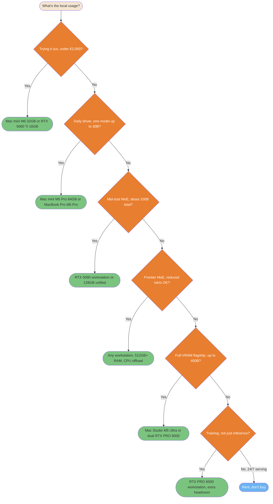
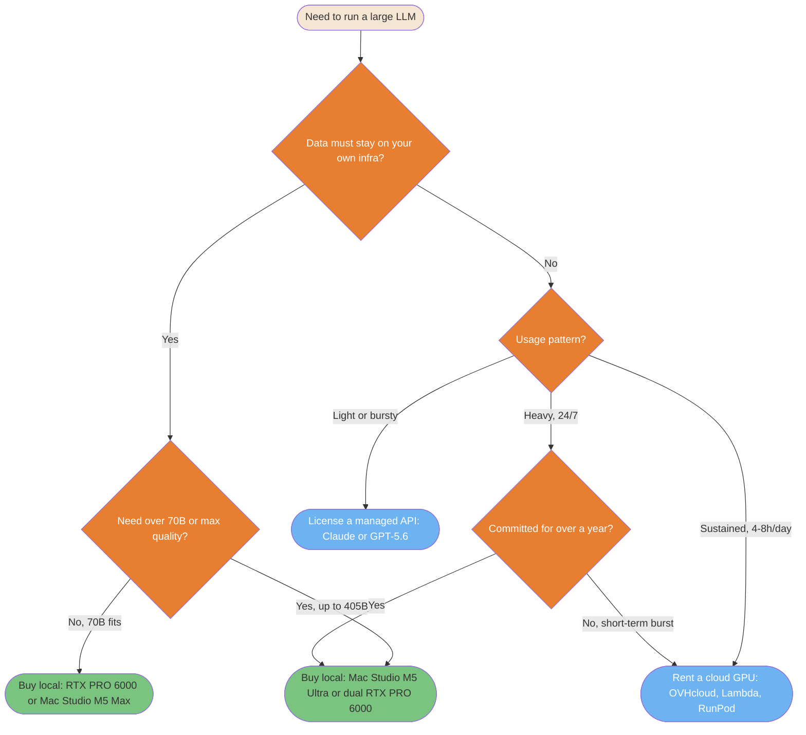

# Local vs Cloud: LLM Hardware and Inference Economics

> **Reading time**: ≈35 minutes
>
> **Purpose**: Answer one question with numbers instead of vibes: for running a large open-weight model (70B to 400B+ parameters), when does a local hardware purchase beat renting a cloud GPU or paying per token, and what actually fits on what machine.

---

## Table of Contents

- [Data Snapshot Date](#data-snapshot-date)
- [Sizing Local Hardware with llmfit](#sizing-local-hardware-with-llmfit)
- [Thirteen Comparable Hardware Configurations](#thirteen-comparable-hardware-configurations)
- [What Actually Fits: Named Models](#what-actually-fits-named-models)
- [Which Local Machine for Which Usage](#which-local-machine-for-which-usage)
- [Cloud GPU Rental Pricing](#cloud-gpu-rental-pricing)
- [One-Year Cost Projections](#one-year-cost-projections)
- [Power Consumption: Watts, Watt-Hours, Joules per Token](#power-consumption-watts-watt-hours-joules-per-token)
- [Energy Efficiency by Model Architecture](#energy-efficiency-by-model-architecture)
- [Cloud API Throughput: Claude vs GPT-5.6](#cloud-api-throughput-claude-vs-gpt-56)
- [Why Cloud and Local Tokens/Sec Are Not Comparable](#why-cloud-and-local-tokenssec-are-not-comparable)
- [Decision Diagram](#decision-diagram)
- [Decision Framework](#decision-framework)
- [Switching Providers at the CLI Level](#switching-providers-at-the-cli-level)

---

## Data Snapshot Date

Every price, spec, and throughput number on this page is a snapshot from **August 2026**. GPU prices move by double digits in weeks, cloud providers reprice without notice, and model families get replaced. Treat the tables as a method to reproduce, not a permanent price list. The queries and CLI commands used to produce this page are included so you can rerun them.

For a live view instead of this fixed snapshot, two trackers update continuously rather than on a fixed schedule: [llm-stats.com](https://llm-stats.com/llm-updates) (benchmark scores, arena votes, and API pricing pulled directly from providers) and [benchlm.ai](https://benchlm.ai/) (401+ models across 46 leaderboard categories, including tokens/sec and time-to-first-token, explicitly excluding algorithmically-generated benchmark data). Neither replaces the hardware-fit math on this page, which still needs `llmfit` against your own target model.

---

## Sizing Local Hardware with llmfit

Before buying anything, check what a given memory budget can actually run. [`llmfit`](https://github.com/AlexsJones/llmfit) (MIT, `brew install llmfit`) detects your hardware and scores its model database for fit, speed, and quality.

```bash
llmfit system                                    # detect current hardware
llmfit --memory 96G --ram 128G fit --json         # simulate a different memory budget
llmfit --memory 96G --ram 128G info "meta-llama/Llama-3.3-70B-Instruct"
```

Two limits to know before trusting its output:

**`--memory` overrides GPU VRAM, `--ram` overrides system RAM. They are not interchangeable.** On a discrete Nvidia GPU, only VRAM holds model weights during normal inference; system RAM is not usable for that purpose except through CPU offload, which drops throughput below 5 tokens/sec. On Apple Silicon and AMD's Ryzen AI unified-memory chips, the two numbers should be set equal, because there is only one physical memory pool.

**The tool cannot switch inference backend.** It detects the backend of the machine it runs on (Metal, CUDA, ROCm) and keeps using that backend's speed model even when you override memory size to simulate different hardware. Run it on an Nvidia machine for Nvidia numbers, an Apple Silicon machine for Apple numbers. Simulating an RTX PRO 6000 from a MacBook gives you a correct memory-capacity answer (what fits) and a wrong throughput answer (tokens/sec), because the tool is still computing speed from the Mac's Metal roofline model, not from CUDA.

---

## Thirteen Comparable Hardware Configurations

Bare GPUs are not comparable to laptops or appliances. The table below only lists complete systems: CPU, memory, GPU, and storage together, sorted by increasing price. For workstation builds around a bare Nvidia GPU (no fixed CPU from the vendor), the CPU column shows one realistic example, not a spec. The first three rows are the entry tier a reader specifically asked for: machines with a GPU (dedicated or unified) capped around 16-32 GB, cheap enough to try local inference without committing to a €4,000+ build.


| # | Configuration | CPU | System memory | GPU | Storage | Price (Aug 2026) |
|---|---|---|---|---|---|---|
| 1 | Mac mini, Apple M6 | Apple M6, 12 cores (2 super + 4 performance + 6 efficiency) | 16-32 GB unified | Integrated GPU, 12 cores, 170 GB/s bandwidth | 256 GB-2 TB SSD | €1,049 (16 GB/256 GB base) / ≈€1,500 est. at 32 GB max (+$400 BTO) |
| 2 | Workstation, 1x RTX 5060 Ti 16 GB | *Example*: AMD Ryzen 5 7600, 6 cores | 32-64 GB DDR5 (host only) | RTX 5060 Ti, 4,608 CUDA cores, 16 GB GDDR7 dedicated, 448 GB/s | 1-2 TB NVMe | ≈€1,300-1,600 (GPU alone: $429 MSRP, ≈€590-730 street Aug 2026) |
| 3 | Mac mini, Apple M5 Pro | Apple M5 Pro, 15 or 18 cores | 24-64 GB unified | Integrated GPU, 16 or 20 cores, 307 GB/s bandwidth | 512 GB-8 TB SSD | €1,999 (24 GB/512 GB base) / ≈€3,000 est. at 64 GB max (+$1,000 BTO) |
| 4 | AMD Ryzen AI Halo | Ryzen AI Max+ 395, Zen 5, 16 cores/32 threads | 128 GB unified LPDDR5x | Radeon 8060S integrated, 40 CU RDNA 3.5, no dedicated VRAM | 2 TB SSD | ≈$3,999 (≈€3,700-4,000) |
| 5 | NVIDIA DGX Spark | Grace, 20 Arm cores (10x Cortex-X925 + 10x Cortex-A725) | 128 GB unified LPDDR5x | GB10 Blackwell, 6,144 CUDA cores (48 SM), no dedicated VRAM | 4 TB NVMe (included) | ≈$4,699 (≈€4,180-4,700) |
| 6 | MacBook Pro, Apple M5 Pro | Apple M5 Pro, 15 or 18 cores | 48 GB unified | Integrated GPU, 20 cores | 2 TB SSD | ≈€4,500-5,000 |
| 7 | Workstation, 1x RTX 5090 | *Example*: AMD Ryzen 9 9950X, 16 cores | 64-128 GB DDR5 (host only) | RTX 5090, 21,760 CUDA cores, 32 GB GDDR7 dedicated | 2-4 TB NVMe | ≈€5,000-6,000 |
| 8 | MacBook Pro, Apple M5 Max | Apple M5 Max, 18 cores | 128 GB unified | Integrated GPU, 40 cores | 2 TB SSD | ≈€5,500-6,500 |
| 9 | AMD Ryzen AI Max PRO 400 ("Gorgon Halo") | Ryzen AI Max+ PRO 495, Zen 5, 16 cores/32 threads, up to 5.2 GHz | 192 GB unified + 160 GB dedicated graphics memory | Radeon 8065S integrated, 40 CU RDNA 3.5 | 2-4 TB (estimated) | Unannounced, ≈€5,000-10,000 est. (Q3 2026 launch, no independent benchmark exists) |
| 10 | Workstation, dual RTX 5090 | *Example*: AMD Threadripper 7960X, 24 cores | 128-256 GB DDR5 (host only) | 2x RTX 5090, 43,520 CUDA cores combined, 64 GB GDDR7 combined, no NVLink | 4 TB NVMe | ≈€8,000-12,000 |
| 11 | Mac Studio, Apple M5 Ultra | Apple M5 Ultra, 36 cores | 256 GB unified | Integrated GPU, 80 cores | 4 TB SSD | ≈€12,000 |
| 12 | Workstation, RTX PRO 6000 Blackwell | *Example*: AMD Threadripper PRO 7975WX, 32 cores | 128-256 GB DDR5 ECC (host only) | RTX PRO 6000, 24,064 CUDA cores, 96 GB GDDR7 ECC dedicated | 4 TB NVMe | ≈€16,000-18,000 (the card alone is ≈€14,000) |
| 13 | Workstation, dual RTX PRO 6000 Blackwell | *Example*: AMD Threadripper PRO 7995WX, 96 cores | 256 GB+ DDR5 ECC (host only) | 2x RTX PRO 6000, 48,128 CUDA cores combined, 192 GB GDDR7 combined, no NVLink | 4-8 TB NVMe | ≈€30,000-32,000+ |

Sources: Nvidia RTX 5090 and RTX PRO 6000 Blackwell core counts and VRAM confirmed via [Central Computer](https://www.centralcomputer.com/pny-nvidia-rtx-pro-6000-graphics-card-96gb-gddr6-24-064-cuda-cores-pci-express-5-0-x16-600w-vcnrtxpro6000b-pb.html) and [Schneider Digital](https://shop.schneider-digital.com/en/graphics-cards/nvidia/rtx-pro-blackwell-series/nvidia-rtx-pro-6000-blackwell-workstation-edition-96gb-pcie-5.0-x16) (card price ≈€14,000). RTX 5060 Ti 16 GB specs and MSRP from [VideoCardz](https://videocardz.com/newz/nvidia-announces-geforce-rtx-5060-ti-at-429-16gb-and-379-8gb-299-rtx-5060-launches-next-month), street price range from [BestValueGPU's August 2026 tracker](https://bestvaluegpu.com/history/new-and-used-rtx-5060-ti-16gb-price-history-and-specs/). GB10 specs from [Arm Learning Paths](https://learn.arm.com/learning-paths/laptops-and-desktops/dgx_spark_llamacpp/1_gb10_introduction/) and [NVIDIA DGX Spark](https://www.nvidia.com/en-us/products/workstations/dgx-spark/). Radeon 8060S CU count from [TechPowerUp](https://www.techpowerup.com/342635/amd-readies-ryzen-ai-max-388-8c-16t-and-full-40-cu-radeon-8060s-gpu). Apple M5 Pro/Max chip specs (core counts, memory bandwidth, confirmed 24/48/64 GB tiers) from [Apple's own tech specs page](https://support.apple.com/en-mide/126318). Apple has not published M5 Ultra specs; the 256 GB / 36-core / 80-core figures come from pre-launch reporting, not an Apple source. Mac mini M6 and M5 Pro were announced August 25, 2026 (shipping September 22, 2026): chip specs and memory tiers from [9to5Mac's launch coverage](https://9to5mac.com/2026/08/25/apple-announces-new-mac-mini-heres-everything-new/), French base pricing from [MacGeneration](https://www.macg.co/mac/2026/08/de-700-eu-1-050-eu-en-moins-de-deux-ans-le-tarif-du-mac-mini-nen-finit-plus-de-bouger-310595), USD BTO memory upgrade pricing (the basis for the EUR "est." figures above, since Apple's French config-by-config EUR pricing wasn't independently reachable) from [Daring Fireball's configuration breakdown](https://daringfireball.net/2026/08/configurations_and_pricing_for_new_mac_minis_and_mac_studios).

---

## What Actually Fits: Named Models

Sorting `llmfit`'s database by raw parameter count surfaces obscure or roleplay-oriented fine-tunes that happen to fit in memory, not the flagship models most people actually want to run. Querying `llmfit info` against each lab's own official repo (not a third-party quant mirror) gives a cleaner starting point, but `llmfit`'s HuggingFace scrape has its own data-quality gaps (see the Kimi K3 row below, where it was off by roughly 2x). Every parameter count and MoE expert count in this table was cross-checked a second time against each lab's own model card, GitHub repo, or official announcement, not `llmfit` alone.

This table uses the current generation as of August 2026, not the mid-2024/2025 models (Llama 3.x, Qwen2.5, Mixtral, original DeepSeek-V3) that dated an earlier version of this page.

| Hardware memory budget | Model that fits | Architecture | Full weight VRAM required |
|---|---|---|---|
| 16 GB VRAM (RTX 5060 Ti) or 16-32 GB unified (Mac mini M6) | **`openai/gpt-oss-20b`** (Aug 2025, Apache 2.0) fits with headroom; `Qwen/Qwen3.8-27B` only reaches this tier at a heavier quant (Q3_K_M), marginal at 99% memory utilization | MoE, 21B total, 3.6B active (4/32 experts) | 11.0 GB for gpt-oss-20b, 15.84 GB for Qwen3.8-27B at Q3_K_M |
| 32 GB VRAM (1x RTX 5090) | **`Qwen/Qwen3.8-27B`** (Aug 2026, Apache 2.0) | Dense, ≈27B | 14.2 GB, large headroom |
| 48 GB unified (MacBook Pro M5 Pro) | Qwen3.8-27B fits easily; **`meta-llama/Llama-4-Scout-17B-16E`** (109B total, MoE) does not quite fit | MoE, 17B active / 16 experts | 55.6 GB required, exceeds 48 GB |
| 64 GB VRAM (dual RTX 5090) | **`meta-llama/Llama-4-Scout-17B-16E`** | MoE, 109B total, 17B active | 55.6 GB, comfortable |
| 96-128 GB (RTX PRO 6000, Mac Studio M5 Max, DGX Spark, Ryzen AI Halo) | Llama-4-Scout fits with large headroom; no confirmed current-generation flagship lands specifically between 56 GB and 200 GB as of this snapshot | | |
| 192-256 GB (dual RTX PRO 6000, Mac Studio M5 Ultra) | **`deepseek-ai/DeepSeek-V4-Flash-0731`** (MIT, GA release July 30-31, 2026) fits with comfortable headroom on both configs; `meta-llama/Llama-4-Maverick-17B-128E` (≈400B total, MoE, community license) also fits but far more tightly | MoE, 304B total / 13B active per NVIDIA's official Build model card; the earlier preview build was 284B total at the same 13B active, and neither DeepSeek nor NVIDIA states why the GA release's total grew | No official VRAM figure exists. Third-party quantized estimates for the GA release cluster 100-170 GB (Unsloth: ≈103 GB at 3-bit, ≈162 GB at "lossless" 8-bit; Spheron: ≈166 GB at INT4; `llmfit`: 155.8 GB), all comfortable on the 192 GB and 256 GB configs. Llama-4-Maverick-17B-128E needs 205.7 GB, fits 256 GB, marginal on 192 GB |
| Any config on this page | **`zai-org/GLM-5.2`** (≈753B total, MoE, MIT). `GLM-5.3` (Aug 17, 2026) is the same base model with a post-training coding upgrade; weights ship staged, roughly two weeks after announcement | MoE, ≈40B active / 256 experts | 385.9 GB, exceeds everything here |
| Any config on this page | **`deepseek-ai/DeepSeek-V4-Pro-0813`** (1.6T total, MoE, MIT, GA Aug 13, 2026) | MoE, **49B active** (officially confirmed) | 845.4 GB, does not fit |
| Any config on this page | **`Qwen/Qwen3.8-2.4T-A95B`** (2.4T total, MoE, open-weight base of the hosted Qwen3.8-Max) | MoE, ≈95B active / 512 experts | 1,253 GB, does not fit |
| Any config on this page | **`MoonshotAI/Kimi-K3`** (**2.8T total**, confirmed via Moonshot's own GitHub repo, Aug 2026) | MoE, 16 of 896 experts active (≈50B active, calculated) | ≈1,430 GB estimated (extrapolated from DeepSeek-V4-Pro's VRAM-per-parameter ratio; `llmfit`'s own entry for this repo reports an incorrect 5,527B total and was not used) |

Sources for the officially-confirmed figures: [gpt-oss-20b model card](https://huggingface.co/openai/gpt-oss-20b), [Qwen3.8-27B](https://huggingface.co/Qwen/Qwen3.8-27B), [Qwen3.8-2.4T-A95B](https://huggingface.co/Qwen/Qwen3.8-2.4T-A95B), [Llama 4 announcement](https://ai.meta.com/blog/llama-4-multimodal-intelligence/), [Llama-4-Scout model card](https://huggingface.co/meta-llama/Llama-4-Scout-17B-16E), [DeepSeek-V4-Flash-0731 model card](https://huggingface.co/deepseek-ai/DeepSeek-V4-Flash-0731) and [NVIDIA's Build model card](https://build.nvidia.com/deepseek-ai/deepseek-v4-flash-0731/modelcard) for the 304B/13B figures (third-party VRAM estimates from [Unsloth's deployment guide](https://unsloth.ai/docs/models/deepseek-v4) and [Spheron's GPU recommender](https://www.spheron.network/tools/gpu-recommender/deepseek-ai/DeepSeek-V4-Flash-0731/)), [DeepSeek-V4-Pro model card](https://huggingface.co/deepseek-ai/DeepSeek-V4-Pro), [GLM-5.2 announcement](https://datanorth.ai/news/zhipu-ai-releases-glm-5-2), [Kimi K3 GitHub repo](https://github.com/MoonshotAI/Kimi-K3).

**The full-weight column above assumes every expert must be resident in VRAM. That's the requirement for `llmfit`'s "GPU" run mode, not a law of physics.** `llmfit` reports both a "full model" VRAM figure and a much smaller "active" figure (for example DeepSeek-V4-Pro-0813 shows 845.4 GB full versus 63.6 GB active). The active figure describes the compute cost of a single forward pass; the full-weight figure is what a naive all-in-VRAM deployment needs. A real shortcut does exist, but it moves the constraint rather than removing it: the full expert set must stay resident somewhere fast (system RAM, not VRAM), and only the handful of experts routing picks for the current token get streamed to the GPU or computed on CPU.

Two real projects implement exactly this. `llama.cpp`'s `--n-cpu-moe`/`--cpu-moe` flags keep MoE expert tensors in CPU RAM while streaming the active ones to GPU over PCIe per token, confirmed via the project's own GitHub docs and issue discussions. [FreeToken](https://github.com/FlashML-org/FreeToken) (Apache 2.0, [arXiv paper](https://arxiv.org/abs/2608.16157), authors including Song Han and Ion Stoica) goes further with a bandwidth-adaptive `hybrid` mode: it profiles a machine's PCIe-vs-host bandwidth ratio (`ft bench bw`) and splits expert cache misses between "fetch over PCIe" and "compute in place on CPU," with an LRU cache of experts on GPU reusing whichever ones were active on the previous token. FreeToken's own README claims 3-4x faster decode and 6-30x faster prefill than Ollama on MoE models; that figure comes from the paper's authors, not an independent benchmark. FreeToken officially supports DeepSeek-V4-Flash, GLM-5.2, GLM-4.7, Qwen3.6/3.5 MoE, and gpt-oss, among others, and its `ft launch claude` command wires a locally-served model directly into Claude Code via FreeToken's Anthropic-compatible API. Community-reported (not independently verified) throughput numbers relayed on Slack: an 8 GB laptop GPU with 64 GB RAM running a 35B MoE model at 39.3 tokens/sec, an RTX 5090 with 192 GB RAM running DeepSeek-V4-Flash (284B) at 22 tokens/sec, and a 96 GB workstation GPU with 512 GB RAM running GLM-5.2 (753B) at 14.9 tokens/sec.

Practically, this means the "does not fit" verdicts for GLM-5.2 and DeepSeek-V4-Pro in the table above are true only for naive full-VRAM loading. With enough system RAM (512 GB-class, not the 96-256 GB VRAM figures this page uses elsewhere) and a CPU-offload-capable engine, both become usable at real, if reduced, throughput on hardware already covered in this page's thirteen configurations.

The frontier gap still widened rather than narrowed since the previous generation covered here: DeepSeek-V3 needed 350.6 GB at 4-bit, its August 2026 successor DeepSeek-V4-Pro needs 845.4 GB in full-VRAM terms, and neither Qwen's 2.4T-parameter MoE nor Moonshot's 2.8T-parameter Kimi-K3 fit on anything in this hardware lineup even with CPU offload, including the €30,000+ dual RTX PRO 6000 workstation. Reaching that class of model at usable speed requires either quantization aggressive enough that `llmfit` no longer rates it usable, or a budget and interconnect (NVLink-class, not the PCIe-only multi-GPU builds on this page) well past this page's scope.

---

## Which Local Machine for Which Usage

The two tables above answer "what fits where." This section answers a different, more common question: given what you actually want to do, which of the thirteen configurations is the right one to buy. Same underlying data, organized by use case instead of by price.


| Usage | Recommended configuration(s) | Model class this targets | Why |
|---|---|---|---|
| Trying local inference cheaply, side project, budget under €2,000 | Mac mini M6 (32 GB) or RTX 5060 Ti 16 GB workstation | `gpt-oss-20b`, `Qwen3.8-27B` at a heavier quant | Cheapest entry point that runs a real current-generation model, not a toy fine-tune |
| Daily coding assistant, one model up to ≈30B, real context window | Mac mini M5 Pro (64 GB) or MacBook Pro M5 Pro (48 GB) | `Qwen3.8-27B` comfortable; `Llama-4-Scout` too tight | 48-64 GB gives one model room plus enough context to be useful, not just a benchmark pass |
| Mid-size MoE (≈100B total, ≈17B active) at good throughput | RTX 5090 workstation (32-64 GB VRAM) or a 128 GB unified config (DGX Spark, Ryzen AI Halo, MacBook Pro M5 Max) | `Llama-4-Scout-17B-16E` | 55.6 GB full-weight fits comfortably above 64 GB with headroom |
| Frontier MoE (GLM-5.2, DeepSeek-V4-Pro), reduced but usable throughput accepted | Any workstation on this page with 512 GB+ system RAM added, running `llama.cpp --n-cpu-moe` or [FreeToken](https://github.com/FlashML-org/FreeToken) | `GLM-5.2`, `DeepSeek-V4-Pro-0813` | Full expert set stays resident in system RAM; only the per-token active experts stream to GPU, so VRAM stops being the hard limit |
| Largest model this page supports at full-VRAM residency, no offload tricks | Mac Studio M5 Ultra (256 GB) or dual RTX PRO 6000 Blackwell (192 GB combined) | `DeepSeek-V4-Flash-0731` (fits both with headroom); `Llama-4-Maverick-17B-128E` also fits but only comfortably on the 256 GB config | ≈100-170 GB (third-party quantized estimates, no official figure) for DeepSeek-V4-Flash-0731, comfortable on both; 205.7 GB for Llama-4-Maverick, marginal on 192 GB |
| Local fine-tuning or training, not inference-only | RTX PRO 6000 Blackwell workstation (single or dual) | Depends on target model | Training needs VRAM headroom beyond weight residency for optimizer states and gradients, a cost this page's inference-only figures don't model |
| Sustained heavy or 24/7 production serving | Don't buy: rent | Any | See [Cloud GPU Rental Pricing](#cloud-gpu-rental-pricing) and [One-Year Cost Projections](#one-year-cost-projections) below; buying only wins past roughly a year of continuous use, per that section's own numbers |



<details>
<summary>ASCII version</summary>

```
What's the local usage?
└─ Trying it out, under €2,000?
   ├─ Yes → Mac mini M6 32GB or RTX 5060 Ti 16GB
   └─ No  → Daily driver, one model up to 30B?
            ├─ Yes → Mac mini M5 Pro 64GB or MacBook Pro M5 Pro
            └─ No  → Mid-size MoE, about 100B total?
                     ├─ Yes → RTX 5090 workstation or 128GB unified
                     └─ No  → Frontier MoE, reduced tok/s OK?
                              ├─ Yes → Any workstation, 512GB+ RAM, CPU offload
                              └─ No  → Full-VRAM flagship, up to 400B?
                                       ├─ Yes → Mac Studio M5 Ultra or dual RTX PRO 6000
                                       └─ No  → Training, not just inference?
                                                ├─ Yes             → RTX PRO 6000 workstation, extra VRAM headroom
                                                └─ No, 24/7 serving → Rent, don't buy
```

</details>

---

## Cloud GPU Rental Pricing

Hourly, on-demand, per GPU. USD figures kept as published; EUR given only where the provider quotes EUR directly.

| Provider | GPU | Price/hour |
|---|---|---|
| OVHcloud | H100 80 GB | €2.80 ($2.99) |
| OVHcloud | A100 80 GB | $3.07 |
| OVHcloud | L40S 48 GB | $1.80 |
| RunPod (Secure Cloud) | L40S 48 GB | $0.99 |
| RunPod (Community Cloud) | L40S 48 GB | $0.79 |
| Lambda | H100 80 GB SXM | $3.99-4.29 depending on node size |
| Lambda | A6000 48 GB (RTX PRO 6000-class) | $1.09 |
| GMI Cloud | H100 80 GB | $2.00 |
| GMI Cloud | H200 | $2.60 |
| Hetzner (`GEX131`, dedicated bare-metal, not elastic hourly cloud) | RTX PRO 6000 Blackwell Max-Q 96 GB | €1.4247 (€889/month flat, excl. VAT) |
| Decentralized (Vast.ai-class marketplace) | H100 80 GB | $2.50-3.89 |
| AWS | H100 80 GB (no direct AWS tariff found; market range per [AltStreet](https://altstreet.investments/tools/gpu/gpu-price-comparison)) | $8.00-12.29, mid estimate $10 |
| AWS | H200, `p5en.48xlarge`, on-demand (8-GPU node, per GPU) | $7.91 |
| AWS | H200, `p5en.48xlarge`, spot (per GPU) | $3.37 |

AWS does not sell a single-GPU H200 instance: the smallest P5en node is already 8 GPUs at $63.30/hour total. For a "one GPU as a remote workstation" use case, OVHcloud, Lambda, GMI Cloud, or RunPod fit the shape of the need better than AWS. GMI Cloud in particular undercuts OVHcloud on H100 (\$2.00/h vs OVH's \$2.99/h). Hetzner's GEX131 is a dedicated server, not a per-second elastic cloud instance: it bills a flat monthly rate regardless of how many hours you actually use that month, which is why it doesn't appear in the hourly-prorated table below. Sources: [OVHcloud price list](https://us.ovhcloud.com/public-cloud/prices/), [Cloud Mercato H100-380](https://pcr.cloud-mercato.com/providers/ovh/flavors/H100-380), [Lambda pricing](https://lambda.ai/pricing), [RunPod L40S](https://www.runpod.io/gpu-models/l40s), [Vantage EC2 P5en](https://instances.vantage.sh/aws/ec2/p5en.48xlarge), [GMI Cloud pricing](https://www.gmicloud.ai/en/pricing), [Hetzner GEX131 press release](https://www.hetzner.com/pressroom/new-gex131/).

---

## One-Year Cost Projections

`annual cost = price/hour × hours/day × 365`. Three usage patterns, same GPU class (H100/H200), across providers.

| Provider / GPU | 4h/day | 8h/day | 24/7 |
|---|---|---|---|
| OVH H100 80 GB | ≈€4,088 | ≈€8,176 | ≈€24,528 |
| GMI Cloud H100 80 GB | ≈$2,920 (≈€2,716) | ≈$5,840 (≈€5,431) | ≈$17,520 (≈€16,294) |
| GMI Cloud H200 | ≈$3,796 (≈€3,530) | ≈$7,592 (≈€7,061) | ≈$22,776 (≈€21,182) |
| Decentralized H100 (≈$3/h) | ≈$4,380 | ≈$8,760 | ≈$26,280 |
| Lambda H100 80 GB | ≈$6,263 (≈€5,825) | ≈$12,527 (≈€11,650) | ≈$37,580 (≈€34,955) |
| AWS H200 spot | ≈$4,925 (≈€4,580) | ≈$9,850 (≈€9,161) | ≈$29,547 (≈€27,479) |
| AWS H200 on-demand | ≈$11,552 (≈€10,743) | ≈$23,104 (≈€21,487) | ≈$69,309 (≈€64,457) |
| AWS H100 (≈$10/h estimate) | ≈$14,600 (≈€13,578) | ≈$29,200 (≈€27,156) | ≈$87,600 (≈€81,468) |

Hetzner's GEX131 (RTX PRO 6000 Blackwell 96 GB) doesn't fit this hourly-prorated format since it bills a flat €889/month regardless of hours used, but at 12 months of straight rental (€10,668/year) it is worth comparing directly against buying: see below.

Cross-referenced against the hardware table above:

**At light usage (4h/day), OVH's rental cost for one year (≈€4,088) roughly equals the purchase price of the cheapest machines on this page** (Ryzen AI Halo, DGX Spark, ≈€3,700-4,700). Buying wins from year two onward at this usage level, on the cheapest provider.

**Renting the exact RTX PRO 6000 tier beats buying it, even at full-time usage for a year.** A full year of Hetzner's GEX131 (€10,668) is cheaper than the ≈€14,000 the same RTX PRO 6000 Blackwell card costs to buy outright, before even adding a host system. This overturns the general "buy wins at 24/7" pattern for this specific GPU tier: Hetzner's bare-metal dedicated-server pricing (no hypervisor overhead, no cloud margin stack) undercuts every hourly cloud provider on this page for that card by a wide margin, and undercuts the purchase price too. If your workload fits a single RTX PRO 6000's 96 GB, renting one from Hetzner is the better default over buying, unless you specifically need the hardware for more than roughly 16 months or have a data-sovereignty requirement that rules out a rented dedicated server.


**GMI Cloud is the cheapest elastic (per-second, not dedicated) H100/H200 option found on this page, undercutting even OVHcloud.** At 24/7, GMI's H100 (≈€16,294/year) costs less than OVH's H100 (≈€24,528/year) for the identical GPU class, and its H200 (≈€21,182/year) still comes in under OVH's H100.

**AWS is not economically viable for this use case at any usage level.** Even at 4h/day, AWS H100 (≈€13,578/year) costs nearly as much as an entire RTX PRO 6000 workstation bought once. At 24/7, AWS H100 (≈€81,468/year) funds close to three dual-RTX-PRO-6000 workstations (≈€30,000 each) in a single year of rental.

---

## Power Consumption: Watts, Watt-Hours, Joules per Token

A reader asked directly: where are the watts-per-token or watts-per-hour figures for the hardware and services above? The honest answer is that almost nobody publishes them. Checked directly: none of OVHcloud, AWS, Lambda, GMI Cloud, or Hetzner exposes watts-per-token, kWh-per-1000-tokens, or any per-request energy figure for their GPU instances. Neither Anthropic nor OpenAI discloses energy-per-token or energy-per-query for Claude Opus 5, Sonnet 5, or GPT-5.6 Sol/Terra/Luna. This is an industry-wide gap, not a gap specific to this page, and the table below separates what is actually published (official TDP specs, or independently measured system power) from the handful of places real per-token energy numbers exist at all.

**Official TDP and board power specs** (the ceiling the cooling and power delivery are designed for, not what a workload actually draws):

| Hardware | Power spec | Source |
|---|---|---|
| RTX 5090 | 575 W TDP, 950 W recommended PSU | [TechPowerUp](https://www.techpowerup.com/gpu-specs/geforce-rtx-5090.c4216) |
| RTX PRO 6000 Blackwell Server Edition | 400-600 W | [NVIDIA](https://www.nvidia.com/en-us/data-center/rtx-pro-6000-blackwell-server-edition/) |
| RTX PRO 6000 Blackwell Workstation Edition | 600 W | [NVIDIA](https://www.nvidia.com/en-us/products/workstations/professional-desktop-gpus/rtx-pro-6000-family/) |
| RTX PRO 6000 Blackwell Max-Q | 300 W | [NVIDIA](https://www.nvidia.com/en-us/products/workstations/professional-desktop-gpus/rtx-pro-6000-family/) |
| AMD Ryzen AI Max+ 395 (Ryzen AI Halo SoC) | 55 W nominal, 45-120 W configurable | [TechPowerUp](https://www.techpowerup.com/cpu-specs/ryzen-ai-max-395.c3994) |
| MacBook Pro 14" M5 Pro/M5 Max | 96 W USB-C adapter, 72.4 Wh battery | [Apple tech specs](https://support.apple.com/en-mide/126318) |
| NVIDIA DGX Spark | 240 W USB-PD adapter (ceiling only) | [NVIDIA](https://www.nvidia.com/en-us/products/workstations/dgx-spark/) |

**Independently measured system power** (from-the-wall measurements, not vendor marketing):

| Hardware | Measured power | Notes |
|---|---|---|
| Mac Studio, M3 Ultra (32-core CPU, 80-core GPU, 512 GB, 16 TB SSD) | 9 W idle, 270 W max | [Apple's own support document](https://support.apple.com/en-us/102027), wall-measured |
| Mac Studio, M1 Ultra (20-core CPU, 48-core GPU, 64 GB, 1 TB SSD) | 13 W idle, 215 W max | Same Apple document, for scale across generations |
| NVIDIA DGX Spark | 40-45 W idle, **60-90 W during typical LLM inference**, under 200 W under combined CPU+GPU stress | [ServeTheHome review](https://www.servethehome.com/nvidia-dgx-spark-review-the-gb10-machine-is-so-freaking-cool/4/), the only independently measured LLM-specific figure on this page |

No independently measured, LLM-specific power figure exists in the sources checked for the RTX 5090, the RTX PRO 6000 Blackwell family, or the Ryzen AI Halo platform. Anyone quoting a watts-per-token number for those specific GPUs today is extrapolating from the TDP, not reporting a measurement, and this page won't manufacture a fake-precise number to fill that gap.

**The one directly measured joules-per-token figure found**, from [ML.Energy's longitudinal analysis](https://ml.energy/blog/measurement/energy/llm-inference-energy-a-longitudinal-analysis/): Llama 3.1 8B on H100, batch size 64, dropped from 0.20 J/token (v2.0, September 2024) to 0.12 J/token (v3.0, December 2025), a 41% reduction from software and kernel improvements alone, same hardware. The 70B and 405B Llama 3.1 models showed comparable reductions (up to 15% and 39% respectively) between the same two software generations, though ML.Energy's public writeup doesn't give the absolute J/token value for those larger sizes. The practical lesson: for a fixed GPU, the inference stack can change energy per token by up to 2x on its own, which matters more than comparing TDP numbers across GPU generations.

**[Neuralwatt](https://portal.neuralwatt.com/pricing)** is the one inference provider found that publishes a real per-request energy figure in watt-hours, for GLM-5.2 variants, alongside its per-token pricing. The exact number moves: a check during this page's research showed ≈1.96 Wh for the standard variant and ≈1.17 Wh for the "fast" variant, while an earlier automated search the same day returned ≈2.29 Wh and ≈1.73 Wh for the same two variants. Neuralwatt runs a live energy-pricing page, so treat the exact figure as a snapshot that moves, not a fixed constant, and convert to joules per token only if you know the actual token count of your own requests (Wh × 3600 ÷ tokens).

**To measure your own hardware rather than guess**, [TokenPowerBench](https://github.com/chenxuniu/TokenPowerBench) (open source, MIT-style benchmarking tool, [arXiv paper](https://arxiv.org/html/2512.03024v1)) instruments GPU and system power through software telemetry and computes phase-aware joules-per-token, joules-per-response, and energy-delay-product metrics, without needing external metering hardware. The formula underlying every number on this page is simple: energy per token (joules) equals system power (watts) divided by throughput (tokens per second). Anyone can compute this for their own setup with a wall meter or `nvidia-smi`/`powermetrics` and a stopwatch; nobody should trust a watts-per-token number, including any that later gets added to this page, without knowing whether it came from a spec sheet, a wall measurement, or a guess.

---

## Energy Efficiency by Model Architecture

The hardware section above answers "how many watts does the GPU draw." A separate question is "does the model itself matter": does a Mixture-of-Experts architecture, a smaller active-parameter count, or a lower-precision format actually cut energy per token, and do any of the labs behind the models named on this page say so. Checked directly against each model's own official card or repo, plus the two research benchmarks that measure this independently (ML.Energy, EnergyLLM-Bench).

**Meta is the only lab on this page that discloses training energy and carbon figures at all.** The [official Llama 4 model card](https://github.com/meta-llama/llama-models/blob/main/models/llama4/MODEL_CARD.md) reports, per model: Llama 4 Scout used 5.0 million H100 GPU-hours at 700 W per GPU, for 1,354 tons of location-based CO2eq (0 tons market-based, meaning Meta's own electricity purchases were matched to clean sources); Llama 4 Maverick used 2.38 million GPU-hours for 645 tons location-based CO2eq. These are training figures, not inference measurements. Checked directly and confirmed absent for every other model on this page: Qwen3.8-27B, Qwen3.8-2.4T-A95B, GLM-5.2, Kimi K3, and DeepSeek-V4-Pro's own model cards give architecture, precision, and (for DeepSeek) relative efficiency claims, but no absolute joules, GPU-hours, kWh, or CO2 figure. Neither Anthropic nor OpenAI publishes anything comparable for Claude Opus 5/Sonnet 5 or GPT-5.6 Sol/Terra/Luna. One third-party site, [Know Your Compute](https://www.knowyourcompute.com/models/llama-4-maverick/), estimates ≈0.60 Wh per query for Llama 4 Scout and ≈1.8 Wh for Maverick, but states explicitly that these are derived from hardware specs and API benchmarks, not Meta data, and should be read as an estimate, not a disclosure.

**MoE's active-parameter ratio reduces arithmetic per token, but it does not reliably predict measured energy, and one real benchmark shows it can go the wrong way.** DeepSeek's own model card states that DeepSeek-V4-Pro (1.6T total, 49B active) needs only 27% of the single-token inference FLOPs and 10% of the KV cache of its predecessor DeepSeek-V3.2 at a 1-million-token context, an architectural claim against DeepSeek's own prior model, not a dense-model comparison and not a joules figure. The [ML.Energy v3.0 leaderboard](https://ml.energy/blog/measurement/energy/diagnosing-inference-energy-consumption-with-the-mlenergy-leaderboard-v30/) (46 models, 7 tasks, H100 and B200 GPUs) gives the closest real cross-model measurement: Qwen 3 30B-A3B (MoE) uses 3.56x less energy per token than dense Qwen 3 32B on the same hardware, but Qwen 3 235B-A22B, despite activating a similar 22B parameters per token, consumes *more* energy than the dense 32B model, because its 235B total parameters require more GPUs to hold in memory, and that hardware footprint outweighs the compute saved by sparsity. Total parameter count still matters, not just active count. A second data point makes the same point more starkly: [EnergyLLM-Bench](https://openreview.net/pdf/03dfc5242cdec04c87b1c5d436fb275adfeafba9.pdf) measured Mixtral-8x7B (MoE, 2 of 8 experts active) at 271.44 J/token, versus 4.59 J/token for dense Mistral-7B and 0.80 J/token for GPT-2, an outcome driven by implementation and hardware configuration rather than a controlled, capability-matched comparison, but a clear demonstration that "fewer active parameters" is not a guarantee of lower measured energy.

**Quantization's energy benefit is real but batch-size-dependent, not a fixed percentage.** A benchmark of Llama 3 405B reported approximately 30% lower energy per token switching FP16 to FP8 under a heavy batched workload (45 kJ to 32 kJ for the same batch). But ML.Energy's controlled FP8-vs-BF16 comparison for Qwen 3 235B-A22B on H100 found the opposite at small batch sizes: at batch 8-16, FP8 used up to 56% *more* energy than BF16 (FP8 won 0 of 7 comparisons), because conversion and quantization overhead outweighs the format's throughput advantage until the workload is large enough to saturate the tensor cores. At batch 65-256, FP8 won 11 of 12 comparisons with a median 11% energy reduction. A low-concurrency chatbot and a high-throughput batch job on the identical model and GPU can therefore see opposite results from the same precision switch. No same-hardware, same-model measurement isolating INT4 or AWQ's energy effect (as opposed to memory footprint) was found; a separate low-bit precision study reports normalized figures of approximately 0.55x for NVFP4 and 0.34x for NVINT4 relative to its own baseline, but ties the result to specific kernels and hardware rather than a model-independent constant.

**No trustworthy, capability-matched, same-hardware joules-per-token ranking exists across GLM-5.2, DeepSeek-V4-Pro, Qwen3.8, Kimi K3, and GPT-5.6 together.** ML.Energy is the closest thing to a cross-family benchmark on this page's model list, but its published v3.0 results don't cover all of them on identical hardware and software, and task shape swamps model choice on its own: the same leaderboard shows a problem-solving task averaging 6,988 output tokens and 4,625 J per response, versus a text-conversation task averaging 717 tokens and 184 J, a 25x difference driven entirely by output length, not model efficiency. Any energy comparison across models that doesn't fix hardware, precision, batch size, and task shape is not measuring the model.

---

## Cloud API Throughput: Claude vs GPT-5.6

OpenAI's GPT-5.6 family (launched July 9, 2026) ships in three durable capability tiers named after celestial bodies: **Sol** (flagship), **Terra** (balanced mid-tier), **Luna** (fast, cheap). All three are available in ChatGPT, Codex, and the API, and generally available on Amazon Bedrock. Anthropic's current lineup for comparison: **Claude Opus 5** (flagship) and **Claude Sonnet 5** (mid-tier), both defaults in Claude Code.

| Model | Typical throughput | Max-effort/benchmark throughput | Time to first token | Price ($/M tokens, in/out) |
|---|---|---|---|---|
| GPT-5.6 Sol | ≈70 tok/s (OpenRouter P50) | 74.3 tok/s (ArtificialAnalysis) | ≈138.6s in max reasoning mode | $5 / $30 |
| GPT-5.6 Terra | ≈58 tok/s (OpenRouter P50) | n/a | ≈2.48s | $2 / $12 (cut 20% from launch, effective July 30, 2026) |
| GPT-5.6 Luna | ≈112 tok/s (OpenRouter P50) | 140.7 tok/s (ArtificialAnalysis) | ≈150.7s in max reasoning mode | $0.20 / $1.20 (cut 80% from launch, effective July 30, 2026) |
| Claude Sonnet 5 | ≈75.9 tok/s (ArtificialAnalysis, max effort) | n/a | not published | $2 / $10 |
| Claude Opus 5 | **≈26 tok/s average** (LLM-Benchmarks production telemetry, min 5.3, max 60.9) | n/a | ≈2.87s | $5 / $25 (fast mode research preview: $10 / $50) |

Claude Opus 5's ≈26 tok/s average comes from production telemetry across real calls, not a single benchmark preset, a materially lower number than the ≈55-80 tok/s figures reported for Opus 5 under lighter-effort presets on other trackers. Anthropic optimizes Opus 5 for reasoning depth, not raw streaming speed.

On specialized hardware (Cerebras wafer-scale systems, not a standard cloud GPU), Sol reaches roughly **750 tok/s**, about 10x the typical cloud API rate. This confirms the throughput ceiling is set by deployment infrastructure and multi-tenant scheduling, not by the model's architecture alone.

Sources: [OpenRouter Sol](https://openrouter.ai/openai/gpt-5.6-sol), [OpenRouter Terra](https://openrouter.ai/openai/gpt-5.6-terra), [OpenRouter Luna](https://openrouter.ai/openai/gpt-5.6-luna), [ArtificialAnalysis Sol](https://artificialanalysis.ai/models/gpt-5-6-sol), [ArtificialAnalysis Luna](https://artificialanalysis.ai/models/gpt-5-6-luna), [ArtificialAnalysis Sonnet 5](https://artificialanalysis.ai/models/claude-sonnet-5), [LLM-Benchmarks Anthropic](https://llm-benchmarks.com/providers/anthropic), [OpenAI price-performance update](https://openai.com/index/advancing-the-price-performance-frontier-with-gpt-5-6/), [Cerebras](https://www.cerebras.ai/blog/getting-the-most-out-of-gpt-5-6-sol-terra-and-luna).

---

## Why Cloud and Local Tokens/Sec Are Not Comparable

Comparing a cloud API's tokens/sec to a local GPU's tokens/sec is comparing a car's speed on a congested highway to the same car's speed on an empty road. Three concrete mechanisms cause the gap:

**Cloud time-to-first-token often hides invisible reasoning.** Sol and Luna's 138-150 second TTFT figures under max-reasoning presets come from internal reasoning tokens that are computed and counted but never streamed to the client. A locally run quantized model has no such phase; TTFT drops to tens of milliseconds once weights are loaded.

**Cloud infrastructure optimizes aggregate throughput across every concurrent user, not your single request.** Dynamic batching, shared queues, and paid priority tiers (Opus 5's fast mode at 2x price is exactly this, sold openly) all trade individual latency for total system utilization. A local GPU serves only you; there is no queue.

**Cloud frontier models and local models are not the same size or precision.** Sol and Opus 5 run at full precision on hundreds of billions of parameters. A local deployment typically runs 4-8 bit quantized weights on 7-70B parameters. Illustrative local ranges from the same evidence base: a 7B model on an RTX-4090-class GPU reaches roughly 100-150 tok/s, a 13B model 50-100 tok/s, a 30B model 20-50 tok/s, a 70B model on a single GPU 10-30 tok/s. These numbers land in the same range as Terra and Luna's cloud figures by coincidence of scale, not because the comparison is meaningful.

One measured data point from this page's own research process: `llmfit system` on a real MacBook Pro M5 Max reported **171 GB/s measured RAM bandwidth**, well below the ≈460-614 GB/s Apple lists as the chip's theoretical peak. Real, measured, sustained bandwidth on your actual machine is the number that predicts your actual tokens/sec, not a spec sheet peak.

---

## Decision Diagram



<details>
<summary>ASCII version</summary>

```
Need to run a large LLM
└─ Data must stay on your own infra?
   ├─ Yes → Need over 70B or max quality?
   │        ├─ Yes, up to 405B → BUY: Mac Studio M5 Ultra or dual RTX PRO 6000
   │        └─ No, 70B fits    → BUY: RTX PRO 6000 or Mac Studio M5 Max
   └─ No  → Usage pattern?
            ├─ Light or bursty      → LICENSE: managed API (Claude or GPT-5.6)
            ├─ Sustained, 4-8h/day  → RENT: cloud GPU (OVHcloud, Lambda, RunPod)
            └─ Heavy, 24/7          → Committed for over a year?
                                       ├─ Yes            → BUY (see above)
                                       └─ No, short burst → RENT (see above)
```

</details>

## Decision Framework

**Light or bursty usage, no data sovereignty requirement**: use a managed API (Claude, GPT-5.6) or a specialized inference provider. No hardware to maintain, pay only for what you use.

**Sustained usage, 4-8 hours a day, open-weight models up to 70B**: rent a GPU. OVHcloud's H100 at ≈€4,000-8,000/year beats every local hardware option on this page at that usage level. Avoid AWS for this shape of workload; it is priced for enterprises with different constraints, not for a single sustained GPU.

**Heavy or 24/7 usage, sustained over more than a year**: buy, on elastic hourly clouds specifically. The break-even against elastic cloud rental (even the cheapest provider tested, GMI Cloud) lands inside twelve months once usage crosses roughly 12-16 hours/day. The one exception on this page: Hetzner's dedicated-server GEX131 (RTX PRO 6000 Blackwell 96 GB) rents for less per year (€10,668) than the card costs to buy outright (≈€14,000), so for that specific GPU tier, renting stays the better default even at full-time usage, unless data sovereignty or a horizon past ≈16 months tips it toward buying.

**Need genuinely huge models (up to ≈300-400B) locally**: the Mac Studio M5 Ultra 256 GB and the dual RTX PRO 6000 Blackwell workstation (192 GB combined) both host DeepSeek-V4-Flash-0731 (304B total, MIT) comfortably, at roughly 100-170 GB depending on quantization (no official figure, third-party estimates only). Llama 4 Maverick (401.6B total) also fits, but only on the 256 GB Mac Studio, and at the edge of its memory budget there. Anything past that (GLM-5.2, DeepSeek-V4-Pro, or the multi-trillion-parameter MoE releases) does not fit on anything covered here.

**Data never leaves the building is a hard requirement**: this eliminates managed APIs and cloud rental outright, regardless of the economics above. Buy local hardware sized with `llmfit` against your actual target model, not against a marketing spec sheet.

---

## Switching Providers at the CLI Level

Everything above is about which hardware or API to run inference on. A separate, complementary problem is how to point Claude Code itself at whichever backend you picked without rewriting configuration every time. [cc-copilot-bridge](https://ccbridge.bruniaux.com/) is a routing layer for the Claude Code CLI that toggles between three backends with a three-character command: `ccd` for Anthropic direct (pay-per-token), `ccc` for a GitHub Copilot subscription, and `cco` for fully offline local inference via Ollama. It doesn't change any of the hardware-fit or cost math on this page, it changes which backend Claude Code talks to once you've decided. Current release is v1.5.3, with a v2 in progress. Worth flagging: the Copilot route relies on a reverse-engineered API, which the project's own documentation notes may violate GitHub Copilot's Terms of Service.
