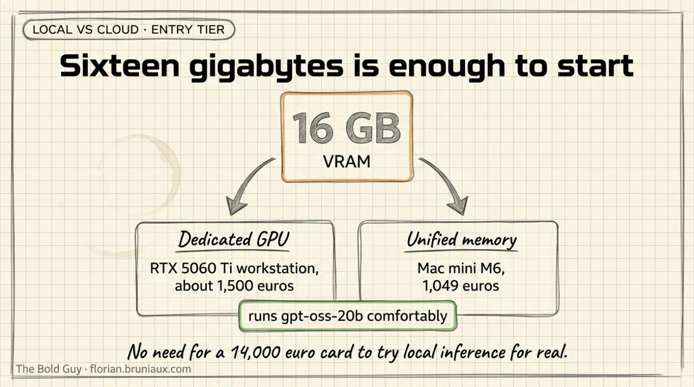
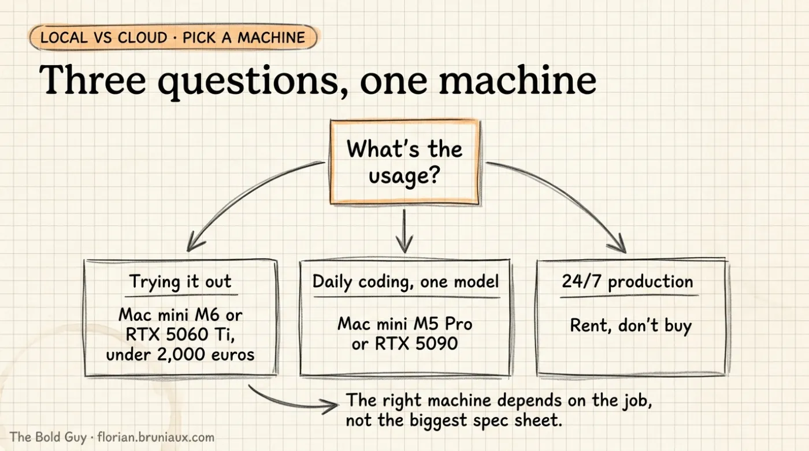
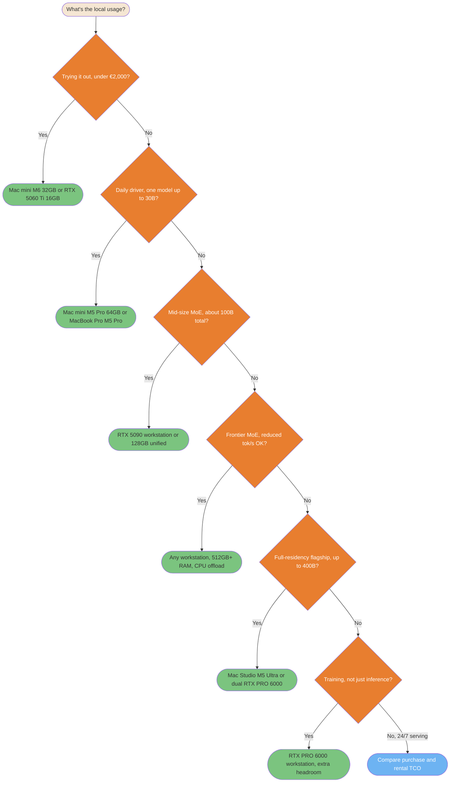
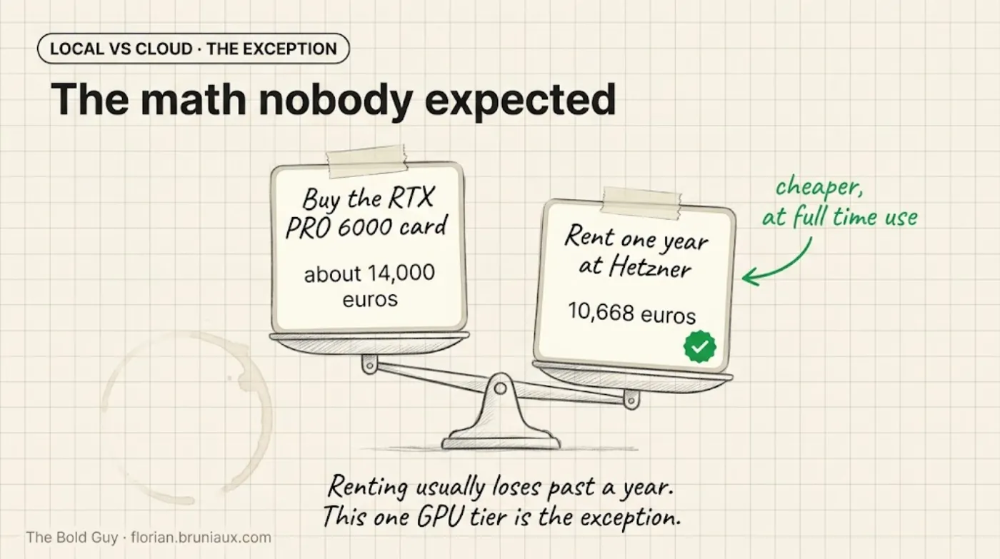
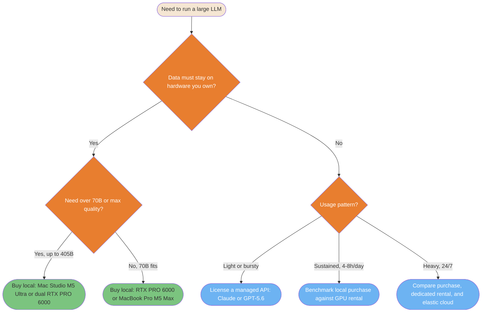
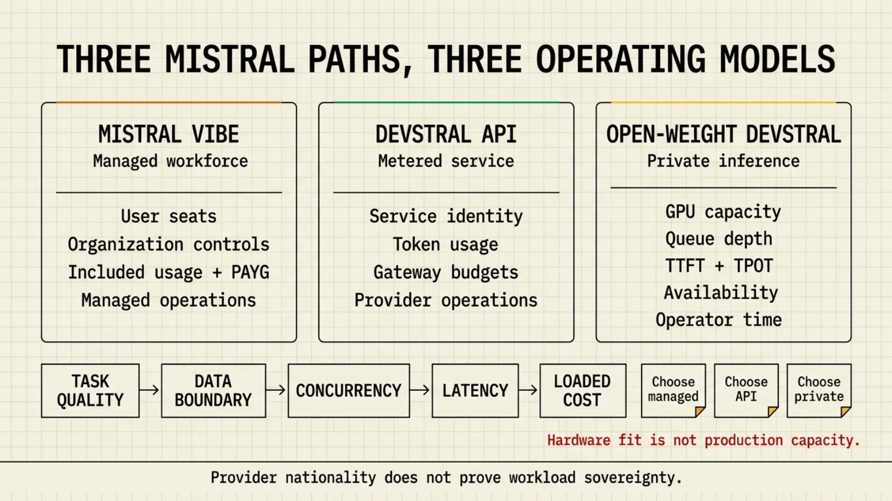

# Local vs Cloud: LLM Hardware and Inference Economics

> **Reading time**: ≈35 minutes
>
> **Purpose**: Answer one question with numbers instead of vibes: for running a large open-weight model (70B to 400B+ parameters), when does a local hardware purchase beat renting a cloud GPU or paying per token, and what actually fits on what machine.

---

## Table of Contents

- [Data Snapshot Date](#data-snapshot-date)
- [Sizing Local Hardware with llmfit](#sizing-local-hardware-with-llmfit)
- [Benchmark Protocol Before You Buy](#benchmark-protocol-before-you-buy)
- [Fourteen Comparable Hardware Configurations](#fourteen-comparable-hardware-configurations)
- [What Actually Fits: Named Models](#what-actually-fits-named-models)
- [Which Local Machine for Which Usage](#which-local-machine-for-which-usage)
- [Serving Engine Tuning: vLLM in Production](#serving-engine-tuning-vllm-in-production)
- [Coding Agent Setup: Apple Silicon with MLX](#coding-agent-setup-apple-silicon-with-mlx)
- [Cloud GPU Rental Pricing](#cloud-gpu-rental-pricing)
- [One-Year Cost Projections](#one-year-cost-projections)
- [Power Consumption: Watts, Watt-Hours, Joules per Token](#power-consumption-watts-watt-hours-joules-per-token)
- [Energy Efficiency by Model Architecture](#energy-efficiency-by-model-architecture)
- [Cloud API Throughput: Claude vs GPT-5.6](#cloud-api-throughput-claude-vs-gpt-56)
- [Why Cloud and Local Tokens/Sec Are Not Comparable](#why-cloud-and-local-tokenssec-are-not-comparable)
- [Decision Diagram](#decision-diagram)
- [Decision Framework](#decision-framework)
- [Sizing Self-Hosted Inference for a Team](#sizing-self-hosted-inference-for-a-team)
- [Switching Providers at the CLI Level](#switching-providers-at-the-cli-level)

---

## Data Snapshot Date

Every price, spec, and throughput number on this page is a snapshot from **August 2026**. GPU prices move by double digits in weeks, cloud providers reprice without notice, and model families get replaced. Treat the tables as a method to reproduce, not a permanent price list. The queries and CLI commands used to produce this page are included so you can rerun them.

For a live view instead of this fixed snapshot, two trackers update continuously rather than on a fixed schedule: [llm-stats.com](https://llm-stats.com/llm-updates) (benchmark scores, arena votes, and API pricing pulled directly from providers) and [benchlm.ai](https://benchlm.ai/) (401+ models across 46 leaderboard categories, including tokens/sec and time-to-first-token, explicitly excluding algorithmically-generated benchmark data). Neither replaces the hardware-fit math on this page, which still needs `llmfit` against your own target model.

---

## Sizing Local Hardware with llmfit

Before buying anything, check what a given memory budget can actually run. [`llmfit`](https://github.com/AlexsJones/llmfit) (MIT, `brew install llmfit`) detects your hardware and scores its model database for fit, speed, and quality.

```bash
llmfit system                                    # detect current hardware
llmfit --memory 96G --ram 128G fit --json         # simulate a different memory budget
llmfit --memory 96G --ram 128G info "meta-llama/Llama-3.3-70B-Instruct"
```

Two limits to know before trusting its output:

**`--memory` overrides GPU VRAM, `--ram` overrides system RAM. They are not interchangeable.** On a discrete Nvidia GPU, model weights normally reside in VRAM. CPU offload can keep part of the model or MoE experts in system RAM, but every transfer or CPU-computed expert adds a performance cost. The result depends on PCIe bandwidth, host-memory bandwidth, model architecture, and the offload strategy; there is no universal 5 tokens/sec ceiling. On Apple Silicon and AMD's Ryzen AI unified-memory chips, the two numbers should be set equal, because there is only one physical memory pool.

**The tool cannot switch inference backend.** It detects the backend of the machine it runs on (Metal, CUDA, ROCm) and keeps using that backend's speed model even when you override memory size to simulate different hardware. Run it on an Nvidia machine for Nvidia numbers, an Apple Silicon machine for Apple numbers. Simulating an RTX PRO 6000 from a MacBook gives you a correct memory-capacity answer (what fits) and a wrong throughput answer (tokens/sec), because the tool is still computing speed from the Mac's Metal roofline model, not from CUDA.

---

## Benchmark Protocol Before You Buy

A capacity check only answers whether the weights can be loaded. It does not show whether the model remains usable with a real prompt, several users, or the inference backend you plan to run. Test the exact model, quantization, context length, and concurrency target before comparing machines.

| Measurement | What it prevents |
|---|---|
| Weight residency plus runtime and KV-cache headroom | A model that loads successfully but runs out of memory on a long prompt |
| Prefill throughput and time to first token | Hiding slow prompt processing behind a fast decode number |
| Decode throughput | Treating input and generated-token rates as the same metric |
| Single-user and target-concurrency runs | Ignoring one KV cache per active sequence, batching, and queueing |
| Wall power during the same run | Converting a TDP ceiling into a fictional joules-per-token measurement |
| Purchase, electricity, maintenance, and measured utilization | Comparing a hardware purchase with an hourly rental price as if both had the same capacity and operations cost |

The talks indexed during this page's review show why each field matters. In a Devoxx experiment on a Ryzen AI Max+ 395 running a Q4 Qwen 122B model, the speakers separate prefill from decode, identify memory bandwidth as the decode bottleneck, and show that GPU offload trades capacity for transfer cost ([memory bandwidth at 21:58](https://youtube.com/watch?v=DXEsG3Vo6F4&t=1318s), [GPU offload at 28:46](https://youtube.com/watch?v=DXEsG3Vo6F4&t=1726s), [hardware run at 37:05](https://youtube.com/watch?v=DXEsG3Vo6F4&t=2225s)). A RamaLama demo reports roughly 1,300 input tokens/sec and 60-70 output tokens/sec on the same laptop, two numbers that cannot be collapsed into one "tokens/sec" result ([17:24](https://youtube.com/watch?v=CYxwXobrL28&t=1044s)).

One Framework Desktop presentation reports 80-130 W during use, 25-60 tokens/sec on average with peaks near 80-90, and a machine cost that moved from about €2,400 to €3,000 ([power at 15:57](https://youtube.com/watch?v=RTQdC6IgBzc&t=957s), [cost at 16:20](https://youtube.com/watch?v=RTQdC6IgBzc&t=980s), [throughput at 17:25](https://youtube.com/watch?v=RTQdC6IgBzc&t=1045s)). These are speaker-reported field observations, not controlled cross-hardware benchmarks. Use them to define what to measure on your own workload, not to rank the machines in the table below.

---

## Fourteen Comparable Hardware Configurations

Bare GPUs are not comparable to laptops or appliances. The table below only lists complete systems: CPU, memory, GPU, and storage together, sorted by increasing price. For workstation builds around a bare Nvidia GPU (no fixed CPU from the vendor), the CPU column shows one realistic example, not a spec. The first three rows are the entry tier a reader specifically asked for: machines with a GPU (dedicated or unified) capped around 16-32 GB, cheap enough to try local inference without committing to a €4,000+ build.



| # | Configuration | CPU | System memory | GPU | Storage | Price (Aug 2026) |
|---|---|---|---|---|---|---|
| 1 | Mac mini, Apple M6 | Apple M6, 12 cores (2 super + 4 performance + 6 efficiency) | 16-32 GB unified | Integrated GPU, 12 cores, 170 GB/s bandwidth | 256 GB-2 TB SSD | €1,049 (16 GB/256 GB base) / ≈€1,500 est. at 32 GB max (+$400 BTO) |
| 2 | Workstation, 1x RTX 5060 Ti 16 GB | *Example*: AMD Ryzen 5 7600, 6 cores | 32-64 GB DDR5 (host only) | RTX 5060 Ti, 4,608 CUDA cores, 16 GB GDDR7 dedicated, 448 GB/s | 1-2 TB NVMe | ≈€1,300-1,600 (GPU alone: $429 MSRP, ≈€590-730 street Aug 2026) |
| 3 | Mac mini, Apple M5 Pro | Apple M5 Pro, 15 or 18 cores | 24-64 GB unified | Integrated GPU, 16 or 20 cores, 307 GB/s bandwidth | 512 GB-8 TB SSD | €1,999 (24 GB/512 GB base) / ≈€3,000 est. at 64 GB max (+$1,000 BTO) |
| 4 | AMD Ryzen AI Halo | Ryzen AI Max+ 395, Zen 5, 16 cores/32 threads | 128 GB unified LPDDR5x | Radeon 8060S integrated, 40 CU RDNA 3.5, no dedicated VRAM | 2 TB SSD | ≈$3,999 (≈€3,700-4,000) |
| 5 | NVIDIA DGX Spark | Grace, 20 Arm cores (10x Cortex-X925 + 10x Cortex-A725) | 128 GB unified LPDDR5x | GB10 Blackwell, 6,144 CUDA cores (48 SM), no dedicated VRAM | 4 TB NVMe (included) | ≈$4,699 (≈€4,180-4,700) |
| 6 | MacBook Pro, Apple M5 Pro | Apple M5 Pro, 15 or 18 cores | 48 GB unified | Integrated GPU, 20 cores | 2 TB SSD | ≈€4,500-5,000 |
| 7 | Workstation, 1x RTX 5090 | *Example*: AMD Ryzen 9 9950X, 16 cores | 64-128 GB DDR5 (host only) | RTX 5090, 21,760 CUDA cores, 32 GB GDDR7 dedicated | 2-4 TB NVMe | ≈€5,000-6,000 |
| 8 | MacBook Pro, Apple M5 Max | Apple M5 Max, 18 cores | 128 GB unified | Integrated GPU, 40 cores | 2 TB SSD | ≈€5,500-6,500 |
| 9 | AMD Ryzen AI Max PRO 400 ("Gorgon Halo") | Ryzen AI Max+ PRO 495, Zen 5, 16 cores/32 threads, up to 5.2 GHz | 192 GB unified + 160 GB dedicated graphics memory | Radeon 8065S integrated, 40 CU RDNA 3.5 | 2-4 TB (estimated) | Unannounced, ≈€5,000-10,000 est. (Q3 2026 launch, no independent benchmark exists) |
| 10 | Workstation pair, 2x NVIDIA DGX Spark | 2x Grace, 20 Arm cores each (10x Cortex-X925 + 10x Cortex-A725) | 256 GB unified LPDDR5x combined (2x128 GB) | 2x GB10 Blackwell, 12,288 CUDA cores combined (96 SM), no dedicated VRAM, no NVLink | 2x 4 TB NVMe (included) | ≈$9,398 (≈€8,360-9,400), twice the single-unit price above |
| 11 | Workstation, dual RTX 5090 | *Example*: AMD Threadripper 7960X, 24 cores | 128-256 GB DDR5 (host only) | 2x RTX 5090, 43,520 CUDA cores combined, 64 GB GDDR7 combined, no NVLink | 4 TB NVMe | ≈€8,000-12,000 |
| 12 | Mac Studio, Apple M5 Ultra | Apple M5 Ultra, 36 cores | 256 GB unified | Integrated GPU, 80 cores | 4 TB SSD | ≈€12,000 |
| 13 | Workstation, RTX PRO 6000 Blackwell | *Example*: AMD Threadripper PRO 7975WX, 32 cores | 128-256 GB DDR5 ECC (host only) | RTX PRO 6000, 24,064 CUDA cores, 96 GB GDDR7 ECC dedicated | 4 TB NVMe | ≈€16,000-18,000 (the card alone is ≈€14,000) |
| 14 | Workstation, dual RTX PRO 6000 Blackwell | *Example*: AMD Threadripper PRO 7995WX, 96 cores | 256 GB+ DDR5 ECC (host only) | 2x RTX PRO 6000, 48,128 CUDA cores combined, 192 GB GDDR7 combined, no NVLink | 4-8 TB NVMe | ≈€30,000-32,000+ |

Sources: Nvidia RTX 5090 and RTX PRO 6000 Blackwell core counts and VRAM confirmed via [Central Computer](https://www.centralcomputer.com/pny-nvidia-rtx-pro-6000-graphics-card-96gb-gddr6-24-064-cuda-cores-pci-express-5-0-x16-600w-vcnrtxpro6000b-pb.html) and [Schneider Digital](https://shop.schneider-digital.com/en/graphics-cards/nvidia/rtx-pro-blackwell-series/nvidia-rtx-pro-6000-blackwell-workstation-edition-96gb-pcie-5.0-x16) (card price ≈€14,000). RTX 5060 Ti 16 GB specs and MSRP from [VideoCardz](https://videocardz.com/newz/nvidia-announces-geforce-rtx-5060-ti-at-429-16gb-and-379-8gb-299-rtx-5060-launches-next-month), street price range from [BestValueGPU's August 2026 tracker](https://bestvaluegpu.com/history/new-and-used-rtx-5060-ti-16gb-price-history-and-specs/). GB10 specs from [Arm Learning Paths](https://learn.arm.com/learning-paths/laptops-and-desktops/dgx_spark_llamacpp/1_gb10_introduction/) and [NVIDIA DGX Spark](https://www.nvidia.com/en-us/products/workstations/dgx-spark/). Radeon 8060S CU count from [TechPowerUp](https://www.techpowerup.com/342635/amd-readies-ryzen-ai-max-388-8c-16t-and-full-40-cu-radeon-8060s-gpu). Apple M5 Pro/Max chip specs (core counts, memory bandwidth, confirmed 24/48/64 GB tiers) from [Apple's own tech specs page](https://support.apple.com/en-mide/126318). Apple has not published M5 Ultra specs; the 256 GB / 36-core / 80-core figures come from pre-launch reporting, not an Apple source. Mac mini M6 and M5 Pro were announced August 25, 2026 (shipping September 22, 2026): chip specs and memory tiers from [9to5Mac's launch coverage](https://9to5mac.com/2026/08/25/apple-announces-new-mac-mini-heres-everything-new/), French base pricing from [MacGeneration](https://www.macg.co/mac/2026/08/de-700-eu-1-050-eu-en-moins-de-deux-ans-le-tarif-du-mac-mini-nen-finit-plus-de-bouger-310595), USD BTO memory upgrade pricing (the basis for the EUR "est." figures above, since Apple's French config-by-config EUR pricing wasn't independently reachable) from [Daring Fireball's configuration breakdown](https://daringfireball.net/2026/08/configurations_and_pricing_for_new_mac_minis_and_mac_studios).

---

## What Actually Fits: Named Models

Sorting `llmfit`'s database by raw parameter count surfaces obscure or roleplay-oriented fine-tunes that happen to fit in memory, not the flagship models most people actually want to run. Querying `llmfit info` against each lab's own official repo (not a third-party quant mirror) gives a cleaner starting point, but `llmfit`'s HuggingFace scrape has its own data-quality gaps (see the Kimi K3 row below, where it was off by roughly 2x). Every parameter count and MoE expert count in this table was cross-checked a second time against each lab's own model card, GitHub repo, or official announcement, not `llmfit` alone.

This table uses the current generation as of August 2026, not the mid-2024/2025 models (Llama 3.x, Qwen2.5, Mixtral, original DeepSeek-V3) that dated an earlier version of this page.

| Hardware memory budget | Model that fits | Architecture | Estimated weight residency at the stated precision or quantization |
|---|---|---|---|
| 16 GB VRAM (RTX 5060 Ti) or 16-32 GB unified (Mac mini M6) | **`openai/gpt-oss-20b`** (Aug 2025, Apache 2.0) fits with headroom; `Qwen/Qwen3.8-27B` only reaches this tier at a heavier quant (Q3_K_M), marginal at 99% memory utilization | MoE, 21B total, 3.6B active (4/32 experts) | 11.0 GB for gpt-oss-20b, 15.84 GB for Qwen3.8-27B at Q3_K_M |
| 32 GB VRAM (1x RTX 5090) or 32-48 GB unified (MacBook Pro M5 Pro) | **`Qwen/Qwen3.8-27B`** (Aug 2026, Apache 2.0) fits with large headroom; **`Qwen/Qwen3.6-35B-A3B`** (Apr 2026, Apache 2.0, MoE) also fits at 4-6-bit and decodes faster on unified-memory hardware because only ≈3B parameters activate per token | Dense ≈27B, or MoE 35B total / 3B active (256 experts, 8 routed + 1 shared per token) | 14.2 GB for Qwen3.8-27B; ≈20-26 GB for Qwen3.6-35B-A3B at 4-6-bit |
| 48 GB unified (MacBook Pro M5 Pro) | Qwen3.8-27B fits easily; **`meta-llama/Llama-4-Scout-17B-16E`** (109B total, MoE) does not quite fit | MoE, 17B active / 16 experts | 55.6 GB required, exceeds 48 GB |
| 64 GB VRAM (dual RTX 5090) | **`meta-llama/Llama-4-Scout-17B-16E`** | MoE, 109B total, 17B active | 55.6 GB for weights; it loads, but the remaining 8.4 GB is limited once runtime and KV cache are included |
| 96-128 GB (RTX PRO 6000, MacBook Pro M5 Max, DGX Spark, Ryzen AI Halo) | Llama-4-Scout fits with large headroom; no confirmed current-generation flagship lands specifically between 56 GB and 200 GB as of this snapshot | | |
| 192-256 GB (dual RTX PRO 6000, Mac Studio M5 Ultra) | **`deepseek-ai/DeepSeek-V4-Flash-0731`** (MIT, GA release July 30-31, 2026) fits within the published third-party weight estimates on both configs; `meta-llama/Llama-4-Maverick-17B-128E` (≈400B total, MoE, community license) fits only on the 256 GB config | MoE, 304B total / 13B active per NVIDIA's official Build model card; the earlier preview build was 284B total at the same 13B active, and neither DeepSeek nor NVIDIA states why the GA release's total grew | No official VRAM figure exists. Third-party quantized estimates for the GA release cluster around 100-170 GB (Unsloth: ≈103 GB at 3-bit, ≈162 GB at "lossless" 8-bit; Spheron: ≈166 GB at INT4; `llmfit`: 155.8 GB). The upper end leaves about 22 GB before runtime and KV cache on a 192 GB system. Llama-4-Maverick-17B-128E needs 205.7 GB, so it fits 256 GB and does not fit 192 GB at that estimate |
| 192-256 GB (dual RTX PRO 6000, Mac Studio M5 Ultra, dual DGX Spark) | **`LibertAIDAI/GLM-5.3-Flash-NVFP4`**, a third-party NVFP4 quantization of Zhipu/Z.ai's `GLM-5.3-Flash` (MIT license, 1,048,576-token context, first natively multimodal model in the GLM-5 line: text, image, and video). Z.ai announced it officially on Aug 26, 2026, after running it anonymously as "Ox Alpha" on OpenRouter and OpenCode from Aug 20 | MoE, 320B total / 18B active across 45 layers, distinct from the 743B-parameter `GLM-5.3` flagship SKU below | ≈181 GiB, down from 598.5 GiB in BF16. Weight-only NVFP4 on the routed FFN tensors (≈97% of parameters, the rest stays BF16); the checkpoint's authors report ≈0.99665 per-expert cosine round-trip fidelity against the BF16 source. Comfortably clears the 192 GB floor with headroom for runtime and KV cache, unlike the other rows in this bracket. The checkpoint was verified by its own authors only on a 2x DGX Spark pair (SGLang, tensor-parallel 2); their README states vLLM does not run on that combination |
| Any config on this page | **`zai-org/GLM-5.2`** (≈753B total, MoE, MIT). `GLM-5.3` (743B total, MoE, announced Aug 14, 2026, not Aug 17 as an earlier revision of this page stated) is the same base model with a post-training coding upgrade; weights ship staged, roughly two weeks after announcement. It is a separate SKU from `GLM-5.3-Flash` above, a smaller, distinct model that does fit this page's hardware once quantized | MoE, ≈40B active / 256 experts | 385.9 GB, exceeds everything here |
| Any config on this page | **`deepseek-ai/DeepSeek-V4-Pro-0813`** (1.6T total, MoE, MIT, GA Aug 13, 2026) | MoE, **49B active** (officially confirmed) | 845.4 GB, does not fit |
| Any config on this page | **`Qwen/Qwen3.8-2.4T-A95B`** (2.4T total, MoE, open-weight base of the hosted Qwen3.8-Max) | MoE, ≈95B active / 512 experts | 1,253 GB, does not fit |
| Any config on this page | **`MoonshotAI/Kimi-K3`** (**2.8T total**, confirmed via Moonshot's own GitHub repo, Aug 2026) | MoE, 16 of 896 experts active (≈50B active, calculated) | ≈1,430 GB estimated (extrapolated from DeepSeek-V4-Pro's VRAM-per-parameter ratio; `llmfit`'s own entry for this repo reports an incorrect 5,527B total and was not used) |

Sources for the officially-confirmed figures: [gpt-oss-20b model card](https://huggingface.co/openai/gpt-oss-20b), [Qwen3.8-27B](https://huggingface.co/Qwen/Qwen3.8-27B), [Qwen3.6-35B-A3B](https://huggingface.co/Qwen/Qwen3.6-35B-A3B), [Qwen3.8-2.4T-A95B](https://huggingface.co/Qwen/Qwen3.8-2.4T-A95B), [Llama 4 announcement](https://ai.meta.com/blog/llama-4-multimodal-intelligence/), [Llama-4-Scout model card](https://huggingface.co/meta-llama/Llama-4-Scout-17B-16E), [DeepSeek-V4-Flash-0731 model card](https://huggingface.co/deepseek-ai/DeepSeek-V4-Flash-0731) and [NVIDIA's Build model card](https://build.nvidia.com/deepseek-ai/deepseek-v4-flash-0731/modelcard) for the 304B/13B figures (third-party VRAM estimates from [Unsloth's deployment guide](https://unsloth.ai/docs/models/deepseek-v4) and [Spheron's GPU recommender](https://www.spheron.network/tools/gpu-recommender/deepseek-ai/DeepSeek-V4-Flash-0731/)), [DeepSeek-V4-Pro model card](https://huggingface.co/deepseek-ai/DeepSeek-V4-Pro), [GLM-5.2 announcement](https://datanorth.ai/news/zhipu-ai-releases-glm-5-2), [Kimi K3 GitHub repo](https://github.com/MoonshotAI/Kimi-K3), [GLM-5.3-Flash model card](https://huggingface.co/zai-org/GLM-5.3-Flash), [Artificial Analysis GLM-5.3-Flash](https://artificialanalysis.ai/models/glm-5-3-flash), [GLM-5.3-Flash-NVFP4 checkpoint](https://huggingface.co/LibertAIDAI/GLM-5.3-Flash-NVFP4), [Tutanka01's 2x DGX Spark deployment repo](https://github.com/Tutanka01/glm5.3-flash-2x-dgx-spark-nvfp4), [kingjones30's 2x DGX Spark benchmark repo](https://github.com/kingjones30/GLM-5.3-Flash-2x-DGX-Spark).

**GLM-5.3-Flash-NVFP4's own maintainers publish no throughput number for the checkpoint**, stating on their own repo that they "would rather publish nothing than publish a number we did not measure." Three third parties ran the checkpoint on the same class of hardware, a 2x DGX Spark pair, within two days of each other (Aug 26-27, 2026) and reported three different results. `Tutanka01/glm5.3-flash-2x-dgx-spark-nvfp4`, a single-author repo created Aug 26 with one star, uses SGLang and measured ≈18 tokens/sec end to end, with no benchmark method documented. `kingjones30/GLM-5.3-Flash-2x-DGX-Spark`, posted to an NVIDIA developer forum thread on Aug 27, uses a modified vLLM (NoPE-MLA zero-padding, Marlin MoE kernels) plus the checkpoint's own MTP-5 speculative decoding, and reports a three-run median of 24.74 tok/s for code, 30.30 tok/s for structured output, and 19.58 tok/s for prose; without speculative decoding, the same setup drops to a flat 14.6 tok/s, which its author attributes to the decode being bound by MoE memory bandwidth. A separate NVIDIA forum thread, titled with a "43.4 tok/s PEAK" claim, reports that single number with no benchmark method disclosed at all. The gap between 18, the 24.7-30.3 range, and 43.4 tok/s on the same two machines is most plausibly explained by engine choice (SGLang versus a hand-patched vLLM) and the presence or absence of MTP-5 speculative decoding, a hypothesis the two documented threads support but neither confirms outright. Treat all three numbers as community-reported field results, not independently verified benchmarks, and rerun the Benchmark Protocol section above before sizing a purchase around any of them.

**The residency column above assumes every expert must be resident in VRAM or unified memory. It covers weights, not the complete runtime budget.** `llmfit` reports both a "full model" figure and a much smaller "active" figure (for example DeepSeek-V4-Pro-0813 shows 845.4 GB full versus 63.6 GB active). The active figure describes the compute cost of a single forward pass; the full-model figure is what a naive all-in-accelerator-memory deployment needs. Runtime allocations, context length, KV-cache precision, batch size, and concurrent sequences consume additional memory. A shortcut does exist for MoE models, but it moves the constraint rather than removing it: the full expert set must stay resident somewhere fast (system RAM, not VRAM), and only the experts selected for the current token get streamed to the GPU or computed on CPU.

Two real projects implement exactly this. `llama.cpp`'s `--n-cpu-moe`/`--cpu-moe` flags keep MoE expert tensors in CPU RAM while streaming the active ones to GPU over PCIe per token, confirmed via the project's own GitHub docs and issue discussions. [FreeToken](https://github.com/FlashML-org/FreeToken) (Apache 2.0, [arXiv paper](https://arxiv.org/abs/2608.16157), authors including Song Han and Ion Stoica) goes further with a bandwidth-adaptive `hybrid` mode: it profiles a machine's PCIe-vs-host bandwidth ratio (`ft bench bw`) and splits expert cache misses between "fetch over PCIe" and "compute in place on CPU," with an LRU cache of experts on GPU reusing whichever ones were active on the previous token. FreeToken's own README claims 3-4x faster decode and 6-30x faster prefill than Ollama on MoE models; that figure comes from the paper's authors, not an independent benchmark. FreeToken officially supports DeepSeek-V4-Flash, GLM-5.2, GLM-4.7, Qwen3.6/3.5 MoE, and gpt-oss, among others, and its `ft launch claude` command wires a locally-served model directly into Claude Code via FreeToken's Anthropic-compatible API. Community-reported (not independently verified) throughput numbers relayed on Slack: an 8 GB laptop GPU with 64 GB RAM running a 35B MoE model at 39.3 tokens/sec, an RTX 5090 with 192 GB RAM running DeepSeek-V4-Flash (284B) at 22 tokens/sec, and a 96 GB workstation GPU with 512 GB RAM running GLM-5.2 (753B) at 14.9 tokens/sec.

Practically, this means the "does not fit" verdicts for GLM-5.2 and DeepSeek-V4-Pro in the table above are true only for naive full-VRAM loading. With enough system RAM (512 GB-class, not the 96-256 GB VRAM figures this page uses elsewhere) and a CPU-offload-capable engine, both become usable at real, if reduced, throughput on hardware already covered in this page's fourteen configurations.

The frontier gap still widened rather than narrowed since the previous generation covered here: DeepSeek-V3 needed 350.6 GB at 4-bit, its August 2026 successor DeepSeek-V4-Pro needs 845.4 GB in full-VRAM terms, and neither Qwen's 2.4T-parameter MoE nor Moonshot's 2.8T-parameter Kimi-K3 fit on anything in this hardware lineup even with CPU offload, including the €30,000+ dual RTX PRO 6000 workstation. Reaching that class of model at usable speed requires either quantization aggressive enough that `llmfit` no longer rates it usable, or a budget and interconnect (NVLink-class, not the PCIe-only multi-GPU builds on this page) well past this page's scope.

---

## Which Local Machine for Which Usage

The two tables above answer "what fits where." This section answers a different, more common question: given what you actually want to do, which of the fourteen configurations is the right one to buy. Same underlying data, organized by use case instead of by price.



| Usage | Recommended configuration(s) | Model class this targets | Why |
|---|---|---|---|
| Trying local inference cheaply, side project, budget under €2,000 | Mac mini M6 (32 GB) or RTX 5060 Ti 16 GB workstation | `gpt-oss-20b`, `Qwen3.8-27B` at a heavier quant | Cheapest entry point that runs a real current-generation model, not a toy fine-tune |
| Daily coding assistant, one model up to ≈30B, real context window | Mac mini M5 Pro (64 GB) or MacBook Pro M5 Pro (48 GB) | `Qwen3.8-27B` comfortable; `Llama-4-Scout` too tight | 48-64 GB gives one model room plus enough context to be useful, not just a benchmark pass |
| Mid-size MoE (≈100B total, ≈17B active) at good throughput | Dual RTX 5090 workstation (64 GB aggregate, with a backend that supports tensor splitting) or a 96-128 GB unified config (DGX Spark, Ryzen AI Halo, MacBook Pro M5 Max) | `Llama-4-Scout-17B-16E` | 55.6 GB of weights does not fit one 32 GB RTX 5090; 64 GB leaves limited runtime and context headroom, while 96-128 GB is safer |
| Frontier MoE (GLM-5.2, DeepSeek-V4-Pro), reduced but usable throughput accepted | Any workstation on this page with 512 GB+ system RAM added, running `llama.cpp --n-cpu-moe` or [FreeToken](https://github.com/FlashML-org/FreeToken) | `GLM-5.2`, `DeepSeek-V4-Pro-0813` | Full expert set stays resident in system RAM; only the per-token active experts stream to GPU, so VRAM stops being the hard limit |
| Largest model this page supports at full-accelerator-memory residency, no offload tricks | Mac Studio M5 Ultra (256 GB) or dual RTX PRO 6000 Blackwell (192 GB combined) | `DeepSeek-V4-Flash-0731` fits within the available third-party weight estimates on both; `Llama-4-Maverick-17B-128E` fits only on the 256 GB config | ≈100-170 GB (third-party quantized estimates, no official figure) for DeepSeek-V4-Flash-0731; the upper estimate leaves limited runtime headroom on 192 GB. Llama-4-Maverick needs 205.7 GB and does not fit 192 GB |
| Local fine-tuning or training, not inference-only | RTX PRO 6000 Blackwell workstation (single or dual) | Depends on target model | Training needs VRAM headroom beyond weight residency for optimizer states and gradients, a cost this page's inference-only figures don't model |
| Sustained heavy or 24/7 production serving | Compare purchase, dedicated rental, and elastic rental | Exact production model and service level | Utilization, power, maintenance, availability, and the required GPU class determine the result; the hourly price alone does not |



<details>
<summary>ASCII version</summary>

```
What's the local usage?
└─ Trying it out, under €2,000?
   ├─ Yes → Mac mini M6 32GB or RTX 5060 Ti 16GB
   └─ No  → Daily driver, one model up to 30B?
            ├─ Yes → Mac mini M5 Pro 64GB or MacBook Pro M5 Pro
            └─ No  → Mid-size MoE, about 100B total?
                     ├─ Yes → RTX 5090 workstation or 128GB unified
                     └─ No  → Frontier MoE, reduced tok/s OK?
                              ├─ Yes → Any workstation, 512GB+ RAM, CPU offload
                              └─ No  → Full-residency flagship, up to 400B?
                                       ├─ Yes → Mac Studio M5 Ultra or dual RTX PRO 6000
                                       └─ No  → Training, not just inference?
                                                ├─ Yes             → RTX PRO 6000 workstation, extra VRAM headroom
                                                └─ No, 24/7 serving → Compare purchase and rental TCO
```

</details>

---

## Serving Engine Tuning: vLLM in Production

The tables above answer what hardware to buy. They say nothing about whether that hardware's throughput actually reaches users: the serving engine and its configuration decide that. [vLLM](https://docs.vllm.ai/) is the default open-source serving engine behind most self-hosted OpenAI-compatible deployments, including the CPU-offload MoE row above. These are the configuration levers with a documented effect, and what the official docs actually say about each, per the [vLLM optimization guide](https://docs.vllm.ai/en/stable/configuration/optimization/) (August 2026 snapshot; vLLM ships new releases roughly every two weeks, so re-check exact defaults before relying on them).

### Compilation optimization levels

Set with `-O` on `vllm serve`, or `compilation_config` in the Python API.

| Level | What it does |
|---|---|
| `-O0` | No optimizations. Fastest startup, lowest runtime performance. |
| `-O1` | Simple compilation, fast fusions, `PIECEWISE` CUDA graphs. |
| `-O2` | Default. Additional compilation ranges, more fusions, `FULL_AND_PIECEWISE` CUDA graphs. |
| `-O3` | Documented as "currently equal to `-O2`", reserved for future experimental optimizations. |

`-O2` being the documented default matches the "production sweet spot" framing that circulates in serving write-ups. What does not hold up: treating `-O3` as a distinct, more aggressive production tier. As of this snapshot, vLLM's own docs state `-O3` is identical to `-O2` in practice.

### Prefix caching

Automatic prefix caching hashes each KV-cache block by its token content plus the tokens preceding it, so a second request sharing a prompt prefix (a fixed system prompt, a repeated few-shot template) reuses already-computed blocks instead of recomputing them. It is on by default in V1; `--prefix-caching-hash-algo` (default `sha256`) is the tunable. vLLM's design docs call it "almost a free lunch" but publish no quantified Time To First Token or cost figure, official or otherwise. Treat any specific percentage attached to this feature (a commonly repeated "30-50% cost cut" among others) as anecdotal until measured on your own shared-prefix workload.

### Chunked prefill

On by default in V1. It splits a long prompt's prefill into chunks and interleaves them with in-flight decode steps from other requests, instead of letting one large prefill block the batch. The tuning knob is `max_num_batched_tokens`: smaller values (around 2048) favor decode latency because fewer prefill chunks slow down token-by-token generation for other requests, while larger values favor time-to-first-token. vLLM's own guidance is `max_num_batched_tokens > 8192` for smaller models on large GPUs.

### KV cache preemption

When KV-cache space runs out for the current batch, vLLM evicts (preempts) a request and recomputes it later, rather than crashing with an out-of-memory error. In V1, the default preemption mode is `RECOMPUTE`, not swap-to-CPU-and-restore, because recomputation has lower overhead in the current architecture. The levers that reduce how often preemption fires: `gpu_memory_utilization` up, `max_num_seqs` down, `tensor_parallel_size` and `pipeline_parallel_size` up (both shard the model and free per-GPU memory for KV cache). Preemption is the correctness fallback for running out of memory; these four settings are what actually keeps you from hitting it.

### Parallelism strategies

Four independent axes, [combinable](https://docs.vllm.ai/en/latest/serving/parallelism_scaling/):

| Mode | Splits | Typical use |
|---|---|---|
| TP (tensor parallel) | Weight matrices across GPUs | Model too large for one GPU's VRAM |
| PP (pipeline parallel) | Layers across GPUs or nodes | Multi-node scaling, usually TP within a node and PP across nodes |
| DP (data parallel) | Full model replicated per GPU/group | Raw concurrency scaling when the model already fits on one GPU/group |
| EP (expert parallel) | MoE expert weights across GPUs | Mixture-of-experts models; each GPU/rank hosts a subset of experts |

A documented production pattern for large MoE models: 1-way tensor parallel, 8-way data-parallel attention, 8-way expert-parallel MoE layers, with attention weights replicated across all 8 GPUs while expert weights are sharded across them. Common convention: TP size equals GPUs per node, PP size equals number of nodes.

### CPU and NUMA: a real bottleneck, but not a vLLM flag on CUDA

Tokenization, chat-template rendering, request scheduling, and multimodal preprocessing all run on CPU before anything reaches the GPU. Under long sequences and large batches, tokenization alone has been measured at up to roughly 80% of added latency in CPU-contended configurations ([arXiv:2603.22774](https://arxiv.org/html/2603.22774v1)). That part holds up: inference is not GPU-only. What does not hold as commonly stated: vLLM's documented CPU-binding and NUMA-pinning feature is scoped to the [`vllm-ascend` plugin](https://docs.vllm.ai/projects/ascend/en/latest/user_guide/feature_guide/cpu_binding.html) (Huawei NPU, ARM servers only): its own docs say explicitly "No action needed on x86_64". For a standard CUDA multi-socket server, such as the dual-RTX-PRO-6000 or dual-RTX-5090 configurations on this page, there is no documented vLLM NUMA engine argument to reach for. The available lever is OS-level `numactl` pinning of the vLLM process, done outside vLLM, not a vLLM setting.

### Multimodal (VLM) serving

Three flags reduce repeated image or video preprocessing for vision-language models:

- `mm_encoder_tp_mode="data"` splits batched multimodal input across TP ranks (data-parallel encoding) while each rank still hosts the full encoder weights.
- `mm_processor_cache_gb` sets the size in GiB of the cache that avoids reprocessing multimodal inputs already seen; defaults to 4 GiB, `0` disables it.
- `mm_processor_cache_type="shm"` moves the cache payload into shared memory accessible across worker processes, keeping only cache keys on the primary process.

### What to tune first

No official vLLM-published priority ranking exists. The order below follows where each feature sits in the request path (prefill/decode scheduling before OOM-avoidance before scale-out), not a benchmarked ranking:

1. Prefix caching and chunked prefill (on by default in V1; confirm they are not disabled)
2. `gpu_memory_utilization` and `max_num_batched_tokens`
3. `max_num_seqs` and KV-cache preemption headroom
4. Parallelism strategy (TP/PP/DP/EP) once single-GPU tuning is exhausted
5. Multimodal cache flags, if serving VLMs

---

## Coding Agent Setup: Apple Silicon with MLX

vLLM does not target Apple Silicon; on a Mac, the equivalent decision (model, runtime, memory budget) runs through [MLX](https://github.com/ml-explore/mlx), Apple's own array framework, and the ecosystem built on it. This section covers what to run and how, for the specific case of a local coding agent on a unified-memory Mac (the 96-128 GB configs on this page: MacBook Pro M5 Max, Mac Studio, Mac mini M5 Pro).

### Model choice: one MoE for daily use, one dense model in reserve

| Model | Architecture | License | Context | Published benchmarks |
|---|---|---|---|---|
| [`Qwen/Qwen3.6-35B-A3B`](https://huggingface.co/Qwen/Qwen3.6-35B-A3B) | MoE, 35B total / ≈3B active (256 experts, 8 routed + 1 shared per token) | Apache 2.0 | 262,144 native, extensible to ≈1.01M | SWE-Bench Verified 73.4, LiveCodeBench v6 80.4, MMLU-Pro 85.2, GPQA 86.0 (model card) |
| [`Qwen/Qwen3.8-27B`](https://huggingface.co/Qwen/Qwen3.8-27B) | Dense, ≈27B | Apache 2.0 | 262,144 native | Same architecture as the April 2026 `Qwen3.6-27B`, all gains from post-training: Terminal-Bench 2.1 73.0 (vs 63.4), SWE-Bench Pro 61.7 (vs 53.5), LiveCodeBench v6 90.3 (vs 83.9) |

Both figures are pulled directly from each model's HuggingFace card, verified in this session. `Qwen3.8-27B` is already this page's reference dense model (see the hardware table above); it supersedes the older `Qwen3.6-27B` dense release that circulates in some August 2026 write-ups (including a widely shared local-Mac-inference report reviewed while writing this section) as the "quality" pairing for `Qwen3.6-35B-A3B`. Since `Qwen3.8-27B` is strictly better on every benchmark where a comparison exists and is already the model this page uses elsewhere, use it instead of `Qwen3.6-27B` as the dense fallback: same weight footprint, no reason to run the older one.

The MoE-for-speed, dense-for-depth split matches this page's [MoE CPU-offload discussion](#what-actually-fits-named-models) at a smaller scale: `Qwen3.6-35B-A3B` activates ≈3B parameters per token, so it decodes closer to a 3B model's speed while retaining a 35B model's trained capacity, at the cost of ≈20-26 GB of resident weights (4-6-bit) instead of a 3B model's ≈2 GB. On a 96-128 GB unified-memory Mac, both models fit simultaneously with room left for a large KV cache, meaning you can keep the MoE model loaded for everyday agent turns and swap in the dense model for a harder single request rather than choosing one permanently.

### Runtime comparison: what is verified, what is vendor-reported, what is neither

Four runtimes expose an OpenAI-compatible local API on Apple Silicon. They are not interchangeable in practice, and the size of the gap between them is the single biggest lever in this section, larger than model choice for a given quality target.

| Runtime | What it is | Verified in this session |
|---|---|---|
| [MLX](https://github.com/ml-explore/mlx) / [`mlx-lm`](https://github.com/ml-explore/mlx-lm) | Apple's own array framework; `mlx-lm` provides model loading, quantization, and an OpenAI-compatible server via `mlx_lm.server` | Current release is v0.31.3 (checked directly against the GitHub releases page); speculative decoding exists in the codebase (a v0.31.2 changelog entry references a fix to it), confirming the feature is real and current, though the specific speedup and draft-acceptance percentages that circulate for it come from third-party blogs, not an official MLX benchmark, and were not independently reproduced here |
| [`llama.cpp`](https://github.com/ggml-org/llama.cpp) (Metal backend) | `llama-server` built with `-DGGML_METAL=ON`; the same OpenAI-compatible server used on CUDA elsewhere on this page | MTP speculative decoding on Metal is documented as a **net loss**: [GitHub issue #23752](https://github.com/ggml-org/llama.cpp/issues/23752), open and unresolved at time of writing, measured Qwen3.5-9B-Q4_K_M dropping from a 25.3 tok/s non-speculative baseline to 19.3-22.4 tok/s (-11% to -24%) across every MTP draft-length setting tested, with the issue's own conclusion being that draft-evaluation overhead exceeds the speculative gain on Metal. **Caveat**: that issue's hardware is a 2021 MacBook Pro M1 Max, not an M5 Max; the mechanism (draft overhead on Metal) is architectural and plausibly generalizes, but the magnitude has not been independently confirmed on current-generation Apple Silicon |
| [LM Studio](https://lmstudio.ai/) (`mlx-engine`) | LM Studio's own MLX-based backend on Mac | [LM Studio's own blog post](https://lmstudio.ai/blog/mlx-engine-agentic-workloads) on `mlx-engine` v1.8.5, an official first-party source, reports on an M3 Max/36 GB: 82% less extra RAM in parallel long-prompt workloads (6.47 GB down to 1.18 GB), parallel-chat throughput up 2.2x (15.24 to 33.97 output tok/s), and a repeated-image prompt going from 23.79s to 6.88s (uncached prompt tokens dropping from ≈3,730 to 145) thanks to disk-backed KV-cache restoration. These are vendor-published, not independently reproduced, but the source is LM Studio's own engineering blog, not a third-party aggregator |
| [Ollama](https://ollama.com/) | General-purpose runtime, switched to an MLX backend on Mac | Real (documented in Ollama's own release notes), but the specific "1.6-2x faster, 1,100 to 1,851 tok/s prefill" figures attached to this switch in circulating write-ups trace to a third-party review blog, not Ollama's own benchmarks; not independently reproduced here |

Net practical takeaway, consistent with what all four rows point toward: prefer an MLX-native server (`mlx_lm.server`, LM Studio's `mlx-engine`, or a dedicated MLX server like [oMLX](https://omlx.ai/) or [vMLX](https://vmlx.net/)) over `llama.cpp`'s Metal backend for a Mac coding-agent loop, specifically because of the confirmed MTP regression on Metal and the confirmed prefix-cache handling on MLX-based engines. Do not enable `llama.cpp`'s speculative decoding on Metal without benchmarking your own model and hardware first; issue #23752 shows it can make things worse.

### A caution about Apple Silicon "benchmark" sites

Researching this section surfaced a cluster of content sites that appeared through 2026 and specialize in Apple-Silicon LLM throughput numbers (domain names withheld here since none of it should be relied on): several explicitly label their own headline tok/s figures as "estimates extrapolated from chip-family data," not measured runs, while presenting them in a table indistinguishable from measured results at a glance. One source cited in an initial pass of research for this section, presented as "Apple's own scalable inference paper" reporting a 5.8x TTFT improvement (245ms to 42ms) from prefix caching, does not exist as described: the underlying arXiv paper (2601.19139) is an independent submission (not from Apple) whose abstract reports different figures entirely (21-87% throughput gains, a 24.7x video-cache speedup, and a 21.7s-to-under-1s multimodal latency drop, no 245ms/42ms TTFT numbers at all). Treat any specific M5-Max tok/s figure you find outside a lab's own model card, an official runtime's release notes, or a reproducible community benchmark repo (like `omlx.ai`'s published run pages, which are vendor-published but at least link a specific model, quantization, and context length per number) as unverified until you measure it yourself with the [Benchmark Protocol](#benchmark-protocol-before-you-buy) above.

### Memory budget and context length

Unified memory is shared between CPU, GPU, and NPU; macOS caps how much of it the GPU can address at once via `iogpu.wired_limit_mb`. Community Apple-Silicon LLM guides (not an Apple-published figure) converge on treating roughly 60-70% of total RAM as safely usable for model weights plus KV cache before memory pressure and swap set in; on a 128 GB machine that is a practical ceiling around 90 GB for model+KV, leaving headroom for macOS, Docker, an IDE, and a browser. `Qwen3.6-35B-A3B` at 4-6-bit (≈20-26 GB weights) leaves generous room under that ceiling for a large KV cache; a dense 70B model at Q4/Q5 (≈40-50 GB weights) leaves much less. This matches the general pattern already documented above: [context length materially reduces throughput](#benchmark-protocol-before-you-buy) as KV cache grows, so treat 32k-64k tokens as the practical working context for a continuous agent loop on a 128 GB Mac with other apps running, and reserve longer contexts for occasional large-codebase analysis rather than every-turn agent use.

### Running it as a persistent local API

```bash
# Install (Python 3.12, isolated venv recommended)
pip install mlx-lm

# Serve an OpenAI-compatible endpoint at http://127.0.0.1:8080/v1
mlx_lm.server \
  --model mlx-community/Qwen3.6-35B-A3B-4bit \
  --port 8080
```

To keep it running as a background service that survives a reboot and restarts on crash, a `launchd` user agent is the macOS equivalent of a systemd unit:

```xml
<!-- ~/Library/LaunchAgents/local.mlx-llm.plist -->
<?xml version="1.0" encoding="UTF-8"?>
<!DOCTYPE plist PUBLIC "-//Apple//DTD PLIST 1.0//EN" "http://www.apple.com/DTDs/PropertyList-1.0.dtd">
<plist version="1.0">
<dict>
  <key>Label</key><string>local.mlx-llm</string>
  <key>ProgramArguments</key>
  <array>
    <string>/usr/local/bin/mlx_lm.server</string>
    <string>--model</string><string>mlx-community/Qwen3.6-35B-A3B-4bit</string>
    <string>--port</string><string>8080</string>
  </array>
  <key>RunAtLoad</key><true/>
  <key>KeepAlive</key>
  <dict><key>SuccessfulExit</key><false/></dict>
</dict>
</plist>
```

```bash
launchctl load ~/Library/LaunchAgents/local.mlx-llm.plist
launchctl start local.mlx-llm
```

`RunAtLoad` starts the server at login; `KeepAlive` with `SuccessfulExit: false` restarts it if the process crashes. Swap the `ProgramArguments` for `llama-server` or `mlx-openai-server launch` to run a different runtime under the same supervision pattern. Point your coding agent's OpenAI-compatible base URL at `http://127.0.0.1:8080/v1`.

---

## Cloud GPU Rental Pricing

Hourly, on-demand, per GPU. USD figures kept as published; EUR given only where the provider quotes EUR directly.

| Provider | GPU | Price/hour |
|---|---|---|
| OVHcloud | H100 80 GB | €2.80 ($2.99) |
| OVHcloud | A100 80 GB | $3.07 |
| OVHcloud | L40S 48 GB | $1.80 |
| RunPod (Secure Cloud) | L40S 48 GB | $0.99 |
| RunPod (Community Cloud) | L40S 48 GB | $0.79 |
| Lambda | H100 80 GB SXM | $3.99-4.29 depending on node size |
| Lambda | A6000 48 GB (previous-generation workstation GPU) | $1.09 |
| GMI Cloud | H100 80 GB | $2.00 |
| GMI Cloud | H200 | $2.60 |
| Hetzner (`GEX131`, dedicated bare-metal, not elastic hourly cloud) | RTX PRO 6000 Blackwell Max-Q 96 GB | €1.4247 (€889/month flat, excl. VAT) |
| Decentralized (Vast.ai-class marketplace) | H100 80 GB | $2.50-3.89 |
| AWS | H100 80 GB (no direct AWS tariff found; market range per [AltStreet](https://altstreet.investments/tools/gpu/gpu-price-comparison)) | $8.00-12.29, mid estimate $10 |
| AWS | H200, `p5en.48xlarge`, on-demand (8-GPU node, per GPU) | $7.91 |
| AWS | H200, `p5en.48xlarge`, spot (per GPU) | $3.37 |

AWS does not sell a single-GPU H200 instance: the smallest P5en node is already 8 GPUs at $63.30/hour total. For a "one GPU as a remote workstation" use case, OVHcloud, Lambda, GMI Cloud, or RunPod fit the shape of the need better than AWS. GMI Cloud in particular undercuts OVHcloud on H100 (\$2.00/h vs OVH's \$2.99/h). Hetzner's GEX131 is a dedicated server, not a per-second elastic cloud instance: it bills a flat monthly rate regardless of how many hours you actually use that month, which is why it doesn't appear in the hourly-prorated table below. Sources: [OVHcloud price list](https://us.ovhcloud.com/public-cloud/prices/), [Cloud Mercato H100-380](https://pcr.cloud-mercato.com/providers/ovh/flavors/H100-380), [Lambda pricing](https://lambda.ai/pricing), [RunPod L40S](https://www.runpod.io/gpu-models/l40s), [Vantage EC2 P5en](https://instances.vantage.sh/aws/ec2/p5en.48xlarge), [GMI Cloud pricing](https://www.gmicloud.ai/en/pricing), [Hetzner GEX131 press release](https://www.hetzner.com/pressroom/new-gex131/).

---

## One-Year Cost Projections

`annual cost = price/hour × hours/day × 365`. Three usage patterns, same GPU class (H100/H200), across providers.

This is a rental-spend model, not a complete total-cost-of-ownership calculation. It excludes persistent storage, data transfer, reserved-use discounts, local electricity and cooling, maintenance time, financing, resale value, downtime, and the cost of keeping spare capacity. It also does not make an H100 rental performance-equivalent to a cheaper local Mac or Ryzen system.

| Provider / GPU | 4h/day | 8h/day | 24/7 |
|---|---|---|---|
| OVH H100 80 GB | ≈€4,088 | ≈€8,176 | ≈€24,528 |
| GMI Cloud H100 80 GB | ≈$2,920 (≈€2,716) | ≈$5,840 (≈€5,431) | ≈$17,520 (≈€16,294) |
| GMI Cloud H200 | ≈$3,796 (≈€3,530) | ≈$7,592 (≈€7,061) | ≈$22,776 (≈€21,182) |
| Decentralized H100 (≈$3/h) | ≈$4,380 | ≈$8,760 | ≈$26,280 |
| Lambda H100 80 GB | ≈$6,263 (≈€5,825) | ≈$12,527 (≈€11,650) | ≈$37,580 (≈€34,955) |
| AWS H200 spot | ≈$4,925 (≈€4,580) | ≈$9,850 (≈€9,161) | ≈$29,547 (≈€27,479) |
| AWS H200 on-demand | ≈$11,552 (≈€10,743) | ≈$23,104 (≈€21,487) | ≈$69,309 (≈€64,457) |
| AWS H100 (≈$10/h estimate) | ≈$14,600 (≈€13,578) | ≈$29,200 (≈€27,156) | ≈$87,600 (≈€81,468) |

Hetzner's GEX131 (RTX PRO 6000 Blackwell 96 GB) doesn't fit this hourly-prorated format since it bills a flat €889/month regardless of hours used, but at 12 months of straight rental (€10,668/year) it is worth comparing directly against buying: see below.

Cross-referenced against the hardware table above:

**At light usage (4h/day), OVH's H100 rental spend for one year (≈€4,088) lands near the purchase price of a Ryzen AI Halo or DGX Spark (≈€3,700-4,700).** This is a cash-spend crossover, not a performance comparison. The H100, Ryzen, and DGX systems differ in memory, throughput, software support, and availability. Buying only becomes the lower-cost choice if the local machine can run the same workload at the required service level after power and operations are included.

**Hetzner's 96 GB dedicated rental costs less for one year than buying the workstation card alone, but the hardware variants are not equivalent.** A full year of GEX131 rental costs €10,668. Hetzner lists an RTX PRO 6000 Blackwell Max-Q at up to 300 W, while the ≈€14,000 purchase comparison uses the Workstation Edition rated at 600 W. Both expose 96 GB, but the power envelope can affect sustained throughput. The card-only spend crosses €10,668 after about 15.7 months; comparing against the complete €16,000-18,000 workstation moves the nominal crossing to roughly 18-20 months before local electricity, maintenance, and resale value. The supported conclusion is narrower than "rent always beats buy": GEX131 is a strong one-year option when 96 GB of accelerator memory is sufficient, but benchmark the exact workload before treating it as performance-equivalent to the workstation card.



*Spend comparison only. The rental uses the 300 W Max-Q variant; the purchase price uses the 600 W Workstation Edition. The graphic does not establish equivalent throughput.*

**GMI Cloud is the cheapest elastic (per-second, not dedicated) H100/H200 option found on this page, undercutting even OVHcloud.** At 24/7, GMI's listed H100 price produces ≈€16,294/year, versus ≈€24,528/year from OVH's listed H100 price. The accelerator name matches, but host CPU, storage, networking, availability, and service terms may differ.

**AWS on-demand list prices are not competitive in this snapshot for a single-GPU, workstation-shaped inference workload.** Even at 4h/day, the estimated AWS H100 spend (≈€13,578/year) approaches the purchase price of one RTX PRO 6000 workstation. At 24/7, the estimate reaches ≈€81,468/year. Enterprise discounts, existing AWS commitments, regional availability, managed services, and network locality can change that decision; the table only supports a conclusion about the public prices and workload shape compared here.

---

## Power Consumption: Watts, Watt-Hours, Joules per Token

OVHcloud, AWS, Lambda, GMI Cloud, and Hetzner do not expose watts-per-token, kWh-per-1000-tokens, or a per-request energy figure for the GPU instances checked for this page. Anthropic and OpenAI also do not disclose energy-per-token or energy-per-query for Claude Opus 5, Sonnet 5, or GPT-5.6 Sol/Terra/Luna. The tables below separate official power ceilings, vendor measurements, independent measurements, and the small number of per-token energy measurements that are available.

**Official TDP and board power specs** (the ceiling the cooling and power delivery are designed for, not what a workload actually draws):

| Hardware | Power spec | Source |
|---|---|---|
| RTX 5090 | 575 W TDP, 950 W recommended PSU | [TechPowerUp](https://www.techpowerup.com/gpu-specs/geforce-rtx-5090.c4216) |
| RTX PRO 6000 Blackwell Server Edition | 400-600 W | [NVIDIA](https://www.nvidia.com/en-us/data-center/rtx-pro-6000-blackwell-server-edition/) |
| RTX PRO 6000 Blackwell Workstation Edition | 600 W | [NVIDIA](https://www.nvidia.com/en-us/products/workstations/professional-desktop-gpus/rtx-pro-6000-family/) |
| RTX PRO 6000 Blackwell Max-Q | 300 W | [NVIDIA](https://www.nvidia.com/en-us/products/workstations/professional-desktop-gpus/rtx-pro-6000-family/) |
| AMD Ryzen AI Max+ 395 (Ryzen AI Halo SoC) | 55 W nominal, 45-120 W configurable | [TechPowerUp](https://www.techpowerup.com/cpu-specs/ryzen-ai-max-395.c3994) |
| MacBook Pro 14" M5 Pro/M5 Max | 96 W USB-C adapter, 72.4 Wh battery | [Apple tech specs](https://support.apple.com/en-mide/126318) |
| NVIDIA DGX Spark | 240 W USB-PD adapter (ceiling only) | [NVIDIA](https://www.nvidia.com/en-us/products/workstations/dgx-spark/) |

**Whole-system measurements** (the Apple figures are vendor-published; the DGX Spark result is an independent review):

| Hardware | Measured power | Notes |
|---|---|---|
| Mac Studio, M3 Ultra (32-core CPU, 80-core GPU, 512 GB, 16 TB SSD) | 9 W idle, 270 W max | [Apple's own support document](https://support.apple.com/en-us/102027), wall-measured |
| Mac Studio, M1 Ultra (20-core CPU, 48-core GPU, 64 GB, 1 TB SSD) | 13 W idle, 215 W max | Same Apple document, for scale across generations |
| NVIDIA DGX Spark | 40-45 W idle, **60-90 W during typical LLM inference**, under 200 W under combined CPU+GPU stress | [ServeTheHome review](https://www.servethehome.com/nvidia-dgx-spark-review-the-gb10-machine-is-so-freaking-cool/4/), the only independently measured LLM-specific figure on this page |

No independently measured, LLM-specific power figure exists in the sources checked for the RTX 5090, the RTX PRO 6000 Blackwell family, or the Ryzen AI Halo platform. Anyone quoting a watts-per-token number for those specific GPUs today is extrapolating from the TDP, not reporting a measurement, and this page won't manufacture a fake-precise number to fill that gap.

**The one directly measured joules-per-token figure found**, from [ML.Energy's longitudinal analysis](https://ml.energy/blog/measurement/energy/llm-inference-energy-a-longitudinal-analysis/): Llama 3.1 8B on H100, batch size 64, dropped from 0.20 J/token (v2.0, September 2024) to 0.12 J/token (v3.0, December 2025), a 41% reduction from software and kernel improvements alone, same hardware. The 70B and 405B Llama 3.1 models showed comparable reductions (up to 15% and 39% respectively) between the same two software generations, though ML.Energy's public writeup doesn't give the absolute J/token value for those larger sizes. For the 8B measurement, the newer stack produced about 1.67 times as many tokens per joule on the same hardware. That software effect is large enough to invalidate comparisons built from GPU TDP alone.

**[Neuralwatt](https://portal.neuralwatt.com/pricing)** is the one inference provider found that publishes a real per-request energy figure in watt-hours, for GLM-5.2 variants, alongside its per-token pricing. The exact number moves: a check during this page's research showed ≈1.96 Wh for the standard variant and ≈1.17 Wh for the "fast" variant, while an earlier automated search the same day returned ≈2.29 Wh and ≈1.73 Wh for the same two variants. Neuralwatt runs a live energy-pricing page, so treat the exact figure as a snapshot that moves, not a fixed constant, and convert to joules per token only if you know the actual token count of your own requests (Wh × 3600 ÷ tokens).

**To measure your own hardware rather than guess**, [TokenPowerBench](https://github.com/chenxuniu/TokenPowerBench) (open source, MIT-style benchmarking tool, [arXiv paper](https://arxiv.org/html/2512.03024v1)) instruments GPU and system power through software telemetry and computes phase-aware joules-per-token, joules-per-response, and energy-delay-product metrics, without needing external metering hardware. The formula underlying every number on this page is simple: energy per token (joules) equals system power (watts) divided by throughput (tokens per second). Anyone can compute this for their own setup with a wall meter or `nvidia-smi`/`powermetrics` and a stopwatch; nobody should trust a watts-per-token number, including any that later gets added to this page, without knowing whether it came from a spec sheet, a wall measurement, or a guess.

---

## Energy Efficiency by Model Architecture

The hardware section above answers "how many watts does the GPU draw." A separate question is "does the model itself matter": does a Mixture-of-Experts architecture, a smaller active-parameter count, or a lower-precision format actually cut energy per token, and do any of the labs behind the models named on this page say so. Checked directly against each model's own official card or repo, plus the two research benchmarks that measure this independently (ML.Energy, EnergyLLM-Bench).

**Meta is the only lab on this page that discloses training energy and carbon figures at all.** The [official Llama 4 model card](https://github.com/meta-llama/llama-models/blob/main/models/llama4/MODEL_CARD.md) reports, per model: Llama 4 Scout used 5.0 million H100 GPU-hours at 700 W per GPU, for 1,354 tons of location-based CO2eq (0 tons market-based, meaning Meta's own electricity purchases were matched to clean sources); Llama 4 Maverick used 2.38 million GPU-hours for 645 tons location-based CO2eq. These are training figures, not inference measurements. Checked directly and confirmed absent for every other model on this page: Qwen3.8-27B, Qwen3.8-2.4T-A95B, GLM-5.2, Kimi K3, and DeepSeek-V4-Pro's own model cards give architecture, precision, and (for DeepSeek) relative efficiency claims, but no absolute joules, GPU-hours, kWh, or CO2 figure. Neither Anthropic nor OpenAI publishes anything comparable for Claude Opus 5/Sonnet 5 or GPT-5.6 Sol/Terra/Luna. One third-party site, [Know Your Compute](https://www.knowyourcompute.com/models/llama-4-maverick/), estimates ≈0.60 Wh per query for Llama 4 Scout and ≈1.8 Wh for Maverick, but states explicitly that these are derived from hardware specs and API benchmarks, not Meta data, and should be read as an estimate, not a disclosure.

**MoE's active-parameter ratio reduces arithmetic per token, but it does not reliably predict measured energy, and one real benchmark shows it can go the wrong way.** DeepSeek's own model card states that DeepSeek-V4-Pro (1.6T total, 49B active) needs only 27% of the single-token inference FLOPs and 10% of the KV cache of its predecessor DeepSeek-V3.2 at a 1-million-token context, an architectural claim against DeepSeek's own prior model, not a dense-model comparison and not a joules figure. The [ML.Energy v3.0 leaderboard](https://ml.energy/blog/measurement/energy/diagnosing-inference-energy-consumption-with-the-mlenergy-leaderboard-v30/) (46 models, 7 tasks, H100 and B200 GPUs) gives the closest real cross-model measurement: Qwen 3 30B-A3B (MoE) uses 3.56x less energy per token than dense Qwen 3 32B on the same hardware, but Qwen 3 235B-A22B, despite activating a similar 22B parameters per token, consumes *more* energy than the dense 32B model, because its 235B total parameters require more GPUs to hold in memory, and that hardware footprint outweighs the compute saved by sparsity. Total parameter count still matters, not just active count. A second data point makes the same point more starkly: [EnergyLLM-Bench](https://openreview.net/pdf/03dfc5242cdec04c87b1c5d436fb275adfeafba9.pdf) measured Mixtral-8x7B (MoE, 2 of 8 experts active) at 271.44 J/token, versus 4.59 J/token for dense Mistral-7B and 0.80 J/token for GPT-2, an outcome driven by implementation and hardware configuration rather than a controlled, capability-matched comparison, but a clear demonstration that "fewer active parameters" is not a guarantee of lower measured energy.

**Quantization's energy benefit is real but batch-size-dependent, not a fixed percentage.** A benchmark of Llama 3 405B reported approximately 30% lower energy per token switching FP16 to FP8 under a heavy batched workload (45 kJ to 32 kJ for the same batch). But ML.Energy's controlled FP8-vs-BF16 comparison for Qwen 3 235B-A22B on H100 found the opposite at small batch sizes: at batch 8-16, FP8 used up to 56% *more* energy than BF16 (FP8 won 0 of 7 comparisons), because conversion and quantization overhead outweighs the format's throughput advantage until the workload is large enough to saturate the tensor cores. At batch 65-256, FP8 won 11 of 12 comparisons with a median 11% energy reduction. A low-concurrency chatbot and a high-throughput batch job on the identical model and GPU can therefore see opposite results from the same precision switch. No same-hardware, same-model measurement isolating INT4 or AWQ's energy effect (as opposed to memory footprint) was found; a separate low-bit precision study reports normalized figures of approximately 0.55x for NVFP4 and 0.34x for NVINT4 relative to its own baseline, but ties the result to specific kernels and hardware rather than a model-independent constant.

**No trustworthy, capability-matched, same-hardware joules-per-token ranking exists across GLM-5.2, DeepSeek-V4-Pro, Qwen3.8, Kimi K3, and GPT-5.6 together.** ML.Energy is the closest thing to a cross-family benchmark on this page's model list, but its published v3.0 results don't cover all of them on identical hardware and software, and task shape swamps model choice on its own: the same leaderboard shows a problem-solving task averaging 6,988 output tokens and 4,625 J per response, versus a text-conversation task averaging 717 tokens and 184 J, a 25x difference driven entirely by output length, not model efficiency. Any energy comparison across models that doesn't fix hardware, precision, batch size, and task shape is not measuring the model.

---

## Cloud API Throughput: Claude vs GPT-5.6

OpenAI's GPT-5.6 family (launched July 9, 2026) ships in three durable capability tiers named after celestial bodies: **Sol** (flagship), **Terra** (balanced mid-tier), **Luna** (fast, cheap). All three are available in ChatGPT, Codex, and the API, and generally available on Amazon Bedrock. Anthropic's current lineup for comparison: **Claude Opus 5** (flagship) and **Claude Sonnet 5** (mid-tier), both defaults in Claude Code.

| Model | Typical throughput | Max-effort/benchmark throughput | Time to first token | Price ($/M tokens, in/out) |
|---|---|---|---|---|
| GPT-5.6 Sol | ≈70 tok/s (OpenRouter P50) | 74.3 tok/s (ArtificialAnalysis) | ≈138.6s in max reasoning mode | $5 / $30 |
| GPT-5.6 Terra | ≈58 tok/s (OpenRouter P50) | n/a | ≈2.48s | $2 / $12 (cut 20% from launch, effective July 30, 2026) |
| GPT-5.6 Luna | ≈112 tok/s (OpenRouter P50) | 140.7 tok/s (ArtificialAnalysis) | ≈150.7s in max reasoning mode | $0.20 / $1.20 (cut 80% from launch, effective July 30, 2026) |
| Claude Sonnet 5 | ≈75.9 tok/s (ArtificialAnalysis, max effort) | n/a | not published | $2 / $10 |
| Claude Opus 5 | **≈26 tok/s average** (LLM-Benchmarks production telemetry, min 5.3, max 60.9) | n/a | ≈2.87s | $5 / $25 (fast mode research preview: $10 / $50) |

Claude Opus 5's ≈26 tok/s average comes from production telemetry across real calls, not a single benchmark preset, a materially lower number than the ≈55-80 tok/s figures reported for Opus 5 under lighter-effort presets on other trackers. Anthropic optimizes Opus 5 for reasoning depth, not raw streaming speed.

On specialized hardware (Cerebras wafer-scale systems, not a standard cloud GPU), Sol reaches roughly **750 tok/s**, about 10x the typical cloud API rate. This confirms the throughput ceiling is set by deployment infrastructure and multi-tenant scheduling, not by the model's architecture alone.

Sources: [OpenRouter Sol](https://openrouter.ai/openai/gpt-5.6-sol), [OpenRouter Terra](https://openrouter.ai/openai/gpt-5.6-terra), [OpenRouter Luna](https://openrouter.ai/openai/gpt-5.6-luna), [ArtificialAnalysis Sol](https://artificialanalysis.ai/models/gpt-5-6-sol), [ArtificialAnalysis Luna](https://artificialanalysis.ai/models/gpt-5-6-luna), [ArtificialAnalysis Sonnet 5](https://artificialanalysis.ai/models/claude-sonnet-5), [LLM-Benchmarks Anthropic](https://llm-benchmarks.com/providers/anthropic), [OpenAI price-performance update](https://openai.com/index/advancing-the-price-performance-frontier-with-gpt-5-6/), [Cerebras](https://www.cerebras.ai/blog/getting-the-most-out-of-gpt-5-6-sol-terra-and-luna).

---

## Why Cloud and Local Tokens/Sec Are Not Comparable

Comparing a cloud API's tokens/sec to a local GPU's tokens/sec is comparing a car's speed on a congested highway to the same car's speed on an empty road. Three concrete mechanisms cause the gap:

**Cloud time-to-first-token can include reasoning that is not streamed to the client.** Sol and Luna's 138-150 second TTFT figures under max-reasoning presets include internal computation before visible output. Local inference does not guarantee a millisecond-scale TTFT: prompt prefill grows with input length, a local reasoning model can still generate reasoning tokens, and weights may need to load or move between host and accelerator memory. Record prefill time and visible decode separately on both paths.

**Cloud infrastructure optimizes aggregate throughput across concurrent users, while a single-user local workstation can reserve the accelerator for one request.** Dynamic batching, shared queues, and paid priority tiers trade individual latency for total system utilization. A self-hosted service with several users reintroduces the same scheduling problem: each active sequence consumes KV cache, continuous batching changes latency and throughput, and requests can queue. The [LLM-D serving talk](https://youtube.com/watch?v=ZcpD1M0Wa8Q&t=899s) demonstrates the static-versus-continuous batching trade-off and later identifies queue size and KV-cache utilization as load-balancing inputs ([47:14](https://youtube.com/watch?v=ZcpD1M0Wa8Q&t=2834s)).

**Cloud frontier models and local models are not disclosed or configured on the same basis.** API providers do not publish enough detail to assert the deployed parameter count, quantization, batching policy, or accelerator topology for every request. A local deployment exposes those choices and commonly uses 4-8 bit quantized weights. The field observations above show the resulting spread: one laptop demo reported roughly 1,300 input tokens/sec but only 60-70 output tokens/sec, while the Framework Desktop talk reported 25-60 output tokens/sec on average. A cloud API's streamed output rate and a local benchmark only become comparable after model, task, context, concurrency, prefill, decode, and latency definitions are aligned.

**Correction from an earlier version of this section**: it previously reported `llmfit system` on a MacBook Pro M5 Max showing "171 GB/s measured RAM bandwidth." That was wrong on both counts. Running the same command three times in a row on the same machine returns exactly 614.0 GB/s every time, zero variance, which is not what a live measurement looks like. `llmfit doctor`'s own hardware diagnostic confirms it: the detected system specs carry no bandwidth field at all. An independent write-up of the tool ([ModelFit's `llmfit` review](https://modelfit.io/blog/llmfit-find-best-llm-for-your-hardware/)) states the same thing directly: `llmfit` maintains a static bandwidth table keyed by chip name and backend, calibrated from public specs and community submissions, not a runtime probe of your machine. Apple's own published theoretical peak for M5 Max is 600-614 GB/s ([Apple Newsroom, Aug 2026](https://www.apple.com/newsroom/2026/08/apple-introduces-new-mac-studio-with-m5-max-and-m5-ultra/)).

A hand-written multi-threaded STREAM-style CPU benchmark on the same machine did produce a real, varying result: 164.7 GB/s median at 8 threads, low variance across repeated runs. Treat that as a floor, not a ceiling. Community STREAM benchmarks on a lower-spec M4 Max (546 GB/s theoretical, below the M5 Max's 600-614) reach 321-402 GB/s with an optimized, BLAS-backed, P-core-pinned implementation; a quick hand-written CPU loop on a faster chip undershooting that is a benchmark-quality artifact, not evidence the hardware is capped.

The more useful check turned out to be cross-referencing your own measured tokens/sec against community numbers for the same model on comparable hardware, rather than chasing an abstract bandwidth figure at all. On this same M5 Max, `Qwen3.6-35B-A3B-4bit` measured 71.5 tok/s mean decode throughput across the context sizes where a paired dense-model comparison ran cleanly. Community-reported figures for the near-identical Qwen 3.5 35B-A3B 4bit put an M4 Max (546 GB/s theoretical) at 55-70 tok/s and an M3 Ultra (800 GB/s theoretical) at 80-110 tok/s; 71.5 tok/s on a 600-614 GB/s chip sits exactly between those two, where the bandwidth gap predicts it should. Real, sustained bandwidth on your actual machine is still the number that predicts your actual tokens/sec. Measuring it credibly takes either a properly optimized micro-benchmark or, more practically, comparing your own tok/s against a same-model community reference, not a CLI tool's spec-sheet lookup.

---

## Decision Diagram



<details>
<summary>ASCII version</summary>

```
Need to run a large LLM
└─ Data must stay on hardware you own?
   ├─ Yes → Need over 70B or max quality?
   │        ├─ Yes, up to 405B → BUY: Mac Studio M5 Ultra or dual RTX PRO 6000
   │        └─ No, 70B fits    → BUY: RTX PRO 6000 or MacBook Pro M5 Max
   └─ No  → Usage pattern?
            ├─ Light or bursty     → LICENSE: managed API (Claude or GPT-5.6)
            ├─ Sustained, 4-8h/day → BENCHMARK: local purchase against GPU rental
            └─ Heavy, 24/7         → COMPARE: purchase, dedicated rental, elastic cloud
```

</details>

## Decision Framework

**Light or bursty usage, with no requirement to own the hardware**: start with a managed API (Claude, GPT-5.6) or a specialized inference provider. This avoids idle hardware and maintenance. Check model quality, data handling, and rate limits before comparing token prices alone.

**Sustained usage, 4-8 hours a day**: benchmark the exact model locally and on the rental GPU. If the workload requires an H100-class accelerator, the hourly rental table gives a relevant starting point. If a 20-30B quantized model already meets the quality target on a Mac mini or workstation, the cheaper local system and the H100 are not comparable purchases. AWS's public on-demand prices remain a poor fit for the single-GPU workload modelled on this page, but existing enterprise commitments can change the effective price.

**Heavy or 24/7 usage**: compare a complete purchase TCO with dedicated and elastic rental. At high utilization, elastic hourly list-price spend can cross the hardware purchase price inside a year, but power, cooling, maintenance, availability, and resale value move the result. Hetzner's GEX131 is the counter-example in this snapshot: one year of its 96 GB Max-Q server costs less than the workstation card alone, while also providing a host system. Its lower power envelope means the workload still needs a direct performance test.

**Need genuinely huge models (up to ≈300-400B) locally**: the Mac Studio M5 Ultra 256 GB and dual RTX PRO 6000 Blackwell workstation 192 GB can hold DeepSeek-V4-Flash-0731's weights within the available 100-170 GB third-party estimates. The upper estimate leaves limited runtime and KV-cache headroom on 192 GB, so context and concurrency must be tested. Llama 4 Maverick's 205.7 GB estimate fits only on the 256 GB Mac Studio. GLM-5.2, DeepSeek-V4-Pro, and the multi-trillion-parameter MoE releases require CPU offload or hardware beyond the full-residency configurations covered here.

**Data must remain on hardware your organization owns**: managed APIs and rented cloud hardware do not meet that requirement. Buy local hardware sized and benchmarked against the actual model. If the requirement concerns region, operator access, encryption, or contractual control rather than hardware ownership, a dedicated or sovereign-cloud deployment may still qualify after a security and compliance review.

A practitioner account from two legacy-system RAG projects gives an adjacent example of that trade-off. Susanne Pieterse said both projects started with cloud APIs, then tested self-hosted Llama because the clients would not send private information to a public cloud. The self-hosted path worked, but was slower, less polished, and moved spend toward costly hardware. This is evidence that sovereignty can justify self-hosting despite weaker operating economics. It is not a coding-agent benchmark or a break-even calculation. Source: [Susanne Pieterse, "RAG in the wild," 09:38](https://www.youtube.com/watch?v=_Hbn-WhMiHA&t=578s), published 2026-04-08.

---

## Sizing Self-Hosted Inference for a Team

Everything above sizes hardware for one workload on one machine. A different question comes up whenever a company evaluates self-hosting to serve many developers running coding agents concurrently: how many concurrent sessions can a given GPU configuration actually carry, and does the math beat a per-seat subscription at that headcount? For context on the subscription side of that comparison, see [Subscription Strategy at Team Scale](../ops/subscription-strategy.md).

**Concurrency, not single-stream speed, is what a shared deployment needs.** A single interactive user rarely saturates a GPU; the economics of shared inference come from serving many requests in the same batch. The GeneralCompute rows below used vLLM 0.8.x, FP8 Llama 3.1 models, prefix caching, 1,024-token inputs, 256-token outputs, and on-demand H100s priced at $2.99/hour. The 671B row comes from a separate 4-bit, 8xH100 analysis. These are different workloads, not one comparable leaderboard. Sources: [GeneralCompute methodology](https://www.generalcompute.com/blog/generalcompute-vs-vllm-throughput-latency-and-cost-benchmarks) and [Developers Digest break-even analysis](https://www.developersdigest.tech/blog/self-hosting-open-weights-models-break-even-math), verified 2026-08-30.

| Model | Hardware | Concurrency | Aggregate throughput | Per-request throughput | P99 TTFT |
|---|---|---|---|---|---|
| Llama 8B | 1x H100 | 64 | n/a | 48 tok/s | 890 ms |
| Llama 8B | 1x H100 | 256 | ≈11,200 tok/s | n/a | n/a |
| Llama 70B | 4x H100 | 64 | n/a | 22 tok/s | 2,400 ms |
| Llama 70B | 4x H100 | 256 | ≈3,400 tok/s | n/a | n/a |
| 671B MoE (DeepSeek-class), 4-bit | 8x H100 | ~100 | ≈620 tok/s | ≈33 tok/s (single-stream) | not reported |

Sources: [GeneralCompute vLLM benchmarks](https://www.generalcompute.com/blog/generalcompute-vs-vllm-throughput-latency-and-cost-benchmarks) for the Llama rows, [Developers Digest break-even analysis](https://www.developersdigest.tech/blog/self-hosting-open-weights-models-break-even-math) for the 671B MoE row. GeneralCompute sells the managed service used as the comparison and explicitly discloses that conflict. These are third-party benchmarks on specific hardware and quantization settings, not a guarantee of what any given deployment will reproduce.

Read the per-request throughput column alongside TTFT, not as a substitute for it. A coding agent experiences both the wait for the first token and the time per generated token across a sequence of dependent calls. Neither number says whether an 8B or 70B open model is capable enough for the target coding tasks. The deployment must satisfy a task-success gate and latency objectives before its aggregate throughput can support a business case.

**Mistral's Devstral paths have different operating shapes.** Vibe is the managed workforce product, Devstral can be consumed through Mistral's API, and the open-weight models can be deployed privately. Mistral's Devstral 2 launch guidance recommends at least four H100-class GPUs for the larger model, while Devstral Small 2 targets a single GPU and can run on some consumer systems or CPU-only configurations. That is a model-fit starting point, not a concurrency result for a development organization. The smaller deployment must still clear the same coding-task quality gate, and the four-H100 deployment still needs measured batching, latency, availability, and loaded operations cost. Sources: [Mistral, Devstral 2 and Vibe CLI](https://mistral.ai/news/devstral-2-vibe-cli/) and [Mistral Vibe 2.0](https://mistral.ai/news/mistral-vibe-2-0/), verified 2026-08-31. Compare the three Mistral purchasing paths in the [300-engineer provider exercise](../ops/subscription-strategy.md#exercise-choose-a-provider-portfolio-for-300-engineers).

The January 2026 launch price listed Devstral 2 at $0.40 per million input tokens and $2.00 per million output tokens, and Devstral Small 2 at $0.10 and $0.30. Record those as a dated launch snapshot, not a current quote. Before calculating break-even, recheck the active model identifier, license, API rate, regional processing path, and private-deployment contract. A French provider and EU-default hosting do not establish that every optional feature or subprocessor remains inside France or the EU; the [subscription exercise](../ops/subscription-strategy.md#exercise-choose-a-provider-portfolio-for-300-engineers) carries that control test.



**The break-even math, worked through for one frontier-scale case.** The Developers Digest analysis models a 671B-parameter MoE model (DeepSeek-class) rented as an 8xH100 node at an all-in fixed cost of about $16,000/month and finds:

| Utilization | Output tokens/month | Cost per 1M output tokens |
|---|---|---|
| 100% | ≈1.6B | ≈$10 |
| 50% | ≈800M | ≈$20 |
| 20% | ≈320M | ≈$50 |
| 5% | ≈80M | ≈$200 |

The source's June 2026 comparison used DeepSeek V4 Pro at $0.87 per 1M output tokens. At that price, ≈$10 self-hosted was correctly more than 11 times the hosted API price. That comparator has moved. DeepSeek now lists V4 Pro output at $1.98 off-peak and $3.96 peak per 1M tokens. Holding the source's self-host estimate fixed produces a current gap of about 5.1 times off-peak or 2.5 times peak:

| Hosted comparator | Hosted output price / 1M tokens | ≈$10 self-host multiple |
|---|---:|---:|
| DeepSeek V4 Pro, June 2026 snapshot | $0.87 | >11x |
| DeepSeek V4 Pro, current off-peak | $1.98 | ≈5.1x |
| DeepSeek V4 Pro, current peak | $3.96 | ≈2.5x |

Sources: [Developers Digest June break-even analysis](https://www.developersdigest.tech/blog/self-hosting-open-weights-models-break-even-math) and [DeepSeek Models and Pricing](https://api-docs.deepseek.com/quick_start/pricing/), verified 2026-08-30. DeepSeek states that prices may change, so the business case must record the comparison date rather than carry one multiple forward indefinitely.

The Developers Digest source says this deployment pencils out only when sustained volume fills the batch, the API being replaced is premium-priced rather than a cheap open-weight host, and operations cost is amortized across that volume. Its closing rule of thumb is roughly 50 to 100 concurrent requests in flight most of the time. Keep that threshold scoped to this 671B-class, 4-bit, 8xH100 scenario.

**Ops cost is not optional overhead, it is a line in the same comparison.** The same analysis adds $5,000 to $15,000/month of loaded engineer time for running the deployment (capacity planning, upgrades, incident response), on top of GPU rental or purchase. A break-even calculation that stops at GPU-hours understates the real cost by that amount.

**Published serving research shows why one concurrency threshold is not portable.** The vLLM paper reports 2 to 4 times higher throughput than its evaluated baselines at the same latency and says the improvement grows with longer sequences, larger models, and more complex decoding. Its evaluation used synthetic arrival processes derived from ShareGPT and Alpaca rather than coding-agent production traffic. DistServe measures *goodput*, the request rate that stays within TTFT and time-per-output-token objectives, and reports up to 7.4 times more requests or 12.6 times tighter SLOs than its evaluated state of the art. Splitwise reports a phase-split cluster design with 1.4 times higher throughput at 20% lower cost than its baseline. These results use different models, hardware, workloads, and baselines, so none predicts the exact savings for this guide's H100 examples. Together they show that prompt length, output length, latency objectives, and serving topology can move capacity and cost materially. Sources: [Kwon et al., PagedAttention and vLLM](https://arxiv.org/pdf/2309.06180), PDF pp. 1-2 and Section 6, pp. 9-12; [Zhong et al., DistServe](https://www.usenix.org/system/files/osdi24-zhong-yinmin.pdf), OSDI 2024 proceedings pp. 193-194 and Section 6, pp. 201-205; and [Patel et al., Splitwise](https://arxiv.org/pdf/2311.18677), PDF pp. 1-2 and evaluation pp. 8-12.

**Agent workloads make scheduler choice another sizing variable.** Agentix, published at NSDI 2026, schedules dependent LLM calls as programs rather than independent requests. Across ShareGPT, BFCL, LATS, and a mixed workload, it reported 4 to 15 times the program throughput of vLLM at the same program-level token latency. The evaluation used Poisson arrivals synthesized from benchmark programs, one homogeneous node with eight A100-SXM4-80GB GPUs, and vLLM 0.6.1. It reported no coding-task quality or cost comparison. The result shows that a request-level vLLM benchmark may misstate agent capacity; it does not supply a production multiplier or a GPU count for 300 engineers. Source: [Luo et al., Agentix](https://www.usenix.org/system/files/nsdi26-luo.pdf), NSDI 2026 proceedings pp. 2451-2454, Sections 6.1-6.4 and Figures 11-18.

**Commodity networking is a real counterexample to assuming that serving gains require a premium fabric.** EcoServe, published at OSDI 2026, evaluated Llama-30B, CodeLlama2-34B, and Qwen2-72B across L20, A800, and H100 clusters. Its primary L20 cluster used 10 Gbps Ethernet, and its 32-GPU result reported goodput improvements of 1.96 to 2.51 times across four comparisons with vLLM, Sarathi, DistServe, and MoonCake. The detailed evaluation reports different margins by model, SLO, and cluster; it also notes that the evaluated DistServe prototype was unmaintained and that some baseline cases could not meet the target SLO. The result is evidence that architecture can change the crossover on commodity infrastructure, not a transferable multiplier. Source: [Du et al., Efficient LLM Serving on Commodity GPU Clusters](https://www.usenix.org/system/files/osdi26-du.pdf), OSDI 2026 proceedings pp. 1787-1790 and Section 4, pp. 1794-1799.

ThunderServe supplies a second hardware and network counterexample. Its MLSys 2025 evaluation served LLaMA-30B on 32 heterogeneous cloud GPUs and reported up to 2.1 times, with a 1.7 times average, higher throughput than its same-budget baselines. In a separate 4xA40 plus 4xRTX 3090 Ti test, the non-disaggregated baseline delivered 1,610 tokens/s, ThunderServe delivered 3,292 tokens/s over 40 Gbps, and its 5 Gbps placement still delivered 2,196 tokens/s. The 4-bit result compresses KV-cache transfers, not model weights. Prices came from a dated Vast.ai snapshot, arrivals replayed Azure coding and conversation traces through a Poisson process, and the paper did not test coding-task quality, redundancy, or operator labor. This moves a hardware crossover under the tested workload but does not establish economic parity with a frontier hosted model. Source: [Jiang et al., ThunderServe](https://proceedings.mlsys.org/paper_files/paper/2025/file/c2a0e26dd9ee7d57e92bb1c24b39659a-Paper-Conference.pdf), PDF pp. 8-10 and 16-17, Figures 7-12 and 16, and Tables 5-8.

**Energy savings do not translate directly into equal cost savings.** DynamoLLM's HPCA 2025 evaluation reported 57%, 42%, and 15% lower energy than its SinglePool baseline under synthetic low, medium, and high loads. In a week-long simulation driven by production conversation and coding traces, the average server count fell from 40 to 24.6, saving a modeled $1,362.70 per hour in GPU rental while the associated electricity saving was only $4.40 per hour. The study models serving infrastructure and excludes operator labor. It supports load-aware elasticity and shows that idle GPU rent can dominate electricity, but its H100 trace simulation is not a self-hosting quote for one development team. Source: [Stojkovic et al., DynamoLLM](https://iacoma.cs.uiuc.edu/iacoma-papers/hpca25_2.pdf), PDF pp. 10-11, Figures 13-17.

**Long-running production evidence supports tracing demand before buying hardware.** OpenTela is an OSDI 2026 operational-systems paper about a heterogeneous, multi-institution research service, not a coding-agent cost study. Its deployment nevertheless provides a stronger workload witness than a synthetic benchmark: more than 22 months, 13 million requests, 15 billion tokens, 142 models, and over 1,000 researchers, with an anonymized trace covering July 2024 through October 2025. The system needed authentication, usage tracking, routing, service discovery, health monitoring, load balancing, and node lifecycle management in addition to inference engines. Those functions belong in a self-hosting cost model even when existing HPC capacity makes GPU acquisition look cheap. Source: [Yao et al., OpenTela](https://www.usenix.org/system/files/osdi26-yao.pdf), OSDI 2026 proceedings pp. 1821-1822 and Section 6, pp. 1829-1833.

**Coding-agent demand also varies within the same task.** A 2026 preprint analyzing trajectories from eight frontier models on SWE-bench Verified found up to 30 times variation in token use across repeated runs of one task, with input tokens driving overall cost and higher token use not implying higher accuracy. A second preprint ran 2,700 trials on five tasks with one model and found that cutting a full specification to a bare user story increased pooled token spend by 29.7%, while identical configurations retained a 1.34 times median run-to-run spread. Both are benchmark studies rather than production telemetry, and the second study's one-model, five-task design is a material limitation. Together they rule out sizing a fleet from seat count, one prompt, or average output tokens alone. Sources: [Bai et al., How Do AI Agents Spend Your Money?](https://arxiv.org/pdf/2604.22750), PDF pp. 1-6 and 10-12; and [Smékal, Can your AI agent be cheaper?](https://arxiv.org/pdf/2608.25399), PDF pp. 3-6 and 9-10.

**Observed coding-agent traces show which parts of that distribution matter for serving.** TraceLab covers 4,265 Claude Code and Codex sessions from 43 developers across eight months. The median step reads 126,180 prefix tokens for Claude or 115,584 for Codex while producing 252 or 184 output tokens, respectively. Its token-weighted prefix cache-hit rate is 95.7%, yet cache misses cause 3.8 times more prefill tokens than genuinely new input alone would require. A separate GitHub Copilot trace covers one week in June 2026, 13.5 million sessions, and 3.2 million US users. It reports a 50 times range in per-turn token consumption across five user archetypes, shallow LLM concurrency among turns that overlap (median 1.15, P90 1.4), and tool failures in 9% of turns that can amplify compute by up to 4 times through retry loops. TraceLab reconstructs cost from API list prices and does not measure task acceptance; the Copilot paper anonymizes models and discloses neither GPU infrastructure nor serving cost. These traces support session-level cache, prefill, failure, and percentile modeling, but neither provides a GPU count or a hosted versus self-hosted break-even. Sources: [Zhu et al., TraceLab](https://arxiv.org/pdf/2606.30560), PDF pp. 1-6 and 11-13, Tables 1, 5, 8, and 11; and [Liu et al., Agentic Coding in the Wild](https://arxiv.org/pdf/2608.00101), PDF pp. 1-6 and 15-16, Tables 1, 3, and 7 and Figure 7.

A practitioner experiment shows why the pilot must replay the agent's exact message pattern. In a local coding-agent setup using llama.cpp, the speakers found that a timestamped header changed on every message and invalidated the KV cache. They estimated the resulting performance drop at about 95%. The same talk notes that each concurrent user adds a separate KV cache, but provides no user count, throughput, TTFT, hardware result, or benchmark artifact. Treat the percentage as an incident estimate specific to that integration, not a llama.cpp or vLLM constant. Test stable prefixes, real context lengths, concurrent sessions, cache eviction, TTFT, time per output token, and queue depth before sizing the deployment. Source: [Maestri and Soldano, "Running Your Coding Agent Locally", 31:58](https://www.youtube.com/watch?v=DXEsG3Vo6F4&t=1918s) and [41:58](https://www.youtube.com/watch?v=DXEsG3Vo6F4&t=2518s), Devoxx, published 2026-04-01.

**What this means for a 300-engineer organization:** do not translate 300 seats into 300 concurrent requests, and do not treat 50 to 100 concurrent requests as a universal break-even. Run a representative pilot and retain the arrival trace, session and turn percentiles, specification variant, thinking effort, prompt and output lengths, cache-hit and eviction behavior, tool-failure and retry rates, simultaneous calls per task, TTFT and time-per-output-token objectives, accepted-task rate, cost per accepted task, and GPU utilization. Include service discovery, routing, monitoring, failover, upgrades, and operator time in the same model. Compare hosted and self-hosted options at the same task-success and latency gates. The 8xH100 case above remains evidence that bursty developer traffic can leave expensive capacity idle, while the systems and operational papers show that workload shape and serving architecture can move the crossover.

---

## Switching Providers at the CLI Level

Everything above is about which hardware or API to run inference on. A separate, complementary problem is how to point Claude Code itself at whichever backend you picked without rewriting configuration every time. [cc-copilot-bridge](https://ccbridge.bruniaux.com/) is a routing layer for the Claude Code CLI that toggles between three backends with a three-character command: `ccd` for Anthropic direct (pay-per-token), `ccc` for a GitHub Copilot subscription, and `cco` for fully offline local inference via Ollama. It doesn't change any of the hardware-fit or cost math on this page, it changes which backend Claude Code talks to once you've decided. Current release is v1.5.3, with a v2 in progress. Worth flagging: the Copilot route relies on a reverse-engineered API, which the project's own documentation notes may violate GitHub Copilot's Terms of Service.
