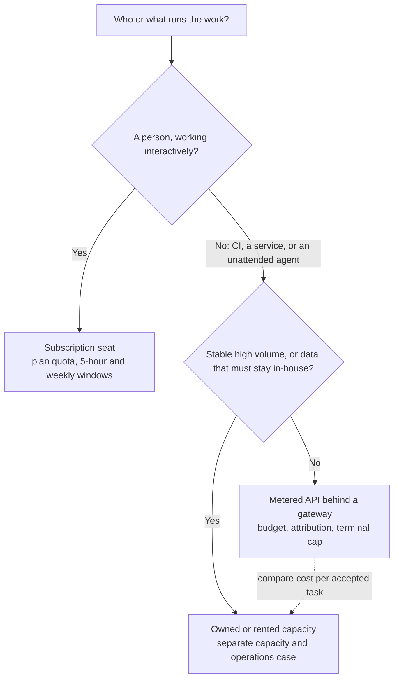
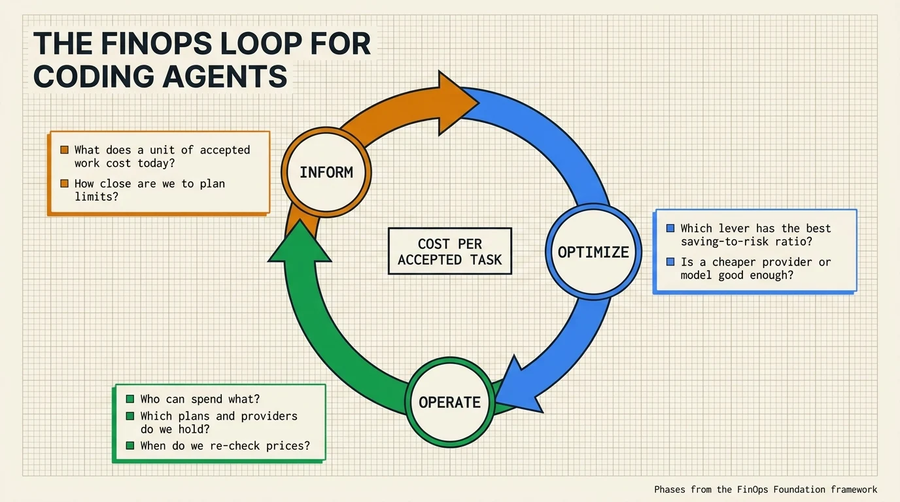
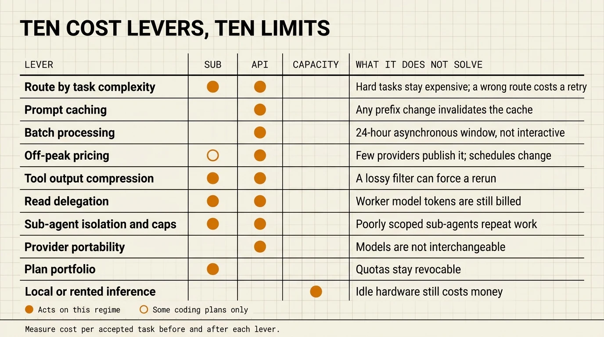

# AI FinOps for coding agents

> **Reading time**: ≈12 minutes
>
> **Audience**: Developers paying for their own agent usage, tech leads who own a team budget, and platform or procurement owners who choose plans and providers.
>
> **Purpose**: Entry point of the AI FinOps section. Each question below links to the page that answers it in depth. Dated prices are kept in the [LLM market snapshot](./llm-market-snapshot.md), not here.

---

## TL;DR

| Question | Start here |
|---|---|
| Are LLM prices going up or down? | [LLM market snapshot, §1](./llm-market-snapshot.md#1-the-trend-quotas-shrink-while-token-prices-fall) |
| What does one day of agent work cost on each provider? | [LLM market snapshot, §5](./llm-market-snapshot.md#5-cost-of-one-reference-workload) |
| How do I measure what my agent work really costs? | [AI unit economics, §2](./ai-unit-economics.md#2-building-a-cost-per-accepted-task) |
| Which levers reduce cost, and what does each one break? | [§3 below](#3-lever-map) |
| Seat, API, or both, for a team? | [Subscription strategy](./subscription-strategy.md) |
| How do I cap spend per team or per key? | [API gateway](./api-gateway.md) |
| When does local or rented hardware beat the API? | [Local vs cloud inference](../ecosystem/local-vs-cloud-inference.md) |
| How do I track my own sessions? | [Observability, cost tracking](./observability.md#cost-tracking) |

---

## 1. Three cost regimes that move independently

Agent work is paid through three different mechanisms. Each has its own unit, and each can change without the others moving.

| Regime | What you buy | Unit you can compare | What changes it |
|---|---|---|---|
| **Subscription quota** | A seat with included usage (Claude Pro, Max, Team; ChatGPT Plus, Pro; Cursor; Copilot) | A share of an allowance the vendor does not publish in tokens | Plan multipliers, 5-hour and weekly windows, model weighting, overage rules, which clients may use the seat |
| **Metered API tokens** | Pay-per-use access to a model | Price per million input, cached input, and output tokens | List price, cache multipliers, batch and off-peak discounts, regional premiums, fast modes, tokenizer changes |
| **Owned or rented capacity** | A machine or GPU-hours running open-weight models | Cost per GPU-hour, divided by the useful work done at your utilization | Hardware prices, rental rates, model fit, utilization, operating staff |

OpenAI in September 2026 shows why the distinction matters. At its September 29 DevDay, OpenAI announced that the usage included in ChatGPT Pro $200 drops from 20 to 10 times the Plus allowance on October 30, at the same price. On September 30, its API price list showed GPT-6.1 Sol at $2 per million input tokens and $10 per million output tokens, one fifth of the GPT-6 Astra rate. A Pro $200 subscriber loses half of the included usage, while an API customer gains a cheaper model. The [market snapshot](./llm-market-snapshot.md#1-the-trend-quotas-shrink-while-token-prices-fall) lists the dated changes and their sources.

Two consequences follow:

- **Know which regime carries your workload.** A headline about "prices going up" says nothing about your bill until you know which regime it concerns.
- **Do not convert a quota into tokens.** Vendors describe allowances as multiples of another plan ("5x Pro", "20x Plus") and weight them by model, effort, and context size. Any token figure you derive is an estimate, not a contract. Measure your own consumption instead (see [§2](#2-the-finops-loop-applied-to-agents)).

Which regime should carry a workload follows from who or what runs it. The routing below condenses the [subscription strategy](./subscription-strategy.md) decision table:

---

## 2. The FinOps loop applied to agents

The [FinOps Foundation framework](https://www.finops.org/framework/phases/) organizes cost work in three phases: **Inform** (examine cost, usage, and efficiency data), **Optimize** (identify ways to improve efficiency and value), and **Operate** (implement the changes).

| Phase | Question for agent work | What to do | Where |
|---|---|---|---|
| **Inform** | What does a unit of accepted work cost today? | Record tokens per attempt, cache hit rate, retries, and review time. Divide by accepted tasks, not by requests. | [AI unit economics, §2](./ai-unit-economics.md#2-building-a-cost-per-accepted-task), [Observability](./observability.md#cost-tracking), `/usage` in Claude Code |
| **Inform** | How close are we to plan limits? | Log how often limits interrupt work and which model was active when they did. | [Subscription plans and limits](../ultimate-guide.md#subscription-plans--limits) |
| **Optimize** | Which lever has the best ratio of saving to risk for this workload? | Pick from the [lever map](#3-lever-map), test on a sample, compare cost per accepted task before and after. | [AI unit economics, §3](./ai-unit-economics.md#3-the-real-cost-reduction-levers) |
| **Optimize** | Is a cheaper provider or model good enough? | Benchmark your own tasks with the same harness. Vendor scores measure a model plus a harness plus an effort setting. | [LLM market snapshot, §4](./llm-market-snapshot.md#4-capability-read-the-benchmark-conditions-first) |
| **Operate** | Who can spend what? | Per-team budgets, virtual keys, model allowlists, progressive spend policies for interactive users, hard caps for unattended agents. | [API gateway](./api-gateway.md), [AI unit economics, §5](./ai-unit-economics.md#5-budget-and-governance-per-team) |
| **Operate** | Which plans and providers do we hold? | Separate workforce seats from production API traffic, run a pilot before committing. | [Subscription strategy, §7](./subscription-strategy.md#7-decision-and-pilot-gate) |
| **Operate** | When do we re-check prices? | Re-verify at the primary source before every procurement decision and at least each quarter. | [LLM market snapshot, §8](./llm-market-snapshot.md#8-refresh-rule) |

---

## 3. Lever map

The second column names the regime a lever acts on. The last column lists what the lever leaves unsolved or can make worse, which is why each one needs a before-and-after measurement of cost per accepted task.

| Lever | Regime | Documented in | What it does not solve |
|---|---|---|---|
| Route by task complexity | API, subscription | [AI unit economics](./ai-unit-economics.md#route-by-complexity) | A task that genuinely needs the strongest model stays expensive, and a wrong route costs a retry |
| Prompt caching | API | [Cost optimization levers](../ultimate-guide.md#cost-optimization-levers-native-vs-api-level) | Any change in the cached prefix invalidates it; proxies that rewrite context can break it |
| Batch processing | API | [Message Batches API](../core/architecture.md#message-batches-api) | Requests are processed asynchronously within a 24-hour window, so batch does not fit an interactive loop |
| Off-peak pricing | API, some coding plans | [LLM market snapshot, §2](./llm-market-snapshot.md#2-api-prices) | Among the providers checked, only DeepSeek (API) and Z.AI (coding plan) publish it, and schedules change |
| Tool output compression | API, subscription | [Context engineering tools, §3](../ecosystem/context-engineering-tools.md#3-output-compression-cli--tool-output), [independent benchmarks](../ecosystem/context-engineering-tools.md#independent-benchmarks) | A lossy filter can drop the line the agent needed, which can trigger a rerun; third-party benchmarks found end-to-end effects far below vendor claims, sometimes a higher cost |
| Read delegation to a cheaper model | API, subscription | [shunt](../ecosystem/context-engineering-tools.md#shunt-delegation-not-compression) | The worker model's tokens are still billed, and it can extract the wrong files |
| Sub-agent isolation and iteration caps | API, subscription | [AI unit economics, §3](./ai-unit-economics.md#isolate-heavy-work-in-sub-agents) | Poorly scoped sub-agents repeat work in parallel |
| Provider portability (gateway, bring-your-own-key harness) | API | [API gateway](./api-gateway.md), [OpenCode](../ecosystem/agentic-tools.md#15-opencode-anomaly-formerly-sst) | Models are not interchangeable: tool schemas, caching, and reasoning behave differently |
| Plan portfolio | Subscription | [Subscription strategy](./subscription-strategy.md) | Quotas stay revocable and are not guaranteed in tokens |
| Local or rented inference | Capacity | [Local vs cloud inference](../ecosystem/local-vs-cloud-inference.md) | Only open-weight models that fit the hardware are available, and idle hardware still costs money |

To judge a vendor's claim that a tool "cuts cost by X%", apply the checklist in [AI unit economics, §6](./ai-unit-economics.md#6-how-to-read-a-vendors-cost-reduction-claim): whether the comparison is paired on the same tasks, how many tasks it covers, whether it reports a median or an average, and whether a cut in tokens is also a cut in dollars.

---

## 4. What this section does not cover

- **A forecast.** The section documents dated facts and a method. It does not predict where prices will go.
- **Negotiated prices.** Volume discounts, committed spend, and reserved capacity are usually private contracts, and the snapshot does not list them.
- **Business value.** Cost per accepted task is the denominator. Revenue, defects avoided, and customer impact remain a separate exercise per team.

---

## See also

- [LLM market snapshot](./llm-market-snapshot.md): dated prices, quotas, and the trend
- [AI unit economics](./ai-unit-economics.md): the measurement framework
- [Subscription strategy](./subscription-strategy.md): seats, APIs, and provider portfolios for teams
- [API gateway](./api-gateway.md): budgets, virtual keys, and allowlists
- [AI FinOps visual overview](https://cc.bruniaux.com/finops/): the same regimes and levers as an interactive page with a cost calculator
- [Token-saving tools, measured](https://cc.bruniaux.com/token-savings/): vendor claims against six public benchmarks
- [Context engineering tools](../ecosystem/context-engineering-tools.md): compression and delegation tools with their measured effects
- [Local vs cloud inference](../ecosystem/local-vs-cloud-inference.md): hardware, rental, and API break-even
