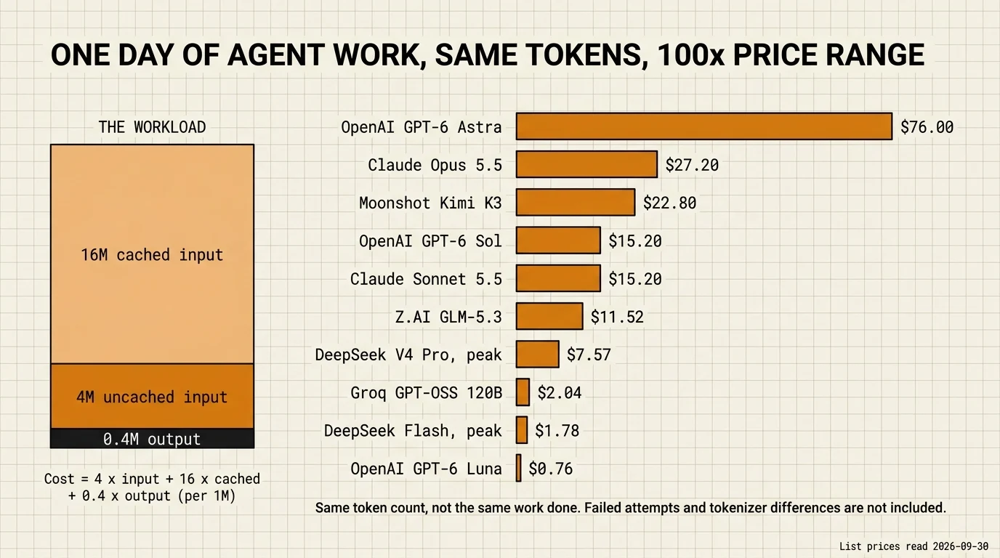

# LLM market snapshot for coding agents (September 2026)

> **Reading time**: ≈20 minutes
>
> **Part of**: the [AI FinOps](./ai-finops.md) section.
>
> **Purpose**: Answer two questions with dated facts: are LLM costs rising or falling, and what does agent work cost on each provider today. This page is a snapshot, not a live price list.

---

## Data snapshot date

Every price and quota on this page was read at the vendor's own documentation on **2026-09-30**, unless a row says otherwise. Vendors reprice without notice and rename models between releases. Re-verify at the linked source before any purchase decision.

**How the numbers were checked.** The starting point was an AI-generated market summary. Each claim was then re-read at a primary source: vendor pricing pages, help centers, API documentation, and changelogs. The reading tool returns a summarized version of each page, so an exact figure can still carry a transcription error. `openai.com` and `help.openai.com` refused automated reads during verification; OpenAI figures come from `developers.openai.com` and OpenAI's `learn.chatgpt.com` pricing page instead. Where only a secondary source was available, the row says so.

---

## 1. The trend: quotas shrink while token prices fall

Three kinds of change get reported as "prices going up". Keep them apart:

- **API price**: the price per million tokens changes.
- **Quota**: a subscription includes less (or more) usage at the same price.
- **Conditions**: windows, model weighting, retired models, or which clients may use a plan.

| Date | Provider | Change | Type | Source |
|---|---|---|---|---|
| 2025-05-08 | Google | Implicit caching on Gemini 2.5: 75% discount on cached input | API, down | [Google Developers Blog](https://developers.googleblog.com/en/gemini-2-5-models-now-support-implicit-caching/) |
| 2025-06-17 | Google | Gemini 2.5 Flash GA: input $0.15 → $0.30, output $3.50 → $2.50 per 1M tokens | API, mixed | [Google Developers Blog](https://developers.googleblog.com/en/gemini-2-5-thinking-model-updates/) |
| 2025-07-07 | Google | Gemini Batch API at 50% of the standard rate | API, down | [Google Developers Blog](https://developers.googleblog.com/en/scale-your-ai-workloads-batch-mode-gemini-api/) |
| 2025-08-21 | DeepSeek | New V3.1 pricing; off-peak discounts end on 2025-09-05, 16:00 UTC | API, off-peak discount removed | [DeepSeek news](https://api-docs.deepseek.com/news/news250821) |
| 2025-12-09 | Mistral | Devstral 2 launched free on the API, with $0.40 / $2.00 announced for later | API | [Mistral](https://mistral.ai/news/devstral-2-vibe-cli) |
| 2026-01-27 | Mistral | Devstral 2 becomes paid ($0.40 / $2.00); free access limited to the Experiment plan | API, up | [Mistral](https://mistral.ai/news/mistral-vibe-2-0) |
| 2026-05-15 | xAI | Several Grok models retired; reasoning traffic redirected to `grok-4.3` at $1.25 / $2.50 | Conditions | [xAI docs](https://docs.x.ai/developers/migration/may-15-retirement) |
| 2026-06-01 | Cursor | Teams Standard $40 per seat monthly ($32 annual), Premium $120 ($96 annual); renewals from 2026-07-01 | Subscription price | [Cursor](https://cursor.com/blog/teams-pricing-june-2026) |
| 2026-06 | Anthropic | The help article, updated in mid-June, pauses the separate monthly credit announced for Agent SDK, `claude -p`, and third-party apps. Read on 2026-09-30: that usage still draws from the subscription's limits | Conditions | [Claude Help Center](https://support.claude.com/en/articles/15036540-use-the-claude-agent-sdk-with-your-claude-plan) |
| 2026-07-30 | Z.AI | GLM Coding Plan moves to credits weighted by model and time of day | Quota | [Z.AI notice](https://docs.z.ai/devpack/notice/usage-revision) |
| 2026-08-13 | DeepSeek | V4-Pro GA with peak and off-peak pricing, off-peak at half the peak rate, effective 2026-08-16 | API, down off-peak | [DeepSeek updates](https://api-docs.deepseek.com/updates) |
| 2026-09-01 | Fireworks | Newly launched US-only models priced at 1.5x the base serverless price | API, regional premium | [Fireworks docs](https://docs.fireworks.ai/serverless/us-only-serverless) |
| 2026-09-22 | Anthropic | Claude Opus 5.5: cache read $0.20 per 1M tokens, 60% lower than its predecessor ($0.50) | API, down | [Anthropic](https://www.anthropic.com/claude-opus-5-5) |
| 2026-09-30 (read) | Anthropic | Claude Fable 5.1 listed at $10 / $50 with cache reads at $0.25, 0.025x the input price. Anthropic recommends Opus 5.5 for most workloads and Fable 5.1 for demanding reasoning and long-horizon agentic work | API | [Anthropic models overview](https://platform.claude.com/docs/en/about-claude/models/overview), [Anthropic pricing](https://platform.claude.com/docs/en/about-claude/pricing) |
| 2026-09-30 (read) | OpenAI | GPT-6 Sol and GPT-6.1 Sol listed at $2 / $10, one fifth of GPT-6 Astra's $10 / $50. The launch date and the previous price were not readable at OpenAI | API | [OpenAI model page](https://developers.openai.com/api/docs/models/gpt-6-sol) |
| 2026-09-29 | OpenAI | New Pro $500 plan, the only Pro plan with Astra Ultrafast. Pro $200: included usage in ChatGPT Work and Codex falls from 20x to 10x the Plus allowance on 2026-10-30, GPT-6 Pro chat messages from 200 to 100 per week, price unchanged | Quota, down | Tiers: [OpenAI pricing](https://learn.chatgpt.com/docs/pricing). Pro $200 change: [The Next Web, 2026-09-29](https://thenextweb.com/news/openai-devday-pro-200-usage-cut-pro-500-plan) (secondary; OpenAI's help pages were not readable) |

Anthropic's pricing documentation also states that a planned increase of Claude Sonnet 5 to $3 / $15, scheduled for 2026-09-01, will not occur. Sonnet 5 stays at $2 / $10.

**Reading of the trend.** Most documented API changes lower the bill: cheaper cache reads (Gemini 2.5 implicit caching, Opus 5.5), batch and off-peak discounts, and a cancelled increase (Sonnet 5). The increases are targeted: Gemini 2.5 Flash input, the end of DeepSeek's off-peak discounts in 2025, the Devstral 2 launch period, and regional premiums. On the subscription side, the dated changes are Z.AI's switch to weighted credits in July 2026 and OpenAI's halving of the Pro $200 allowance at the same price. Across the changes listed here, the reductions hit subscription quotas and conditions; per-token list prices rose only in the targeted cases above.

---

## 2. API prices

USD per 1 million tokens, standard tier, read on 2026-09-30. "n/a" means no cached-input price was found, not that caching is free.

| Provider and model | Input | Cached input | Output | Modifiers | Source |
|---|---:|---:|---:|---|---|
| Anthropic Claude Fable 5.1 | $10.00 | $0.25 | $50.00 | Batch -50%; cache read 0.025x input; 5-minute cache write $12.50 | [Anthropic pricing](https://platform.claude.com/docs/en/about-claude/pricing) |
| Anthropic Claude Opus 5.5 | $4.00 | $0.20 | $20.00 | Batch -50%; US-only inference 1.1x; fast mode $8 / $40 | [Anthropic pricing](https://platform.claude.com/docs/en/about-claude/pricing) |
| Anthropic Claude Sonnet 5.5 | $2.00 | $0.20 | $10.00 | Batch -50%; 5-minute cache write $2.50 | [Anthropic pricing](https://platform.claude.com/docs/en/about-claude/pricing) |
| OpenAI GPT-6 Astra | $10.00 | $1.00 | $50.00 | Batch and Flex -50%; Fast 2x; cache write $12.50 | [OpenAI model page](https://developers.openai.com/api/docs/models/gpt-6-astra) |
| OpenAI GPT-6 Sol and GPT-6.1 Sol | $2.00 | $0.20 | $10.00 | Cache write 1.25x input; above 272K input tokens, input and cache 2x, output 1.5x | [OpenAI model page](https://developers.openai.com/api/docs/models/gpt-6-sol), [OpenAI pricing](https://developers.openai.com/api/docs/pricing) |
| OpenAI GPT-6 Luna | $0.10 | $0.01 | $0.50 | Same modifiers as Sol | [OpenAI model page](https://developers.openai.com/api/docs/models/gpt-6-luna) |
| Google Gemini 3.1 Flash-Lite | $0.25 | n/a | $1.50 | Batch $0.125 / $0.75; preview at launch | [Gemini API pricing](https://ai.google.dev/gemini-api/docs/pricing) |
| DeepSeek `deepseek-v4-pro`, peak | $1.32 | $0.044 | $3.96 | Off-peak half price: $0.66 / $0.022 / $1.98 | [DeepSeek pricing](https://api-docs.deepseek.com/quick_start/pricing/) |
| DeepSeek `deepseek-flash`, peak | $0.30 | $0.006 | $1.20 | Off-peak half price: $0.15 / $0.003 / $0.60 | [DeepSeek pricing](https://api-docs.deepseek.com/quick_start/pricing/) |
| Mistral Devstral 2 | $0.40 | n/a | $2.00 | Devstral Small 2: $0.10 / $0.30 | [Mistral](https://mistral.ai/news/mistral-vibe-2-0) |
| xAI Grok 4.7 | $2.00 | n/a | $6.00 | US regional endpoint +10% | [xAI docs](https://docs.x.ai/developers/grok-4-7) |
| Moonshot Kimi K3 | $3.00 | $0.30 | $15.00 | Cache write $3.00 (5-minute TTL) or $6.00 (1-hour TTL) | [Kimi platform pricing](https://platform.kimi.ai/docs/pricing/chat) |
| Z.AI GLM-5.3 | $1.40 | $0.26 | $4.40 | | [Z.AI pricing](https://docs.z.ai/guides/overview/pricing) |
| Together Qwen3.6-Plus | $0.50 | n/a | $3.00 | Qwen3.7-Plus listed at $0.32 / $1.28 | [Together pricing](https://www.together.ai/pricing) |
| Fireworks DeepSeek V4.1 Flash | $0.30 | $0.006 | $1.20 | Batch -50%; Priority +25%; launched US-only models 1.5x | [Fireworks pricing](https://docs.fireworks.ai/serverless/pricing) |
| Groq GPT-OSS 120B | $0.15 | $0.075 | $0.60 | | [Groq model page](https://console.groq.com/docs/model/openai/gpt-oss-120b) |
| OVHcloud AI Endpoints GPT-OSS 120B | €0.08 | n/a | €0.40 | EUR, as published | [OVHcloud catalog](https://www.ovhcloud.com/en/public-cloud/ai-endpoints/catalog/gpt-oss-120b/) |
| OpenRouter (gateway) | Provider list price | Per endpoint | Provider list price | No inference markup; credit purchase fee 5.5% (Standard) or 8% (Business); bring-your-own-key free up to $25,000 of list-price inference per month ($200,000 on Enterprise), then 5% | [OpenRouter pricing](https://openrouter.ai/pricing) |

**Per-token prices do not compare across tokenizers.** Anthropic documents that Claude 4.7 and later models produce roughly 30% more tokens for the same text than earlier Claude models. Tokenizers also differ between vendors, so the same prompt can produce a different token count on each, and a cheaper per-token price can still produce a larger bill.

---

## 3. Subscription quotas

No vendor below publishes a subscription allowance as a token budget, except where the row says so. A multiplier ("5x Pro") compares one plan with another, and model, effort, and context size weight the consumption.

| Offer | Price | Published allowance | Conditions | Source |
|---|---|---|---|---|
| Claude Pro | $20 monthly, $17 annual | At least 5x the Free plan per 5-hour session | 5-hour sessions plus weekly limits; Claude and Claude Code share the same limits; usage credits at API rates after the limit | [Claude pricing](https://claude.com/pricing), [Claude Code with Pro or Max](https://support.claude.com/en/articles/11145838-use-claude-code-with-your-pro-or-max-plan) |
| Claude Max 5x / 20x | $100 / $200 monthly | 5x / 20x the Pro per-session allowance | Weekly and monthly caps possible | [Max plan](https://support.claude.com/en/articles/11049741-what-is-the-max-plan) |
| Claude Team Standard / Premium | $25 / $125 per seat monthly, $20 / $100 annual; minimum 2 members | 1.25x / 6.25x the Pro per-session allowance | Individual limits per seat | [Team plan](https://support.claude.com/en/articles/9266767-what-is-the-team-plan) |
| Claude Enterprise, usage-based | $20 per seat per month, billed annually | Usage billed at API rates | See [subscription strategy](./subscription-strategy.md#1-the-20-enterprise-seat-does-not-include-usage) | [Claude pricing](https://claude.com/pricing) |
| ChatGPT Go / Plus | $8 / $20 monthly | Plus is the base unit for Pro multipliers | Plus has a 5-hour limit in Work and Codex | [OpenAI pricing](https://learn.chatgpt.com/docs/pricing) |
| ChatGPT Business | $20 per user annual, $25 monthly | Not published in tokens | Standard Business has a 5-hour limit | [OpenAI pricing](https://learn.chatgpt.com/docs/pricing) |
| ChatGPT Pro $100 / $200 / $500 | $100 / $200 / $500 monthly | Pro $200: 10x Plus from 2026-10-30 (20x before). Pro $100 and Pro $500 multiples were not readable on an OpenAI page | Pro plans have no 5-hour limit; among Pro plans, Astra Ultrafast is only on Pro $500 | [OpenAI pricing](https://learn.chatgpt.com/docs/pricing), [The Next Web](https://thenextweb.com/news/openai-devday-pro-200-usage-cut-pro-500-plan) |
| Cursor Pro / Pro+ / Ultra | $20 / $60 / $200 monthly | Not published in tokens | | [Cursor pricing](https://cursor.com/docs/account/pricing) |
| GitHub Copilot Pro / Pro+ / Max | $10 / $39 / $100 monthly | 1,500 / 7,000 / 20,000 AI credits per month; 1 credit = $0.01 | Each allowance splits into base and flex credits (1,000 + 500 on Pro) | [GitHub Copilot plans](https://docs.github.com/en/copilot/get-started/plans) |
| Mistral Le Chat Pro / Team | $14.99 monthly / $24.99 per user ($50 minimum) | Pro includes $15 per month of API credits | Vibe usage subject to fair-use limits, no numbers published | [Mistral pricing](https://mistral.ai/pricing/) |
| Z.AI GLM Coding Plan | From $18 monthly | Lite / Pro / Max: 10,000 / 60,000 / 140,000 credits per week; 2,000 / 12,000 / 28,000 per 5 hours | Peak Monday to Friday 14:00 to 18:00 SGT (UTC+8); GLM-5.3 costs 3x credits at peak vs 1x off-peak; token examples assume a 95% cache hit rate | [Z.AI Coding Plan](https://docs.z.ai/devpack/overview) |
| Alibaba Model Studio Coding Plan | ¥200 monthly | 6,000 requests per 5 hours, 45,000 per week, 90,000 per month | Quota counted per model call, not per prompt | [Alibaba Cloud](https://help.aliyun.com/en/model-studio/coding-plan) |
| OpenCode Go | $10 monthly | See the guide's [OpenCode Go section](../ecosystem/agentic-tools.md#opencode-go-the-subscription-tier-and-why-it-does-not-scale-to-a-team) | Single seat; a Go Plus tier at $40 is also listed | [OpenCode Go](https://opencode.ai/go) |
| Cerebras Code Pro / Max | $50 / $200 monthly | Up to 24M / 120M tokens per day, the only allowance here published in tokens | Both tiers shown as sold out on 2026-09-30; whether cached tokens count toward the daily figure is not stated | [Cerebras Code](https://www.cerebras.ai/code) |

**Third-party clients on a Claude subscription.** Anthropic's legal and compliance page states that third-party developers may not route requests through Free, Pro, or Max plan credentials on behalf of their users, and that a subscriber may sign in to Claude Code with their own plan ([Claude Code legal and compliance](https://code.claude.com/docs/en/legal-and-compliance)). Press coverage dates specific enforcement actions to January and April 2026; no Anthropic page with those dates was found.

---

## 4. Capability: read the benchmark conditions first

A benchmark score measures a model, a harness, an effort setting, and a number of attempts together. Two scores are comparable only when all four match and the benchmark version is the same.

| Model | Benchmark | Score | Conditions stated | Measured by | Date |
|---|---|---:|---|---|---|
| Claude Opus 5.5 | Terminal-Bench 4.0 | 66.4% (±2.6) | xhigh effort, Claude Code harness | Anthropic | 2026-09-22 |
| Claude Sonnet 5.5 | Terminal-Bench 4.0 | 70.6% | Effort and harness not stated in the text read | Anthropic | 2026-09-28 |
| Gemini 3.5 Flash | Terminal-Bench 2.1 | 76.2% | Different benchmark version: not comparable with the rows above | Google | 2026-05-19 |

Sources: [Claude Opus 5.5](https://www.anthropic.com/claude-opus-5-5), [Claude Sonnet 5.5](https://www.anthropic.com/claude-sonnet-5-5), [Gemini 3.5](https://blog.google/innovation-and-ai/models-and-research/gemini-models/gemini-3-5/).

All three are vendor-reported. Do not read the first two rows as "Sonnet beats Opus" until both conditions are published. No independent benchmark run with one harness across all providers was found. For a buying decision, run your own tasks through the same harness on each candidate, as described in [agent evaluation](../roles/agent-evaluation.md).

---

## 5. Cost of one reference workload

The workload is a hypothesis chosen to make providers comparable, not a measured average: one day of agent work with **20M input tokens, 80% of them served from cache (16M cached, 4M uncached), and 0.4M output tokens**.

Cost = 4 × input price + 16 × cached price + 0.4 × output price. When no cached price was found, all 20M input tokens are billed at the full rate, which makes that row an upper bound. Cache writes are excluded because they depend on how prompts are built.

| Model | Cost for the day |
|---|---:|
| OpenAI GPT-6 Astra | $76.00 |
| Anthropic Claude Fable 5.1 | $64.00 |
| xAI Grok 4.7 (no cached price found, upper bound) | $42.40 |
| Anthropic Claude Opus 5.5 | $27.20 |
| Moonshot Kimi K3 | $22.80 |
| OpenAI GPT-6 Sol and GPT-6.1 Sol | $15.20 |
| Anthropic Claude Sonnet 5.5 | $15.20 |
| Z.AI GLM-5.3 | $11.52 |
| Mistral Devstral 2 (no cached price found, upper bound) | $8.80 |
| DeepSeek `deepseek-v4-pro`, peak / off-peak | $7.57 / $3.78 |
| Groq GPT-OSS 120B | $2.04 |
| DeepSeek `deepseek-flash`, peak / off-peak | $1.78 / $0.89 |
| OVHcloud GPT-OSS 120B (EUR, no cached price found) | €1.76 |
| OpenAI GPT-6 Luna | $0.76 |

The chart leaves out the three upper-bound rows (no cached price found) and Claude Fable 5.1, which was added to the table after the chart was generated.

This table compares bills for the same token count. It does not compare work done. A model that fails, loops on tool calls, or needs three attempts costs more per accepted task than its row suggests, and the tokenizer difference noted in [§2](#2-api-prices) changes the token count itself. Measure cost per accepted task on your own workload with the method in [AI unit economics](./ai-unit-economics.md#2-building-a-cost-per-accepted-task).

---

## 6. Where the data goes

| Provider | What the documentation states |
|---|---|
| Anthropic API | Inference geography: only `us` and `global`; workspace geography: only `us` ([data residency](https://platform.claude.com/docs/en/manage-claude/data-residency)). Inputs and outputs from commercial products are not used for training by default ([privacy center](https://privacy.claude.com/en/articles/7996868-is-my-data-used-for-model-training)) |
| OpenAI API | European endpoint `eu.api.openai.com`, which requires approval and a Modified Retention amendment, with a 10% regional processing premium where available. System data (account, metadata, usage) may be processed outside the region. API data is not used for training unless you opt in ([your data](https://developers.openai.com/api/docs/guides/your-data)) |
| Google Gemini API | Paid-tier content is not used to improve Google's products; free-tier content may be ([Gemini API pricing](https://ai.google.dev/gemini-api/docs/pricing)). The Vertex AI residency page lists France and Germany regions, but which commitment and which models they cover was not established ([Vertex data residency](https://docs.cloud.google.com/vertex-ai/generative-ai/docs/learn/data-residency)) |
| DeepSeek API | Personal data is collected, processed, and stored in the People's Republic of China, with a GDPR Article 27 representative for the EU. No EU residency option was found ([privacy policy](https://cdn.deepseek.com/policies/en-US/deepseek-privacy-policy.html)) |
| OpenRouter | In-region EU routing on Business and Enterprise plans; zero-data-retention routing on every plan ([OpenRouter pricing](https://openrouter.ai/pricing)) |
| xAI, Fireworks | Regional premiums: xAI +10% on the US endpoint, Fireworks 1.5x on newly launched US-only models |

Using an LLM API under the GDPR involves a data processing agreement, a legal basis, and control of subprocessors and international transfers. Choosing an EU region, where a provider offers one, narrows the transfer question but does not replace the rest.

---

## 7. Claims that did not survive verification

List prices in the AI-generated summary held up almost everywhere they could be checked. Its errors clustered in dates, plan conditions, and model attribution:

| Claim in the summary | What the primary source says |
|---|---|
| Since June 15, 2026, Agent SDK and `claude -p` usage has its own credit | Announced, then paused. That usage still draws from subscription limits |
| Cerebras Code gives 24M tokens a day for $50 | The figure is real, but the source post dates from November 2025 and both paid tiers were sold out on 2026-09-30 |
| DeepSeek off-peak means nights and weekends at half price | Peak is 01:00 to 04:00 and 06:00 to 10:00 UTC on weekdays; everything else, weekends included, is off-peak |
| OpenRouter zero data retention is a Business and Enterprise feature | Zero-data-retention routing is on every plan; EU in-region routing is the Business and Enterprise feature |
| Gemini 3.5 scores 76.2% on Terminal-Bench 2.1 | The score belongs to Gemini 3.5 Flash |
| Scaleway Generative APIs start at €0.15 input, L4 GPU at €0.93 per hour | Not found on Scaleway's price pages, which showed different figures on 2026-09-30 |

---

## 8. Refresh rule

- **Date every figure.** A price without the date it was read is not usable.
- **Re-verify at the primary source** before quoting a figure in a purchase decision, a budget, or a published comparison.
- **Refresh this page each quarter**, and immediately after a vendor event that changes plans (a developer conference, a model launch, a plan email).
- **Keep dated events out of the table unless a primary or named secondary source carries the date.** An AI-generated summary does not count as a source.

**What this snapshot could not establish**: Pro $100 and Pro $500 multiples on an OpenAI page; GPT-6 Sol's launch date and previous price; prices of Gemini models released after 3.1 Flash-Lite; DeepSeek's February 2025 off-peak discount at a DeepSeek page; per-model Azure and AWS Bedrock prices; Groq batch rules; Cerebras shared-inference prices; Scaleway token and GPU prices; the regions and models covered by Vertex AI residency; volume discounts, which are generally negotiated privately.

---

## See also

- [AI FinOps](./ai-finops.md): the section entry point and lever map
- [AI unit economics](./ai-unit-economics.md): cost per accepted task
- [Subscription strategy](./subscription-strategy.md): choosing seats and providers for a team
- [Local vs cloud inference](../ecosystem/local-vs-cloud-inference.md): hardware and GPU rental prices, August 2026 snapshot
