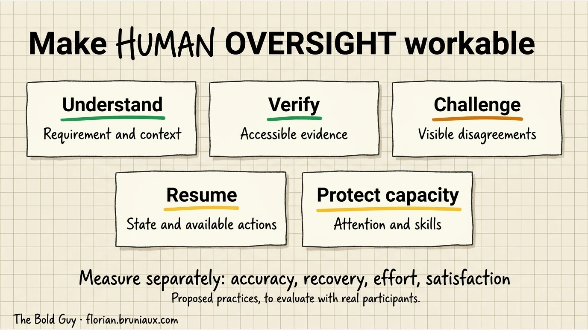

# Learning to Code with AI: The Conscious Developer's Guide

> **Confidence**: Tier 2, based on academic research (2023-2025) and educator feedback
>
> **Audience**: Junior developers, CS students, bootcamp graduates, career changers
>
> **Reading time**: ~15 minutes
>
> **Last updated**: August 2026

---

## Table of Contents

1. [Quick Self-Check (Start Here)](#quick-self-check-start-here)
2. [The Problem in 60 Seconds](#the-problem-in-60-seconds)
3. [The Reality of AI Productivity](#the-reality-of-ai-productivity)
4. [The Three Patterns](#the-three-patterns)
5. [The UVAL Protocol](#the-uval-protocol)
6. [Claude Code for Learning](#claude-code-for-learning-not-just-producing)
7. [Breaking Dependency (Pattern: Dependent)](#breaking-dependency)
8. [Embracing AI Tools (Pattern: Avoidant)](#embracing-ai-tools)
9. [Optimizing Your Flow (Pattern: Augmented)](#optimizing-your-flow)
10. [Case Study: Hybrid Learning Principles](#case-study-hybrid-learning-principles)
11. [Where Are You on the Agent Adoption Curve?](#where-are-you-on-the-agent-adoption-curve)
12. [30-Day Progression Plan](#30-day-progression-plan)
13. [For Tech Leads & Engineering Managers](#for-tech-leads--engineering-managers)
14. [The Attention Cost of the Review Shift](#the-attention-cost-of-the-review-shift)
15. [Red Flags Checklist](#red-flags-checklist)
16. [Sources & Research](#sources--research)
17. [See Also](#see-also)

---

## Quick Self-Check (Start Here)

Before diving in, answer honestly:

| # | Question | Yes | No |
|---|----------|-----|-----|
| 1 | Can you explain the last code that AI generated for you? | ☐ | ☐ |
| 2 | Have you debugged code without AI this week? | ☐ | ☐ |
| 3 | Do you know WHY the solution works (not just THAT it works)? | ☐ | ☐ |
| 4 | Could you write the same function without assistance? | ☐ | ☐ |
| 5 | Do you know the AI's limitations on this type of problem? | ☐ | ☐ |

### Your Score

| Score | Where You Are | Jump To |
|-------|--------------|---------|
| **0-2 yes** | Dependency risk: you're outsourcing thinking | [§6 Breaking Dependency](#breaking-dependency) |
| **3-4 yes** | On track, room for optimization | [§8 Optimizing Your Flow](#optimizing-your-flow) |
| **5 yes** | Augmented: you're using AI correctly | [§9 Case Study](#case-study-hybrid-learning-principles) |

Be honest. This guide only helps if you acknowledge where you actually are.

---

## The Problem in 60 Seconds

> AI can make you 3x more productive OR unemployable in 3 years.
> The difference? How you use it.

Forget the statistics for now. Here's a simple metaphor:

**AI is your GPS.**

- Great for getting somewhere fast
- Dangerous if you lose the ability to navigate without it
- Truly useful when you understand the map AND use the GPS

A developer who only copy-pastes AI output is like a driver who can't read a map. Fine until the GPS fails, or until someone asks them to explain the route.

### The Skills Gap

```
Traditional learning: Problem → Struggle → Understanding → Solution
AI-assisted (wrong): Problem → AI → Solution → ??? (no understanding)
AI-assisted (right): Problem → Attempt → AI guidance → Understanding → Solution
```

The struggle isn't optional. It's where learning happens.

### The "Vibe Coding" Trap

Term coined by [Andrej Karpathy](https://x.com/karpathy/status/1886192184808149383) (Feb 2025, Collins Word of the Year 2025): coding by "fully giving in to the vibes" without understanding the generated code.

> **Related**: For team and OSS contexts, see [AI Traceability](../ops/ai-traceability.md) for disclosure policies (LLVM, Ghostty, Fedora) and attribution tools.

**Symptoms:**
- Accept All without reading diffs
- Copy-paste errors without understanding root cause
- Debug by asking AI for random changes until it works

**Karpathy's caveat:** "Not too bad for throwaway weekend projects", but dangerous for production code you'll need to maintain.

**Proposed practice:** UVAL (§5) provides checkpoints for examining understanding before acceptance; its effect on retention and transfer needs assessment.

> **Related**: For context management strategies that prevent vibe coding chaos, see [Anti-Pattern: Context Overload](#anti-pattern-context-overload) in the main guide (§9.8).

**At team scale**, vibe coding accumulates into what some practitioners call *comprehension debt* (an emerging term, 2025-2026): the growing gap between how much code exists in a system and how much any human genuinely understands. Unlike technical debt, which surfaces through slow builds and tangled dependencies, comprehension debt breeds false confidence: velocity looks fine, tests are green, and the reckoning arrives at the worst possible moment, usually during an incident or an audit.

---

## The Reality of AI Productivity

Before optimizing your learning approach, understand what productivity research actually shows. It's more nuanced than the marketing suggests.

### The Productivity Curve (Not a Straight Line)

Most developers experience three distinct phases:

| Phase | Timeline | Productivity | What's Happening |
|-------|----------|--------------|------------------|
| **Wow Effect** | 0-2 weeks | ~0% gain | Excitement masks learning curve; time spent prompting offsets time saved |
| **Targeted Gains** | 2-8 weeks | +20-50% | AI accelerates specific tasks you've learned to delegate effectively |
| **Sustainable Plateau** | 3-6 months | +20-30% | Stable gains, but only for developers who already have strong fundamentals |

**Critical nuance**: These gains are conditional. Studies show experienced developers (5+ years) see larger, sustained gains. Junior developers often see initial spikes followed by regression, because speed without understanding creates technical debt. A 2026 RCT ([Shen & Tamkin, Anthropic Fellows](https://arxiv.org/abs/2601.20245)) measured a **17% reduction in skills acquisition** when developers learned a new library with AI assistance (n=52, p=0.01), with no significant time savings. Only ~20% of AI users (pure delegation pattern) finished faster, at the cost of learning almost nothing.

**Check whether to continue**: Repeated failures, reported fatigue or difficulty explaining the next action can justify a pause, a smaller task or additional help. Agree and assess a cadence locally; these observations do not establish a medical condition or its cause. See [Check whether to continue](#step-25-check-whether-to-continue).

### Where AI Helps (And Where It Hurts)

| High-Gain Tasks | Low/Negative-Gain Tasks |
|-----------------|-------------------------|
| Boilerplate generation | Architecture decisions |
| Test scaffolding | Domain-specific logic |
| Refactoring known patterns | Deep debugging |
| Documentation drafts | Fine-grained optimization |
| Codebase onboarding | Security-critical code |
| CRUD operations | Novel algorithm design |

The pattern: **AI excels at well-defined, repeatable tasks**. It struggles with ambiguous problems requiring deep context or creative judgment.

### Why Some Teams Get Results (And Others Don't)

**Teams that succeed**:
- Establish clear AI usage guidelines (when to use, when not to)
- Maintain code review standards (AI-generated code reviewed same as human code)
- Build shared prompt libraries for common tasks
- Pair junior developers with seniors when using AI

**Teams that stagnate**:
- No standards for AI-generated code quality
- Juniors using AI without oversight
- Measuring velocity without measuring understanding
- Skipping code review because "AI wrote it"

The tool matters less than the organizational discipline around it.

**The review bottleneck has inverted.** When code was expensive to produce, senior engineers could review it faster than juniors could write it. Review was a quality gate. AI flips this: a junior can now generate code faster than a senior can critically audit it. The rate-limiting factor that historically kept review meaningful has been removed. What used to be a quality gate is now a throughput problem. Teams that don't account for this end up rubber-stamping AI-generated code at scale.

**Verifying AI-produced code is becoming the higher-value skill, ahead of writing it from scratch.** This reframes systematic, rigorous review of an agent's output as the central competency worth developing, rather than raw typing speed.

*Mehran Sahami, Stanford, "It's Never Too Late", 2025*

> **For team leads**: If you're responsible for structuring this (onboarding, policies, growth measurement), jump to [§12 For Tech Leads & Engineering Managers](#for-tech-leads--engineering-managers).

**On maintainability fear**: The concern that AI-generated code creates unmaintainable codebases is not empirically supported: downstream developers show no significant difference in evolution time or code quality (Borg et al., 2025, n=151). The real risks are skill atrophy and over-delegation, not inherent quality degradation for the next developer. ([arXiv:2507.00788](https://arxiv.org/abs/2507.00788))

### Implications for Learning

This research shapes the rest of this guide:

1. **The 70/30 rule** (§5) is calibrated to where AI helps vs. hurts learning, not arbitrary
2. **The Three Patterns** below map to these productivity outcomes
3. **Breaking Dependency** (§6) addresses the junior developer trap specifically

---

## The Three Patterns

Every developer using AI falls into one of three patterns:

| Pattern | Signs | Risk | This Guide |
|---------|-------|------|------------|
| **Dependent** | Copy-paste without understanding, can't debug AI code, anxiety without AI | Unemployable | [§7](#breaking-dependency) |
| **Avoidant** | Refuses AI "on principle", slower than peers, dismissive of tools | Left behind | [§8](#embracing-ai-tools) |
| **Augmented** | Uses AI critically, understands everything, knows AI limits | Thriving | [§9](#optimizing-your-flow) |

**Productivity trajectory by pattern** (based on [§3 research](#the-reality-of-ai-productivity)):

| Pattern | 0-2 weeks | 2-8 weeks | 6+ months |
|---------|-----------|-----------|-----------|
| Dependent | +50% (illusory) | +20% | -10% (debt accumulates) |
| Avoidant | -30% | -20% | 0% (no AI leverage) |
| Augmented | +10% | +30-50% | +20-30% (sustainable) |

### Pattern 1: Dependent

**How you got here**: Started with AI from day one, never built foundational skills, deadline pressure made shortcuts appealing.

**The trap**: You ship code you can't explain. When it breaks, you're stuck. In interviews, you freeze.

**What interviewers see**:
- Can't whiteboard basic algorithms
- Struggles with "why did you choose this approach?"
- Asks to "look something up" for fundamental concepts

### Pattern 2: Avoidant

**How you got here**: Purist mindset, fear of "cheating", learned before AI tools existed, distrust of new technology.

**The trap**: You're slower than peers. You spend hours on problems AI solves instantly. Struggling more doesn't make you learn faster. It just makes you slower.

**What teams see**:
- Reinventing wheels unnecessarily
- Slow on routine tasks
- Resistance to modern tooling

### Pattern 3: Augmented

**How you got here**: Built foundations first OR consciously fixed Pattern 1/2 habits, treat AI as tool not crutch, verify everything.

**The advantage**: You move fast AND understand deeply. You use AI for leverage, not replacement.

**What hiring managers see**:
- Fast delivery with clear explanations
- Can work with OR without AI
- Uses tools appropriately for the task

---

## The UVAL Protocol

A proposed practice for checking understanding during AI-assisted work. It does not establish a retention benefit or replace the policy for accepting a change.

### Overview

| Step | Action | Why It Matters |
|------|--------|----------------|
| **U** | Understand First | Ask better questions, catch wrong answers |
| **V** | Verify | Check explanation and prediction against evidence |
| **A** | Apply | Apply a requirement, predict a result or diagnose a defect |
| **L** | Learn | Record an insight and assess later recall or transfer |

For the reasoning behind naming this a protocol rather than a habit, see [the UVAL protocol and its proposed comprehension checks](https://www.florian.bruniaux.com/blog/articles/uval-protocol-comprehension-debt/).

---

### U: Understand First (The 15-Minute Rule)

**Not just "think for 15 minutes"**, a specific protocol:

#### Step 1: State the Problem (2 min)

Write the problem in ONE sentence. If you can't, you don't understand it yet.

```
❌ "The code doesn't work"
✅ "The login form doesn't show validation errors when email is empty"
```

#### Step 2: Brainstorm Approaches (5 min)

List 3 possible approaches, even if you're not sure they'll work:

```
1. Add client-side validation with JavaScript
2. Use HTML5 required attribute
3. Add server-side validation and return errors
```

This forces you to think before asking AI.

#### Step 2.5: Check whether to continue

Note reported fatigue, frustration, repeated failed attempts and difficulty explaining the next action. These observations can justify a pause, a smaller task or help from another person; they do not diagnose a condition or identify its cause. Agree a cadence suited to the task and evaluate it locally. Clearing an agent context and recovering human attention are separate interventions.

#### Step 3: Identify Knowledge Gaps (3 min)

What specifically do you NOT know?

```
- I know I need validation, but I don't know how to display inline errors in React
- I've never used Zod before but it keeps coming up
```

#### Step 4: THEN Ask AI (5 min)

The revised question names the missing knowledge:

```
❌ "How do I add validation?"
✅ "I'm building a React login form. I want to:
   1. Validate email format client-side
   2. Show inline error messages below the input
   3. Use Zod for schema validation

   I've tried using the HTML required attribute but need custom error messages.
   What's the idiomatic React approach?"
```

The revised question makes the missing knowledge and expected behavior explicit.

#### Claude Code Implementation

Add to your `CLAUDE.md`:

```markdown
## Learning Mode
Before generating code for me, ask:
1. What approaches have I already considered?
2. What specifically am I stuck on?
3. What do I expect the solution to look like?

If I skip these, remind me to think first.
```

---

### V: Verify (Explain It Back)

**The rule**: If you can't explain the code to a colleague, you haven't learned it.

An explanation also needs a behavioral check. [Necessary or Sufficient?](https://arxiv.org/html/2609.05385v1) found that models’ cited top three did not reliably identify the highest-scoring features under the tested input interventions in two synthetic decision tasks. It does not test human learning or validate UVAL. As a local exercise, predict a boundary case, change the input, and compare the actual result with the explanation.

#### The Rubber Duck Protocol

After AI generates code:

1. Read every line out loud
2. Explain what each part does
3. Explain WHY it's done this way (not just what)
4. Identify parts you don't understand
5. Ask AI to explain those specific parts

#### Example

AI generates:
```typescript
const schema = z.object({
  email: z.string().email(),
  password: z.string().min(8)
}).refine(data => data.password !== data.email, {
  message: "Password cannot be email",
  path: ["password"]
});
```

Your explanation:
- Line 1: Creates a Zod schema object
- Lines 2-3: Validates email format and password length
- Lines 4-6: Adds custom validation... **wait, what does `refine` do?**

→ Now ask AI specifically about `refine` instead of just copying the whole thing.

#### Claude Code Implementation

Create a custom slash command `/explain-back`:

```markdown
# Explain Back

After I accept generated code, help me verify understanding.

## Instructions

1. Show the code I just accepted
2. Ask me to explain what each major section does
3. Correct any misunderstandings
4. If I can't explain it, break it down further

## Example Prompt

"You just accepted this code. Can you explain:
1. What problem does it solve?
2. Why was this approach chosen?
3. What would break if we removed line X?"
```

See [/learn:quiz command](../../examples/commands/learn/quiz.md) for a more comprehensive version.

---

### A: Apply (Predict, Test, Adapt)

Keep correct code unchanged when no requirement calls for an edit. Renaming a variable, changing a loop or pasting code does not by itself establish how much someone learned.

Choose a behavior to predict before executing a check. For a cart total, specify whether an invalid price should be rejected, coerced or ignored; those choices are different contracts. A conversion such as `Number(value) || 0` silently maps some invalid inputs to zero and is not evidence of correct validation.

| Exercise | Observation to record |
|---|---|
| Predict an empty-input or duplicate-item case | Prediction, actual result and explanation of the difference |
| Apply a changed requirement | The invariant preserved and the test that observes it |
| Diagnose a seeded defect | Reproduction, cause and correction, with help recorded |
| Resume on a new comparable task | What transfers without replaying the same explanation |

These are proposed learning checks, not a ranking of learning by edit type. A later assessment is needed to establish retention. Use the [comprehension exercise](../../examples/learning-project/review-comprehension-exercise.md) to record evidence without requiring cosmetic edits.

---

### L: Learn (Capture the Insight)

**Not a daily journal**: nobody maintains those. Instead: automated capture.

#### The One-Thing Rule

At the end of each coding session, capture ONE thing you learned. Not ten. One.

```markdown
## 2026-01-17
**Learned**: Zod's `refine()` method for cross-field validation
**Context**: Login form needed password ≠ email check
**Future me**: Use refine() when validation involves multiple fields
```

#### Claude Code Implementation

Create a session-end hook:

```bash
# .claude/hooks/bash/learning-capture.sh
# Prompts for one learning at session end
```

See [examples/hooks/bash/learning-capture.sh](../../examples/hooks/bash/learning-capture.sh) for implementation.

The hook asks: "What's ONE thing you learned this session?" and logs it automatically.

---

## Claude Code for Learning (Not Just Producing)

Claude Code has specific features that support learning. Here's how to configure them.

### Start Here: /powerup

Before configuring anything, run `/powerup`. It's a built-in command that walks you through Claude Code's core features via interactive animated lessons, each one short, hands-on, and designed to show rather than tell. Start here if you've never done a structured onboarding of the tool.

### CLAUDE.md Configuration for Learning Mode

Create this in your `CLAUDE.md`:

```markdown
# Learning-First Configuration

## My Learning Goals
- I'm learning: [React hooks, TypeScript, system design, etc.]
- My level: [beginner/intermediate] on these topics
- I learn best when: [examples are shown first, concepts are explained, etc.]

## Response Style
- Always explain WHY, not just WHAT
- After code blocks, ask "What questions do you have about this?"
- Highlight concepts I should understand deeper
- Point out common mistakes beginners make

## Challenges
- Suggest exercises to reinforce concepts after implementing
- Point out edge cases I should consider
- Ask me to predict output before showing it

## When I Ask for Help
1. First ask what I've already tried
2. Guide me toward the answer before giving it
3. Explain the underlying concept, not just the fix
```

Full template: [examples/claude-md/learning-mode.md](../../examples/claude-md/learning-mode.md)

---

### Slash Commands for Learning

| Command | Purpose | When to Use |
|---------|---------|-------------|
| `/explain` | Explain existing code | Built-in: use on any confusing code |
| `/learn:quiz` | Test your understanding | After implementing a new concept |
| `/learn:alternatives` | Show other approaches | When you want to understand trade-offs |
| `/learn:teach <concept>` | Step-by-step explanation | When learning something new |

> **Note**: Commands use the `/learn:` namespace. Place files in `.claude/commands/learn/`.

#### Creating /learn:quiz

Create `.claude/commands/learn/quiz.md`:

```markdown
# Quiz Me

Test my understanding of the code I just wrote or accepted.

## Instructions

1. Look at the last code I worked with
2. Generate 3-5 questions testing:
   - What does this code do?
   - Why was this approach chosen?
   - What would happen if X changed?
   - How would you extend this?
3. Wait for my answers
4. Provide feedback with explanations

$ARGUMENTS (optional: focus area like "error handling" or "performance")
```

Full template: [examples/commands/learn/quiz.md](../../examples/commands/learn/quiz.md)

---

### Hooks That Build Habits

#### Learning Capture Hook (Session End)

Automatically prompts for daily learning capture:

```json
{
  "hooks": {
    "Stop": [{
      "hooks": [{
        "type": "command",
        "command": "$CLAUDE_PROJECT_DIR/.claude/hooks/bash/learning-capture.sh"
      }]
    }]
  }
}
```

---

### The 70/30 Weekly Split

Balance learning and producing:

| Activity | Time | AI Usage | Why |
|----------|------|----------|-----|
| **Core learning** (new concepts) | 70% | 30% AI | Struggle builds understanding |
| **Practice/projects** (applying known skills) | 30% | 70% AI | Apply what you already know |

> **Research basis**: This ratio aligns with [productivity research](#the-reality-of-ai-productivity) showing AI delivers highest gains on well-defined tasks (practice/projects) while learning new concepts requires cognitive struggle that AI can't shortcut.

#### Week Structure Example

```
Monday:    Learn new React pattern     (minimal AI)
Tuesday:   Learn new React pattern     (minimal AI)
Wednesday: Apply to project            (full AI assistance)
Thursday:  Learn testing approach      (minimal AI)
Friday:    Apply + ship                (full AI assistance)
```

Don't use AI heavily when learning NEW concepts. Use it heavily when applying concepts you already understand.

---

## Breaking Dependency

**For Pattern 1 developers**: You've been using AI as a crutch. Here's how to rebuild your foundation.

### Week 1: The Cold Turkey Period

**Goal**: Prove to yourself you can code without AI.

| Day | Exercise | Duration |
|-----|----------|----------|
| 1-2 | Build a simple feature WITHOUT AI | 2 hours |
| 3-4 | Debug an issue using only documentation | 1 hour |
| 5 | Explain code you previously AI-generated | 30 min |

**Expect this to feel slow and frustrating.** That's the learning happening.

### Week 2: Guided Reintroduction

**Goal**: Use AI as a teacher, not a generator.

| Day | Exercise | AI Role |
|-----|----------|---------|
| 1-2 | Ask AI to explain concepts, then implement yourself | Tutor |
| 3-4 | Write code first, then ask AI for review | Reviewer |
| 5 | Compare your solution to AI's, understand differences | Comparator |

### Week 3-4: Balanced Usage

**Goal**: Develop critical AI usage habits.

Apply the UVAL protocol (§4) to every interaction:

1. **Understand**: 15-minute rule before asking
2. **Verify**: Explain every line back
3. **Apply**: Predict, test a requirement or diagnose; adapt only when needed
4. **Learn**: Capture one insight per session

### Red Flags You're Slipping

| Sign | Action |
|------|--------|
| Copying without reading | Stop. Read every line first. |
| Can't explain what code does | Use `/explain-back` command |
| Anxiety when AI unavailable | Practice 30 min daily without AI |
| Failed interview questions | Focus on fundamentals without AI |

---

## Embracing AI Tools

**For Pattern 2 developers**: You've been avoiding AI. Here's why that's hurting you and how to change.

### Why Avoidance Is a Problem

The job market has changed:

- Teams expect AI-assisted productivity
- "Pure" coding is slower for routine tasks
- Refusing tools signals inflexibility

You're not cheating by using AI. You're being inefficient by not using it.

### Week 1: Low-Stakes Introduction

**Goal**: Use AI for tasks that don't feel like "cheating."

| Task | Why It's Safe | Try It |
|------|---------------|--------|
| Generate boilerplate | Nobody learns from typing imports | "Generate React component boilerplate" |
| Explain unfamiliar code | You'd Google this anyway | `/explain this codebase` |
| Write documentation | Documentation isn't the skill | "Document this function" |
| Generate test cases | Tests verify YOUR understanding | "Generate test cases for this function" |

### Week 2: Expanded Usage

**Goal**: Use AI for tasks you'd normally struggle through.

| Task | Old Way | AI-Assisted Way |
|------|---------|-----------------|
| Debug error message | Stack Overflow rabbit hole | "Explain this error and likely causes" |
| Learn new library | Read entire docs | "Show me the key patterns for X" |
| Refactor code | Manual, error-prone | "Refactor for readability, explain changes" |

### Week 3-4: Integration

**Goal**: AI becomes part of your normal workflow.

Apply UVAL protocol to ensure you're learning, not just generating.

### Mindset Shift

**Old thinking**: "Using AI means I'm not a real developer."

**New thinking**: "AI handles routine tasks so I can focus on architecture, design, and complex problem-solving."

The best developers use every tool available. AI is a tool.

---

## Optimizing Your Flow

**For Pattern 3 developers**: You're using AI well. Here's how to level up.

### Advanced UVAL Applications

#### Predictive Prompting

Before AI generates code, predict the approach:

```
My prediction: This will probably use reduce() with an accumulator
Then compare to AI output, learn from differences
```

#### Teaching Mode

Use AI to test your knowledge by teaching:

```
I'll explain how React hooks work. Correct my mistakes and fill gaps.

useState stores state that persists between renders...
```

AI acts as a smart rubber duck that can catch errors.

#### Comparative Analysis

Ask for multiple approaches, then choose:

```
Show me 3 ways to implement this:
1. Using class components
2. Using hooks
3. Using a state management library

Explain trade-offs of each.
```

This builds architectural thinking.

---

### Advanced Claude Code Configuration

#### Dynamic Learning Mode

```markdown
# Advanced Learning Configuration

## Adaptive Responses
- For topics I mark as "learning": explain thoroughly
- For topics I mark as "known": be concise
- Track my progress within this session

## Challenge Mode (Optional)
When I say "challenge mode on":
- Don't give me complete solutions
- Ask Socratic questions
- Guide me to discover the answer

## Review Mode
After each feature, summarize:
1. New concepts introduced
2. Patterns worth remembering
3. Potential interview questions from this code
```

#### Spaced Repetition Integration

Track concepts for future review:

```bash
# In learning-capture.sh
# Tag concepts with review dates
echo "2026-01-24,zod-refine,$PROJECT" >> ~/.claude/review-queue.csv
```

Then periodically quiz yourself on past learnings.

---

## Case Study: Hybrid Learning Principles

What works best for learning with AI? Research and successful implementations point to the same pattern.

### From Academic Research (2023-2025)

Studies on AI-assisted learning show optimal results with:

| Component | Purpose | Without It |
|-----------|---------|------------|
| **Human supervision** | Motivation, critical feedback, accountability | Students drift, lose direction |
| **AI assistance** | Immediate feedback, infinite patience, practice repetition | Slower iteration, less practice |
| **Progressive autonomy** | Decreasing supervision as skill grows | Never become independent |

AI excels at **practice and feedback**, humans excel at **motivation and critical evaluation**.

### Real-World Implementation: Méthode Aristote

A French educational platform (middle/high school) applies these principles at scale:

**Their Model**:
- Dedicated human tutor = accountability + critical feedback
- AI-powered exercises = structured practice, expert-validated content
- Same tutor over time = relationship, understanding of progress

**Transferable Principles for Developers**:

| Aristote Principle | Developer Equivalent |
|--------------------|---------------------|
| Dedicated tutor | Mentor/senior + regular code reviews |
| AI validated by teachers | AI + verification through tests/linter/review |
| Level-based progression | Projects of increasing complexity |
| Long-term relationship | Consistent feedback from same people |

**Their Philosophy**: *"Exigence, bienveillance, équité"* (Rigor, kindness, equity)

Applied to coding:
- **Rigor**: Don't accept code you can't explain
- **Kindness**: AI is a tool, not a judge. Use it without guilt
- **Equity**: Everyone can learn, pace varies. Don't compare yourself to others

→ [methode-aristote.fr](https://www.methode-aristote.fr/)

### Building Your Own Support System

You probably don't have a dedicated tutor, but you can create the structure:

| Need | Solution |
|------|----------|
| Accountability | Weekly check-ins with peer/mentor |
| Critical feedback | Code reviews, pair programming |
| Structured practice | Deliberate exercises, not just project work |
| Progress tracking | Learning journal, skill assessment |

The combination of **human accountability + AI practice** beats either alone. This mirrors [what research shows about successful teams](#why-some-teams-get-results-and-others-dont): clear guidelines, code review standards, and mentorship structures.

---

## Where Are You on the Agent Adoption Curve?

> **Audience**: Developers already using Claude Code who want to gauge their current sophistication, not beginners starting from scratch (use the 30-Day Plan below for that).

Before picking a learning path, locate yourself. Nicolas Martignole (Principal Engineer at Back Market) proposed a 6-level maturity scale in March 2026 that maps well onto practical Claude Code usage. The levels below are adapted from his framework, with the upper half (3-5) being where most of this guide's content lives.

| Level | Profile | Signal |
|-------|---------|--------|
| **0** | Never used AI dev tools | Using chatbots at most, nothing integrated in workflow |
| **1** | Editor autocomplete | Cursor, Copilot, Windsurf, but no agent-level usage |
| **2** | External LLM, copy-paste | ChatGPT or Claude in browser, pasting code manually into editor |
| **3** | Claude Code basic user | Running Plan mode, simple prompts, reviewing everything manually |
| **4** | Stage delegator | Handing off full development stages (research, architecture, implementation, tests), writing less than 10% of code manually |
| **5** | Context engineer | Designing CLAUDE.md, sub-agents, custom skills, MCP servers, building the environment for agents to operate in |
| **6** | Orchestrator | Coordinating agent graphs, reinforcement loops, distributed agent systems |

**Quick self-placement questions:**

- Can you leave Claude Code running on a feature branch for 20+ minutes without checking in? → Level 4+
- Do you write CLAUDE.md before starting a project, not after? → Level 5
- Have you built a custom agent or hook in the last month? → Level 5-6
- Is your primary output prompts and system design, not code? → Level 6

If you landed at Level 3 or below: the 30-Day Plan below is the right path. If you're at Level 4-6: skip to [Context Engineering](../core/context-engineering.md), [Agent Patterns](../../examples/agents/), or [MCP Ecosystem](../ecosystem/mcp-servers-ecosystem.md).

> Source: Nicolas Martignole, ["Découvrir les niveaux de maturité de l'adoption des coding agents"](https://www.touilleur-express.fr/2026/03/17/decouvrir-les-niveaux-de-maturite-de-ladoption-des-coding-agents), Le Touilleur Express, March 2026. Adapted and extended.

---

## 30-Day Progression Plan

A concrete path from wherever you are to augmented developer.

### Week 1: Foundations

**Focus**: Build (or rebuild) core skills without heavy AI reliance.

| Day | Activity | AI Usage |
|-----|----------|----------|
| 1-2 | Build simple feature WITHOUT AI | 0% |
| 3 | Review: Explain your code out loud | 0% |
| 4-5 | Refactor with AI review (not generation) | 20% |
| 6 | Debug issue without AI | 0% |
| 7 | Rest/reflection | N/A |

**Success criteria**: Can explain every line you wrote.

### Week 2: Understanding

**Focus**: Use AI, but force understanding.

| Day | Activity | AI Usage |
|-----|----------|----------|
| 1-2 | Ask AI to generate, explain EVERY line | 40% |
| 3 | Write code, AI reviews, you fix | 30% |
| 4-5 | AI explains new concept, you implement | 40% |
| 6 | Quiz yourself on week's concepts | 10% |
| 7 | Rest/reflection | N/A |

**Success criteria**: Can modify AI-generated code confidently.

### Week 3: Critical Usage

**Focus**: Challenge AI suggestions, find their limits.

| Day | Activity | AI Usage |
|-----|----------|----------|
| 1-2 | Ask for multiple approaches, choose best | 60% |
| 3 | Find bugs in AI-generated code | 50% |
| 4-5 | Complex feature with AI assistance | 60% |
| 6 | Explain entire feature to rubber duck | 10% |
| 7 | Rest/reflection | N/A |

**Success criteria**: Can identify when AI is wrong.

### Week 4: Augmented

**Focus**: Full productivity with maintained understanding.

| Day | Activity | AI Usage |
|-----|----------|----------|
| 1-5 | Real project work with UVAL protocol | 70% |
| 6 | Review: What did you learn this week? | 10% |
| 7 | Plan next learning goals | N/A |

**Success criteria**: Fast AND you understand everything.

---

## For Tech Leads & Engineering Managers

> **Audience**: Engineering managers, tech leads, senior developers responsible for junior mentoring.
>
> **Problem**: The rest of this guide addresses individual developers. This section addresses the people responsible for creating the conditions where good habits form, or don't.

UVAL proposes individual comprehension checks whose effectiveness needs evaluation. The organizational problem is different: how do you create conditions where juniors *want to* think before they prompt, where quality isn't traded for velocity, and where AI-generated debt doesn't accumulate silently at team scale?

---

### The Onboarding Imperative

AI access without structured training produces poor results. A 2025 Create Future study found junior developers with no AI training achieved only 14-42% time savings on key tasks. With brief structured training, that jumped to 35-65%. The tool doesn't teach itself.

**Structured onboarding beats "here's your license":**

| Week | Focus | Avoid |
|------|-------|-------|
| 1 | Codebase tour without AI: baseline assessment | Granting Copilot access on day one |
| 2 | First features manually, AI as reviewer only | AI as generator before fundamentals are visible |
| 3 | UVAL protocol introduction + supervised pair sessions | Solo AI usage without check-ins |
| 4+ | Full AI usage with weekly understanding check-ins | Unmonitored velocity as success metric |

Week 1 without AI isn't a punishment. It's calibration. You need to see what they actually know before AI masks the gaps. A junior who struggles week 1 needs different mentoring than one who ships confidently, and you can't distinguish them if they both use AI from day one.

---

### Measuring What Actually Matters

Velocity is a lagging indicator. It shows nothing about the skills gap forming underneath.

**Metrics that reveal real growth:**

| Metric | How to Measure | Red Flag |
|--------|---------------|----------|
| Can explain code in review | Ask "walk me through your approach" | "The AI suggested it" |
| Debugs independently | Time to resolve self-reported blockers | Always needs AI to debug |
| Predicts outcomes | Ask "what will this do?" before running | Can't answer without testing |
| Proposes alternatives | In design discussions | Always defers to AI output |
| Notices when AI is wrong | Review comment quality | Never catches AI errors |

**Weekly growth question** (5 minutes, any format):

> "What's one thing you understood deeply this week, not just shipped?"

If they struggle to answer two weeks in a row, that's your signal to slow down.

---

### Assess explanation, diagnosis and escalation

Use the [review comprehension exercise](../../examples/learning-project/review-comprehension-exercise.md) to observe what a learner can explain before assistance, predict after an assumption changes, diagnose in a failing example, and escalate outside their scope. Record mentor and agent interventions separately from the final answer.

In [IFTTD episode 362](https://www.ifttd.io/episodes/le-lean-a-l-ere-de-l-ia), Yacine Hmito distinguishes giving an agent a skill from teaching its operator to judge the resulting work. His example of formalizing a good unit test makes the operator's tacit criteria inspectable. The exercise operationalizes that distinction; it is not evidence that review-based training equals learning by writing code. Repeat with a new task before claiming transfer, and keep comprehension results separate from merged-PR counts.

### Scalable Mentoring Models

The 1:1 senior/junior compagnonnage model doesn't scale past teams of 5-10. These three approaches do:

**1. Pair programming rotations (2-hour slots)**

Two juniors work together with AI. The constraint: neither can accept AI code they can't explain to their partner. Disagreements on the *why* are escalated to a senior. Cost: 2h/week per junior, minimal senior time.

**2. Architecture "hot seat" (15 min/week)**

Any junior can request a 15-minute slot to explain an architectural decision they made. Senior gives one piece of feedback. No code review: just the *why* behind the choice. Scales to N juniors with O(N×15min) senior time, and forces juniors to develop architectural reasoning rather than just copy AI solutions.

**3. Collective CLAUDE.md ownership**

Juniors propose additions to the team `CLAUDE.md`. Proposals must be based on something that burned them or saved them in practice. Seniors review and accept or reject with a reason. This forces reflection, distributes knowledge horizontally, and builds shared ownership of the team's AI usage standards.

---

### Team-Level Steering Metrics

"Measuring What Actually Matters" covers individual growth signals. This section covers what you look at weekly and monthly to steer the whole team, not just assess individual developers.

Two levels, each with a distinct purpose.

**Level 1: Delivery health (DORA-derived)**

| Metric | What It Tells You |
|--------|------------------|
| Deployment Frequency | Are we shipping consistently or in bursts? |
| Cycle Time (commit to deploy) | Where is work stalling? |
| Bug Escape Rate | What fraction of bugs reach production? |

These are standard. Track them regardless of AI usage. The problem is they're not enough.

**Level 2: AI adoption quality**

| Metric | How to Measure |
|--------|---------------|
| % AI-assisted PRs reviewed with understanding | Spot-check: ask "explain this block" in 1 out of 5 junior PRs |
| PR review time on AI PRs vs manual PRs | Time from "ready for review" to merge, segmented by PR origin |
| "Can explain in review" pass rate | Track how often the answer to "walk me through this" is satisfying vs evasive |

These three tell you whether the team is using AI to move faster with understanding, or rubber-stamping output and shipping debt.

**The Velocity Trap**

Teams using AI often hit DORA "high performer" thresholds faster than expected. Deployment frequency goes up, cycle time drops. This looks like success. It isn't if Level 2 metrics are degrading simultaneously. Velocity is not a proxy for skill retention when AI writes the code. A team can ship faster every sprint while understanding their own codebase less each month. Watch both levels together, not either one in isolation.

**Weekly Monday ritual (3 numbers, 5 minutes)**

1. Deployment frequency this week vs last week
2. Open PRs older than 24 hours (count only)
3. Bugs escaped to production this week

If any of the three is trending wrong for two consecutive weeks, that's your trigger to investigate, not a reason to immediately change process. Patterns matter, not individual data points.

For the full framework with dashboards and alerting thresholds, see `ops/team-metrics.md`.

---

### Team-Level AI Policy (CLAUDE.md for Teams)

Individual `CLAUDE.md` configuration (§6) is for one developer. Team-level policy goes in the root `CLAUDE.md` of your shared repo. Keep it short enough that people actually read it:

```markdown
## Team AI Usage Policy

### Required before using AI on a feature
- Write the function signature yourself
- Write at least one test case before asking AI to implement

### Required after AI generates code
- All AI-generated code undergoes the same code review as human code
- Reviewer asks: "Can you explain this section?" for junior PRs, not optional

### Prohibited patterns
- Accepting AI changes without reading the diff
- AI-generated code in security-critical paths without explicit senior sign-off
- Using "AI wrote it" as explanation for any architectural decision in a PR
```

Start minimal. Add rules only when a pattern becomes a problem. A six-page policy nobody reads is worse than a three-rule policy that shapes behavior.

---

### Warning Signs at Team Level

| Pattern | What It Means | Response |
|---------|---------------|----------|
| PRs merged faster each week, quality dropping | Probably skipping review | Add mandatory "explain this" checklist for junior PRs |
| Juniors never ask architectural questions | Over-delegating thinking to AI | Architecture hot seat (see above) |
| Bugs consistently blamed on "AI-generated code" | No code ownership | Review acceptance policy: who's responsible for what they ship? |
| Senior devs increasingly vocal about code quality | Debt accumulating silently | Slow down, introduce "explain this" gates before merge |
| Same fundamental question asked every sprint | Not retaining, just re-prompting | Require learning log, review at 1:1s |
| Junior velocity rises but interview performance falls | The Shen & Tamkin effect at team scale | Reset with week of no-AI exercises on known fundamentals |

---

### Quick Checklist

```
Onboarding
☐ Week 1: no AI, baseline skills visible before tooling provided
☐ Structured AI training included (not just tool access)
☐ UVAL protocol introduced by week 3

Ongoing
☐ Code reviews include "explain this" for junior PRs
☐ Weekly growth question asked (not just velocity reviewed)
☐ Architecture hot seat or equivalent ritual active

Team Policy
☐ CLAUDE.md with AI usage guidelines exists in repo
☐ Prohibited patterns documented and known
☐ Someone owns updating the policy as patterns evolve

Warning Signs
☐ Velocity tracked separately from understanding signals
☐ Debt accumulation monitored (not just feature throughput)
☐ Juniors can explain code they shipped last sprint
```

---

### Regulatory scope requires a product-specific assessment

Using AI to write software does not, by itself, establish which regulatory category applies to the resulting product. This learning guide does not determine compliance, applicable dates or penalties.

The [FDA page for the January 2025 AI-enabled device software draft](https://www.fda.gov/regulatory-information/search-fda-guidance-documents/artificial-intelligence-enabled-device-software-functions-lifecycle-management-and-marketing) identifies it as draft guidance containing non-binding recommendations. Do not turn that draft into a general legal requirement to use UVAL or an explanation gate. A regulated product needs an assessment of its actual intended use and applicable rules.

---

## The Attention Cost of the Review Shift

> **Audience**: Developers at any experience level, plus tech leads doing capacity planning.
>
> **Question**: How does delegated generation change the work needed to verify and resume a task? Measure this separately from code-production speed.

A review consumes attention and may create correction work. Account for both before increasing generated output.

### What the sources establish

[Johan Martinsson](https://unlockers.ai/blog/relire-des-pr-faites-par-l-ia) describes teams where agents produce PRs while humans retain review and merge decisions. Those field observations motivate measuring review capacity; they do not establish an industry-wide inversion of writing and review time.

The [Sonar 2026 survey](https://www.sonarsource.com/state-of-code-developer-survey-report.pdf) reports incomplete trust and verification as separate responses: 96% report incomplete trust, while 48% completely agree that they always check AI-assisted code before committing. The latter item reports n=1,149. These percentages are not nested populations. The report's 24% figure concerns general toil work, not the share of the week spent verifying AI output.

Digital Applied figures from an earlier draft are excluded here because their primary methodology was not established in this review. Repetition across secondary summaries cannot validate a denominator or a causal interpretation.

### Historical review limits need local calibration

Jason Cohen's [Cisco case study](https://static0.smartbear.co/support/media/resources/cc/book/code-review-cisco-case-study.pdf) is an observational study of one team, with roughly 50 developers and 2,500 reviews of C/C++ code. It predates current agent workflows. Its recommendations on review size, pace and duration motivate limiting review load, but do not establish universal cognitive ceilings for AI-generated changes.

Split a change when its behavior cannot be understood or verified in context. A generated file, repetitive edit and unfamiliar authorization change require different effort even at equal line counts. Agree breaks and observe review quality in the actual team. The sources examined here do not establish that the historical thresholds become lower, unchanged or higher with agent assistance.

### Reviewing Machine Output Is a Third Mode

Reviewing agent output is neither writing nor reviewing a colleague. It carries a failure mode the human factors literature named decades ago.

- **Parasuraman & Riley** ([Human Factors, 1997](https://journals.sagepub.com/doi/10.1518/001872097778543886)) mapped use, misuse, disuse and abuse of automation, and described complacency: reliable automation lowers the vigilance applied to it.
- **Goddard et al.** ([2011 systematic review](https://pmc.ncbi.nlm.nih.gov/articles/PMC3240751/), clinical decision support) quantified it. Following erroneous automated advice raised the risk of an incorrect decision by roughly 26% compared with unaided decision making.
- **Lee, Sarkar et al.** ([CHI 2025](https://www.microsoft.com/en-us/research/publication/the-impact-of-generative-ai-on-critical-thinking-self-reported-reductions-in-cognitive-effort-and-confidence-effects-from-a-survey-of-knowledge-workers/), Microsoft Research and Carnegie Mellon, 319 knowledge workers, 936 first-hand task examples) found that higher confidence in GenAI predicts *less* critical thinking, while higher confidence in one's own ability predicts *more*. They also found the work of critical thinking migrating into three activities: verifying information, integrating responses, and stewarding the task.
- **DORA** ([trust in AI](https://dora.dev/insights/trust-in-ai/)) reports roughly 39% of developers outside Google trust generative AI output "a little" or "not at all".

A tool that is usually right is harder to review well than one that is usually wrong. Obvious garbage triggers scrutiny. Plausible output does not.

### Supervision needs capacity and a usable interface

Accounts of lost pauses or satisfying coding work concern how people experience their day. Fatigue, enjoyment, autonomy and clinical burnout are different observations. A survey or an individual approval pattern does not diagnose a developer or identify the cause of their experience.

[Mitchell, Ghosh and Passi](https://arxiv.org/html/2608.23642v3) argue that agent design can undermine the oversight it relies on. Their article is a position grounded in prior research, not a trial showing that a particular intervention works in this team. A concrete design response is a compact dossier containing the requirement, relevant revision, evidence, unknowns, disagreements and available actions, with access to the original traces.

Use a real way to pause and resume work. On selected disposable exercises, collect an initial judgment before the recommendation and record changes after advice. Assess decision accuracy, capacity to resume, human effort and satisfaction separately. A shorter dossier that hides contradictions may increase the work needed to verify it.

[](../images/harness-review/human-oversight-en-gemini.webp)

*Practices to evaluate with real participants, not a reported intervention. [French version and sources](../images/harness-review/README.md).*

### The Apprenticeship Ladder Ran Through the Writing Phase

The labour market data is unusually good for a question this recent.

| Study | Method | Finding |
|-------|--------|---------|
| Brynjolfsson, Chandar & Chen, ["Canaries in the Coal Mine"](https://digitaleconomy.stanford.edu/publication/canaries-in-the-coal-mine-six-facts-about-the-recent-employment-effects-of-artificial-intelligence/) (Stanford Digital Economy Lab, Nov 2025) | ADP payroll records, ~1 in 6 US workers, 285,000 firms | ~16% relative employment decline for ages 22-25 in the most AI-exposed occupations. Adjustment runs through reduced hiring rather than termination, and through headcount rather than wages. With firm-time fixed effects the signal starts in 2024 |
| Westby, Sasser Modestino et al. ([June 2025](https://aliciasassermodestino.com/wp-content/uploads/2025/06/Impact_of_GenAI_on_SWEs_061625.pdf)) | 1.5M+ software developer vacancies, 2021-2023, difference-in-differences with month and location fixed effects | 16.3% drop in the junior share of software developer postings after the November 2022 ChatGPT release, larger than for other computer and mathematical occupations |
| Lichtinger & Hosseini Massoum (Harvard) | LinkedIn and Revelio Labs, ~62M workers, 285,000 firms, 2015-2025 | Junior hiring falls in AI-adopting firms from Q1 2023 while senior headcount rises |

Those three describe the market. Those employment measures do not establish the training mechanism. The ladder ran write, get reviewed, absorb the reviewer's reasoning, eventually review others. Cutting the first rung does not automatically produce the third one, and the assumption that it does is currently an assumption.

The sources reviewed here do not establish whether review-based training develops judgment at the same rate as writing-based training. An absence in this search is not proof that no study exists. The practices in [§13 For Tech Leads & Engineering Managers](#for-tech-leads--engineering-managers) are built to hedge against the pessimistic case at low cost.

### Practices to evaluate locally

| Practice | Responsible role | Observation |
|---|---|---|
| Split changes according to behavior and verification needs | Author and reviewer | Can the requirement and interacting changes be assessed? |
| Agree pauses and a manageable review workload | Reviewer and team lead | Effort, missed defects and ability to resume, without a universal line or time limit |
| Admit new work only when it can be verified | Capacity owner | Availability declared, deferred task owner and explicit resumption condition |
| Separate exploration and acceptance decisions where useful | Task owner | Whether switching modes changes errors or verification effort |
| Exercise prediction and diagnosis on a new task | Learner and mentor | Correctness, assistance received and transfer, separately from delivery speed |
| Discuss workload and difficulty stopping | Person and team lead | Reported experience, without inferring a diagnosis or an intervention from an approval rate |

Start with the [admission worksheet](../../examples/workflows/review-admission.md). It can remain a manual policy; the exercise does not require a scheduler or a questionnaire on every action.

### Observe attention alongside throughput

[Clare Liguori's AWS account at 15:48](https://www.youtube.com/watch?v=pqlWNihgdjI&t=948s) describes the pressure of continuous agent work and multiple terminals. [Nicole Forsgren at 7:24](https://www.youtube.com/watch?v=DfrAaDgFgjc&t=444s) discusses flow, feedback and cognitive load as dimensions of developer experience. These interviews complement IFTTD's practitioner accounts; they do not establish a clinical burnout rate or a causal effect of agent concurrency.

Record concurrent tasks, interruptions, context resumptions, review effort and self-reported difficulty stopping. Agree a concurrency limit to evaluate locally and compare equivalent work before and after the change. Do not convert a line-count heuristic or an individual report into a universal cognitive threshold.

### What is not established

The sources examined for this section do not establish a causal burnout comparison between review-heavy and write-heavy developer work, a protective effect of coding friction, or universal review-size and duration limits for AI-generated changes. Employment trends do not establish an individual's learning trajectory.

The [supervision exercise](../../examples/learning-project/review-comprehension-exercise.md) requires real participants. A simulated person's answer is not human evidence. Its first use can test feasibility; it cannot establish durable learning or cognitive decline without an appropriate design and further observations.

---

## Red Flags Checklist

Warning signs you're becoming dependent, and what to do:

| Red Flag | What's Happening | Immediate Action |
|----------|-----------------|------------------|
| Can't start without AI | Outsourced problem decomposition | Code 30 min daily without AI |
| Don't understand AI's code | Copying without learning | Use `/explain-back` on EVERYTHING |
| Can't debug AI errors | Never learned debugging | Deliberately break code, fix manually |
| Reported anxiety or difficulty working unaided | Cause not established by this signal | Discuss the experience and adapt the exercise or seek appropriate support |
| Rejected in interviews | Fundamentals atrophied | Practice whiteboard problems without AI |
| Always ask "how" never "why" | Surface-level usage | Force yourself to ask "why this approach?" |
| Every solution looks the same | AI has patterns, you need variety | Study multiple implementations manually |
| Task feels easy but you can't explain it | **Perception gap**: AI users rate tasks easier while scoring 17% lower ([Shen & Tamkin 2026](https://arxiv.org/abs/2601.20245)) | After each task, explain the solution without looking at code |
| Repeated failures or difficulty sustaining attention | Reported difficulty, without a causal diagnosis | Pause, reduce scope or request help; evaluate a locally agreed cadence |

### Weekly Self-Audit

Every Friday, ask:

1. What did I learn this week that I didn't know before?
2. Could I have done this week's work without AI?
3. Did I understand everything I shipped?
4. Am I faster than last month? Am I smarter?

Faster delivery and independent understanding are separate observations. Use an unfamiliar task to investigate a suspected gap.

---

## Sources & Research

### Academic Research

- **GitHub Copilot Impact Study (2024)** ([dl.acm.org](https://dl.acm.org/doi/10.1145/3613904.3642394)): Found productivity gains but identified skill atrophy risks in junior developers
- **Student Dependency Patterns in AI-Assisted Learning** (IACIS 2024): Documented "learned helplessness" in students over-reliant on AI
- **Junior Developer Career Trajectories with AI Tools** (Software Engineering Institute): 3-year longitudinal study on skill development
- **AI Impacts on Skill Formation (Shen & Tamkin, 2026)** ([arXiv:2601.20245](https://arxiv.org/abs/2601.20245)): Anthropic Fellows RCT (52 devs learning Python Trio with/without GPT-4o): AI group scored 17% lower on skills quiz (Cohen's d=0.738, p=0.01) with no significant speed gain. Identified 6 interaction patterns, 3 preserving learning (conceptual inquiry, hybrid explanation, generation-then-comprehension) via active cognitive engagement.

### Industry Reports

- **Stack Overflow Developer Survey 2025**: AI tool adoption and perceived impact on learning
- **State of Developer Ecosystem 2025** (JetBrains): AI usage patterns by experience level
- **GitHub Octoverse 2025**: Code generation adoption rates and practices

### Productivity Research

Sources for [§3 The Reality of AI Productivity](#the-reality-of-ai-productivity):

- **GitHub Copilot Productivity Study (2024)** ([GitHub Blog](https://github.blog/news-insights/research/research-quantifying-github-copilots-impact-in-the-enterprise-with-accenture/)): Enterprise productivity measurements with Accenture
- **McKinsey Developer Productivity Report (2024)** ([mckinsey.com](https://www.mckinsey.com/capabilities/mckinsey-digital/our-insights/unleashing-developer-productivity-with-generative-ai)): Comprehensive analysis of AI impact across dev workflows
- **Stack Overflow 2024: AI Sentiment** ([stackoverflow.co](https://stackoverflow.co/labs/developer-sentiment-ai-ml/)): Developer attitudes toward AI tools, productivity perceptions
- **Uplevel Engineering Intelligence (2024)**: Burnout and productivity metrics with AI coding tools
- **METR Experienced Developer RCT (2025)** ([arXiv:2507.09089](https://arxiv.org/abs/2507.09089)): Randomized controlled trial (16 experienced devs, 246 issues, repos 1M+ lines): AI tools made developers 19% slower on familiar codebases, despite perceiving themselves 20% faster (39-point perception gap). A task-performance study, not a measurement of long-term skill atrophy.
- **Borg et al. "Echoes of AI" RCT (2025)** ([arXiv:2507.00788](https://arxiv.org/abs/2507.00788)): 2-phase blind RCT (151 participants, 95% professional developers): AI users 30.7% faster (median), habitual users ~55.9% faster. Phase 2: downstream developers evolving AI-generated code showed no significant difference in evolution time or code quality vs. human-generated code. First RCT to explicitly target maintainability of AI-assisted code. Co-authored by Dave Farley ("Continuous Delivery"). Note: arXiv preprint (v2 Dec 2025), not yet published in peer-reviewed proceedings.
- **DORA/Google DevOps Research (2024)**: AI tool adoption impact on team performance

### Review Load, Cognition & Recovery

Sources for [§14 The Attention Cost of the Review Shift](#the-attention-cost-of-the-review-shift):

- **Cohen, Cisco review case study (2006)** ([primary PDF](https://static0.smartbear.co/support/media/resources/cc/book/code-review-cisco-case-study.pdf)): observational, single team, pre-AI. The findings motivate local workload calibration, not universal thresholds.
- **Siegmund et al., "Understanding Understanding Source Code with fMRI" (ICSE 2014)** ([cs.cmu.edu, PDF](https://www.cs.cmu.edu/~ckaestne/pdf/icse14_fmri.pdf)): program comprehension recruits working memory, attention and language regions.
- **Floyd, Santander & Weimer (ICSE 2017)** ([DOI](https://doi.org/10.1109/ICSE.2017.24)): code review carries a neural signature distinct from prose review, modulated by expertise.
- **Peitek et al., code complexity metrics vs measured cognitive load (2021)** ([DOI](https://doi.org/10.1109/ICSE43902.2021.00056)): textual size and vocabulary size predict neural and subjective cognitive load during comprehension.
- **Parasuraman & Riley, "Humans and Automation: Use, Misuse, Disuse, Abuse" (Human Factors, 1997)** ([sagepub.com](https://journals.sagepub.com/doi/10.1518/001872097778543886)): foundational taxonomy of automation bias and complacency.
- **Goddard, Roudsari & Wyatt, automation bias systematic review (2011)** ([PMC3240751](https://pmc.ncbi.nlm.nih.gov/articles/PMC3240751/)): erroneous decision-support advice raised incorrect-decision risk ~26% versus unaided decisions. Clinical domain; it does not provide an effect size for software review.
- **Lee, Sarkar et al., "The Impact of Generative AI on Critical Thinking" (CHI 2025)** ([microsoft.com](https://www.microsoft.com/en-us/research/publication/the-impact-of-generative-ai-on-critical-thinking-self-reported-reductions-in-cognitive-effort-and-confidence-effects-from-a-survey-of-knowledge-workers/)): Microsoft Research and Carnegie Mellon, 319 knowledge workers, 936 first-hand examples. Confidence in GenAI predicts less critical thinking, self-confidence predicts more. Critical thinking migrates to verification, integration, task stewardship.
- **DORA, Trust in AI** ([dora.dev](https://dora.dev/insights/trust-in-ai/)): ~39% of developers outside Google trust generative AI output "a little" or "not at all".
- **"Modeling Developer Burnout with GenAI Adoption"** ([arXiv:2510.07435](https://arxiv.org/html/2510.07435v2)): survey-based SEM on the JD-R model. Adoption raises burnout through increased job demands, mitigated by job resources and positive perception of the tool. Preprint.
- **"At What Cost? Software Developers' Well-Being in the Age of AI"** ([arXiv:2605.22349](https://arxiv.org/pdf/2605.22349.pdf)): literature review noting that few studies explicitly measure burnout, stress or work-life balance in AI-assisted development. Useful as an honest statement of the evidence gap.
- **Wendsche & Lohmann-Haislah, detachment meta-analysis (Frontiers in Psychology, 2017)** ([frontiersin.org](https://www.frontiersin.org/journals/psychology/articles/10.3389/fpsyg.2016.02072/full)): 86 publications, k=91 samples, N=38,124. Psychological detachment associated with lower exhaustion, better sleep, higher life satisfaction (r ≈ 0.30-0.36). Heavy work investment negatively related to detachment.
- **Involvement profiles in knowledge workers (Frontiers in Psychology, 2020)** ([PMC7205444](https://pmc.ncbi.nlm.nih.gov/articles/PMC7205444/)): two Norwegian samples. The high-involvement profile (low detachment plus high autonomous motivation) scored lower on emotional exhaustion than the higher-detachment group. Counterweight to reading low detachment as burnout on its own.
- **Sonar 2026 State of Code** ([primary report](https://www.sonarsource.com/state-of-code-developer-survey-report.pdf)): trust and verification are separate self-reported measures. The 24% toil measure is not specific to verification of AI output.

### Junior Pipeline & Labour Market

Sources for [§14 The Apprenticeship Ladder Ran Through the Writing Phase](#the-apprenticeship-ladder-ran-through-the-writing-phase):

- **Brynjolfsson, Chandar & Chen, "Canaries in the Coal Mine" (Stanford Digital Economy Lab, Nov 2025)** ([digitaleconomy.stanford.edu](https://digitaleconomy.stanford.edu/publication/canaries-in-the-coal-mine-six-facts-about-the-recent-employment-effects-of-artificial-intelligence/)): ADP payroll records covering roughly 1 in 6 US workers across 285,000 firms. ~16% relative employment decline for ages 22-25 in the most AI-exposed occupations, driven by reduced hiring rather than termination, adjusting on headcount rather than wages. With firm-time fixed effects the signal begins in 2024.
- **Westby, Sasser Modestino et al. (June 2025)** ([PDF](https://aliciasassermodestino.com/wp-content/uploads/2025/06/Impact_of_GenAI_on_SWEs_061625.pdf)): 1.5M+ software developer vacancies 2021-2023, difference-in-differences with month and location fixed effects. 16.3% drop in the junior share of postings after November 2022, larger than for other computer and mathematical occupations.
- **Lichtinger & Hosseini Massoum (Harvard)**: LinkedIn and Revelio Labs data, ~62M workers across 285,000 firms, 2015-2025. Junior hiring falls in AI-adopting firms from Q1 2023 while senior headcount rises.

### Team & Organizational Research

- **Create Future: AI Training Impact on Junior Developers (2025)**: Structured AI training raises junior time savings from 14-42% (untrained) to 35-65% (trained) on key tasks. Source for [§12 Onboarding Imperative](#the-onboarding-imperative).
- **Stanford Digital Economy Study (2025)**: Software developer employment for ages 22-25 declined ~20% by July 2025. Context for the urgency of structured junior development. [understandingai.org analysis](https://www.understandingai.org/p/new-evidence-strongly-suggest-ai). Note: this figure is software-developer-specific and comes from a secondary analysis of an earlier draft. The November 2025 published paper reports ~16% for ages 22-25 across all most-exposed occupations, cited in full under [Junior Pipeline & Labour Market](#junior-pipeline--labour-market).
- **LeadDev: Tech CEOs reckon with AI impact on junior developers (2025)** ([leaddev.com](https://leaddev.com/leadership/tech-ceos-reckon-with-impact-junior-developers)): Organizational perspectives from engineering leaders on structuring junior growth in AI-heavy teams.
- **Stack Overflow: AI vs Gen Z (2025)** ([stackoverflow.blog](https://stackoverflow.blog/2025/12/26/ai-vs-gen-z/)): Career pathway shifts for junior developers with AI adoption data by experience level.

### Practitioner Perspectives

- **Anthropic Claude Code Best Practices** ([anthropic.com](https://www.anthropic.com/engineering/claude-code-best-practices)): Official guidance on effective usage
- **ThoughtWorks Technology Radar**: AI-assisted development maturity model
- **Martin Fowler on AI Pair Programming**: Patterns for effective human-AI collaboration
- **OCTO Technology: Le développement à l'ère des agents IA** ([blog.octo.com](https://blog.octo.com/le-developpement-logiciel-a-l-ere-des-agents-ia)): Organizational perspective on AI-augmented development: pairs as minimal team unit (bus factor), bottleneck shifts from technical to functional requirements, junior developer integration via pair programming and deliberate practice. Managerial focus, useful context for team leads.
- **Matteo Collina: The Human in the Loop** ([adventures.nodeland.dev](https://adventures.nodeland.dev/archive/the-human-in-the-loop/)): Node.js TSC Chair on the bottleneck shift from coding to reviewing. Response to Arnaldi's "Death of Software Development." Key thesis: AI amplifies productivity, but judgment and accountability remain human responsibilities. Quote: "The human in the loop isn't a limitation. It's the point." See [detailed analysis](../ecosystem/ai-ecosystem.md#matteo-collina-nodejs-tsc-chair).

### Educational Frameworks

- **Méthode Aristote** ([methode-aristote.fr](https://www.methode-aristote.fr/)): Hybrid human+AI tutoring model
- **Bloom's Taxonomy Applied to AI Learning**: Cognitive levels in AI-assisted education
- **Zone of Proximal Development with AI**: Vygotsky's theory applied to AI scaffolding

### Methodology References

See [methodologies.md](../core/methodologies.md) for:
- TDD with AI assistance
- Spec-Driven Development
- Eval-Driven Development for AI outputs

### Community Experiences

Practitioner reports from real-world usage provide empirical validation of theoretical patterns. Croce (2025)[^croce2025] documents efficiency gains for isolated algorithmic tasks (90s vs 60min average on Advent of Code puzzles), but highlights collaboration trade-offs during solo challenges: decreased team engagement, fewer creative discussions, and reduced diverse approach sharing.

**Caveat**: These findings are based on N=1 self-reports in competitive programming contexts (Advent of Code), not peer-reviewed research or representative production environments. The collaboration cost observed may be specific to solo challenge contexts rather than team development workflows.

[^croce2025]: Steve Croce, ["What I Learned Challenging Claude to a Coding Competition"](https://www.anaconda.com/blog/challenging-claude-code-coding-competition), Anaconda Blog, Jan 16, 2026. Field CTO perspective from 12 days of Advent of Code competition (human vs Claude Code). Reported metrics: Claude 90s/puzzle average, human 60min/puzzle average, no debugging until day 6. Note: Single-participant study on algorithmic puzzles, not production development.

---

## See Also

### In This Guide

- [AI Roles & Career Paths](./ai-roles.md): Map of emerging AI roles (Prompt Engineer → Harness Engineer) with career matrix and salary benchmarks
- [Methodologies: TDD with Claude](../core/methodologies.md#tier-5-implementation): Write tests first, then implement
- [Workflows: Spec-First](../workflows/spec-first.md): Understand requirements before code
- [Workflows: Plan-Driven](../workflows/plan-driven.md): Use /plan mode for complex work
- [Ultimate Guide: Mental Models](#26-mental-model): How to think about Claude interactions

### Templates & Examples

- [Learning Mode CLAUDE.md](../../examples/claude-md/learning-mode.md): Configuration template
- [/learn:quiz Command](../../examples/commands/learn/quiz.md): Self-testing slash command
- [/learn:teach Command](../../examples/commands/learn/teach.md): Step-by-step concept explanations
- [/learn:alternatives Command](../../examples/commands/learn/alternatives.md): Compare different approaches
- [Learning Capture Hook](../../examples/hooks/bash/learning-capture.sh): Automated insight logging

### External Resources

- [Anthropic Prompt Engineering Guide](https://docs.anthropic.com/en/docs/build-with-claude/prompt-engineering/overview): Better prompts = better learning
- [The Pragmatic Programmer](https://pragprog.com/titles/tpp20/the-pragmatic-programmer-20th-anniversary-edition/): Timeless principles for deliberate practice
- [AI for Engineers](https://leerob.com/ai): AI fundamentals (ML, transformers, tokenization)
- [Step by Token](https://www.stepbytoken.com/en): 21-chapter interactive guide explaining how LLMs work mechanically, from tokenization through agents and KV cache. Free, in 8 languages. Pairs well with the prompt engineering and agents sections of this guide.
- [How to Build an Agent](https://ampcode.com/blog/how-to-build-an-agent) (Thorsten Ball, Amp), builds a minimal coding agent from scratch in ~300 lines: chat loop, tool definitions, agentic loop. The most-cited walkthrough of the same mechanism documented in [Architecture: The Master Loop](../core/architecture.md#1-the-master-loop), useful for readers who learn a mechanism better by building a toy version of it first.

---

## Quick Reference Card

### UVAL Protocol Summary

```
U — UNDERSTAND FIRST
    State → Brainstorm → Identify gaps → THEN ask AI

V — VERIFY
    Explain the invariant → Predict behavior → Investigate gaps

A — APPLY
    Predict → Test a requirement → Diagnose → Adapt only when needed

L — LEARN
    One insight per session → Log it → Review later
```

### The 70/30 Rule

```
Learning new things: 70% struggle, 30% AI
Applying known skills: 30% struggle, 70% AI
```

### Daily Minimums

```
☐ 15 min: Code something without AI
☐ 5 min: Explain one piece of code out loud
☐ 1 min: Log one thing you learned
```

### Claude Code Commands for Learning

```
/explain              — Understand existing code
/learn:quiz           — Test your understanding
/learn:teach <topic>  — Learn something new
/learn:alternatives   — Compare approaches
```

---

*This guide is part of the [Claude Code Ultimate Guide](../ultimate-guide.md). For questions or contributions, see the main repository.*
